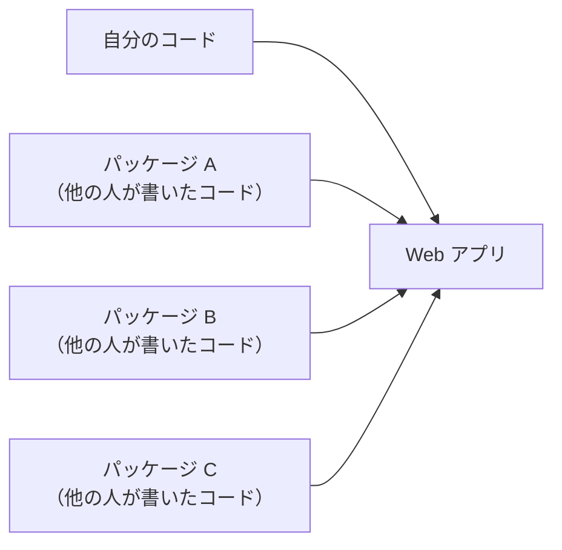
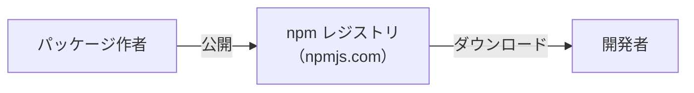
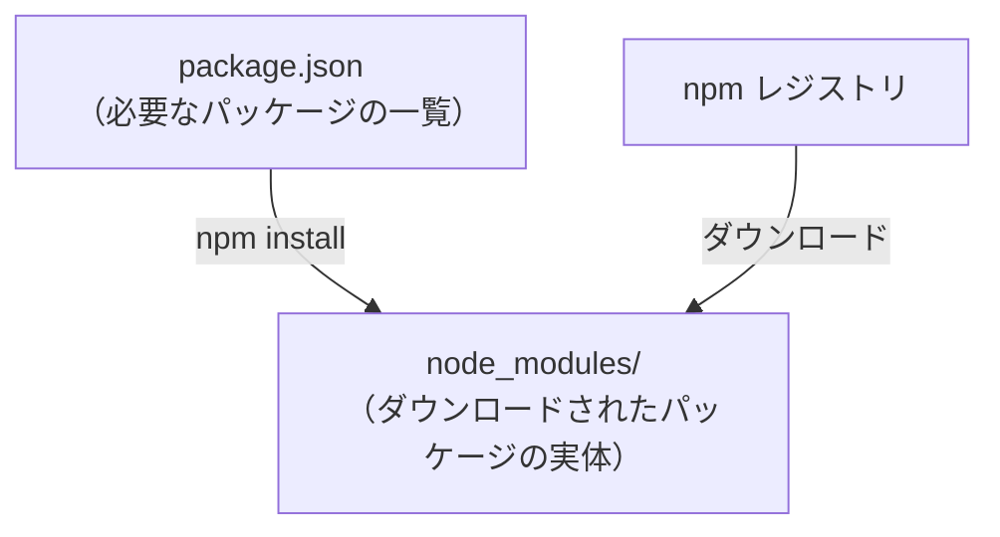
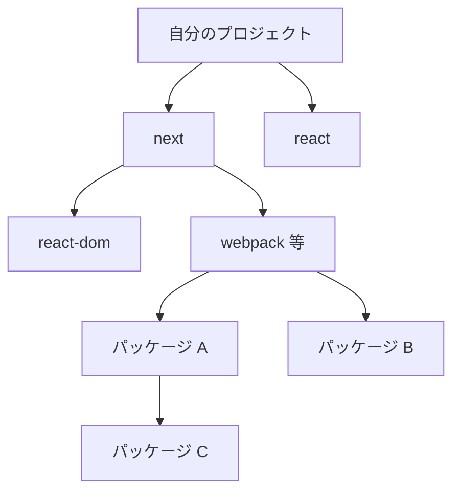
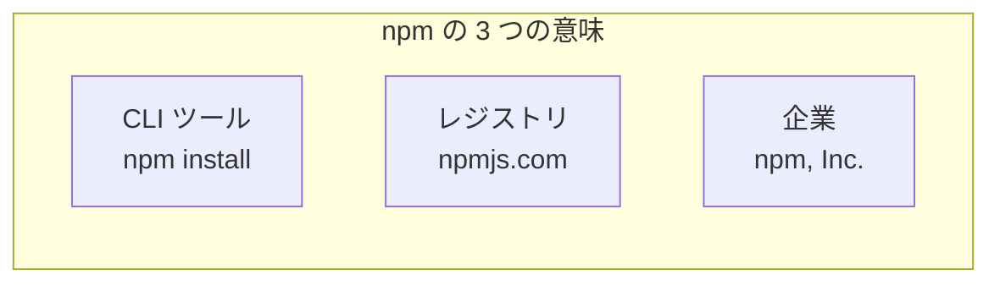

# npm — 3 つの意味を持つ言葉

## 今日のゴール

- npm という言葉が 3 つの意味を持つことを知る
- パッケージという仕組みがなぜ必要なのかを知る
- package.json と node_modules の役割を知る

## npm とは何か

「npm」という言葉は、Web 開発の現場で毎日のように登場します。`npm install` とターミナルに打ったことがある人もいるかもしれません。

この npm には、実は 3 つの異なる意味があります。

| npm の意味 | 何か |
|-----------|------|
| **CLI ツール** | ターミナルで `npm install` や `npm run dev` を実行するコマンドラインツール |
| **レジストリ** | パッケージ（他の人が書いたコード）が公開されている場所。[npmjs.com](https://www.npmjs.com/) |
| **企業** | npm, Inc.。レジストリと CLI を開発・運営している会社。現在は GitHub（Microsoft）傘下 |

会話の中で「npm で公開されている」と言えばレジストリのこと、「npm でインストールして」と言えば CLI のこと、「npm が買収された」と言えば企業のことを指しています。同じ言葉なのに文脈で意味が変わるので、この 3 つがあることを知っておくだけで会話の解像度が上がります。

## なぜ他人のコードを使うのか

npm を理解するには、まず「パッケージ」という考え方から始める必要があります。

Web アプリを作るとき、すべてのコードを自分で書くことはほぼありません。日付の処理、フォームのバリデーション、HTTP 通信の便利な関数。こうした汎用的な機能は、誰かがすでに書いて公開してくれています。この「他の人が書いて再利用できる形にまとめたコード」をパッケージと呼びます。



パッケージを使う理由は単純です。

- **時間の節約**: 自分で書かなくていい
- **品質**: 多くの人が使って検証されたコードは、自分でゼロから書くより信頼性が高いことが多い
- **メンテナンス**: バグ修正やアップデートをパッケージの作者がやってくれる

たとえば React 自体もパッケージです。Next.js もパッケージです。TypeScript もパッケージです。実際のプロジェクトは、数百のパッケージの上に成り立っています。

## レジストリ — パッケージが集まる場所

パッケージを「どこに置いて、どう見つけるか」という問題を解決するのがレジストリです。

npm のレジストリ（[npmjs.com](https://www.npmjs.com/)）は、JavaScript のパッケージが集まる世界最大の公開サーバーです。誰でもパッケージを公開でき、誰でもダウンロードできます。



2026 年時点で 300 万以上のパッケージが公開されています。「こういう機能がほしい」と思ったとき、大抵は誰かがすでにパッケージとして公開しています。

::: tip レジストリは npm だけではない
npm のレジストリが最大ですが、企業が社内専用のプライベートレジストリを持っていることもあります。また、GitHub Packages や JSR（Deno が運営）といった別のレジストリもあります。
:::

## CLI — パッケージを管理するツール

レジストリにパッケージがあっても、手動でダウンロードして配置するのは現実的ではありません。それを自動でやってくれるのが npm の CLI（コマンドラインツール）です。

| コマンド | やっていること |
|---------|-------------|
| `npm install` | package.json に書かれたパッケージをレジストリからダウンロードして node_modules に配置する |
| `npm install react` | react パッケージをレジストリからダウンロードし、package.json に追記する |
| `npm run dev` | package.json に定義されたスクリプトを実行する |
| `npm run build` | package.json に定義されたビルドスクリプトを実行する |

npm CLI は Node.js をインストールすると一緒に付いてきます。

::: details yarn と pnpm — npm 以外のパッケージマネージャ
npm の CLI と同じ役割を持つ別のツールがあります。yarn（Meta が開発）と pnpm です。

| ツール | 特徴 |
|-------|------|
| npm | Node.js に付属。最も広く使われている |
| yarn | npm の課題（速度やセキュリティ）を解決するために作られた |
| pnpm | ディスク使用量を節約する仕組みを持つ |

どれも同じレジストリ（npmjs.com）からパッケージをダウンロードします。レジストリは共通で、それを取りに行くツールが違うだけです。チームによってどれを使うかが異なるので、「npm 以外にも yarn や pnpm がある」と知っておくだけで十分です。
:::

## package.json — プロジェクトの設計図

プロジェクトのルートにある `package.json` は、そのプロジェクトが「どのパッケージに依存しているか」を記録したファイルです。

```json
{
  "name": "my-app",
  "dependencies": {
    "next": "^15.3.2",
    "react": "^19.1.0",
    "react-dom": "^19.1.0"
  },
  "devDependencies": {
    "typescript": "^6.0.3",
    "@types/react": "^19.1.2"
  },
  "scripts": {
    "dev": "next dev",
    "build": "next build"
  }
}
```

| セクション | 役割 |
|-----------|------|
| `dependencies` | アプリの動作に必要なパッケージ。本番環境でも使う |
| `devDependencies` | 開発中だけ必要なパッケージ。TypeScript やテストツールなど |
| `scripts` | `npm run dev` や `npm run build` で実行されるコマンドの定義 |

package.json がプロジェクトにあることで、誰がプロジェクトをクローンしても `npm install` 一発で同じ環境を再現できます。「このプロジェクトには何が必要か」がファイルに記録されているのです。

## node_modules — パッケージの実体

`npm install` を実行すると、package.json に書かれたパッケージがレジストリからダウンロードされ、`node_modules` というフォルダに配置されます。



node_modules の中身を覗くと、大量のフォルダがあることに気づきます。自分が package.json に書いたのは数個なのに、なぜ何百ものフォルダがあるのでしょうか。

それは、パッケージが別のパッケージに依存しているからです。React は数個のパッケージに依存し、そのパッケージもさらに別のパッケージに依存し……と連鎖していきます。この連鎖を**依存の木（dependency tree）**と呼びます。



::: info node_modules は Git に入れない
node_modules は非常に大きく（数百 MB になることもある）、`npm install` でいつでも復元できるので、Git には含めません。`.gitignore` に `node_modules/` と書いて除外するのが標準です。
:::

## ロックファイル — バージョンを固定する

package.json にはバージョンが `"^19.1.0"` のように書かれています。`^` は「19.1.0 以上、20.0.0 未満」という意味で、範囲を持っています。

しかし、チームで開発するときに「人によってインストールされるバージョンが微妙に違う」と問題が起きます。これを防ぐのがロックファイルです。

| パッケージマネージャ | ロックファイル |
|-------------------|-------------|
| npm | `package-lock.json` |
| yarn | `yarn.lock` |
| pnpm | `pnpm-lock.yaml` |

ロックファイルには「実際にインストールされた正確なバージョン」が記録されています。これを Git に含めることで、チーム全員が同じバージョンのパッケージを使えます。

## まとめ



- **npm** は CLI ツール、レジストリ（パッケージの公開サーバー）、企業の 3 つの意味を持つ言葉です
- Web 開発では、他の人が書いたコード（パッケージ）を組み合わせてアプリを作ります。React や Next.js もパッケージです
- **package.json** はプロジェクトが必要とするパッケージの一覧です。`npm install` でレジストリからダウンロードされ、**node_modules** に配置されます
- node_modules が大きくなるのは、パッケージが別のパッケージに依存する連鎖があるためです
- **ロックファイル**でバージョンを固定し、チーム全員が同じ環境を再現できるようにします
- npm 以外にも yarn や pnpm というパッケージマネージャがあります。レジストリは共通で、取りに行くツールが違います
