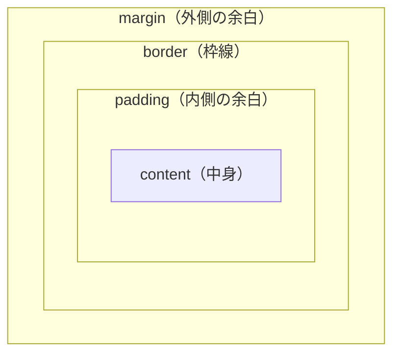

# ボックスモデル — width が思った通りにならない理由

## 今日のゴール

- HTML の要素はすべて「箱」として描画されることを知る
- `width` に padding と border が含まれないデフォルトの動きを知る
- `box-sizing: border-box` で直感的に変わることを知る

## すべての要素は「箱」

ブラウザは HTML のすべての要素を四角い箱として扱います。テキストも画像もボタンも、すべて箱です。この箱は内側から順に 4 つの領域で構成されています。



| 領域 | 役割 |
|------|------|
| content | テキストや画像など要素の中身 |
| padding | content と border の間のスペース。背景色が適用される |
| border | 枠線 |
| margin | 要素の外側のスペース。他の要素との距離 |

この 4 層の構造を**ボックスモデル**と呼びます。

## width は content だけを指す

ここが直感に反するところです。CSS でこう書いたとします。

```css
.box {
  width: 300px;
  padding: 20px;
  border: 3px solid #333;
}
```

`width: 300px` と指定したので、画面上のこの箱は 300px の幅に見えそうです。しかし実際に画面を占有する幅は **346px** です。

```
実際の幅 = content(300px) + padding左(20px) + padding右(20px)
         + border左(3px) + border右(3px)
         = 346px
```

CSS のデフォルトでは、`width` は **content 領域だけの幅** を指します。padding と border は別に加算されます。これを `box-sizing: content-box` と呼びます。

300px と書いたのに 346px になる。`padding` を増やすと箱が膨らむ。`width: 100%` に `padding` を足すと親からはみ出す。どれもこのデフォルトが原因です。

## border-box で直感的にする

`box-sizing: border-box` を指定すると、`width` の意味が変わります。

```css
.box {
  box-sizing: border-box;
  width: 300px;
  padding: 20px;
  border: 3px solid #333;
}
```

`border-box` では、`width: 300px` が **padding と border を含めた幅** になります。content の幅は自動で `300 - 20*2 - 3*2 = 254px` に縮みます。画面上の箱はきっちり 300px です。

こちらのほうがずっと直感的です。

## 全要素に border-box を適用する

実務では、ファイルの先頭にこう書くのが定番です。

```css
*,
*::before,
*::after {
  box-sizing: border-box;
}
```

`*` は「すべての要素」を意味するセレクタです。この 3 行で全要素が `border-box` になり、`width` が直感どおりに動くようになります。

Tailwind CSS を使っているプロジェクトでは、この指定は最初から入っています。Tailwind の基盤スタイル（Preflight）が自動で全要素に `border-box` を適用しているため、`w-[300px]` と `p-5` を組み合わせても幅が 300px のまま崩れません。

## ブラウザの開発者ツールで確認する

ボックスモデルはブラウザの開発者ツール（DevTools）で視覚的に確認できます。

1. ブラウザで右クリック → 「検証」
2. 要素を選択
3. 「Computed」タブを開く

content・padding・border・margin の各領域のサイズが図で表示されます。「幅がおかしい」と思ったとき、最初に確認する場所です。

## まとめ

- HTML の要素はすべて content → padding → border → margin の 4 層の箱として描画されます
- CSS のデフォルトでは `width` は content だけを指すため、padding や border を足すと箱が膨らみます
- `box-sizing: border-box` にすると、`width` に padding と border が含まれて直感的になります
- 実務では全要素に `border-box` を適用するのが定番です。Tailwind CSS では最初から入っています
