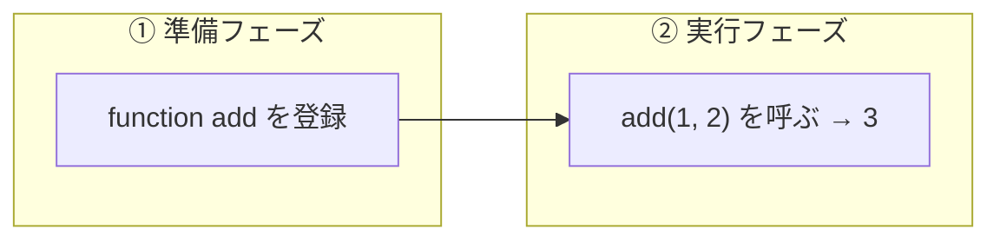
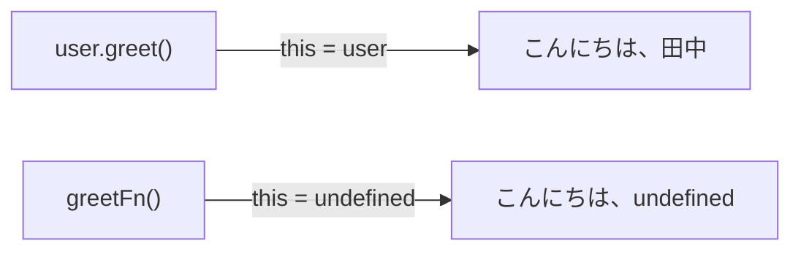

# 関数の書き方 — function 宣言とアロー関数

## 今日のゴール

- JavaScript の関数には複数の書き方があることを知る
- `function` 宣言とアロー関数の見た目以外の違いを知る
- React / Next.js でよく見る使い分けのパターンを知る

## 関数の書き方は 1 つではない

AI が生成した Next.js のコードを見ると、関数の書き方が場所によって違うことに気づくかもしれません。コンポーネントは `function` で書いてあるのに、配列操作やイベントハンドラは `=>` で書いてある。どちらも関数なのに、なぜ書き方が違うのでしょうか。

```javascript
// function 宣言
function greet(name) {
  return "こんにちは、" + name + "さん";
}

// アロー関数
const greet = (name) => {
  return "こんにちは、" + name + "さん";
};

// アロー関数（省略形）
const greet = (name) => "こんにちは、" + name + "さん";
```

どれも「`name` を受け取って挨拶文を返す関数」です。やっていることは同じなのに、なぜ複数の書き方があるのでしょうか。それは見た目だけでなく、動作の違いがあるからです。

このレッスンでは `function` 宣言とアロー関数の 2 つに絞って、それぞれの特徴と使い分けを見ていきます。

## function 宣言 — JavaScript の最初からある書き方

`function` キーワードで始まる、もっとも基本的な関数の書き方です。

```javascript
function add(a, b) {
  return a + b;
}

add(1, 2);  // 3
```

### 巻き上げ（hoisting）

function 宣言には<strong>巻き上げ（hoisting）</strong>という特徴があります。JavaScript エンジンはコードを実行する前にまず全体を読み、`function` 宣言を見つけると、そのスコープ（関数が見える範囲）の先頭に「宣言だけ先に登録する」ように振る舞います。



そのため、コード上で宣言より前に呼び出しても動きます。

```javascript
// 宣言より前で呼び出せる
console.log(add(1, 2));  // 3

function add(a, b) {
  return a + b;
}
```

これにより、ファイルの先頭にメインの処理を書き、ヘルパー関数を下に並べるという読みやすい構成が可能です。

## アロー関数 — 2015 年に追加された書き方

アロー関数は 2015 年の ECMAScript 仕様（ES2015）で追加された構文です。`=>` という矢印のような記号を使うので「アロー（arrow = 矢印）関数」と呼ばれます。

```javascript
const add = (a, b) => {
  return a + b;
};
```

アロー関数は `const` や `let` で変数に代入する形で書きます。`function` 宣言と違い、巻き上げ（hoisting）はされません。宣言より前に呼び出すとエラーになります。

```javascript
add(1, 2);  // エラー: Cannot access 'add' before initialization

const add = (a, b) => {
  return a + b;
};
```

### 省略記法

本体が 1 つの式だけなら、中括弧と `return` を省略できます。

```javascript
const add = (a, b) => a + b;
```

引数が 1 つなら括弧も省略できます。

```javascript
const double = n => n * 2;
```

この省略記法のおかげで、配列の操作で特に簡潔に書けます。

```javascript
const numbers = [1, 2, 3, 4, 5];
const doubled = numbers.map(n => n * 2);        // [2, 4, 6, 8, 10]
const evens = numbers.filter(n => n % 2 === 0);  // [2, 4]
```

## 見た目以外の違い — `this` の扱い

function 宣言とアロー関数には、見た目だけでない重要な違いがあります。それは `this` というキーワードの扱いです。

### `this` とは何か

`this` は「この関数を呼んでいるオブジェクト」を指す特殊なキーワードです。ただし、`function` で定義した関数の `this` は、**呼び出し方によって指すものが変わる**という厄介な性質があります。

```javascript
const user = {
  name: "田中",
  greet: function() {
    console.log("こんにちは、" + this.name);
  }
};

user.greet();  // "こんにちは、田中" — user.greet() なので this は user
```

ここまでは直感的です。しかし、同じ関数を別の変数に入れて呼ぶと、結果が変わります。

```javascript
const greetFn = user.greet;
greetFn();  // "こんにちは、undefined" — this が user ではなくなる
```



関数を取り出して呼ぶと、`this` との結びつきが切れてしまうのです。この問題はコールバック（関数を別の関数に渡す場面）で頻繁に起きます。

### アロー関数は `this` を外側から引き継ぐ

アロー関数はこの問題を起こしません。アロー関数は自分自身の `this` を持たず、**定義された場所の外側のスコープから `this` を引き継ぎます**。呼び出し方が変わっても `this` は変わりません。

```javascript
const user = {
  name: "田中",
  greetLater: function() {
    // アロー関数は外側（greetLater）の this を引き継ぐ
    setTimeout(() => {
      console.log("こんにちは、" + this.name);
    }, 1000);
  }
};

user.greetLater();  // 1秒後に "こんにちは、田中"
```

もし `setTimeout` に `function` を渡していたら、`this` が変わって `undefined` になっていました。アロー関数なら、定義された時点の `this`（= `user`）をそのまま使えます。

| | `function` | アロー関数 |
|---|---|---|
| `this` の決まり方 | 呼び出し方で変わる | 定義した場所の外側から引き継ぐ |
| コールバックでの `this` | 切れやすい | 安全 |

::: details this の問題と React の歴史
かつて React はクラスコンポーネントで書かれていました。クラスの中でイベントハンドラを書くとき、`this` の束縛が大きな悩みの種でした。

```javascript
// クラスコンポーネント（昔の書き方）
class Counter extends React.Component {
  constructor() {
    super();
    this.state = { count: 0 };
    // bind を忘れると this が undefined になりバグる
    this.handleClick = this.handleClick.bind(this);
  }
  handleClick() {
    this.setState({ count: this.state.count + 1 });
  }
}
```

現在の React は関数コンポーネントと Hooks が主流で、`this` を使う場面はほぼありません。`this` の問題を知っておくと、古い React のコードを読んだときに「なぜ `.bind(this)` が書いてあるのか」がわかります。
:::

## ここまでの違いを整理する

function 宣言とアロー関数の違いをまとめます。

| | `function` 宣言 | アロー関数 |
|---|---|---|
| 構文 | `function add(a, b) { ... }` | `const add = (a, b) => { ... }` |
| 巻き上げ（hoisting） | される（宣言前に呼べる） | されない（宣言前に呼ぶとエラー） |
| `this` の決まり方 | 呼び出し方で変わる | 定義した場所の外側から引き継ぐ |
| 省略記法 | なし | 本体が式 1 つなら `{}` と `return` を省略可 |

## 使い分け

どちらを使うかはチームやプロジェクトの方針によって異なりますが、React / Next.js のプロジェクトでよく見られるパターンがあります。

| 場面 | よく使われる書き方 | 理由 |
|------|------------------|------|
| React コンポーネントの定義 | `function` 宣言 | Next.js / React の公式サンプルがこの書き方 |
| 配列のコールバック（map, filter 等） | アロー関数 | 省略記法で簡潔に書ける |
| イベントハンドラ | アロー関数 | 簡潔で `this` の問題がない |
| ユーティリティ関数 | どちらでも | チームで統一されていれば OK |

実際の Next.js のコードでは、こんな風に混在しています。

```typescript
// React コンポーネント — function 宣言
export default function UserList({ users }: { users: User[] }) {
  // 配列のコールバック — アロー関数
  const activeUsers = users.filter(user => user.isActive);

  // イベントハンドラ — アロー関数
  const handleClick = (id: string) => {
    console.log(id);
  };

  return (
    <ul>
      {activeUsers.map(user => (
        <li key={user.id} onClick={() => handleClick(user.id)}>
          {user.name}
        </li>
      ))}
    </ul>
  );
}
```

コンポーネント全体は `function` 宣言、その中のコールバックやハンドラはアロー関数。これが現在の React / Next.js でもっとも一般的なスタイルです。

::: tip どちらが正しいかより、一貫性が大事
`function` 宣言とアロー関数のどちらが絶対的に正しいということはありません。プロジェクト内で統一されていることの方が重要です。ESLint などのリンターで自動的に統一することもできます。
:::

::: details 関数式という書き方もある
`function` 宣言とアロー関数のほかに、<strong>関数式</strong>という書き方もあります。

```javascript
const greet = function(name) {
  return "こんにちは、" + name + "さん";
};
```

`function` キーワードを使いますが、変数に代入する形で書きます。巻き上げはされません（アロー関数と同じ）。現在のコードではアロー関数で書くことがほとんどなので、古いコードで見かけたら「アロー関数と同じ位置づけだな」と思えば十分です。
:::

## まとめ

- JavaScript の関数には `function` 宣言とアロー関数（`=>`）の 2 つの書き方があります
- `function` 宣言は巻き上げ（hoisting）があり、宣言前に呼び出せます
- アロー関数は巻き上げされず、省略記法で簡潔に書けます
- 最大の違いは `this` の扱いです。`function` は呼び出し方で `this` が変わり、アロー関数は定義した場所の外側から `this` を引き継ぎます
- React / Next.js では、コンポーネント定義に `function` 宣言、コールバックやハンドラにアロー関数がよく使われます
- どちらを使うかはチームの方針次第。一貫性が大事です
