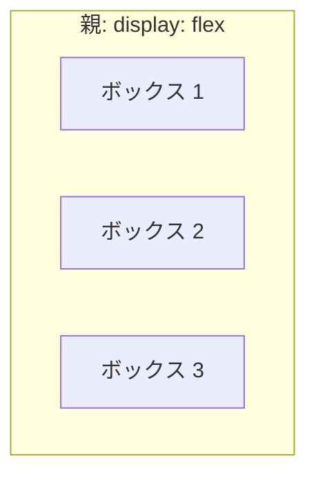
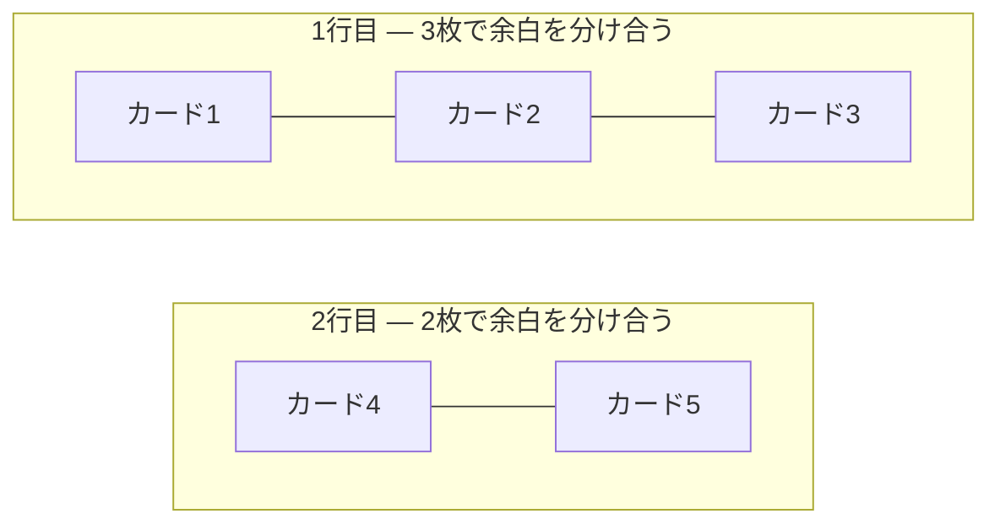
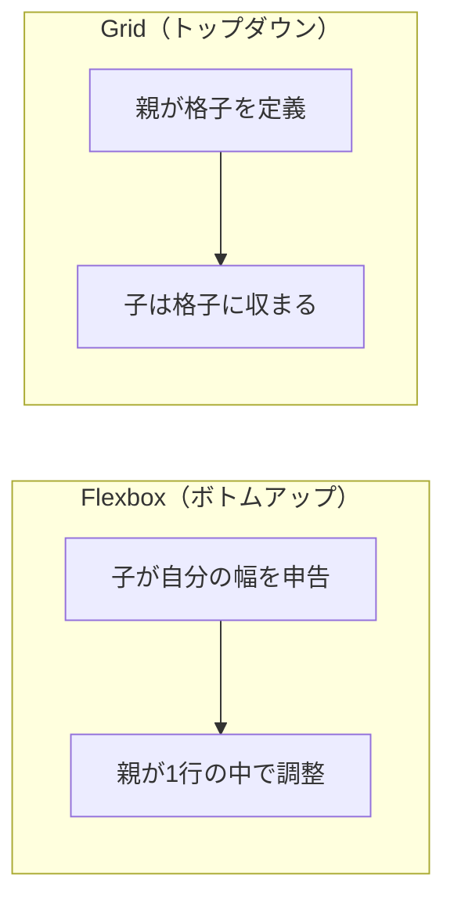
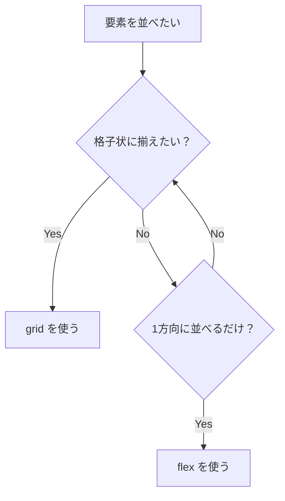

# CSS のレイアウト — flex と grid を正しく使い分ける

## 今日のゴール

- CSS の要素はデフォルトで縦に積まれることを知る
- flex と grid は得意な場面が違うことを知る
- 全部 flex でやろうとすると壊れる理由を知る

## CSS のデフォルトは縦積み

HTML の `<div>` や `<p>` といったブロック要素は、横幅いっぱいに広がって、次の要素を下に押し出します。何もしなければ**全部縦に積まれる**のがデフォルトです。

```html
<div style="background:#dbeafe;border:1px solid #93c5fd;padding:16px">ボックス 1</div>
<div style="background:#dbeafe;border:1px solid #93c5fd;padding:16px">ボックス 2</div>
<div style="background:#dbeafe;border:1px solid #93c5fd;padding:16px">ボックス 3</div>
```

3 つのボックスは、どれだけ横幅に余裕があっても上から下に並びます。この「縦積みがデフォルト」を変えるための仕組みが `flex` と `grid` です。

## flex — 1 方向に並べる仕組み

### display: flex で子が横に並ぶ

並べたい要素の**親に** `display: flex` を付けると、子要素が横に並びます。

```html
<!DOCTYPE html>
<html lang="ja">
  <head>
    <meta charset="UTF-8" />
    <meta name="viewport" content="width=device-width, initial-scale=1.0" />
    <title>Flexbox の例</title>
    <style>
      .container {
        display: flex;
        gap: 8px;
      }
      .item {
        background-color: #dbeafe;
        border: 1px solid #93c5fd;
        padding: 16px;
      }
    </style>
  </head>
  <body>
    <div class="container">
      <div class="item">ボックス 1</div>
      <div class="item">ボックス 2</div>
      <div class="item">ボックス 3</div>
    </div>
  </body>
</html>
```

ポイントは**「親が子の並べ方を決める」**ということです。子要素には何も指定していません。`display: flex` を付けた親が、中の子をどう配置するかを一括で決めます。



### ヘッダーのロゴ左・ナビ右

`justify-content` は主軸方向（アイテムが並ぶ方向）の配置を決めるプロパティです。`space-between` を使うと、最初の要素を左端に、最後の要素を右端に配置できます。

```html
<header style="display:flex; justify-content:space-between; align-items:center; padding:12px 16px; border:1px solid #e2e8f0">
  <div>MyApp</div>
  <nav aria-label="メインナビゲーション">メニュー</nav>
</header>
```

ロゴを左、メニューを右。ヘッダーのレイアウトがこれだけで完成します。

### 上下中央の配置が 2 行で終わる

`align-items` は交差軸方向（主軸に対して垂直な方向）の配置を決めるプロパティです。この 2 つを組み合わせれば、中央寄せが 2 行で書けます。

```css
.center {
  display: flex;
  justify-content: center;  /* 横の中央 */
  align-items: center;      /* 縦の中央 */
  min-height: 200px;
}
```

昔は `position: absolute` と `transform: translate(-50%, -50%)` を組み合わせるテクニックが必要でした。「CSS で中央寄せが難しい」はインターネット上で長年ネタにされてきた話です。Flexbox がこれを過去のものにしました。

### flex は「1 方向」の仕組み

ここまで見てきたように、flex はヘッダーの横並び、中央配置、サイドバーとメインの分割など、**1 方向の配置**が得意です。要素を一列に並べる場面では最適な道具です。

しかし、ここで疑問が出てきます。「じゃあカード一覧みたいな格子状のレイアウトも flex でいけるのでは？」と。

## flex で格子を作ると崩れる

### 6 枚のカードなら問題ない

カード一覧を flex で作ってみます。`flex-wrap: wrap` で折り返しを有効にし、各カードに `flex: 1 1 200px`（最低 200px、余白があれば伸びる）を指定します。

<div class="c04-flex-grid-ok" style="background:#f8fafc;color:#1e293b;padding:16px;border-radius:8px;margin:16px 0">
  <p style="margin:0 0 8px;font-weight:bold;color:#1e293b">flex で 6 枚（3×2）— きれいに並ぶ ✓</p>
  <div style="display:flex;flex-wrap:wrap;gap:8px">
    <div style="flex:1 1 200px;background:#dbeafe;border:1px solid #93c5fd;padding:16px;border-radius:4px;color:#1e293b">カード 1</div>
    <div style="flex:1 1 200px;background:#dbeafe;border:1px solid #93c5fd;padding:16px;border-radius:4px;color:#1e293b">カード 2</div>
    <div style="flex:1 1 200px;background:#dbeafe;border:1px solid #93c5fd;padding:16px;border-radius:4px;color:#1e293b">カード 3</div>
    <div style="flex:1 1 200px;background:#dbeafe;border:1px solid #93c5fd;padding:16px;border-radius:4px;color:#1e293b">カード 4</div>
    <div style="flex:1 1 200px;background:#dbeafe;border:1px solid #93c5fd;padding:16px;border-radius:4px;color:#1e293b">カード 5</div>
    <div style="flex:1 1 200px;background:#dbeafe;border:1px solid #93c5fd;padding:16px;border-radius:4px;color:#1e293b">カード 6</div>
  </div>
</div>

6 枚なら 3 列 × 2 行でぴったり。問題なさそうに見えます。

### 5 枚にすると最後の行が崩れる

では、カードが 5 枚だったらどうなるでしょう。

<div class="c04-flex-grid-ng" style="background:#f8fafc;color:#1e293b;padding:16px;border-radius:8px;margin:16px 0">
  <p style="margin:0 0 8px;font-weight:bold;color:#1e293b">flex で 5 枚 — 最後の行が伸びてしまう ✗</p>
  <div style="display:flex;flex-wrap:wrap;gap:8px">
    <div style="flex:1 1 200px;background:#dbeafe;border:1px solid #93c5fd;padding:16px;border-radius:4px;color:#1e293b">カード 1</div>
    <div style="flex:1 1 200px;background:#dbeafe;border:1px solid #93c5fd;padding:16px;border-radius:4px;color:#1e293b">カード 2</div>
    <div style="flex:1 1 200px;background:#dbeafe;border:1px solid #93c5fd;padding:16px;border-radius:4px;color:#1e293b">カード 3</div>
    <div style="flex:1 1 200px;background:#dbeafe;border:1px solid #93c5fd;padding:16px;border-radius:4px;color:#1e293b">カード 4</div>
    <div style="flex:1 1 200px;background:#dbeafe;border:1px solid #93c5fd;padding:16px;border-radius:4px;color:#1e293b">カード 5</div>
  </div>
</div>

最後の行にカードが 2 枚しかないのに、**残りのスペースを 2 枚で分け合って幅が広くなってしまいます**。上の行のカードと幅が揃いません。

### なぜ崩れるのか — flex は 1 行ずつ独立している

これはバグではなく、flex の仕様どおりの動きです。



`flex-wrap: wrap` で折り返すと、各行は独立した flex コンテナのように振る舞います。1 行目は 3 枚で余白を分け合い、2 行目は 2 枚で余白を分け合います。**行をまたいで列幅を揃える仕組みがありません**。

これが「flex は 1 次元（1D）」と言われる理由です。flex は「1 行の中でアイテムをどう並べるか」だけを扱います。複数行にまたがる格子のレイアウトは、そもそも flex の守備範囲ではないのです。

## grid — 格子を定義する仕組み

### 親が格子を作り、子がそこに収まる

`display: grid` と `grid-template-columns` を使うと、親が**格子（グリッド）そのものを定義**します。

```css
.card-grid {
  display: grid;
  grid-template-columns: repeat(3, 1fr);
  gap: 8px;
}
```

`repeat(3, 1fr)` は「同じ幅の列を 3 つ作る」という意味です。`1fr` は「余白を 1 等分する」という単位で、flex の `flex: 1` に似た考え方です。

<div class="c04-grid-demo" style="background:#f8fafc;color:#1e293b;padding:16px;border-radius:8px;margin:16px 0">
  <p style="margin:0 0 8px;font-weight:bold;color:#1e293b">grid で 5 枚 — 列幅が揃ったまま ✓</p>
  <div style="display:grid;grid-template-columns:repeat(3,1fr);gap:8px">
    <div style="background:#dbeafe;border:1px solid #93c5fd;padding:16px;border-radius:4px;color:#1e293b">カード 1</div>
    <div style="background:#dbeafe;border:1px solid #93c5fd;padding:16px;border-radius:4px;color:#1e293b">カード 2</div>
    <div style="background:#dbeafe;border:1px solid #93c5fd;padding:16px;border-radius:4px;color:#1e293b">カード 3</div>
    <div style="background:#dbeafe;border:1px solid #93c5fd;padding:16px;border-radius:4px;color:#1e293b">カード 4</div>
    <div style="background:#dbeafe;border:1px solid #93c5fd;padding:16px;border-radius:4px;color:#1e293b">カード 5</div>
  </div>
</div>

5 枚でも列幅は 3 列のまま。最後の行のカードが伸びたりしません。格子が親によって固定されているので、中身が何枚でもレイアウトは崩れないのです。

### flex と grid の根本的な違い

flex と grid の違いは、**誰がサイズを決めるか**です。



| | Flexbox | Grid |
|---|---|---|
| 方向 | 1 次元（横 or 縦） | 2 次元（横 × 縦） |
| サイズの決め方 | 子が自分の幅を申告、親が行内で調整 | 親が列・行のサイズを定義 |
| 行をまたぐ列幅の統一 | できない | できる |
| 得意な場面 | ナビバー、ヘッダー、中央配置 | カード一覧、ダッシュボード |

### レスポンシブ対応も grid なら簡単

`auto-fill` と `minmax()` を使えば、メディアクエリを書かずにレスポンシブなグリッドが作れます。

```css
.card-grid {
  display: grid;
  grid-template-columns: repeat(auto-fill, minmax(200px, 1fr));
  gap: 8px;
}
```

`auto-fill` は「入るだけ列を作る」、`minmax(200px, 1fr)` は「最低 200px、余白があれば均等に広がる」という意味です。画面が狭くなれば列数が減り、広くなれば増えます。メディアクエリなしで、カードの数が変わっても常にきれいな格子を維持できます。

## 使い分けの判断基準

### シンプルなルール

迷ったときの判断基準はシンプルです。

- **1 方向に並べるだけ** → `flex`
- **格子状に揃えたい** → `grid`

もう少し具体的に言えば、**「子の数が変わっても列幅を揃えたいか？」**がポイントです。Yes なら Grid。No なら Flex で十分です。



### flex 乱用の典型パターン

「flex しか知らない」状態でカード一覧を作ると、こうなりがちです。

```css
/* flex でカードグリッドを作ろうとする（よくある失敗） */
.card-list {
  display: flex;
  flex-wrap: wrap;
  gap: 16px;
}
.card {
  flex: 1 1 calc(33.33% - 16px); /* 3列に見せたい */
}
```

一見うまくいきますが、カードが 4 枚や 5 枚のときに最後の行が崩れます。さらに `calc` の計算で gap を考慮する必要があり、列数を変えるたびに計算し直す羽目になります。

Grid なら `grid-template-columns: repeat(3, 1fr)` の一行で済み、カードが何枚になっても列幅は揃います。**道具選びを間違えると、コードが複雑になるだけでなく、レイアウトも壊れる**のです。

## まとめ

- CSS の要素はデフォルトで縦に積まれます。横に並べるには `flex` か `grid` を使います
- **flex は 1 方向の配置が得意**です。ヘッダーの横並び、中央配置、サイドバー + メインのような場面で使います
- **flex で格子を作ると、最後の行でカードが伸びて崩れます**。これはバグではなく、flex が 1 行ずつ独立して動く仕様です
- **grid は格子を定義する仕組み**です。親が列と行を決めるので、子の数が変わっても列幅が揃います
- 迷ったら「1 方向なら flex、格子なら grid」。全部 flex でやろうとせず、場面に合った道具を選ぶことが大切です
