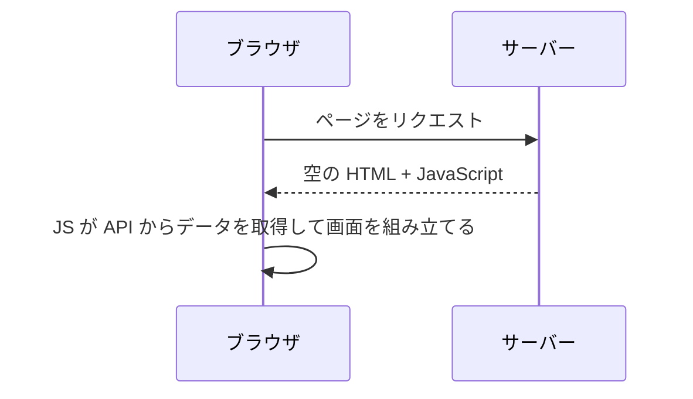
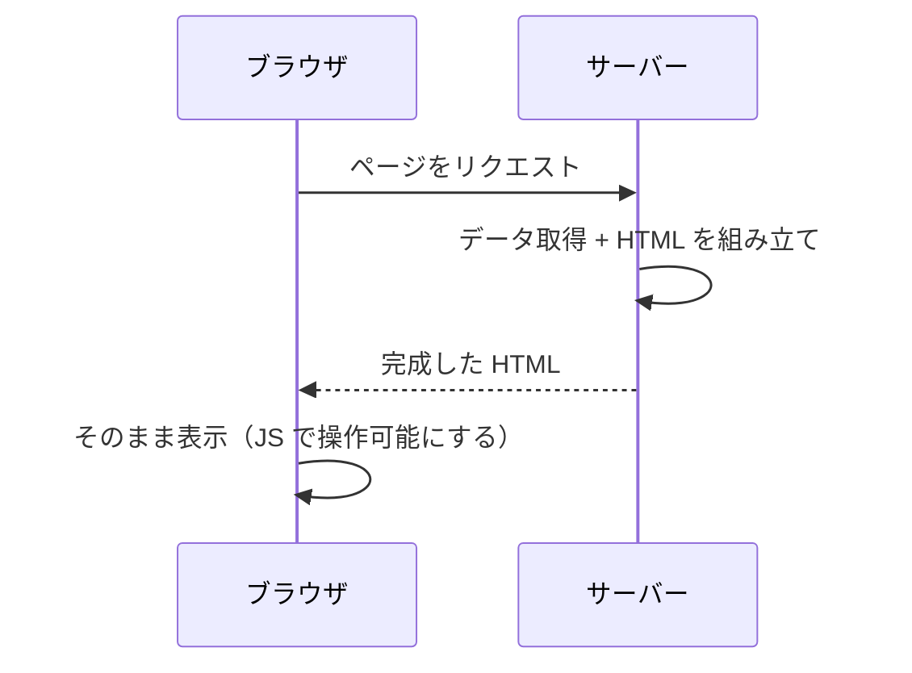
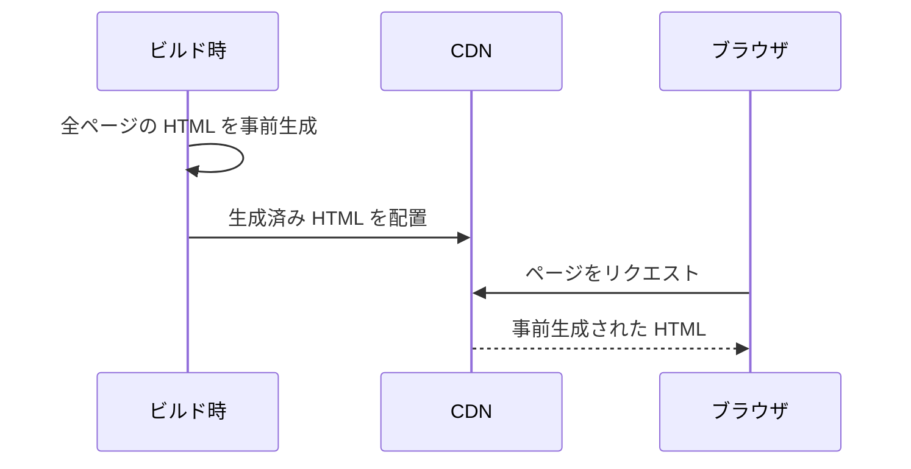
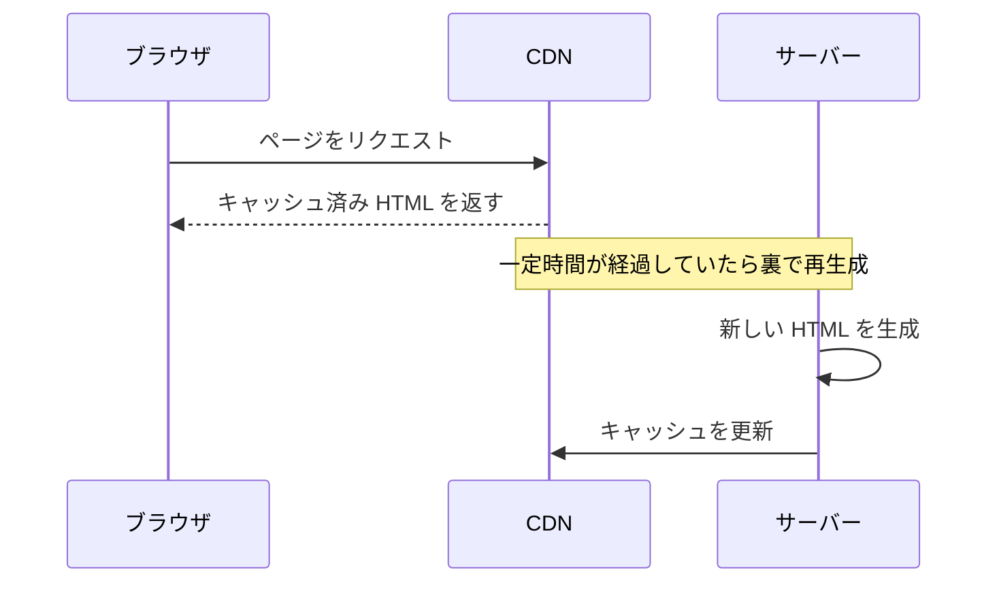
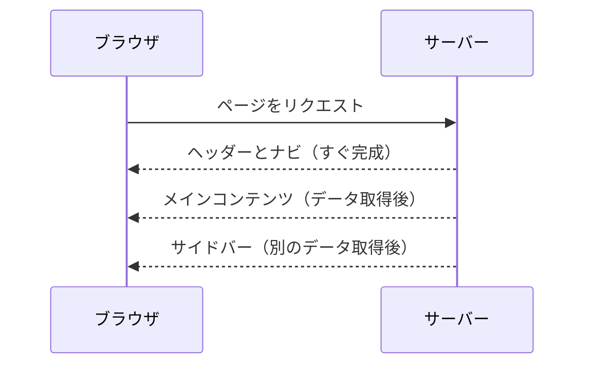
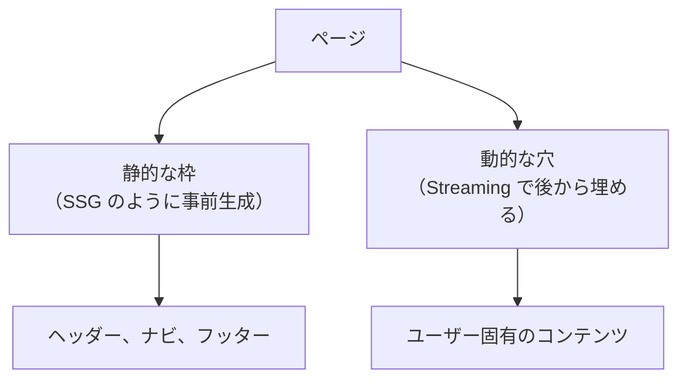

# Web ページの届け方 — CSR から PPR まで

## 今日のゴール

- Web ページの描画にはいくつかの方式があることを知る
- CSR / SSR / SSG / ISR の違いと、それぞれが解決する問題を知る
- Streaming / PPR / キャッシュ制御で、ページ内をさらに細かく制御できることを知る

## ページ単位の描画方式

Web ページの HTML を「いつ」「どこで」作るか。この違いで、ユーザーに届くまでの速度や体験が変わります。

### CSR — ブラウザで組み立てる



サーバーはほぼ空の HTML と JavaScript を返します。ブラウザが JavaScript を実行し、API からデータを取得して画面を組み立てます。

| メリット | デメリット |
|---------|----------|
| サーバーの負荷が低い | 初期表示が遅い（JS の読み込みと実行を待つ） |
| ページ遷移が速い | SEO に弱い（検索エンジンが空の HTML を見る） |

CSR は SPA（Single Page Application）の基本的な方式です。React や Vue のアプリは、何も設定しなければこの方式で動きます。

### SSR — リクエストのたびにサーバーで組み立てる



ブラウザからリクエストが来るたびに、サーバーがデータを取得して HTML を組み立てて返します。

| メリット | デメリット |
|---------|----------|
| 初期表示が速い（完成した HTML が届く） | リクエストのたびにサーバーが処理する |
| SEO に強い（検索エンジンが完成した HTML を見る） | サーバーの負荷が高い |
| 常に最新のデータを表示できる | サーバーの処理が遅いと表示も遅い |

### SSG — ビルド時に組み立てておく



デプロイ前のビルド時にすべてのページの HTML を生成しておきます。リクエストが来たら、生成済みの HTML ファイルをそのまま返すだけです。

| メリット | デメリット |
|---------|----------|
| 最速（ファイルを返すだけ） | データが古くなる（ビルドし直すまで更新されない） |
| サーバーの負荷がほぼゼロ | ページ数が多いとビルドに時間がかかる |
| CDN から配信できる | ユーザーごとに違う内容は出せない |

ブログや企業サイトのように、内容がめったに変わらないページに向いています。

### ISR — SSG を定期的に更新する

SSG の「データが古くなる」問題を解決する方式です。



一定時間が経過したページにリクエストが来ると、まずキャッシュ済みの古い HTML を返しつつ、裏側で新しい HTML を再生成します。次のリクエストからは新しい HTML が返されます。

| メリット | デメリット |
|---------|----------|
| SSG の速さを保ちつつデータを更新できる | 更新直後は古いデータが返る可能性がある |
| 全ページをビルドし直す必要がない | リアルタイム性が求められるものには不向き |

### ページ単位の方式まとめ

| 方式 | HTML を作るタイミング | 作る場所 | データの鮮度 |
|------|---------------------|---------|------------|
| CSR | リクエスト後（ブラウザで） | ブラウザ | 最新 |
| SSR | リクエスト時 | サーバー | 最新 |
| SSG | ビルド時 | サーバー | ビルド時点 |
| ISR | ビルド時 + 定期更新 | サーバー | やや遅れる |


それぞれが前の方式の弱点を補う形で生まれました。しかし、どの方式も「ページ全体」を単位にしています。1 つのページの中に「静的でいい部分」と「動的に取得したい部分」が混在する場合、ページ単位の方式では最適化しきれません。

---

## ページの中をさらに細かく制御する

ここからは、ページ全体ではなく「ページの中の一部分」を単位にして描画を制御する仕組みです。

### Streaming — 完成を待たずに流す

SSR の弱点は、ページ全体の HTML が完成するまでブラウザに何も届かないことです。データ取得に 3 秒かかる部分があれば、ページ全体が 3 秒待たされます。

Streaming は、できた部分から順にブラウザに送る仕組みです。



ヘッダーやナビゲーションのように即座に作れる部分は先に送り、データ取得が必要な部分は後から送ります。ブラウザは届いた分から表示していくので、ユーザーは白い画面を見つめて待つ必要がありません。

### PPR — 静的と動的を 1 ページに混ぜる

PPR（Partial Prerendering）は、1 つのページの中で「静的な部分」と「動的な部分」を分ける仕組みです。



ページの枠（ヘッダー、フッター、レイアウト）はビルド時に生成しておき、CDN から即座に返します。ユーザー固有のコンテンツや最新データが必要な部分だけ、Streaming で後から埋めます。

SSG の速さと SSR のデータ鮮度を、1 つのページの中で両立できます。

### キャッシュ制御 — コンポーネント単位で決める

Next.js は、キャッシュの制御をさらに細かくコンポーネント単位で行う方向に進んでいます。

従来はページ全体を「SSR にする」「SSG にする」と決めていましたが、コンポーネント単位のキャッシュ制御では、同じページの中でも部品ごとに「これはキャッシュする」「これはリクエストのたびに取得する」と指定できます。

```
ページ
├── ヘッダー（キャッシュ: 長期間）
├── 商品一覧（キャッシュ: 1 時間）
├── ユーザー情報（キャッシュ: しない）
└── フッター（キャッシュ: 長期間）
```

ページ単位で「CSR か SSR か SSG か」を選ぶのではなく、コンポーネントごとにキャッシュ戦略を決める。これが現在の Next.js が向かっている方向です。

## まとめ

### ページ単位の方式

| 方式 | いつ | どこで | 特徴 |
|------|------|-------|------|
| CSR | リクエスト後 | ブラウザ | JS で組み立て。初期表示は遅い |
| SSR | リクエスト時 | サーバー | 毎回組み立て。常に最新 |
| SSG | ビルド時 | サーバー | 事前生成。最速だがデータが古くなる |
| ISR | ビルド時 + 更新 | サーバー | SSG + 定期再生成 |

### ページ内の細かい制御

| 仕組み | 何をするか |
|--------|----------|
| Streaming | できた部分から順にブラウザに送る |
| PPR | 静的な枠を事前生成し、動的な部分だけ後から埋める |
| キャッシュ制御 | コンポーネント単位でキャッシュ戦略を決める |

ページ単位の「CSR / SSR / SSG / ISR」から、ページ内の「Streaming / PPR / キャッシュ制御」へ。制御の粒度がページからコンポーネントへと細かくなっています。
