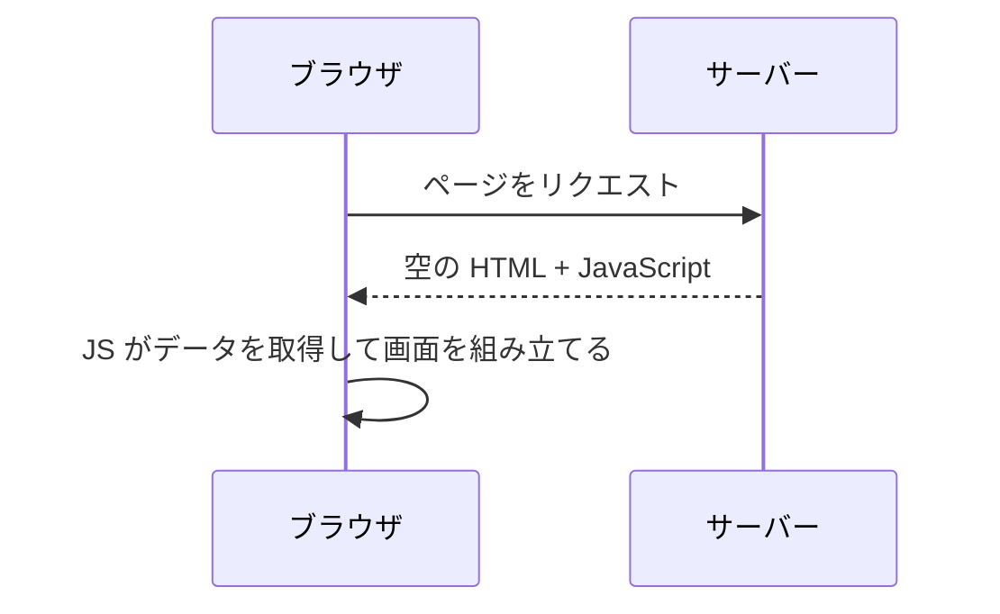
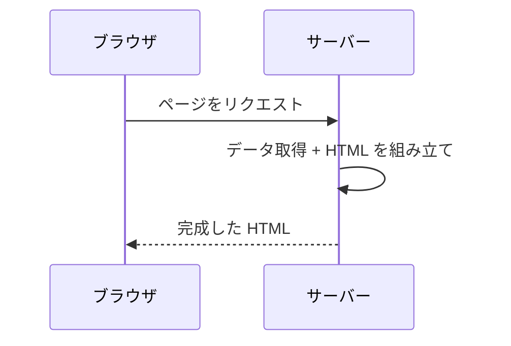
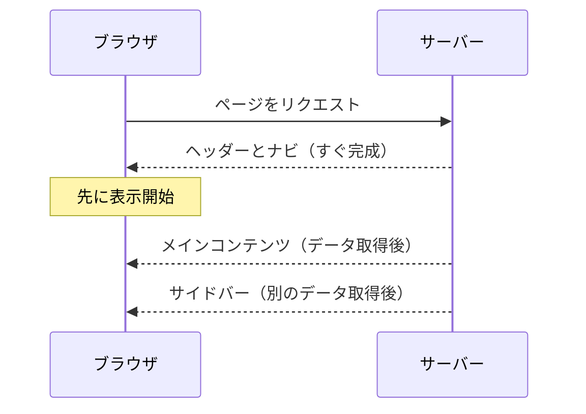
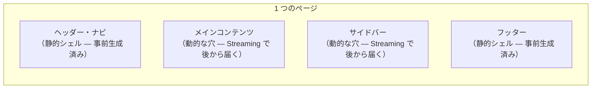
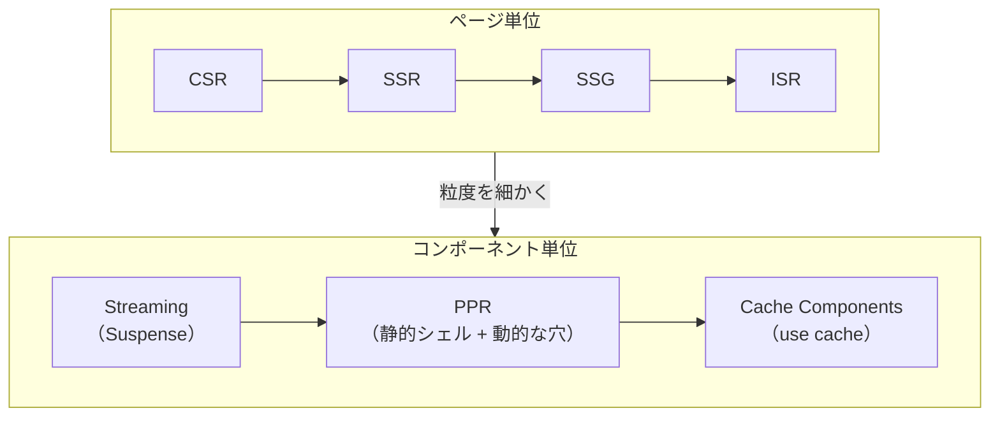

# Web ページの届け方 — CSR から Cache Components まで

## 今日のゴール

- Web ページの描画にはいくつかの方式があることを知る
- CSR / SSR / SSG / ISR の違いを知る
- Streaming / PPR / Cache Components で、ページ内をコンポーネント単位で制御できることを知る

## ページ単位の描画方式

Web ページの HTML を「いつ」「どこで」作るか。この違いで、ユーザーに届くまでの速度や体験が変わります。

### CSR — ブラウザで組み立てる



サーバーはほぼ空の HTML と JavaScript を返します。ブラウザが JavaScript を実行し、API からデータを取得して画面を組み立てます。SPA（Single Page Application）の基本的な方式です。

| メリット | デメリット |
|---------|----------|
| サーバーの負荷が低い | 初期表示が遅い（JS の読み込みと実行を待つ） |
| ページ遷移が速い | SEO に弱い（検索エンジンが空の HTML を見る） |

### SSR — リクエストのたびにサーバーで組み立てる



リクエストが来るたびに、サーバーがデータを取得して完成した HTML を返します。認証が必要な画面やユーザーごとに異なるデータを表示する画面に向いています。

| メリット | デメリット |
|---------|----------|
| 初期表示が速い（完成した HTML が届く） | リクエストのたびにサーバーが処理する |
| SEO に強い | 最も遅いデータ取得に全体が律速される |
| 常に最新のデータ | サーバーの負荷が高い |

### SSG と ISR — 事前生成とその更新


**SSG**（Static Site Generation）はビルド時に全ページの HTML を生成しておく方式です。リクエスト時はファイルを返すだけなので最速ですが、データはビルド時点のまま古くなります。

**ISR**（Incremental Static Regeneration）は SSG の弱点を補う方式です。一定時間が経過したページにリクエストが来ると、キャッシュを返しつつ裏側で HTML を再生成します。

::: info SSG / ISR が使えない場面
SSG と ISR はビルド時に HTML を生成するため、ログインが必要な画面やユーザーごとに異なるデータを表示する画面には使えません。業務系の管理画面はほぼ該当するため、そうしたプロジェクトでは SSR が基本の選択肢になります。
:::

### 4 つの方式の比較

| 方式 | HTML を作るタイミング | 作る場所 | データの鮮度 | 認証が必要な画面 |
|------|---------------------|---------|------------|---------------|
| CSR | リクエスト後 | ブラウザ | 最新 | 使える |
| SSR | リクエスト時 | サーバー | 最新 | 使える |
| SSG | ビルド時 | サーバー | ビルド時点 | 使えない |
| ISR | ビルド時 + 定期更新 | サーバー | やや遅れる | 使えない |


それぞれが前の方式の弱点を補う形で生まれました。しかし、どの方式も「ページ全体」を単位にしています。SSR で 1 つのページの中に「すぐ表示できる部分」と「データ取得に時間がかかる部分」が混在する場合、遅い部分に全体が引きずられます。

---

## ページの中をコンポーネント単位で制御する

ここからは、ページ全体ではなく「ページの中の一部分」を単位にして描画を制御する仕組みです。

### Streaming — 完成を待たずに流す

SSR はページ全体の HTML が完成するまでブラウザに何も届きません。データ取得に 3 秒かかる部分があれば、ページ全体が 3 秒待ちです。

Streaming は、できた部分から順にブラウザに送ります。



| SSR | SSR + Streaming |
|-----|----------------|
| 全部完成してからまとめて送る | できた部分から順に送る |
| 遅い部分に全体が引っ張られる | 速い部分は先に表示される |

Next.js では `<Suspense>` コンポーネントと `loading.tsx` ファイルが Streaming の仕組みです。`<Suspense>` で囲んだ部分は、データ取得中にフォールバック（ローディング表示）を見せておき、準備ができたら本体に差し替わります。

```tsx
// <Suspense> で囲んだ部分が Streaming される
<Suspense fallback={<LoadingSpinner />}>
  <UserDashboard />  {/* データ取得が終わるまでスピナーが表示される */}
</Suspense>
```

### PPR — 静的と動的を 1 ページに混ぜる

PPR（Partial Prerendering）は、SSG の速さと SSR のデータ鮮度を 1 つのページの中で両立します。



| 部分 | 方式 | 届くタイミング |
|------|------|-------------|
| ヘッダー、フッター | 静的シェル（事前生成） | 即座 |
| メインコンテンツ | Streaming（`<Suspense>`） | データ取得後 |
| サイドバー | Streaming（`<Suspense>`） | データ取得後 |

ページの枠（静的シェル）は事前生成して即座に届け、動的な部分（穴）だけ Streaming で後から埋めます。

::: info PPR のメリットはインフラ構成で変わる
PPR の静的シェルを CDN のエッジから配信できる構成では、TTFB（最初の 1 バイトが届くまでの時間）が大幅に短縮されます。一方、CDN がエッジキャッシュに対応していない構成では、サーバー（オリジン）のメモリから配信するため、通常の SSR + Streaming との性能差は小さくなります。
:::

### Cache Components — `"use cache"` でキャッシュを宣言する

Next.js 16 で導入された Cache Components は、コンポーネントや関数の単位でキャッシュを宣言的に制御する仕組みです。`next.config.ts` で `cacheComponents: true` を設定すると有効になります。

#### `"use cache"` ディレクティブ

関数やコンポーネントの先頭に `"use cache"` と書くと、その出力がキャッシュされます。

```tsx
async function ProductList() {
  "use cache";
  const products = await db.products.findMany();
  return <ul>{products.map(p => <li key={p.id}>{p.name}</li>)}</ul>;
}
```

`"use cache"` を書かなければキャッシュされません。つまり「デフォルトは動的、キャッシュは明示的に opt-in」というモデルです。

| バリアント | キャッシュの保存先 | 用途 |
|-----------|-----------------|------|
| `"use cache"` | サーバーのインメモリ | 一般的なキャッシュ |
| `"use cache: remote"` | 外部ストア（Redis 等） | サーバーインスタンス間で共有するキャッシュ |

#### `cacheLife` — キャッシュの有効期間

`cacheLife()` でキャッシュの有効期間を指定します。

```tsx
import { cacheLife } from "next/cache";

async function ProductList() {
  "use cache";
  cacheLife("hours");
  const products = await db.products.findMany();
  return <ul>{products.map(p => <li key={p.id}>{p.name}</li>)}</ul>;
}
```

| プロファイル | 意味 |
|------------|------|
| `"seconds"` | 秒単位の短いキャッシュ |
| `"minutes"` | 分単位 |
| `"hours"` | 時間単位 |
| `"days"` | 日単位 |
| `"weeks"` | 週単位 |
| `"max"` | 最大限キャッシュ |

#### `cacheTag` と `updateTag` — オンデマンド無効化

`cacheTag()` でキャッシュにタグを付け、`updateTag()` でそのタグのキャッシュを無効化できます。

```tsx
import { cacheTag } from "next/cache";

async function ProductList() {
  "use cache";
  cacheLife("hours");
  cacheTag("products");
  const products = await db.products.findMany();
  return <ul>{products.map(p => <li key={p.id}>{p.name}</li>)}</ul>;
}
```

```tsx
// Server Action で商品を更新したとき
"use server";
import { updateTag } from "next/cache";

async function updateProduct(data) {
  await db.products.update(data);
  updateTag("products");  // "products" タグのキャッシュを即座に無効化
}
```

#### コンポーネント単位のキャッシュ戦略

Cache Components により、同じページの中でも部品ごとにキャッシュ戦略を変えられます。

```
ページ
├── ヘッダー       → "use cache" + cacheLife("days")
├── 商品一覧       → "use cache" + cacheLife("hours") + cacheTag("products")
├── ユーザー情報    → キャッシュなし（毎回取得）
└── フッター       → "use cache" + cacheLife("days")
```

ページ単位で「SSR か SSG か」を選ぶのではなく、コンポーネントごとにキャッシュを宣言する。これが Next.js が向かっている方向です。

::: details `unstable_cache` との関係
Next.js 16 以前は `unstable_cache` という関数でキャッシュを制御していました。Next.js 16 の公式ドキュメントでは `unstable_cache` は `"use cache"` に置き換えることが推奨されています。`unstable_cache` は引き続き動作しますが、新規で書くなら `"use cache"` が公式の推奨パスです。
:::

## まとめ



| 粒度 | 方式 | 特徴 |
|------|------|------|
| ページ全体 | CSR / SSR / SSG / ISR | ページごとに「いつ」「どこで」HTML を作るか決める |
| ページの一部分 | Streaming / PPR / Cache Components | コンポーネント単位で描画方式やキャッシュを制御する |

制御の粒度がページからコンポーネントへと細かくなっています。`<Suspense>` で Streaming の境界を決め、`"use cache"` でキャッシュの対象を宣言し、`cacheLife` で期間を、`cacheTag` + `updateTag` で無効化を制御する。これが現在の Next.js のレンダリングとキャッシュの全体像です。
