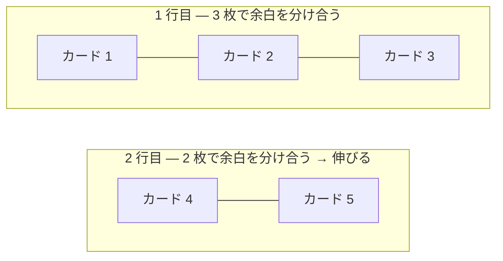

# CSS のレイアウト — 横並びの変遷

## 今日のゴール

- CSS の要素はデフォルトで縦に積まれることを知る
- 横に並べる方法が時代とともに進化してきたことを知る
- flex と grid の得意な場面の違いを知る

## CSS のデフォルトは縦積み

HTML の `<div>` や `<p>` といったブロック要素は、横幅いっぱいに広がって、次の要素を下に押し出します。何もしなければ全部縦に積まれるのがデフォルトです。

<div class="c04-demo">
  <div class="c04-block">ボックス 1</div>
  <div class="c04-block">ボックス 2</div>
  <div class="c04-block">ボックス 3</div>
</div>

どれだけ横幅に余裕があっても、ブロック要素は上から下に並びます。Web ページで要素を「横に並べたい」場面は多いのに、CSS にはそのための仕組みが長い間ありませんでした。ここからは、横並びをどうやって実現してきたか、その変遷を見ていきます。

## float — 回り込みを転用した時代

### 新聞のような画像の回り込み

`float` はもともと、新聞のように画像の横にテキストを回り込ませるための仕組みです。

```css
img {
  float: left;
  margin-right: 16px;
}
```

画像が左に寄り、テキストがその右側に回り込みます。これが本来の用途でした。

### float でナビゲーションを横に並べる

2000 年代、横並びの仕組みがなかった時代に、開発者はこの回り込みをレイアウトに転用しました。

<div class="c04-demo">
  <p class="c04-demo-label">float で横並びにしたナビゲーション</p>
  <div class="c04-float-nav" id="c04-float-nav">
    <div class="c04-float-item">ホーム</div>
    <div class="c04-float-item">製品</div>
    <div class="c04-float-item">お問い合わせ</div>
  </div>
  <div class="c04-float-after" id="c04-float-after">← ナビの下に来てほしいコンテンツ</div>
</div>

一見うまくいっているように見えます。しかし float には厄介な副作用がありました。

### 親の高さが消える

float した要素は通常のフローから外れるため、親要素の高さが 0 になります。下のデモで「float の問題を見る」を押してください。

<div class="c04-demo">
  <p class="c04-demo-label">float の問題: 親の高さが消える</p>
  <div class="c04-float-parent" id="c04-float-parent">
    <div class="c04-float-item">ホーム</div>
    <div class="c04-float-item">製品</div>
    <div class="c04-float-item">お問い合わせ</div>
  </div>
  <div class="c04-float-content" id="c04-float-content">このテキストはナビの下にあるはずが、回り込んでしまう</div>
  <div style="margin-top:12px;display:flex;gap:8px">
    <button type="button" class="c04-btn" id="c04-float-break-btn">float の問題を見る</button>
    <button type="button" class="c04-btn" id="c04-float-fix-btn" style="display:none">clearfix で直す</button>
  </div>
</div>

親の枠線が潰れ、後続のテキストが回り込んでしまいます。これを直すために `clearfix` というハックが生まれました。

```css
/* clearfix — float の後始末 */
.nav::after {
  content: "";
  display: block;
  clear: both;
}
```

「横に並べたいだけなのに、後始末のハックが必要」——これが float レイアウトの現実でした。

## inline-block — ブロックをインラインに並べる

float の問題を避けるために、`display: inline-block` を使う方法も広まりました。テキストと同じようにブロック要素を横に並べます。

<div class="c04-demo">
  <p class="c04-demo-label">inline-block で横並び</p>
  <div class="c04-inline-block-container" id="c04-ib-container">
    <div class="c04-ib-item">ホーム</div>
    <div class="c04-ib-item">製品</div>
    <div class="c04-ib-item">お問い合わせ</div>
  </div>
  <p class="c04-demo-note" id="c04-ib-note">横に並んだが、要素の間に謎の隙間がある（↑ よく見てください）</p>
</div>

float のような親の高さ問題は起きません。しかし inline-block には別の厄介な問題がありました。要素と要素の間に **意図しない隙間** ができるのです。

この隙間は CSS の余白ではなく、HTML のソースコードにある改行やスペースが原因です。ブラウザがインライン要素の間の空白をそのまま描画してしまいます。

```html
<!-- この改行が隙間になる -->
<div class="item">ホーム</div>
<div class="item">製品</div>
```

隙間を消すには `font-size: 0` を親に指定して子で戻す、HTML の改行を消す、コメントで繋ぐ、といったハックが必要でした。

```html
<!-- ハック: コメントで改行を消す -->
<div class="item">ホーム</div><!--
--><div class="item">製品</div>
```

横に並べるだけのことに、なぜこんな工夫が必要なのか。float も inline-block も、横並びのための仕組みではなかったからです。

## flex — 横並びのために生まれた仕組み

2012 年頃から使えるようになった Flexbox は、CSS で初めて「要素を並べる」ために設計されたレイアウト手法です。

```css
.nav {
  display: flex;
  gap: 8px;
}
```

<div class="c04-demo">
  <p class="c04-demo-label">flex で横並び — これだけで完成</p>
  <div class="c04-flex-nav">
    <div class="c04-flex-item">ホーム</div>
    <div class="c04-flex-item">製品</div>
    <div class="c04-flex-item">お問い合わせ</div>
  </div>
</div>

float の後始末も inline-block の隙間もありません。親に `display: flex` を付けるだけで、子要素が横に並びます。

### ヘッダーのロゴ左・ナビ右

`justify-content: space-between` を加えると、最初の要素を左端に、最後の要素を右端に配置できます。

```css
header {
  display: flex;
  justify-content: space-between;
  align-items: center;
}
```

<div class="c04-demo">
  <div class="c04-flex-header">
    <div class="c04-flex-logo">MyApp</div>
    <nav class="c04-flex-menu" aria-label="メインナビゲーション">メニュー</nav>
  </div>
</div>

ロゴを左、メニューを右。ヘッダーのレイアウトがこれだけで完成します。

### 中央配置が 2 行で終わる

CSS で上下中央に配置するのは、昔は `position: absolute` と `transform: translate(-50%, -50%)` を組み合わせる必要がありました。「CSS で中央寄せが難しい」はインターネット上で長年ネタにされてきた話です。Flexbox がこれを過去のものにしました。

```css
.center {
  display: flex;
  justify-content: center;  /* 横の中央 */
  align-items: center;      /* 縦の中央 */
}
```

### flex の限界 — 格子が作れない

ここまで見てきたように、flex は横並びを簡潔に書けます。しかし「カード一覧のように格子状に並べたい」場面では問題が出ます。

<div class="c04-demo">
  <p class="c04-demo-label">flex で 5 枚のカード — 最後の行が伸びてしまう</p>
  <div class="c04-flex-grid">
    <div class="c04-grid-card">カード 1</div>
    <div class="c04-grid-card">カード 2</div>
    <div class="c04-grid-card">カード 3</div>
    <div class="c04-grid-card">カード 4</div>
    <div class="c04-grid-card">カード 5</div>
  </div>
</div>

最後の行のカード 2 枚が、残りのスペースを分け合って幅が広がってしまいます。これはバグではなく、flex の仕様です。flex は 1 行ずつ独立して動く仕組みなので、行をまたいで列幅を揃えることができません。



## grid — 格子そのものを定義する仕組み

2017 年頃から使えるようになった Grid は、親が格子を定義し、子がそこに収まるレイアウト手法です。

```css
.card-grid {
  display: grid;
  grid-template-columns: repeat(3, 1fr);
  gap: 8px;
}
```

<div class="c04-demo">
  <p class="c04-demo-label">grid で 5 枚のカード — 列幅が揃ったまま</p>
  <div class="c04-grid-grid">
    <div class="c04-grid-card">カード 1</div>
    <div class="c04-grid-card">カード 2</div>
    <div class="c04-grid-card">カード 3</div>
    <div class="c04-grid-card">カード 4</div>
    <div class="c04-grid-card">カード 5</div>
  </div>
</div>

5 枚でも列幅は 3 列のまま。親が格子を定義しているので、中身が何枚でもレイアウトは崩れません。

`repeat(3, 1fr)` は「同じ幅の列を 3 つ作る」という意味です。`1fr` は「余白を 1 等分する」単位で、flex の `flex: 1` に似た考え方です。

## 今の現在地

横並びの歴史を振り返ると、float と inline-block はどちらも「横に並べるために作られたものではない」仕組みの転用でした。float は画像の回り込み、inline-block はテキストと同じ行内に置く仕組みです。横並びに使えはしたものの、後始末のハックや謎の隙間が付きまといました。

flex と grid は、最初からレイアウトのために設計されています。だからハックがいりません。

| 時代 | 方法 | 弱点 |
|------|------|------|
| 2000 年代 | `float` | 親の高さが消える。clearfix ハックが必要 |
| 2000 年代後半 | `inline-block` | HTML の改行が隙間になる |
| 2012 年〜 | `flex` | 1 方向は得意だが、格子は作れない |
| 2017 年〜 | `grid` | 格子を定義できる。2 次元のレイアウト |

今は flex と grid を場面に応じて使い分けるのが定番です。

- **1 方向に並べる**（ヘッダー、ナビバー、中央配置） → `flex`
- **格子状に揃える**（カード一覧、ダッシュボード） → `grid`

AI が生成した CSS に `display: flex` や `display: grid` が入っているのを見かけたら、「float や inline-block のハックなしに横並びができるようになったんだな」と思い出してください。

## まとめ

- CSS の要素はデフォルトで縦に積まれます。横に並べるには工夫が必要でした
- **float** は回り込みの転用。親の高さが消える問題があり、clearfix ハックが必要でした
- **inline-block** は HTML の改行が隙間になる問題がありました
- **flex** は横並びのために生まれた初めての仕組みです。1 方向の配置が得意ですが、格子は苦手です
- **grid** は格子そのものを定義します。行をまたいで列幅を揃えられます
- 今は flex（1 方向）と grid（格子）を場面で使い分けるのが定番です

<style>
.c04-demo {
  background: #f8fafc;
  color: #1e293b;
  border-radius: 8px;
  padding: 16px;
  margin: 16px 0;
}
.c04-demo-label {
  margin: 0 0 8px;
  font-weight: bold;
  color: #1e293b;
}
.c04-demo-note {
  margin: 8px 0 0;
  font-size: 14px;
  color: #64748b;
}
.c04-block {
  background: #dbeafe;
  color: #1e293b;
  border: 1px solid #93c5fd;
  padding: 12px 16px;
  margin-bottom: 4px;
}
.c04-btn {
  background: #3b82f6;
  color: white;
  border: none;
  padding: 6px 16px;
  border-radius: 4px;
  cursor: pointer;
  font-size: 14px;
}
.c04-btn:hover {
  background: #2563eb;
}

/* float デモ */
.c04-float-nav {
  border: 2px dashed #93c5fd;
  padding: 8px;
  overflow: hidden;
}
.c04-float-item {
  float: left;
  background: #dbeafe;
  color: #1e293b;
  border: 1px solid #93c5fd;
  padding: 8px 16px;
  margin-right: 4px;
}
.c04-float-after {
  background: #fef3c7;
  color: #1e293b;
  border: 1px solid #f59e0b;
  padding: 8px 16px;
  margin-top: 8px;
  clear: both;
}
.c04-float-parent {
  border: 2px dashed #93c5fd;
  padding: 8px;
  transition: all 0.3s;
}
.c04-float-parent.c04-collapsed .c04-float-item {
  float: left;
  margin-right: 4px;
}
.c04-float-parent.c04-collapsed {
  border-color: #ef4444;
}
.c04-float-content {
  background: #fef3c7;
  color: #1e293b;
  border: 1px solid #f59e0b;
  padding: 8px 16px;
  margin-top: 8px;
  transition: all 0.3s;
}
.c04-float-parent.c04-clearfix::after {
  content: "";
  display: block;
  clear: both;
}

/* inline-block デモ */
.c04-inline-block-container {
  border: 2px dashed #93c5fd;
  padding: 8px;
  font-size: 0;
}
.c04-ib-item {
  display: inline-block;
  font-size: 16px;
  background: #dbeafe;
  color: #1e293b;
  border: 1px solid #93c5fd;
  padding: 8px 16px;
}
.c04-inline-block-container.c04-show-gap {
  font-size: 16px;
}

/* flex デモ */
.c04-flex-nav {
  display: flex;
  gap: 8px;
}
.c04-flex-item {
  background: #dbeafe;
  color: #1e293b;
  border: 1px solid #93c5fd;
  padding: 8px 16px;
}
.c04-flex-header {
  display: flex;
  justify-content: space-between;
  align-items: center;
  padding: 12px 16px;
  border: 1px solid #e2e8f0;
  border-radius: 4px;
}
.c04-flex-logo {
  font-weight: bold;
  color: #1e293b;
}
.c04-flex-menu {
  color: #475569;
}
.c04-flex-grid {
  display: flex;
  flex-wrap: wrap;
  gap: 8px;
}
.c04-grid-card {
  background: #dbeafe;
  color: #1e293b;
  border: 1px solid #93c5fd;
  padding: 16px;
  border-radius: 4px;
}
.c04-flex-grid .c04-grid-card {
  flex: 1 1 150px;
}

/* grid デモ */
.c04-grid-grid {
  display: grid;
  grid-template-columns: repeat(3, 1fr);
  gap: 8px;
}
</style>

<script setup>
import { onMounted } from 'vue'

onMounted(() => {
  const breakBtn = document.getElementById('c04-float-break-btn')
  const fixBtn = document.getElementById('c04-float-fix-btn')
  const parent = document.getElementById('c04-float-parent')
  const content = document.getElementById('c04-float-content')

  breakBtn?.addEventListener('click', () => {
    parent?.classList.add('c04-collapsed')
    content.style.marginTop = '0'
    content.style.clear = 'none'
    breakBtn.style.display = 'none'
    if (fixBtn) fixBtn.style.display = 'inline-block'
  })

  fixBtn?.addEventListener('click', () => {
    parent?.classList.add('c04-clearfix')
    content.style.marginTop = '8px'
    content.style.clear = 'both'
  })

  const ibContainer = document.getElementById('c04-ib-container')
  setTimeout(() => {
    ibContainer?.classList.add('c04-show-gap')
  }, 100)
})
</script>
