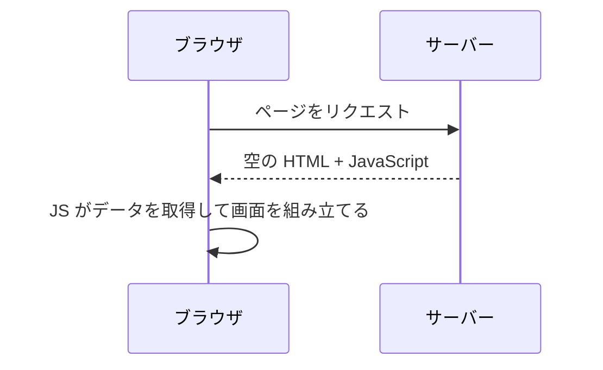
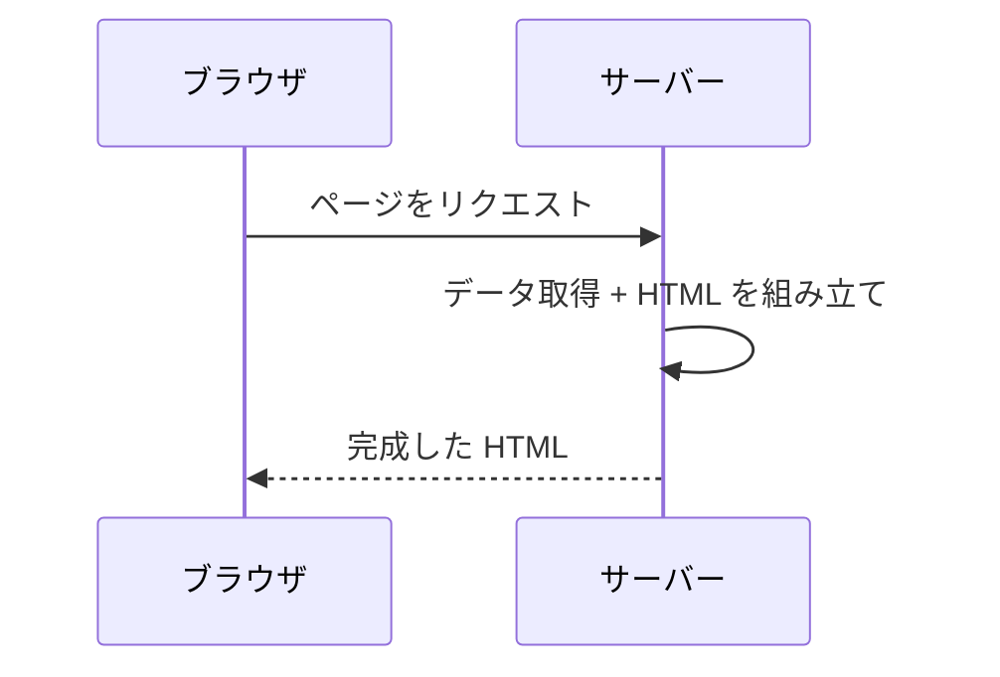
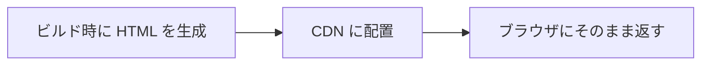
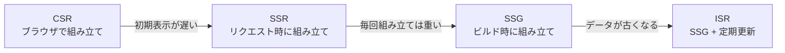
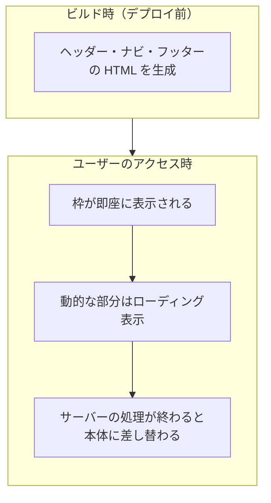
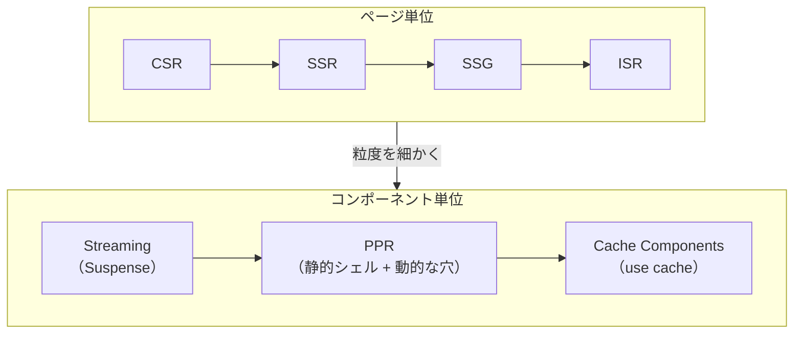

# Web ページの届け方 — CSR から Cache Components まで

## 今日のゴール

- Web ページの描画にはいくつかの方式があることを知る
- CSR / SSR / SSG / ISR の違いを知る
- Streaming / PPR / Cache Components で、ページ内をコンポーネント単位で制御できることを知る

## ページ単位の描画方式

Web ページの HTML を「いつ」「どこで」作るか。この違いで、ユーザーに届くまでの速度や体験が変わります。

### CSR — ブラウザで組み立てる



サーバーはほぼ空の HTML と JavaScript を返します。ブラウザが JavaScript を実行し、API からデータを取得して画面を組み立てます。SPA（Single Page Application）の基本的な方式です。

| メリット | デメリット |
|---------|----------|
| サーバーの負荷が低い | 初期表示が遅い（JS の読み込みと実行を待つ） |
| ページ遷移が速い | SEO に弱い（検索エンジンが空の HTML を見る） |

### SSR — リクエストのたびにサーバーで組み立てる



リクエストが来るたびに、サーバーがデータを取得して完成した HTML を返します。認証が必要な画面やユーザーごとに異なるデータを表示する画面に向いています。

| メリット | デメリット |
|---------|----------|
| 初期表示が速い（完成した HTML が届く） | リクエストのたびにサーバーが処理する |
| SEO に強い | 最も遅いデータ取得に全体が律速される |
| 常に最新のデータ | サーバーの負荷が高い |

### SSG と ISR — 事前生成とその更新



**SSG**（Static Site Generation）はビルド時に全ページの HTML を生成しておく方式です。リクエスト時はファイルを返すだけなので最速ですが、データはビルド時点のまま古くなります。

**ISR**（Incremental Static Regeneration）は SSG の弱点を補う方式です。一定時間が経過したページにリクエストが来ると、キャッシュを返しつつ裏側で HTML を再生成します。

::: info SSG / ISR が使えない場面
SSG と ISR はビルド時に HTML を生成するため、ログインが必要な画面やユーザーごとに異なるデータを表示する画面には使えません。業務系の管理画面はほぼ該当するため、そうしたプロジェクトでは SSR が基本の選択肢になります。
:::

### 4 つの方式の比較

| 方式 | どこで | いつ | データの鮮度 | 認証画面 |
|------|-------|------|------------|---------|
| CSR | ブラウザ | アクセス時 | 最新 | ✓ |
| SSR | サーバー | アクセス時 | 最新 | ✓ |
| SSG | サーバー | 事前（ビルド時） | ビルド時点 | ✗ |
| ISR | サーバー | 事前 + 定期更新 | やや遅れる | ✗ |



それぞれが前の方式の弱点を補う形で生まれました。しかし、どの方式も「ページ全体」を単位にしています。SSR で 1 つのページの中に「すぐ表示できる部分」と「データ取得に時間がかかる部分」が混在する場合、遅い部分に全体が引きずられます。

---

## ページの中をコンポーネント単位で制御する

ここからは、ページ全体ではなく「ページの中の一部分」を単位にして描画を制御する仕組みです。

### Streaming — 完成を待たずに流す

SSR はページ全体の HTML が完成するまでブラウザに何も届きません。データ取得に 3 秒かかる部分があれば、ページ全体が 3 秒待ちです。

Streaming は、できた部分から順にブラウザに送ります。下のデモで違いを体験してください。

<div class="c04-demo">
  <p class="c04-demo-label">Streaming なし vs あり</p>
  <div style="display:grid;grid-template-columns:1fr 1fr;gap:16px">
    <div>
      <p style="font-weight:bold;color:#1e293b;margin:0 0 8px;font-size:14px">Streaming なし</p>
      <div class="c04-screen" id="c04-no-stream">
        <div class="c04-screen-inner">
          <div class="c04-part c04-profile c04-hidden">田中太郎</div>
          <div class="c04-part c04-orders c04-hidden">注文履歴 3 件</div>
        </div>
      </div>
    </div>
    <div>
      <p style="font-weight:bold;color:#1e293b;margin:0 0 8px;font-size:14px">Streaming あり</p>
      <div class="c04-screen" id="c04-stream">
        <div class="c04-screen-inner">
          <div class="c04-part c04-profile c04-hidden">田中太郎</div>
          <div class="c04-part c04-orders c04-hidden"><span class="c04-loading">読み込み中...</span></div>
        </div>
      </div>
    </div>
  </div>
  <button type="button" class="c04-btn" id="c04-stream-btn" style="margin-top:12px">再生</button>
  <p class="c04-demo-note">左: 3 秒後にすべて表示される。右: 0.5 秒でプロフィールが先に表示され、注文は 3 秒後に届く</p>
</div>

| SSR | SSR + Streaming |
|-----|----------------|
| 全部完成してからまとめて送る | できた部分から順に送る |
| 遅い部分に全体が引っ張られる | 速い部分は先に表示される |

Next.js では `<Suspense>` が Streaming の境界を決めます。`<Suspense>` で囲んだ部分は、データ取得中にフォールバック（ローディング表示）を見せておき、準備ができたら本体に差し替わります。

```tsx
// Streaming なし — 全部揃うまで何も表示されない
export default async function Page() {
  const user = await fetchUser();        // 0.5 秒
  const orders = await fetchOrders();    // 3 秒
  return (
    <div>
      <UserProfile user={user} />
      <OrderList orders={orders} />
    </div>
  );
}
```

```tsx
// Streaming あり — UserProfile は先に表示される
export default async function Page() {
  const user = await fetchUser();        // 0.5 秒
  return (
    <div>
      <UserProfile user={user} />
      <Suspense fallback={<p>注文履歴を読み込み中...</p>}>
        <OrderList />  {/* この中で 3 秒かかるデータ取得をする */}
      </Suspense>
    </div>
  );
}
```

### PPR — 静的と動的を 1 ページに混ぜる

Streaming ではページの部品を順に送れるようになりましたが、最初の表示もサーバーの処理を待つ必要があります。

PPR（Partial Prerendering）は、ページの「枠」（ヘッダー、ナビ、フッターなど変わらない部分）をデプロイ前のビルド時に HTML として生成しておきます。ユーザーがアクセスすると、この枠がサーバーの処理を待たずに即座に届きます。動的な部分（ユーザーごとに変わるコンテンツ）だけを Streaming で後から埋めます。



| 部分 | いつ作るか | 届くタイミング |
|------|----------|-------------|
| ヘッダー、ナビ、フッター | ビルド時（デプロイ前） | 即座 |
| メインコンテンツ | アクセス時（サーバーで） | データ取得後 |

| | SSR + Streaming | PPR |
|---|----------------|-----|
| 枠（ヘッダー等） | サーバーが処理してから届く | ビルド済みなので即座に届く |
| 動的な部分 | サーバーが処理してから届く | サーバーが処理してから届く |
| 最初の表示 | サーバーの処理開始を待つ | 待たない |
:::

### Cache Components — コンポーネント単位でキャッシュする

Next.js 16 で導入された Cache Components は、コンポーネントや関数の単位でキャッシュを制御する仕組みです。

関数やコンポーネントの先頭に `"use cache"` と書くと、その出力がキャッシュされます。

```tsx
async function ProductList() {
  "use cache";
  const products = await db.products.findMany();
  return <ul>{products.map(p => <li key={p.id}>{p.name}</li>)}</ul>;
}
```

ページ単位で「SSR か SSG か」を選ぶのではなく、コンポーネントごとに「キャッシュするかしないか」を宣言できます。`"use cache"` を書かなければキャッシュされません。

```
ページ
├── ヘッダー       → "use cache"（キャッシュする）
├── 商品一覧       → "use cache"（キャッシュする）
├── ユーザー情報    → キャッシュなし（毎回取得）
└── フッター       → "use cache"（キャッシュする）
```

## まとめ



| 粒度 | 方式 | 特徴 |
|------|------|------|
| ページ全体 | CSR / SSR / SSG / ISR | ページごとに「いつ」「どこで」HTML を作るか決める |
| ページの一部分 | Streaming / PPR / Cache Components | コンポーネント単位で描画方式やキャッシュを制御する |

制御の粒度がページからコンポーネントへと細かくなっています。

<style>
.c04-demo {
  background: #f8fafc;
  color: #1e293b;
  border-radius: 8px;
  padding: 16px;
  margin: 16px 0;
}
.c04-demo-label {
  margin: 0 0 12px;
  font-weight: bold;
  color: #1e293b;
}
.c04-demo-note {
  margin: 8px 0 0;
  font-size: 14px;
  color: #64748b;
}
.c04-btn {
  background: #3b82f6;
  color: white;
  border: none;
  padding: 8px 20px;
  border-radius: 6px;
  cursor: pointer;
  font-size: 14px;
}
.c04-btn:hover {
  background: #2563eb;
}
.c04-screen {
  background: white;
  border: 2px solid #e2e8f0;
  border-radius: 8px;
  min-height: 120px;
  overflow: hidden;
}
.c04-screen-inner {
  padding: 12px;
}
.c04-part {
  padding: 10px 12px;
  border-radius: 4px;
  margin-bottom: 8px;
  font-size: 14px;
  color: #1e293b;
  transition: opacity 0.3s;
}
.c04-part:last-child {
  margin-bottom: 0;
}
.c04-profile {
  background: #dbeafe;
  border: 1px solid #93c5fd;
}
.c04-orders {
  background: #dcfce7;
  border: 1px solid #86efac;
}
.c04-hidden {
  opacity: 0;
}
.c04-visible {
  opacity: 1;
}
.c04-loading {
  color: #94a3b8;
  font-style: italic;
}
</style>

<script setup>
import { onMounted } from 'vue'

onMounted(() => {
  const btn = document.getElementById('c04-stream-btn')
  if (!btn) return

  btn.addEventListener('click', () => {
    btn.disabled = true

    const noStreamProfile = document.querySelector('#c04-no-stream .c04-profile')
    const noStreamOrders = document.querySelector('#c04-no-stream .c04-orders')
    const streamProfile = document.querySelector('#c04-stream .c04-profile')
    const streamOrders = document.querySelector('#c04-stream .c04-orders')

    // リセット
    ;[noStreamProfile, noStreamOrders, streamProfile, streamOrders].forEach(el => {
      el.classList.remove('c04-visible')
      el.classList.add('c04-hidden')
    })
    streamOrders.innerHTML = '<span class="c04-loading">読み込み中...</span>'

    // Streaming あり: 0.5秒でプロフィール表示
    setTimeout(() => {
      streamProfile.classList.remove('c04-hidden')
      streamProfile.classList.add('c04-visible')
      streamOrders.classList.remove('c04-hidden')
      streamOrders.classList.add('c04-visible')
    }, 500)

    // 3秒後: 両方とも注文履歴が表示
    setTimeout(() => {
      // Streaming なし: ここでやっと全部表示
      noStreamProfile.classList.remove('c04-hidden')
      noStreamProfile.classList.add('c04-visible')
      noStreamOrders.classList.remove('c04-hidden')
      noStreamOrders.classList.add('c04-visible')

      // Streaming あり: 読み込み中が本体に差し替わる
      streamOrders.innerHTML = '注文履歴 3 件'

      btn.disabled = false
    }, 3000)
  })
})
</script>
