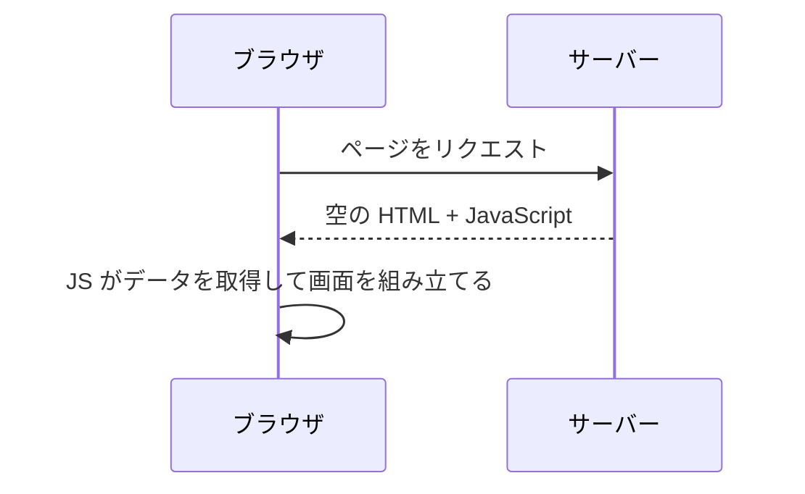
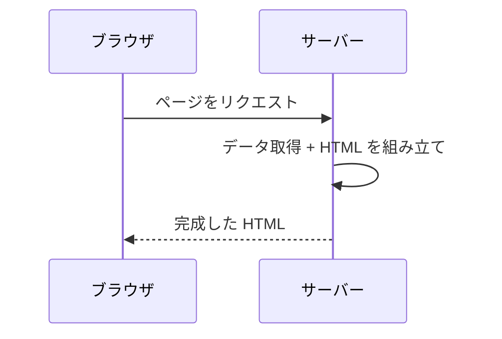
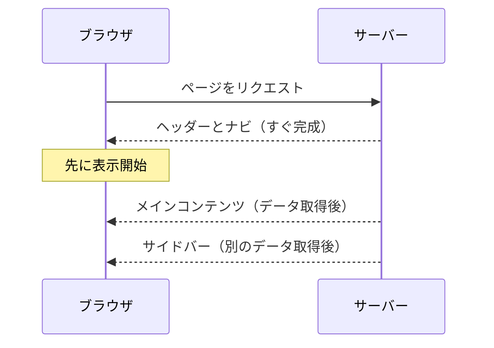
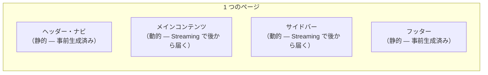
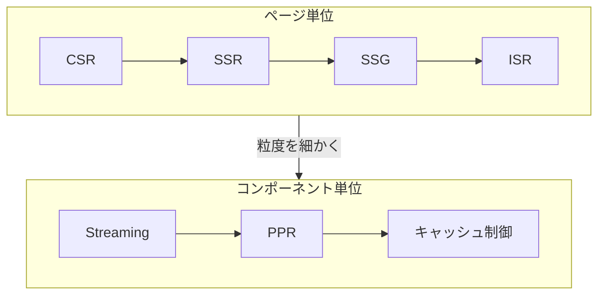

# Web ページの届け方 — CSR から PPR まで

## 今日のゴール

- Web ページの描画にはいくつかの方式があることを知る
- CSR / SSR / SSG / ISR の違いを知る
- Streaming / PPR / キャッシュ制御で、ページ内をさらに細かく制御できることを知る

## ページ単位の描画方式

Web ページの HTML を「いつ」「どこで」作るか。この違いで、ユーザーに届くまでの速度や体験が変わります。

### CSR — ブラウザで組み立てる



サーバーはほぼ空の HTML と JavaScript を返します。ブラウザが JavaScript を実行し、API からデータを取得して画面を組み立てます。SPA（Single Page Application）の基本的な方式です。

| メリット | デメリット |
|---------|----------|
| サーバーの負荷が低い | 初期表示が遅い（JS の読み込みと実行を待つ） |
| ページ遷移が速い | SEO に弱い（検索エンジンが空の HTML を見る） |

### SSR — リクエストのたびにサーバーで組み立てる



リクエストが来るたびに、サーバーがデータを取得して完成した HTML を返します。

| メリット | デメリット |
|---------|----------|
| 初期表示が速い（完成した HTML が届く） | リクエストのたびにサーバーが処理する |
| SEO に強い | サーバーの処理が遅いと表示も遅い |
| 常に最新のデータ | サーバーの負荷が高い |

### SSG と ISR — 事前生成とその更新


**SSG**（Static Site Generation）はビルド時に全ページの HTML を生成しておく方式です。リクエスト時はファイルを返すだけなので最速ですが、データはビルド時点のまま古くなります。

**ISR**（Incremental Static Regeneration）は SSG の弱点を補う方式です。一定時間が経過したページにリクエストが来ると、キャッシュを返しつつ裏側で HTML を再生成します。

### 4 つの方式の比較

| 方式 | HTML を作るタイミング | 作る場所 | データの鮮度 |
|------|---------------------|---------|------------|
| CSR | リクエスト後 | ブラウザ | 最新 |
| SSR | リクエスト時 | サーバー | 最新 |
| SSG | ビルド時 | サーバー | ビルド時点 |
| ISR | ビルド時 + 定期更新 | サーバー | やや遅れる |


それぞれが前の方式の弱点を補う形で生まれました。しかし、どの方式も「ページ全体」を単位にしています。1 つのページの中に「静的でいい部分」と「動的に取得したい部分」が混在する場合、ページ単位では最適化しきれません。

---

## ページの中をさらに細かく制御する

ここからは、ページ全体ではなく「ページの中の一部分」を単位にして描画を制御する仕組みです。

### Streaming — 完成を待たずに流す

SSR はページ全体が完成するまでブラウザに何も届きません。データ取得に 3 秒かかる部分があれば、ページ全体が 3 秒待ちです。

Streaming は、できた部分から順にブラウザに送ります。



ユーザーは白い画面を見つめて待つ必要がありません。

| SSR | SSR + Streaming |
|-----|----------------|
| 全部完成してからまとめて送る | できた部分から順に送る |
| 遅い部分に全体が引っ張られる | 速い部分は先に表示される |

### PPR — 静的と動的を 1 ページに混ぜる

PPR（Partial Prerendering）は、SSG の速さと SSR のデータ鮮度を 1 つのページの中で両立します。



| 部分 | 方式 | 届くタイミング |
|------|------|-------------|
| ヘッダー、フッター | SSG（事前生成） | 即座（CDN から） |
| メインコンテンツ | Streaming | データ取得後 |
| サイドバー | Streaming | データ取得後 |

ページの枠は CDN から即座に届き、動的な部分だけ後から埋まります。

### キャッシュ制御 — コンポーネント単位で決める

Next.js は、キャッシュの制御をさらに細かくコンポーネント単位で行う方向に進んでいます。

```
ページ
├── ヘッダー       → キャッシュ: 長期間
├── 商品一覧       → キャッシュ: 1 時間
├── ユーザー情報    → キャッシュ: しない（毎回取得）
└── フッター       → キャッシュ: 長期間
```

ページ単位で「CSR か SSR か SSG か」を選ぶのではなく、コンポーネントごとにキャッシュ戦略を決める。これが現在の Next.js が向かっている方向です。

## まとめ



| 粒度 | 方式 | 特徴 |
|------|------|------|
| ページ全体 | CSR / SSR / SSG / ISR | ページごとに「いつ」「どこで」HTML を作るか決める |
| ページの一部分 | Streaming / PPR / キャッシュ制御 | 1 つのページの中で部品ごとに描画方式を変える |

制御の粒度がページからコンポーネントへと細かくなっています。
