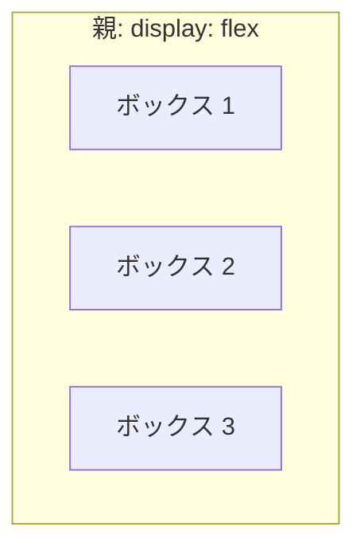
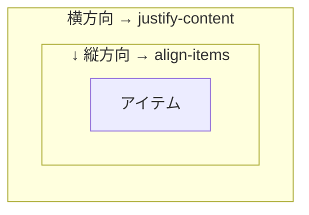

# Flexbox — 横に並べるための仕組み

## 今日のゴール

- CSS の要素はデフォルトで縦に積まれることを知る
- `display: flex` で横に並ぶ仕組みを知る
- 横方向と縦方向の配置を別々に指定できることを知る

## CSS の要素は全部縦に積まれる

HTML に `<div>` を 3 つ並べると、画面上では縦に積み重なります。

```html
<!DOCTYPE html>
<html lang="ja">
  <head>
    <meta charset="UTF-8" />
    <meta name="viewport" content="width=device-width, initial-scale=1.0" />
    <title>縦積みの例</title>
    <style>
      .box {
        background-color: #e8f0fe;
        border: 1px solid #93c5fd;
        padding: 16px;
      }
    </style>
  </head>
  <body>
    <div class="box">ボックス 1</div>
    <div class="box">ボックス 2</div>
    <div class="box">ボックス 3</div>
  </body>
</html>
```

ブラウザで開くと、3 つのボックスが上から下に並びます。横に並んでほしくても、縦に積まれます。

これは `<div>` がブロック要素だからです。ブロック要素は横幅いっぱいに広がり、次の要素を下に押し出します。CSS の世界では**縦積みがデフォルト**です。

では横に並べたいときはどうすればいいのでしょうか。ここで登場するのが Flexbox です。

## display: flex で横に並ぶ

並べたい要素の**親**に `display: flex` を付けます。

```html
<!DOCTYPE html>
<html lang="ja">
  <head>
    <meta charset="UTF-8" />
    <meta name="viewport" content="width=device-width, initial-scale=1.0" />
    <title>Flexbox の例</title>
    <style>
      .container {
        display: flex;
        gap: 8px;
      }
      .box {
        background-color: #e8f0fe;
        border: 1px solid #93c5fd;
        padding: 16px;
      }
    </style>
  </head>
  <body>
    <div class="container">
      <div class="box">ボックス 1</div>
      <div class="box">ボックス 2</div>
      <div class="box">ボックス 3</div>
    </div>
  </body>
</html>
```

たった 1 行、`display: flex` を親に付けるだけで、子要素が横に並びます。

ポイントは **flex を付けるのは親** ということです。子要素には何も指定していません。Flexbox は「親が子の並べ方を決める」仕組みです。



`display: flex` を付けた親を**フレックスコンテナ**、その中の子を**フレックスアイテム**と呼びます。

## 横方向と縦方向は別の操作

Flexbox で要素の位置を調整するとき、横方向と縦方向は別々のプロパティで指定します。



- **`justify-content`**: 横方向（アイテムが並ぶ方向）の配置
- **`align-items`**: 縦方向（アイテムが並ぶ方向に対して垂直）の配置

この 2 つを覚えれば、Flexbox の配置はほとんど理解できます。

### justify-content — 横方向の配置

```css
.container {
  display: flex;
  justify-content: flex-start;   /* 左寄せ（デフォルト） */
}
```

| 値 | 動き |
|------|------|
| `flex-start` | 左に寄せる（デフォルト） |
| `center` | 中央に寄せる |
| `flex-end` | 右に寄せる |
| `space-between` | 最初と最後を端に付け、残りを均等に配置 |

`space-between` は特に便利です。ヘッダーで「ロゴを左、メニューを右」に配置するのにぴったりです。

```css
.header {
  display: flex;
  justify-content: space-between;
  align-items: center;
}
```

```html
<header class="header">
  <div>ロゴ</div>
  <nav>メニュー</nav>
</header>
```

これだけで、ロゴは左端、メニューは右端に配置されます。

### align-items — 縦方向の配置

```css
.container {
  display: flex;
  align-items: stretch;   /* 高さを揃える（デフォルト） */
}
```

| 値 | 動き |
|------|------|
| `stretch` | 親の高さいっぱいに伸びる（デフォルト） |
| `flex-start` | 上に寄せる |
| `center` | 縦方向の中央 |
| `flex-end` | 下に寄せる |

デフォルトが `stretch` であることは知っておくと役に立ちます。Flexbox の中で子要素の高さが親と同じになるのは、`stretch` が自動で効いているからです。

## 中央配置が 2 行で終わる

CSS で要素を画面の中央に置くのは、かつてはかなり面倒でした。Flexbox を使うと 2 行で済みます。

```css
.center {
  display: flex;
  justify-content: center;   /* 横方向の中央 */
  align-items: center;       /* 縦方向の中央 */
  min-height: 200px;
}
```

```html
<div class="center">
  <p>ど真ん中に表示されます</p>
</div>
```

`justify-content: center` で横の中央、`align-items: center` で縦の中央。これだけです。

Flexbox が登場する前は、`position: absolute` と `transform: translate(-50%, -50%)` を組み合わせたり、`display: table-cell` を使ったりと、直感的ではない方法が必要でした。「CSS で中央寄せが難しい」という話を聞いたことがあるかもしれませんが、それは Flexbox より前の時代の話です。

## flex-wrap — 画面に収まらないとき

デフォルトでは、Flexbox のアイテムは 1 行に収まろうとして縮みます。アイテムの数が多いと潰れてしまいます。

`flex-wrap: wrap` を付けると、収まりきらないアイテムが次の行に折り返されます。

```css
.card-list {
  display: flex;
  flex-wrap: wrap;
  gap: 16px;
}

.card {
  width: 200px;
  padding: 16px;
  background-color: #e8f0fe;
  border: 1px solid #93c5fd;
}
```

```html
<ul class="card-list" aria-label="カード一覧">
  <li class="card">カード 1</li>
  <li class="card">カード 2</li>
  <li class="card">カード 3</li>
  <li class="card">カード 4</li>
  <li class="card">カード 5</li>
</ul>
```

画面幅が広ければ 1 行に並び、狭くなれば自動的に 2 行、3 行と折り返されます。カード一覧のようなレイアウトでよく使われます。

## flex-direction — 縦に並べたいとき

ここまで「flex は横に並べる」と説明してきましたが、縦に並べることもできます。`flex-direction: column` を指定します。

```css
.vertical {
  display: flex;
  flex-direction: column;
  gap: 8px;
}
```

「わざわざ flex にして縦に並べる意味があるのか」と思うかもしれません。意味はあります。`gap` で間隔を管理できること、`justify-content` や `align-items` で配置を制御できること。素のブロック要素の縦積みでは、これらが使えません。

## まとめ

- CSS の要素はデフォルトで縦に積まれます。横に並べるには仕組みが必要です
- `display: flex` を**親**に付けると、子が横に並びます
- 横方向の配置は `justify-content`、縦方向の配置は `align-items` で指定します。2 つは別の操作です
- `justify-content: center` と `align-items: center` の 2 行で中央配置ができます
- `flex-wrap: wrap` で折り返し、`flex-direction: column` で縦並びもできます
