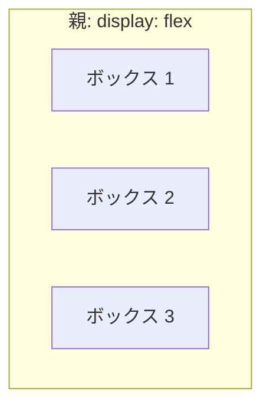
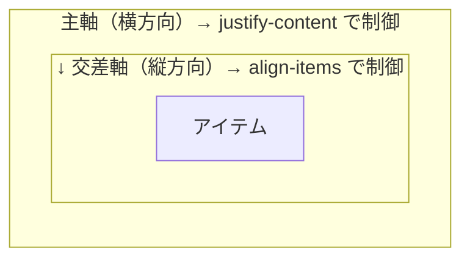

# Flexbox — 横に並べるだけで大変だった時代とその終わり

## 今日のゴール

- CSS の要素がデフォルトで縦に積まれる理由を知る
- 横に並べるために昔どんなハックが必要だったかを知る
- `display: flex` が何を解決したかを知る

## 横に並べるだけなのに

Web ページを作っていると、「横に並べたい」場面はいたるところにあります。ヘッダーのロゴとメニュー、カードの一覧、フォームのラベルと入力欄。どれもごく自然な要望です。

ところが、CSS の世界では**横に並べるのは当たり前ではありません**。

HTML の `<div>` や `<p>` などの要素（ブロック要素と呼ばれます）は、横幅いっぱいに広がって、次の要素を下に押し出します。つまり、何もしなければ**全部縦に積まれる**のがデフォルトです。

```html
<!DOCTYPE html>
<html lang="ja">
  <head>
    <meta charset="UTF-8" />
    <meta name="viewport" content="width=device-width, initial-scale=1.0" />
    <title>縦積みの例</title>
    <style>
      .item {
        background-color: #dbeafe;
        border: 1px solid #93c5fd;
        padding: 16px;
      }
    </style>
  </head>
  <body>
    <div class="item">ボックス 1</div>
    <div class="item">ボックス 2</div>
    <div class="item">ボックス 3</div>
  </body>
</html>
```

3 つのボックスは、どれだけ横幅に余裕があっても上から下に並びます。「横に並んでほしいのに」と思っても、CSS にその機能がなかった時代がありました。

では、昔の開発者はどうしていたのか。そこには、なかなか大変な歴史があります。


## Flexbox の前 — 「横並び」に専用の道具がなかった時代

### float — 回り込みを並びに流用していた

`float` はもともと、**新聞のように画像の横にテキストを回り込ませるための仕組み**です。横に並べるためのものではありません。

```css
/* 画像の回り込み（本来の用途） */
img {
  float: left;
  margin-right: 16px;
}
```

しかし CSS に「横に並べる」専用の仕組みがなかったため、開発者は `float` を流用しました。要素を浮かせて無理やり横に並べていたのです。

```css
.card {
  float: left;
  width: 33.33%;
}
```

これで一応横に並びますが、問題がありました。`float` された要素は通常の配置から外れるため、**親要素が子の高さを認識できなくなります**。親の高さがゼロになり、背景色も枠線も表示されません。

```css
/* 親が高さを失うのを防ぐ「おまじない」 */
.card-list::after {
  content: "";
  display: block;
  clear: both;
}
```

「横に並べたい」だけなのに、「高さを回復するおまじない」が必要になる。回り込み用の仕組みを並びに流用した副作用です。

### inline-block — 幽霊の隙間が出る

もうひとつの方法が `display: inline-block` です。ブロック要素をインライン（文字のように横に流れる）として扱わせます。

```html
<div class="item">A</div>
<div class="item">B</div>
<div class="item">C</div>
```

```css
.item {
  display: inline-block;
  width: 100px;
}
```

一見うまくいきますが、**A と B の間に謎の隙間**が生まれます。

この隙間の正体は、HTML の改行やスペースです。`inline-block` は文字と同じ扱いなので、HTML 上の改行が「半角スペース」として描画されてしまいます。消すには HTML の改行を消す、`font-size: 0` を親に指定するなど、本質とは無関係なハックが必要でした。

```html
<!-- 改行を消す荒業 -->
<div class="item">A</div><div class="item">B</div><div class="item">C</div>
```

### 中央寄せ — CSS 界の長年のネタ

横並びも苦労しましたが、もっと大変だったのが**上下左右の中央寄せ**です。

CSS で要素を画面の真ん中に置きたい。言葉にすれば単純です。しかし昔はこんなコードが必要でした。

```css
.center {
  position: absolute;
  top: 50%;
  left: 50%;
  transform: translate(-50%, -50%);
}
```

要素を親の左上から 50% の位置に置き、自身のサイズの半分だけ戻す。やっていることは理にかなっていますが、「真ん中に置きたい」という素朴な要望に対して、知っていないと書けないテクニックです。

```css
/* 別の方法: テーブルレイアウトの流用 */
.parent {
  display: table-cell;
  vertical-align: middle;
  text-align: center;
}
```

テーブル（表）の機能を使う方法もありましたが、表でもないのに `table-cell` を使うのは不自然です。

「CSS で中央寄せが難しい」というのはインターネット上で長年ネタにされてきました。それくらい、CSS には配置の専用道具が欠けていたのです。


## Flexbox が解決した — 親が子の並べ方を決める

### display: flex の一行で世界が変わる

2012 年頃から使えるようになった **Flexbox（Flexible Box Layout）** は、「1 次元の並びを配置する」ための専用の仕組みです。

使い方は、並べたい要素の**親に** `display: flex` を付けるだけです。

```html
<!DOCTYPE html>
<html lang="ja">
  <head>
    <meta charset="UTF-8" />
    <meta name="viewport" content="width=device-width, initial-scale=1.0" />
    <title>Flexbox の例</title>
    <style>
      .container {
        display: flex;
        gap: 8px;
      }
      .item {
        background-color: #dbeafe;
        border: 1px solid #93c5fd;
        padding: 16px;
      }
    </style>
  </head>
  <body>
    <div class="container">
      <div class="item">ボックス 1</div>
      <div class="item">ボックス 2</div>
      <div class="item">ボックス 3</div>
    </div>
  </body>
</html>
```

たった 1 行で、子要素が横に並びます。`float` のおまじないも、`inline-block` の幽霊の隙間も、もう要りません。

### ポイントは「親が決める」

Flexbox の重要な考え方は、**親が子の並べ方を決める**ということです。

子要素には何も指定していません。`display: flex` を付けた親（フレックスコンテナと呼びます）が、中の子要素（フレックスアイテム）をどう配置するかを一括で決めます。



`float` や `inline-block` は、子要素一つひとつに指定する仕組みでした。だから「親の高さが消える」「子同士に謎の隙間ができる」といった問題が起きたのです。Flexbox は発想が逆です。並べ方は親の仕事。子は並べられるだけ。だからシンプルに動きます。

### 隙間は gap で

要素の間にスペースを空けたいとき、昔は `margin` を使っていました。しかし `margin` だと「最後の要素の右端にも余白が付く」問題があり、`:last-child` で消す例外処理が要りました。

```css
/* 昔の書き方 */
.item {
  margin-right: 16px;
}
.item:last-child {
  margin-right: 0;
}
```

`gap` は**アイテムの間にだけ**隙間を作ります。端には付きません。例外処理は不要です。

```css
.container {
  display: flex;
  gap: 16px;
}
```

`gap` は Flexbox の親に指定します。ここでも「親が決める」という一貫した考え方です。


## 2 つの軸で位置を決める

Flexbox で要素の位置を調整するとき、**横方向と縦方向は別々のプロパティで指定します**。この 2 つの軸の考え方が、Flexbox を使いこなすための鍵です。



- **`justify-content`**: 主軸方向（アイテムが並ぶ方向）の配置を決める
- **`align-items`**: 交差軸方向（主軸に対して垂直な方向）の配置を決める

2 つの軸は完全に独立した操作です。横方向を変えても縦方向には影響しません。

### justify-content — 横方向の配置

| 値 | 動き |
|------|------|
| `flex-start` | 左に寄せる（デフォルト） |
| `center` | 中央に寄せる |
| `flex-end` | 右に寄せる |
| `space-between` | 最初と最後を両端に付け、残りを均等配置 |

`space-between` は特に便利です。ヘッダーで「ロゴを左、メニューを右」に配置するのにぴったりです。

```html
<header class="site-header">
  <div class="logo">MyApp</div>
  <nav aria-label="メインナビゲーション">メニュー</nav>
</header>
```

```css
.site-header {
  display: flex;
  justify-content: space-between;
  align-items: center;
  padding: 12px 16px;
}
```

これだけで、ロゴは左端、メニューは右端に配置されます。

### align-items — 縦方向の配置

| 値 | 動き |
|------|------|
| `stretch` | 親の高さいっぱいに伸びる（デフォルト） |
| `flex-start` | 上に寄せる |
| `center` | 縦方向の中央 |
| `flex-end` | 下に寄せる |

デフォルトが `stretch` であることは知っておくと役に立ちます。Flexbox の中で子要素の高さが親と同じになるのは、`stretch` が自動で効いているからです。

### 中央寄せが 2 行で終わる

あの面倒だった中央寄せが、Flexbox では 2 行で済みます。

```css
.center {
  display: flex;
  justify-content: center;
  align-items: center;
  min-height: 200px;
}
```

```html
<div class="center">
  <p>ど真ん中に表示されます</p>
</div>
```

`justify-content: center` で横の中央、`align-items: center` で縦の中央。`position: absolute` と `transform` を組み合わせていた時代が嘘のようです。


## よく使うパターン

ここまでの知識だけで、実務でよく出るレイアウトが作れます。

### カード一覧（折り返し）

デフォルトでは、Flexbox のアイテムは 1 行に収まろうとして縮みます。`flex-wrap: wrap` を付けると、収まりきらないアイテムが次の行に折り返されます。

```css
.card-list {
  display: flex;
  flex-wrap: wrap;
  gap: 16px;
}

.card {
  width: 200px;
  padding: 16px;
  background-color: #dbeafe;
  border: 1px solid #93c5fd;
}
```

```html
<ul class="card-list" aria-label="カード一覧">
  <li class="card">カード 1</li>
  <li class="card">カード 2</li>
  <li class="card">カード 3</li>
  <li class="card">カード 4</li>
  <li class="card">カード 5</li>
</ul>
```

画面幅が広ければ 1 行に並び、狭くなれば自動的に折り返されます。

### flex: 1 で残りの幅を使い切る

サイドバーとメインコンテンツのようなレイアウトでは、`flex: 1` が活躍します。これは「余った空間を全部受け取る」という意味です。

```css
.layout {
  display: flex;
  gap: 16px;
}

.sidebar {
  width: 200px;
}

.main-content {
  flex: 1; /* 残りの幅を全部使う */
}
```

サイドバーは 200px で固定、メインコンテンツは画面の残りを使い切る。よく見るレイアウトが、この数行で作れます。


## まとめ

- CSS の要素はデフォルトで縦に積まれます。横に並べる専用の仕組みは、長い間ありませんでした
- `float` や `inline-block` は本来の用途とは違うハックで、おまじないや例外処理が必要でした
- **Flexbox** は横並び・縦並びの専用の道具です。親に `display: flex` を付けるだけで子が並びます
- 「親が子の並べ方を決める」のが Flexbox の考え方。隙間は `gap` で親が指定します
- 横方向の配置は `justify-content`、縦方向の配置は `align-items`。2 つの軸は独立した操作です
- あの面倒だった中央寄せも、`justify-content: center` と `align-items: center` の 2 行で終わります
