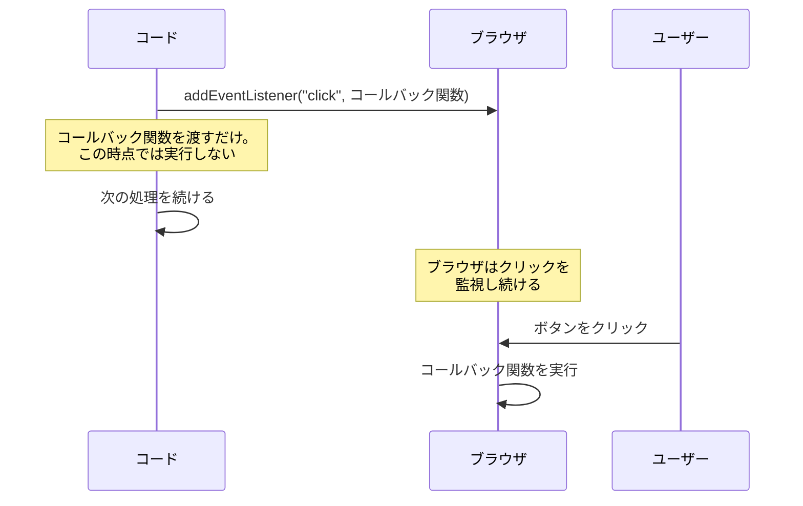
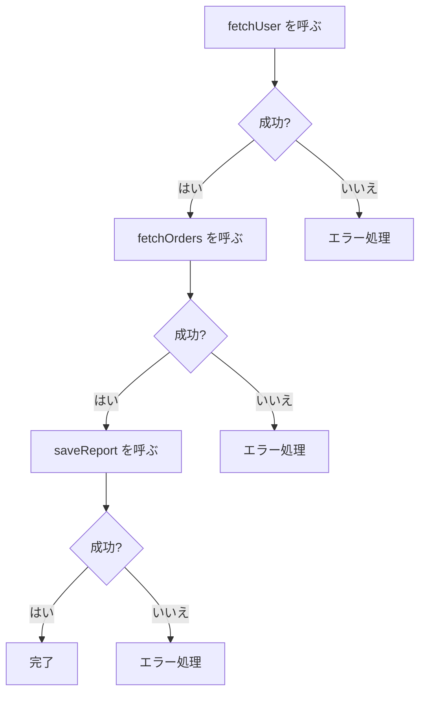

# コールバックと高階関数 — 関数を渡すという発想

## 今日のゴール

- JavaScript では関数を値として扱えることを知る
- コールバック — 関数を別の関数に渡して「後で呼んでもらう」パターンを知る
- 高階関数 — 関数を受け取ることで汎用的な処理を作れる仕組みを知る

## 1. 関数は値である

JavaScript では、数値や文字列と同じように、関数も「値」として扱えます。変数に入れたり、配列に格納したり、別の関数に引数として渡したりできます。

```javascript
const greet = function(name) {
  return "こんにちは、" + name;
};

console.log(greet("田中"));  // "こんにちは、田中"
```

関数を変数 `greet` に代入しています。`greet` は数値や文字列が入っている変数と同じように扱えます。

配列にも入れられます。

```javascript
function add(a, b) { return a + b; }
function subtract(a, b) { return a - b; }
function multiply(a, b) { return a * b; }

const operations = [add, subtract, multiply];

console.log(operations[0](10, 3));  // 13
console.log(operations[1](10, 3));  // 7
console.log(operations[2](10, 3));  // 30
```

配列の要素として関数を格納し、インデックスで取り出して呼び出しています。

このように、関数を他の値と同じように扱える性質のことを<strong>ファーストクラスオブジェクト</strong>（第一級オブジェクト）と呼びます。「関数が特別扱いされず、普通の値と同じ立場」という意味です。

すべてのプログラミング言語がこの性質を持っているわけではありません。JavaScript では関数が値であることが当たり前なので、「関数を別の関数に渡す」というパターンが頻繁に登場します。

## 2. コールバック — 「後で呼んで」を渡す

関数を値として渡せるなら、「この処理を後で実行してほしい」という指示を関数として渡すことができます。この「後で呼び出してもらうために渡す関数」を<strong>コールバック関数</strong>（callback function）と呼びます。

「電話を折り返してください（call back）」と同じ発想です。自分の電話番号を渡しておけば、相手が準備できたタイミングで折り返してくれます。コールバック関数も同じで、「実行してほしい処理」を渡しておけば、適切なタイミングで呼び出してもらえます。

### addEventListener — 「クリックされたとき」に呼んでもらう

ブラウザでボタンがクリックされたとき何をするかを、コールバック関数で指定します。

```javascript
const button = document.querySelector("button");

button.addEventListener("click", function() {
  console.log("ボタンがクリックされました");
});
```

`addEventListener` の 2 つ目の引数に渡している `function() { ... }` がコールバック関数です。この関数はその場では実行されません。ユーザーがボタンをクリックした「とき」に、ブラウザが呼び出します。

アロー関数で書くこともできます。

```javascript
button.addEventListener("click", () => {
  console.log("ボタンがクリックされました");
});
```

### setTimeout — 「一定時間後」に呼んでもらう

```javascript
console.log("開始");

setTimeout(() => {
  console.log("3秒経ちました");
}, 3000);

console.log("次の処理");
```

実行結果はこうなります。

```
開始
次の処理
3秒経ちました
```

`setTimeout` は渡されたコールバック関数を指定ミリ秒後に実行します。3000 ミリ秒（3 秒）後に呼び出してもらう関数を渡しています。重要なのは、`setTimeout` を呼んだ時点では待たずに次の行（`"次の処理"`）がすぐ実行されることです。3 秒後にコールバックが呼ばれます。

### コールバック実行の流れ

`addEventListener` の場合の流れを図で見てみましょう。



コールバックの本質は「今は実行しない。条件が満たされたときに実行してもらう」です。クリックされたとき、時間が経ったとき、データの取得が終わったとき — タイミングは様々ですが、パターンは同じです。

## 3. 高階関数 — 関数を受け取る関数

関数を引数として受け取る関数、または関数を戻り値として返す関数のことを<strong>高階関数</strong>（higher-order function）と呼びます。先ほどの `addEventListener` や `setTimeout` も、コールバック関数を受け取るので高階関数です。

高階関数の強みは「何をするか」を外から受け取ることで、汎用的な処理を作れることです。

### 配列の高階関数 — map と filter

JavaScript の配列には、高階関数がいくつも用意されています。中でも `map` と `filter` は特によく使います。

<strong>`map`</strong> は配列の各要素を変換して、新しい配列を作ります。

```javascript
const numbers = [1, 2, 3, 4, 5];
const doubled = numbers.map((n) => n * 2);

console.log(doubled);  // [2, 4, 6, 8, 10]
```

`map` に渡しているアロー関数 `(n) => n * 2` がコールバックです。`map` は配列の要素を 1 つずつこの関数に渡して、戻り値を集めた新しい配列を返します。

<strong>`filter`</strong> は条件に合う要素だけを残した新しい配列を作ります。

```javascript
const numbers = [1, 2, 3, 4, 5];
const evens = numbers.filter((n) => n % 2 === 0);

console.log(evens);  // [2, 4]
```

コールバックが `true` を返した要素だけが残ります。

組み合わせることもできます。

```javascript
const users = [
  { name: "田中", age: 25, active: true },
  { name: "佐藤", age: 30, active: false },
  { name: "鈴木", age: 22, active: true },
];

const activeNames = users
  .filter((user) => user.active)
  .map((user) => user.name);

console.log(activeNames);  // ["田中", "鈴木"]
```

「アクティブなユーザーだけを残して、名前だけを取り出す」という処理が、高階関数の組み合わせで読みやすく書けます。

### 高階関数がない場合との比較

高階関数を使わない場合、似たような処理を何度も書くことになります。

| 高階関数なし | 高階関数あり |
|------------|------------|
| 配列をループして条件で分岐 | `filter` にコールバックを渡す |
| 配列をループして変換結果を新しい配列に追加 | `map` にコールバックを渡す |
| 処理ごとにループのコードが重複 | ループの仕組みは `map` / `filter` に任せる |

具体的なコードで比べてみましょう。

```javascript
// 高階関数なし — ループと条件分岐を自分で書く
const numbers = [1, 2, 3, 4, 5];

const doubledEvens = [];
for (let i = 0; i < numbers.length; i++) {
  if (numbers[i] % 2 === 0) {
    doubledEvens.push(numbers[i] * 2);
  }
}
console.log(doubledEvens);  // [4, 8]
```

```javascript
// 高階関数あり — 「何をするか」だけを書く
const numbers = [1, 2, 3, 4, 5];

const doubledEvens = numbers
  .filter((n) => n % 2 === 0)
  .map((n) => n * 2);

console.log(doubledEvens);  // [4, 8]
```

高階関数を使うと「ループをどう回すか」は `filter` や `map` に任せて、「何をするか」（偶数だけ残す、2 倍にする）に集中できます。

### 自分で高階関数を作る

高階関数は組み込みのものだけではありません。自分で作ることもできます。

```javascript
function repeat(n, action) {
  for (let i = 0; i < n; i++) {
    action(i);
  }
}

repeat(3, (i) => {
  console.log("実行 " + i + " 回目");
});
```

```
実行 0 回目
実行 1 回目
実行 2 回目
```

`repeat` は「n 回繰り返す」という仕組みだけを持ち、「何をするか」はコールバックとして外から受け取ります。回数と処理を分離することで、`repeat` は汎用的に使えます。

## 4. コールバックの連鎖と限界

コールバックは非同期処理（結果がすぐに返ってこない処理）でも使われます。例えばサーバーからデータを取得する処理は、通信に時間がかかるため、結果が返ってきた「とき」にコールバック関数を呼ぶという仕組みになっています。

1 つのコールバックなら問題ありません。しかし、非同期処理が連鎖すると話が変わります。「データを取得して、その結果を加工して、加工した結果を保存する」という処理を考えてみましょう。

```javascript
fetchUser("user-1", (user) => {
  fetchOrders(user.id, (orders) => {
    saveReport(user, orders, (result) => {
      console.log("レポート保存完了:", result);
    });
  });
});
```

コールバックの中にコールバック、さらにその中にコールバック — ネストがどんどん深くなっています。これは<strong>コールバック地獄</strong>（callback hell）と呼ばれる問題です。

実際のアプリケーションではエラー処理も必要です。各段階でエラーが起きる可能性を考えると、さらに複雑になります。

```javascript
fetchUser("user-1", (error, user) => {
  if (error) {
    console.error("ユーザー取得失敗:", error);
    return;
  }
  fetchOrders(user.id, (error, orders) => {
    if (error) {
      console.error("注文取得失敗:", error);
      return;
    }
    saveReport(user, orders, (error, result) => {
      if (error) {
        console.error("保存失敗:", error);
        return;
      }
      console.log("レポート保存完了:", result);
    });
  });
});
```

ネストが深く、同じようなエラー処理が繰り返され、どの処理がどの段階のものか追いにくくなっています。



本来やりたいことは「ユーザーを取得 → 注文を取得 → レポートを保存」という直線的な流れです。しかしコールバックで書くと、ネストと分岐で構造が複雑になってしまいます。

この問題を解決するために、JavaScript には <strong>Promise</strong> という仕組みが導入されました。Promise を使うと、コールバックのネストを平坦な書き方に変えられます。さらに `async`/`await` という構文と組み合わせることで、非同期処理をまるで同期処理のように書けるようになります。

## まとめ

- JavaScript の関数はファーストクラスオブジェクトです。変数に代入したり、引数として渡したりできます
- コールバック関数は「後で呼んでもらうために渡す関数」です。イベント発生時、タイマー完了時、データ取得完了時など、特定のタイミングで実行されます
- 高階関数は「関数を受け取る関数」です。`map` や `filter` のように「何をするか」を外から受け取ることで、汎用的な処理が書けます
- コールバックが連鎖するとネストが深くなる「コールバック地獄」が起きます。これを解決するのが Promise と async/await です
