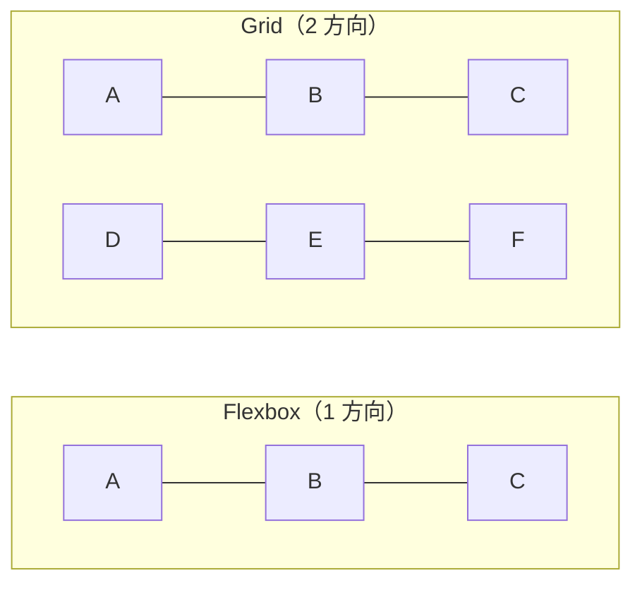

# CSS Grid — 格子状に並べる仕組み

## 今日のゴール

- CSS Grid は 2 次元（行と列の両方）を同時に扱えることを知る
- `grid-template-columns` でグリッドを定義する方法を知る
- Flexbox との使い分けの考え方を知る

## Flexbox と Grid の違い

Flexbox は「1 方向」のレイアウトです。横に並べるか、縦に並べるか、どちらか一方を指定します。`flex-wrap: wrap` で折り返しはできますが、行と列のサイズを同時に揃える仕組みはありません。

CSS Grid は「2 方向」のレイアウトです。**行と列の両方を同時に定義**できます。格子状にきれいに揃えたいとき、Grid のほうが適しています。



## display: grid で格子を作る

Flexbox と同じく、**親**に `display: grid` を指定します。そしてグリッドの列数を `grid-template-columns` で定義します。

```css
.grid {
  display: grid;
  grid-template-columns: 1fr 1fr 1fr;
  gap: 16px;
}
```

これで 3 列のグリッドができます。子要素は自動的に 3 列の格子に収まります。

```html
<!DOCTYPE html>
<html lang="ja">
  <head>
    <meta charset="UTF-8" />
    <meta name="viewport" content="width=device-width, initial-scale=1.0" />
    <title>CSS Grid の例</title>
    <style>
      .grid {
        display: grid;
        grid-template-columns: 1fr 1fr 1fr;
        gap: 16px;
      }
      .item {
        padding: 16px;
        background-color: #e8f0fe;
        border: 1px solid #93c5fd;
        border-radius: 8px;
      }
    </style>
  </head>
  <body>
    <div class="grid">
      <div class="item">1</div>
      <div class="item">2</div>
      <div class="item">3</div>
      <div class="item">4</div>
      <div class="item">5</div>
      <div class="item">6</div>
    </div>
  </body>
</html>
```

6 つの要素が 3 列 × 2 行にきれいに並びます。要素を追加すれば自動的に次の行に入ります。

## fr — 余った幅を分け合う単位

`1fr 1fr 1fr` の `fr` は "fraction"（分数）の略で、**余ったスペースを均等に分ける**という意味です。

```css
/* 3 列が等幅 */
grid-template-columns: 1fr 1fr 1fr;

/* 左列を 2 倍幅にする */
grid-template-columns: 2fr 1fr 1fr;

/* 左列を固定幅にして、残りを均等に */
grid-template-columns: 200px 1fr 1fr;
```

`fr` を使うと、画面幅が変わっても列が自動的にリサイズされます。`px` で固定するよりも柔軟です。

### repeat() で繰り返す

`1fr 1fr 1fr` と 3 回書く代わりに `repeat()` で簡潔にできます。

```css
/* 3 列を等幅で */
grid-template-columns: repeat(3, 1fr);

/* 4 列を等幅で */
grid-template-columns: repeat(4, 1fr);
```

## レスポンシブなグリッド

メディアクエリを使って画面幅ごとに列数を変えるのが基本的なアプローチです。

```css
.grid {
  display: grid;
  gap: 16px;
  grid-template-columns: 1fr;
}

@media (min-width: 768px) {
  .grid {
    grid-template-columns: repeat(2, 1fr);
  }
}

@media (min-width: 1024px) {
  .grid {
    grid-template-columns: repeat(3, 1fr);
  }
}
```

スマホでは 1 列、タブレットでは 2 列、PC では 3 列。メディアクエリの仕組みと組み合わせてレイアウトを切り替えます。

さらに、メディアクエリを使わずに自動で列数を調整する方法もあります。

```css
.grid {
  display: grid;
  grid-template-columns: repeat(auto-fill, minmax(200px, 1fr));
  gap: 16px;
}
```

「各列は最低 200px、余ったスペースは均等に分配、入るだけ列を作る」という意味です。画面幅に応じて列数が自動で変わります。

## Flexbox と Grid の使い分け

| 場面 | 適したレイアウト |
|------|----------------|
| ヘッダーのロゴとメニューを左右に配置 | Flexbox |
| ナビゲーションのリンクを横に並べる | Flexbox |
| カードを格子状に並べる | Grid |
| ダッシュボードのレイアウト（メイン + サイドバー） | Grid |
| 要素を 1 方向に並べて間隔を調整したい | Flexbox |
| 行と列のサイズを揃えたい | Grid |

シンプルな判断基準は、**1 方向に並べるなら Flexbox、格子状に並べるなら Grid** です。

## まとめ

- CSS Grid は行と列の 2 方向を同時に定義できるレイアウトの仕組みです
- `display: grid` を親に付け、`grid-template-columns` で列を定義します
- `fr` は余った幅を分け合う単位です。`repeat(3, 1fr)` で 3 列均等になります
- `auto-fill` と `minmax()` を使うとメディアクエリなしでレスポンシブなグリッドが作れます
- 1 方向に並べるなら Flexbox、格子状に並べるなら Grid が基本の使い分けです
