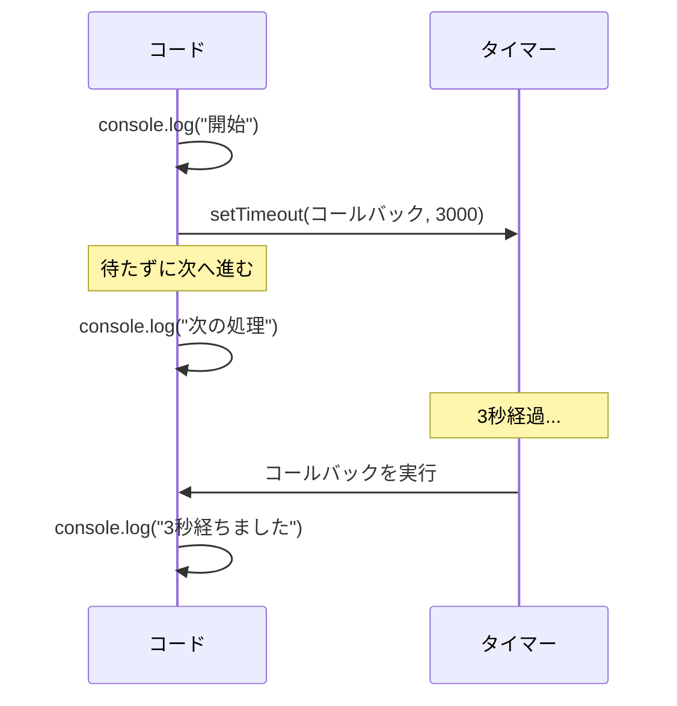
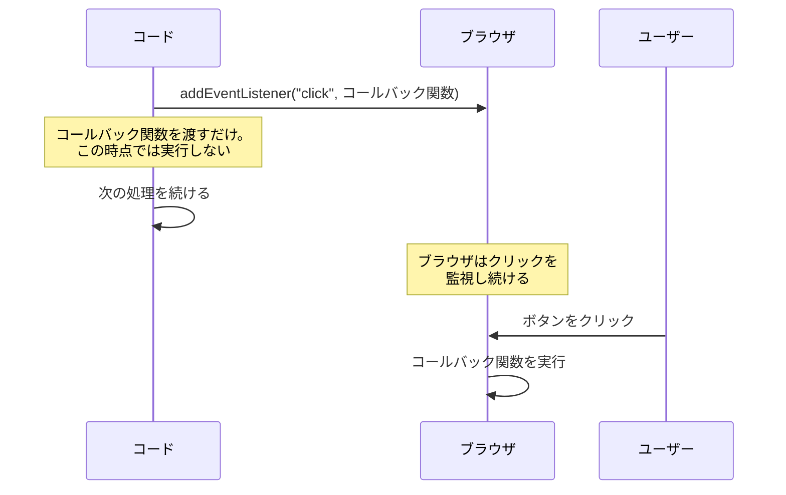
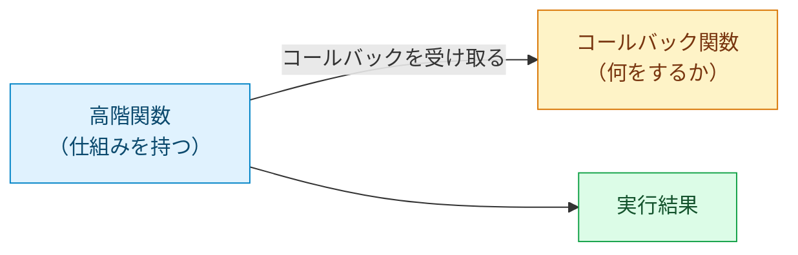
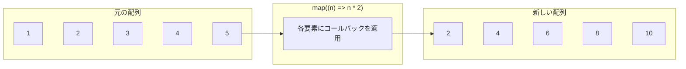

# 関数とコールバック — 関数を値として渡すという発想

## 今日のゴール

- JavaScript の関数に `function` 宣言とアロー関数の 2 つの書き方があることを知る
- 関数を値として別の関数に渡す「コールバック」のパターンを知る
- 高階関数（map / filter）が「仕組み」と「何をするか」を分離する仕組みだと知る

## 関数の 2 つの書き方

JavaScript のコードを読んでいると、関数の書き方が場所によって違うことに気づくかもしれません。

```javascript
// function 宣言
function add(a, b) {
  return a + b;
}

// アロー関数
const add = (a, b) => {
  return a + b;
};
```

どちらも同じ処理ですが、動作に違いがあります。

<strong>`function` 宣言</strong>は JavaScript の最初からある書き方です。<strong>巻き上げ（hoisting）</strong>という特徴があり、宣言より前で呼び出しても動きます。

```javascript
console.log(add(1, 2));  // 3 — 宣言より前でも呼べる

function add(a, b) {
  return a + b;
}
```

<strong>アロー関数</strong>は 2015 年に追加された書き方です。`=>` という矢印のような記号を使います。巻き上げはされないので、宣言より前に呼ぶとエラーになります。

本体が式 1 つなら中括弧と `return` を省略でき、引数が 1 つなら括弧も省略できます。

```javascript
const add = (a, b) => a + b;
const double = n => n * 2;
```

この省略記法のおかげで、配列操作やコールバックで簡潔に書けます。

| | `function` 宣言 | アロー関数 |
|---|---|---|
| 巻き上げ | される（宣言前に呼べる） | されない |
| 省略記法 | なし | 式 1 つなら `{}` と `return` を省略可 |

::: details this の束縛 — 2 つの書き方が存在する歴史的理由
`function` で定義した関数の `this` は呼び出し方によって指すものが変わります。関数をコールバックとして渡すと `this` との結びつきが切れてバグの原因になっていました。

```javascript
const user = {
  name: "田中",
  greet: function() {
    console.log("こんにちは、" + this.name);
  }
};

user.greet();           // "こんにちは、田中"
const fn = user.greet;
fn();                   // "こんにちは、undefined" — this が切れる
```

アロー関数はこの問題を解決するために生まれました。アロー関数は自分自身の `this` を持たず、定義された場所の外側から `this` を引き継ぎます。呼び出し方が変わっても `this` は変わりません。

現在の React は関数コンポーネントと Hooks が主流で、`this` を使う場面はほぼありません。古いコードで `.bind(this)` を見かけたとき、「`this` の問題を回避しているのだな」とわかれば十分です。
:::

## 関数は値である

JavaScript のコードを見ていると、こんな書き方に出会います。

```javascript
<button onClick={() => setCount(count + 1)}>+1</button>
```

```javascript
const names = users.map((user) => user.name);
```

`onClick` に関数を渡す。`map` に関数を渡す。JavaScript では「関数を別の関数に渡す」という書き方が頻繁に登場します。これが自然にできるのは、JavaScript の関数が数値や文字列と同じ「値」として扱えるからです。

```javascript
const greet = function(name) {
  return "こんにちは、" + name;
};

console.log(greet("田中"));  // "こんにちは、田中"
```

関数を変数 `greet` に代入しています。`greet` は数値や文字列が入っている変数と同じように扱えます。

このように、関数を他の値と同じように扱える性質のことを<strong>ファーストクラスオブジェクト</strong>（第一級オブジェクト）と呼びます。「関数が特別扱いされず、普通の値と同じ立場」という意味です。

すべてのプログラミング言語がこの性質を持っているわけではありません。JavaScript では関数が値であることが当たり前なので、「関数を別の関数に渡す」というパターンが日常的に使われます。

## コールバック — 「後で呼んで」を渡す

関数を値として渡せるなら、「この処理を後で実行してほしい」という指示を関数として渡すことができます。この「後で呼び出してもらうために渡す関数」を<strong>コールバック関数</strong>（callback function）と呼びます。

「電話を折り返してください（call back）」と同じ発想です。自分の電話番号を渡しておけば、相手の準備ができたタイミングで折り返してくれます。コールバック関数も同じで、「実行してほしい処理」を渡しておけば、適切なタイミングで呼び出してもらえます。

### addEventListener — 「クリックされたとき」に呼んでもらう

ブラウザでボタンがクリックされたとき何をするかを、コールバック関数で指定します。

```javascript
const button = document.querySelector("button");

button.addEventListener("click", function() {
  console.log("ボタンがクリックされました");
});
```

`addEventListener` の 2 つ目の引数に渡している `function() { ... }` がコールバック関数です。この関数はその場では実行されません。ユーザーがボタンをクリックした「とき」に、ブラウザが呼び出します。

アロー関数で書くこともできます。React の `onClick` で見かける書き方はこちらです。

```javascript
button.addEventListener("click", () => {
  console.log("ボタンがクリックされました");
});
```

### setTimeout — 「一定時間後」に呼んでもらう

```javascript
console.log("開始");

setTimeout(() => {
  console.log("3秒経ちました");
}, 3000);

console.log("次の処理");
```

実行結果はこうなります。

```
開始
次の処理
3秒経ちました
```

`setTimeout` は渡されたコールバック関数を指定ミリ秒後に実行します。3000 ミリ秒（3 秒）後に呼び出してもらう関数を渡しています。重要なのは、`setTimeout` を呼んだ時点では待たずに次の行（`"次の処理"`）がすぐ実行されることです。コールバックが呼ばれるのは 3 秒後です。



### コールバックの共通パターン

`addEventListener` の場合の流れを図で見てみましょう。



どの例にも共通するのは「今は実行しない。条件が満たされたときに実行してもらう」という構造です。

| 例 | 何に渡すか | いつ呼ばれるか |
|---|---|---|
| `addEventListener("click", fn)` | ブラウザ | ユーザーがクリックしたとき |
| `setTimeout(fn, 3000)` | タイマー | 3 秒経ったとき |
| `fetch(url).then(fn)` | ネットワーク処理 | データの取得が完了したとき |
| `array.map(fn)` | 配列の `map` メソッド | 各要素を処理するとき |

タイミングは様々ですが、「関数を渡して、後で呼んでもらう」というパターンは同じです。

## 高階関数 — 関数を受け取る関数

関数を引数として受け取る関数、または関数を戻り値として返す関数のことを<strong>高階関数</strong>（higher-order function）と呼びます。先ほどの `addEventListener` や `setTimeout` も、コールバック関数を受け取るので高階関数です。

高階関数の強みは「仕組み」と「何をするか」を分離できることです。



<strong>高階関数が「どう繰り返すか」「いつ実行するか」を担当し、コールバック関数が「何をするか」を担当する。</strong>高階関数はこの役割分担によって成り立っています。

### 配列の高階関数 — map と filter

JavaScript の配列には、高階関数がいくつも用意されています。中でも `map` と `filter` は特によく使います。

| メソッド | 役割 | コールバックの戻り値 | 結果 |
|---------|------|-------------------|------|
| `map` | 各要素を変換する | 変換後の値 | 同じ長さの新しい配列 |
| `filter` | 条件に合う要素を残す | `true` または `false` | 条件を満たす要素だけの新しい配列 |

<strong>`map`</strong> は配列の各要素を変換して、新しい配列を作ります。

```javascript
const numbers = [1, 2, 3, 4, 5];
const doubled = numbers.map((n) => n * 2);

console.log(doubled);  // [2, 4, 6, 8, 10]
```

`map` に渡しているアロー関数 `(n) => n * 2` がコールバックです。`map` は配列の要素を 1 つずつこの関数に渡して、戻り値を集めた新しい配列を返します。元の配列 `numbers` は変更されません。



<strong>`filter`</strong> は条件に合う要素だけを残した新しい配列を作ります。

```javascript
const numbers = [1, 2, 3, 4, 5];
const evens = numbers.filter((n) => n % 2 === 0);

console.log(evens);  // [2, 4]
```

コールバックが `true` を返した要素だけが残ります。

組み合わせることもできます。

```javascript
const users = [
  { name: "田中", age: 25, active: true },
  { name: "佐藤", age: 30, active: false },
  { name: "鈴木", age: 22, active: true },
];

const activeNames = users
  .filter((user) => user.active)
  .map((user) => user.name);

console.log(activeNames);  // ["田中", "鈴木"]
```

「アクティブなユーザーだけを残して、名前だけを取り出す」という処理が、高階関数の組み合わせで読みやすく書けます。

高階関数は組み込みのものだけでなく、自分でも作れます。共通するのは、**「どう繰り返すか・いつ実行するか」を高階関数が持ち、「何をするか」をコールバックで受け取る**という分離です。for ループのように「ループの管理」と「処理の中身」が混ざる書き方に比べ、`filter` や `map` はメソッド名から意図がそのまま読み取れます。

## コールバックの連鎖と限界

コールバックは<strong>非同期処理</strong>でも使われます。非同期処理とは、結果がすぐに返ってこない処理のことです。例えばサーバーからデータを取得する処理は通信に時間がかかるため、結果が返ってきた「とき」にコールバック関数を呼ぶという仕組みになっています。

1 つのコールバックなら問題ありません。しかし、非同期処理が連鎖すると話が変わります。「ユーザーを取得して、その注文を取得して、レポートを保存する」という処理を考えてみましょう。

```javascript
// fetchUser, fetchOrders, saveReport は
// サーバーと通信する非同期関数（仮の例）
fetchUser("user-1", (user) => {
  fetchOrders(user.id, (orders) => {
    saveReport(user, orders, (result) => {
      console.log("レポート保存完了:", result);
    });
  });
});
```

コールバックの中にコールバック、さらにその中にコールバック。ネストがどんどん深くなっています。これは<strong>コールバック地獄</strong>（callback hell）と呼ばれる問題です。各段階にエラー処理（`if (error) ...`）を足すと、ネストの中に if が並んでさらに膨らみます。

本来やりたいことは「ユーザーを取得 → 注文を取得 → レポートを保存」という直線的な流れなのに、コードの形がそれを裏切る。この問題を解決するために JavaScript には <strong>Promise</strong> という仕組みが導入され、さらに `async`/`await` という構文で同期処理のように書けるようになりました。「関数を値として渡す」という今日の発想が、そのすべての土台になっています。

## まとめ

- 関数は<strong>ファーストクラスオブジェクト</strong>で、変数や引数として渡せる
- <strong>コールバック関数</strong>は「後で呼んでもらうために渡す関数」
- <strong>高階関数</strong>は関数を受け取る関数で、`map` / `filter` が代表
- 連鎖して起きる<strong>コールバック地獄</strong>を解決するのが Promise
