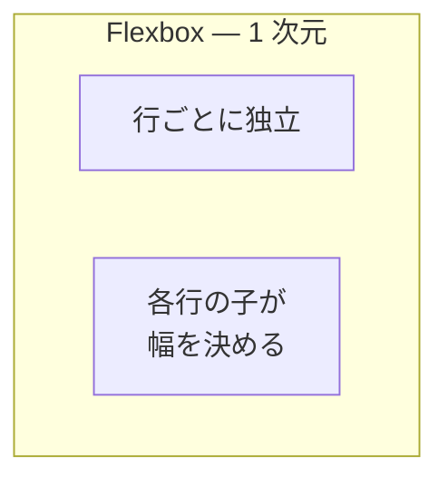
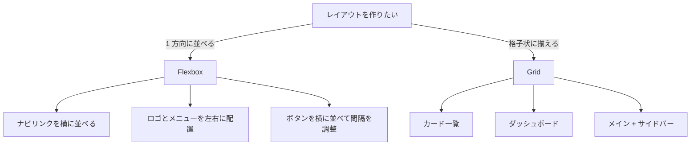

# CSS Grid — Flexbox だけではきれいに並ばない理由

## 今日のゴール

- Flexbox で格子状のレイアウトを作ろうとすると崩れることを知る
- CSS Grid は行と列を同時に定義する仕組みだと知る
- `auto-fill` と `minmax()` でメディアクエリなしのレスポンシブが作れると知る

## Flexbox で「カード一覧」を作ると何が起きるか

カードを格子状に並べたい ── Web アプリを作っていればよくある場面です。Flexbox で `flex-wrap: wrap` を使えば折り返しもできるので、これでいけそうに見えます。

```css
.card-list {
  display: flex;
  flex-wrap: wrap;
  gap: 16px;
}

.card {
  flex: 1 1 200px; /* 最小 200px、余ったら伸びる */
}
```

3 列にきれいに並んでいるように見えますが、**カードの数が 3 の倍数でないとき**に問題が起きます。

<style>
.c05-flex-demo { display:flex;flex-wrap:wrap;gap:12px;padding:20px;background:#f8fafc;border-radius:8px;border:1px solid #e2e8f0;margin:16px 0 }
.c05-flex-card { flex:1 1 200px;padding:16px;background:white;border:1px solid #93c5fd;border-radius:8px;color:#1e293b;font-size:0.9em;font-weight:600;text-align:center }
</style>

<div style="font-weight:700;margin-bottom:4px;font-size:0.85em;color:#64748b">カード 6 枚（3 の倍数）— きれいに並ぶ</div>
<div class="c05-flex-demo">
<div class="c05-flex-card">カード 1</div>
<div class="c05-flex-card">カード 2</div>
<div class="c05-flex-card">カード 3</div>
<div class="c05-flex-card">カード 4</div>
<div class="c05-flex-card">カード 5</div>
<div class="c05-flex-card">カード 6</div>
</div>

<div style="font-weight:700;margin-bottom:4px;font-size:0.85em;color:#dc2626">カード 5 枚 — 最後の行が引き伸ばされる</div>
<div class="c05-flex-demo">
<div class="c05-flex-card">カード 1</div>
<div class="c05-flex-card">カード 2</div>
<div class="c05-flex-card">カード 3</div>
<div class="c05-flex-card">カード 4</div>
<div class="c05-flex-card">カード 5</div>
</div>

5 枚目のカードが不自然に広がっているのが見えるでしょうか。`flex: 1 1 200px` は「余ったスペースを均等に分ける」という意味なので、最後の行にカードが 2 枚しかなければ、2 枚で横幅を分け合って太くなってしまいます。

### なぜこうなるのか

原因は Flexbox の根本的な性質にあります。Flexbox は**1 次元**のレイアウトです。横方向に並べるか、縦方向に並べるか、**どちらか一方**しか制御しません。



`flex-wrap: wrap` で折り返しはできますが、**各行は独立**しています。1 行目が 3 列、2 行目が 2 列になっても、Flexbox は気にしません。行をまたいで列の幅を揃える仕組みがないのです。

これは Flexbox のバグではなく、設計思想です。ナビゲーションのリンクを横に並べる、ヘッダーのロゴとメニューを左右に配置する ── こうした「1 方向に並べる」用途には Flexbox がぴったりです。しかし、**格子状に揃えたい**ときには、別の仕組みが必要でした。

## CSS Grid — 行と列を同時に定義する

この問題を解決するために作られたのが **CSS Grid** です。Grid の考え方は Flexbox とは根本的に違います。

| | Flexbox | Grid |
|---|---------|------|
| 次元 | **1 次元**（横 or 縦） | **2 次元**（横 and 縦） |
| 誰が幅を決めるか | **子要素**が自分の幅を決める | **親要素**が格子を定義する |
| 行と列の関係 | 行ごとに独立 | 行と列が連動する |

Flexbox は子が「自分は 200px がいい」と主張するボトムアップの仕組みです。Grid は親が「3 列の格子を作る」と宣言するトップダウンの仕組みです。

先ほどの 5 枚のカードを Grid で並べてみます。

```css
.card-list {
  display: grid;
  grid-template-columns: 1fr 1fr 1fr;
  gap: 16px;
}
```

<style>
.c05-grid-demo { display:grid;grid-template-columns:repeat(3,1fr);gap:12px;padding:20px;background:#f8fafc;border-radius:8px;border:1px solid #e2e8f0;margin:16px 0 }
.c05-grid-card { padding:16px;background:white;border:1px solid #60a5fa;border-radius:8px;color:#1e293b;font-size:0.9em;font-weight:600;text-align:center }
</style>

<div style="font-weight:700;margin-bottom:4px;font-size:0.85em;color:#16a34a">Grid で 5 枚 — 最後の行も列幅が揃う</div>
<div class="c05-grid-demo">
<div class="c05-grid-card">カード 1</div>
<div class="c05-grid-card">カード 2</div>
<div class="c05-grid-card">カード 3</div>
<div class="c05-grid-card">カード 4</div>
<div class="c05-grid-card">カード 5</div>
</div>

5 枚目のカードが引き伸ばされず、他のカードと同じ幅で収まっています。Grid は「3 列の格子」を先に定義しているので、要素が何枚あっても列の幅は変わりません。

### 書き方を見てみる

```html
<!DOCTYPE html>
<html lang="ja">
  <head>
    <meta charset="UTF-8" />
    <meta name="viewport" content="width=device-width, initial-scale=1.0" />
    <title>CSS Grid の例</title>
    <style>
      .card-list {
        display: grid;
        grid-template-columns: 1fr 1fr 1fr;
        gap: 16px;
      }
      .card {
        padding: 16px;
        background-color: #e8f0fe;
        border: 1px solid #93c5fd;
        border-radius: 8px;
      }
    </style>
  </head>
  <body>
    <ul class="card-list" aria-label="お知らせ一覧">
      <li class="card">カード 1</li>
      <li class="card">カード 2</li>
      <li class="card">カード 3</li>
      <li class="card">カード 4</li>
      <li class="card">カード 5</li>
    </ul>
  </body>
</html>
```

Flexbox と同じく、**親要素**に `display: grid` を指定します。違うのは `grid-template-columns` で**列の構造を先に宣言する**ところです。子要素には幅の指定が一切ありません。

### fr — 余った幅を分け合う単位

`1fr 1fr 1fr` の `fr` は "fraction"（分数）の略で、**余ったスペースを均等に分ける**という意味です。

```css
/* 3 列が等幅 */
grid-template-columns: 1fr 1fr 1fr;

/* 左列を 2 倍幅にする */
grid-template-columns: 2fr 1fr 1fr;

/* 左列を固定幅にして、残りを均等に */
grid-template-columns: 200px 1fr 1fr;
```

`px` は固定、`fr` は可変です。これを組み合わせることで「サイドバーは 250px 固定、メインコンテンツは残り全部」のようなレイアウトも簡単に作れます。

### repeat() で繰り返す

`1fr 1fr 1fr` と 3 回書く代わりに `repeat()` で簡潔にできます。

```css
/* 3 列を等幅で */
grid-template-columns: repeat(3, 1fr);

/* 4 列を等幅で */
grid-template-columns: repeat(4, 1fr);
```

## Grid だけでできるレスポンシブ

`repeat(3, 1fr)` は「常に 3 列」という意味です。画面が狭くなってもお構いなしに 3 列を維持するので、スマホでは各カードが潰れてしまいます。

通常、これを解決するにはメディアクエリを書きます。

```css
.card-list {
  display: grid;
  gap: 16px;
  grid-template-columns: 1fr;
}

@media (min-width: 768px) {
  .card-list {
    grid-template-columns: repeat(2, 1fr);
  }
}

@media (min-width: 1024px) {
  .card-list {
    grid-template-columns: repeat(3, 1fr);
  }
}
```

スマホでは 1 列、タブレットでは 2 列、PC では 3 列。動きますが、メディアクエリを何段も書くのは面倒です。

実は Grid には、**メディアクエリなしで画面幅に応じて列数を自動調整する**書き方があります。

```css
.card-list {
  display: grid;
  grid-template-columns: repeat(auto-fill, minmax(200px, 1fr));
  gap: 16px;
}
```

この 1 行で以下のことが起きます。

- `minmax(200px, 1fr)` — 各列は **最小 200px、最大は均等分配**
- `auto-fill` — 200px 以上の列を**入るだけ詰め込む**

画面幅が 700px なら 200px の列が 3 つ入ります。画面幅が 500px なら 2 つ。350px なら 1 つ。ブラウザが自動的に計算してくれます。

<style>
.c05-auto-demo { display:grid;grid-template-columns:repeat(auto-fill,minmax(140px,1fr));gap:12px;padding:20px;background:#f8fafc;border-radius:8px;border:1px solid #e2e8f0;margin:16px 0 }
.c05-auto-card { padding:16px;background:white;border:1px solid #60a5fa;border-radius:8px;color:#1e293b;font-size:0.9em;font-weight:600;text-align:center }
</style>

<div style="font-weight:700;margin-bottom:4px;font-size:0.85em;color:#16a34a">auto-fill + minmax() — ブラウザの幅を変えてみてください</div>
<div class="c05-auto-demo">
<div class="c05-auto-card">カード 1</div>
<div class="c05-auto-card">カード 2</div>
<div class="c05-auto-card">カード 3</div>
<div class="c05-auto-card">カード 4</div>
<div class="c05-auto-card">カード 5</div>
<div class="c05-auto-card">カード 6</div>
</div>

メディアクエリを 1 行も書かずに、画面幅に応じてカードの列数が変わります。カード一覧のようなレイアウトでは、この書き方が非常に便利です。

## Flexbox と Grid の使い分け

Flexbox と Grid は対立するものではなく、得意な場面が違います。



判断基準はシンプルです。

- **並べる方向が 1 つ**なら Flexbox — ナビゲーション、ヘッダー、ボタン群
- **行と列を揃えたい**なら Grid — カード一覧、ダッシュボード、ページ全体のレイアウト

迷ったら「子の数が変わっても列の幅を揃えたいか？」と考えてみてください。答えが Yes なら Grid です。

## まとめ

- Flexbox は 1 次元のレイアウト。`flex-wrap` で折り返しても行ごとに独立するため、格子状に揃えるのは苦手
- CSS Grid は 2 次元のレイアウト。**親が格子を定義する**ので、子の数に関係なく列幅が揃う
- `display: grid` + `grid-template-columns` で列を定義する。`fr` は余った幅を分け合う単位
- `repeat(auto-fill, minmax(200px, 1fr))` でメディアクエリなしのレスポンシブが作れる
- 1 方向に並べるなら Flexbox、格子状に揃えるなら Grid
