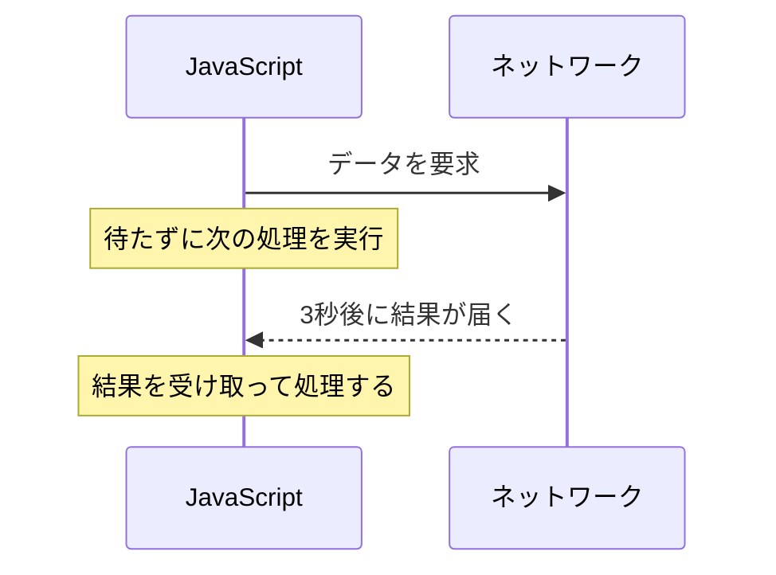
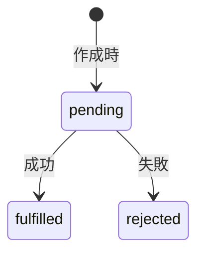
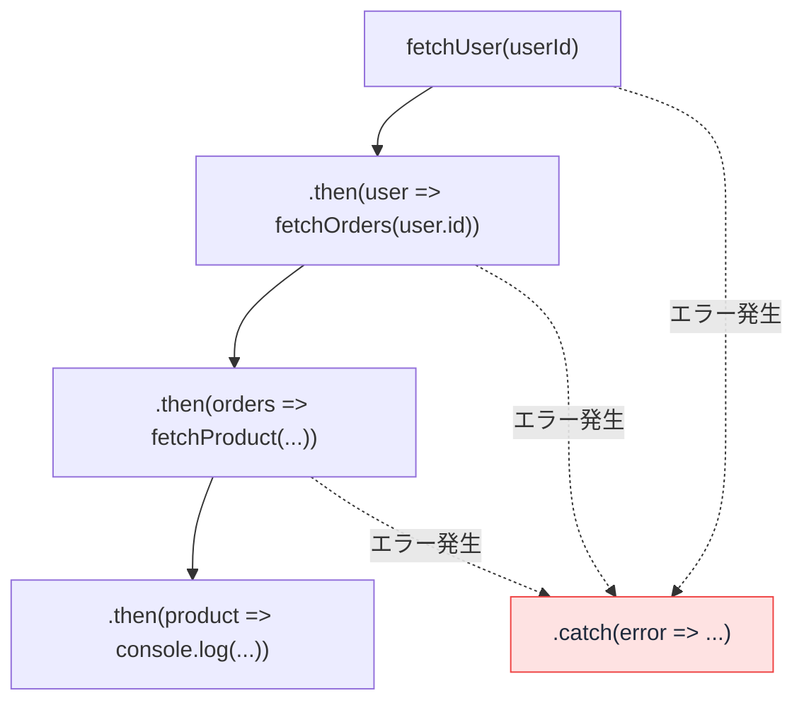

# Promise — 「まだ結果がない」を包むオブジェクト

## 今日のゴール

- 非同期処理が「待っている間に他の仕事を進める」仕組みだと知る
- Promise が 3 つの状態を持つオブジェクトだと知る
- `.then()` / `.catch()` のチェーンが読めるようになる

## 待っていられない言語

Web アプリでは、サーバーからデータを取ってくる処理が頻繁に発生し、この通信には時間がかかります。もし JavaScript が通信の完了を**その場で待つ**としたらどうなるか。

```javascript
// もし通信が「待つ」方式だったら...
const response = fetchSync("https://api.example.com/user/1"); // 3秒かかる
console.log(response);
```

JavaScript は一度に 1 つの処理しか実行できない言語なので、この 3 秒間、ボタンも、スクロールも、一切反応しません。画面が完全にフリーズします。

そこで JavaScript の時間のかかる処理は、「**待たずに次へ進み、終わったら教えてもらう**」方式（**非同期処理**）で書かれています。



問題は、この「終わったら教えてもらう」を**コードでどう書くか**です。書き方は歴史とともに進化しており、その中心にいるのが今日の主役 Promise です。

## 出発点 — コールバックの限界

最初の書き方は**コールバック**でした。「終わったらこの関数を実行して」と関数を渡しておく方法です。

```javascript
setTimeout(() => {
  console.log("3秒経ちました");
}, 3000);
```

1 つなら十分に機能します。しかし「ユーザー情報を取得して、そのユーザーの注文を取得して、その注文の商品を取得する」と**連鎖**した瞬間、形が崩れます。

```javascript
fetchUser(userId, (user) => {
  fetchOrders(user.id, (orders) => {
    fetchProduct(orders[0].productId, (product) => {
      console.log(product.name);
    });
  });
});
```

コールバックの中にコールバック、その中にさらにコールバック。**コールバック地獄**（callback hell）と呼ばれる、右へ右へ深くなるコードです。処理の本質は「ユーザー → 注文 → 商品」という直線なのに、コードの形がそれを裏切っています。さらに各段階のエラー処理を足すと、膨張は加速します。

この問題を解決するために生まれたのが Promise です。

## Promise — 結果の「引換券」

**Promise**（プロミス）は、「まだ結果が返ってきていない非同期処理」を 1 つのオブジェクトとして扱う仕組みです。名前の通り「約束」。「今は結果がないけれど、いずれ結果を届けると約束する」**引換券のようなオブジェクト**です。

### 3 つの状態

Promise は常に 3 つの状態のどれかにあります。



| 状態 | 意味 | 例 |
|------|------|-----|
| **pending**（保留中） | まだ結果が出ていない | サーバーに問い合わせ中 |
| **fulfilled**（成功） | 処理が成功して値が手に入った | データが返ってきた |
| **rejected**（失敗） | 処理が失敗してエラーになった | 通信エラーが発生した |

一度 fulfilled か rejected になると、その後は状態が変わりません。成功したものが後から失敗になることはありません。fulfilled と rejected をまとめて **settled**（決着済み）と呼びます。

### .then() と .catch() でチェーンする

引換券から結果を受け取るには `.then()` を、エラーを受け取るには `.catch()` を使います。

```javascript
fetch("https://api.example.com/user/1")
  .then((response) => response.json())
  .then((user) => {
    console.log(user.name);
  })
  .catch((error) => {
    console.error("エラーが発生しました:", error);
  });
```

`fetch` はブラウザ組み込みの通信関数で、Promise を返します。`.then()` は fulfilled になったとき、`.catch()` は rejected になったときに実行されます。

`.then()` の中で値を返すと、その値を包んだ**新しい Promise** が返るので、さらに `.then()` を繋げられます。これが **Promise チェーン**です。`.then()` が 2 つ続いているのは `fetch` の結果が 2 段階（応答の受信 → 本文の変換）に分かれているためで、「Promise を返す関数は `.then()` で連結できる」という形が読めれば十分です。

### コールバック地獄を書き直す

冒頭の地獄を Promise チェーンで書き直します。

```javascript
fetchUser(userId)
  .then((user) => fetchOrders(user.id))
  .then((orders) => fetchProduct(orders[0].productId))
  .then((product) => {
    console.log(product.name);
  })
  .catch((error) => {
    console.error("エラー:", error);
  });
```

ネストが消え、処理の流れが「ユーザー → 注文 → 商品」と**上から下に一直線**で読めます。エラー処理も末尾の `.catch()` 1 つで、**途中のどの段階のエラーもまとめて**受け取れます。



| | コールバック | Promise |
|---|---|---|
| 連続した非同期処理 | ネストが深くなる | `.then()` で平坦に繋がる |
| エラー処理 | 各段階で個別に書く | `.catch()` で一括 |
| 読む方向 | 右に深くなる | 上から下に読める |

## Promise を作る側 — resolve と reject

普段は `fetch` などの「Promise を返してくれる関数」を使うだけですが、作る側のコードを一度見ておくと、reject の正体が分かります。

```javascript
function fetchUser(id) {
  return new Promise((resolve, reject) => {
    if (id < 0) {
      reject(new Error("不正な ID"));  // ← rejected になる
    } else {
      resolve({ id, name: "Alice" });  // ← fulfilled になる
    }
  });
}
```

`resolve` を呼ぶか `reject` を呼ぶかは、**Promise を作る側が決めています**。「何をエラー（reject）とするか」は関数ごとに思想が違うので、たとえば `fetch` は「404 が返ってきた」程度では reject しません（通信自体が失敗したときだけ reject します）。使う関数が「いつ reject するのか」を確認する習慣が、エラー処理の漏れを防ぎます。

## この先 — もっと読みやすく

Promise チェーンでコールバック地獄は解消されましたが、`.then()` が連なるコードにはまだ独特の読み癖が要ります。そこで Promise の上に、同期処理と同じ感覚で「上から下に」書ける構文（**async/await**）が用意されています。現代のコードの大半はそちらの形で書かれていますが、**裏側で動いているのは常に今日の Promise** です。チェーンが読めれば、async/await は「その読みやすい皮」として素直に理解できます。

## まとめ

- 非同期処理 = 待たずに進み、終わったら教えてもらう。書き方の中心が Promise
- Promise は結果の引換券。pending → fulfilled / rejected の 3 状態
- `.then()` で繋ぎ、`.catch()` で一括エラー処理。地獄のネストが直線になる
- いつ reject するかは作る側が決めている。使う関数の仕様を確認する
