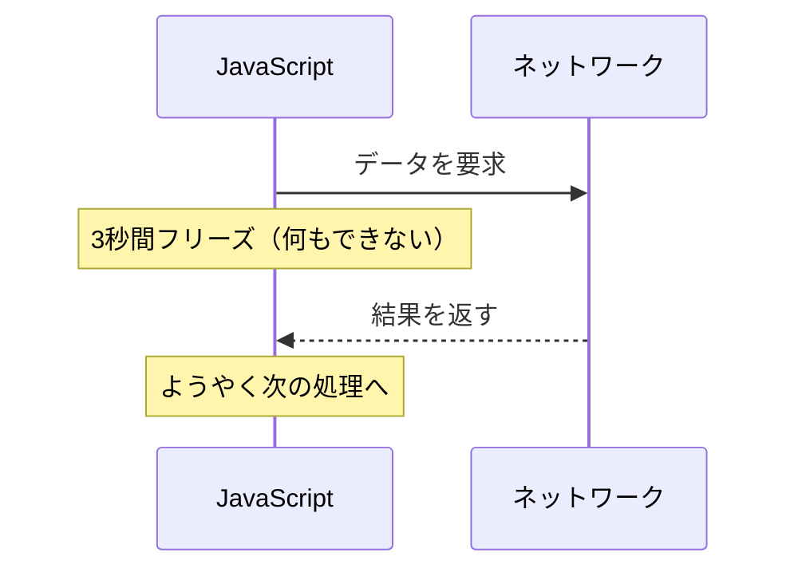
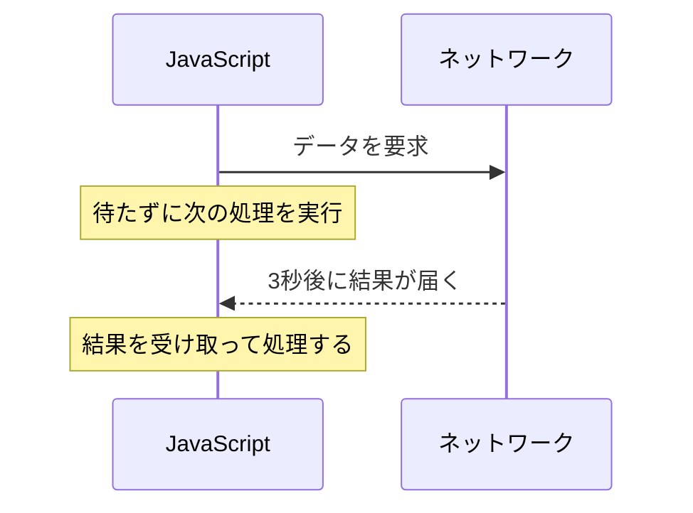
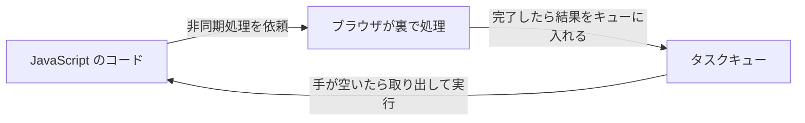
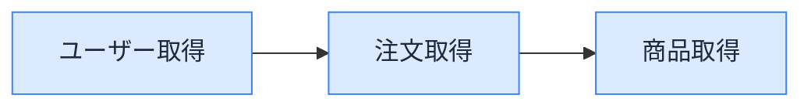
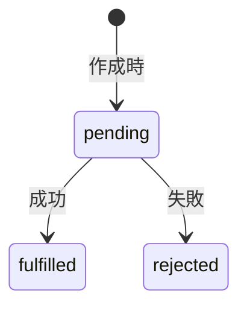
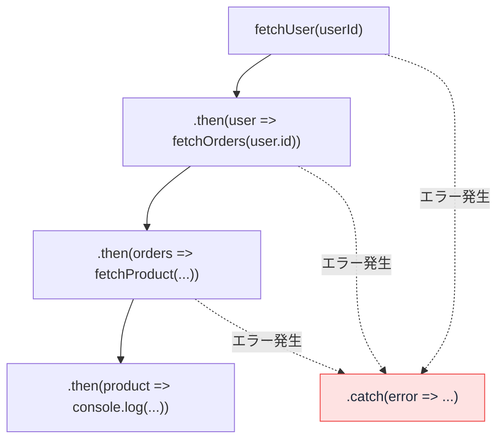

# Promise と async/await — 非同期処理の読み方

Next.js のコードを見ていると、`async function` や `await fetch(...)` という書き方がよく出てきます。AI が生成するコードにもほぼ必ず登場します。

これらは JavaScript の<strong>非同期処理</strong>を扱うための仕組みです。非同期処理とは、時間のかかる処理（サーバーとの通信など）の完了を待たずに次の処理へ進める仕組みのことです。このレッスンでは、なぜこの仕組みが必要なのかから順に見ていきます。

## 今日のゴール

- JavaScript がシングルスレッドであること、それが非同期処理を必要とする理由を知る
- Promise が「まだ結果がない」状態を扱うための仕組みであることを知る
- async/await が Promise を同期処理のように読める構文であることを知る
- AI 生成コードでよく見落とされる落とし穴（逐次 `await`、await し忘れ）に気づける

## JavaScript はシングルスレッドで動く

JavaScript は<strong>シングルスレッド</strong>の言語です。シングルスレッドとは、一度に 1 つの処理しか実行できないということです。

Web アプリでは、サーバーからデータを取ってくる処理が頻繁に発生します。この通信には時間がかかります。もし通信が終わるまで JavaScript が何もできなかったらどうなるでしょうか。

```javascript
// もし通信が同期的だったら...
const response = fetchSync("https://api.example.com/user/1"); // 3秒かかる
console.log(response);
```

この 3 秒間、ボタンをクリックしても反応しない。スクロールしても動かない。画面が完全にフリーズします。シングルスレッドなので、通信の待ち時間の間は他の処理を一切実行できないのです。

### 非同期処理という解決策

この問題を解決するのが<strong>非同期処理</strong>です。「時間のかかる処理を待っている間、他の仕事を進める」仕組みです。

同期処理では通信が終わるまで何もできません。



非同期処理では、通信をブラウザに任せてその間に他の処理を進められます。



::: details イベントループ — 非同期処理を支える仕組み
JavaScript が非同期処理を実現できるのは、<strong>イベントループ</strong>という仕組みがあるからです。

JavaScript 自体はシングルスレッドですが、ブラウザ（や Node.js）がネットワーク通信やタイマーなどの時間のかかる処理を裏側で実行してくれます。その処理が完了すると、結果が<strong>タスクキュー</strong>（実行待ちの行列）に入ります。イベントループは JavaScript が手の空いたタイミングでキューから次の処理を取り出して実行します。



深く理解する必要はありません。「JavaScript は 1 つのことしかできないが、時間のかかる仕事はブラウザに任せて、終わったら教えてもらう」という流れだけ覚えておけば十分です。
:::

## コールバックの限界

非同期処理の書き方は時代とともに進化してきました。最初に登場したのが<strong>コールバック</strong>です。コールバックとは、「この処理が終わったら、この関数を実行してね」と関数を渡しておく方法です。

```javascript
setTimeout(() => {
  console.log("3秒経ちました");
}, 3000);
```

`setTimeout` は指定した時間が経過したら、渡した関数（コールバック）を実行します。単純な処理ならこれで十分です。

しかし、非同期処理が連続すると問題が起きます。「ユーザー情報を取得して、そのユーザーの注文を取得して、その注文の商品を取得する」という処理を考えてみましょう。

```javascript
fetchUser(userId, (user) => {
  fetchOrders(user.id, (orders) => {
    fetchProduct(orders[0].productId, (product) => {
      console.log(product.name);
    });
  });
});
```

コールバックの中にコールバック、その中にさらにコールバック。ネストが深くなり、読みにくくなります。これが<strong>コールバック地獄</strong>（callback hell）と呼ばれる問題です。さらに各段階でエラー処理（`if (!user) ...`）を入れると、ネストの中に if が並んでさらに膨らみます。

処理の本質は「ユーザー → 注文 → 商品」という直線的な流れなのに、コードはどんどん右にネストしていきます。この問題を解決するために生まれたのが Promise です。



<p style="text-align:center;color:#64748b;font-size:0.9em">処理の流れは直線的なのに、コールバックではネストが深くなる</p>

## Promise — 「まだ結果がない」を包むオブジェクト

<strong>Promise</strong>（プロミス）は、「まだ結果が返ってきていない非同期処理」を 1 つのオブジェクトとして扱う仕組みです。名前の通り「約束」を意味します。「今は結果がないけれど、いずれ結果を届けると約束する」というオブジェクトです。

### 3 つの状態

Promise は常に 3 つの状態のどれかにあります。



| 状態 | 意味 | 例 |
|------|------|-----|
| **pending**（保留中） | まだ結果が出ていない | サーバーに問い合わせ中 |
| **fulfilled**（成功） | 処理が成功して値が手に入った | データが返ってきた |
| **rejected**（失敗） | 処理が失敗してエラーになった | 通信エラーが発生した |

一度 fulfilled か rejected になると、その後は状態が変わりません。成功したものが後から失敗になることはありません。fulfilled と rejected をまとめて<strong>settled</strong>（決着済み）と呼びます。後で出てくる `Promise.allSettled` の `settled` はこの状態のことです。

### `.then()` と `.catch()` でチェーンする

Promise の結果を受け取るには `.then()` を使います。エラーを受け取るには `.catch()` を使います。

```javascript
fetch("https://api.example.com/user/1")
  .then((response) => response.json())
  .then((user) => {
    console.log(user.name);
  })
  .catch((error) => {
    console.error("エラーが発生しました:", error);
  });
```

`fetch` はブラウザに組み込まれた HTTP 通信の関数で、Promise を返します。`.then()` は Promise が fulfilled になったときに実行され、`.catch()` は rejected になったときに実行されます。

`.then()` の中で値を返すと、その値を包んだ新しい Promise が返るので、さらに `.then()` を繋げられます。この仕組みを<strong>Promise チェーン</strong>と呼びます。

上のコードで `.then()` が 2 つ続いているのは、`fetch` の結果が 2 段階に分かれているためです。1 つ目で応答を受け取り、2 つ目で本文を JavaScript のオブジェクトに変換しています。「Promise を返す関数は連続して `.then()` で繋げられる」という形が読めれば十分です。

コールバック地獄だったコードを Promise で書き直してみます。

```javascript
fetchUser(userId)
  .then((user) => fetchOrders(user.id))
  .then((orders) => fetchProduct(orders[0].productId))
  .then((product) => {
    console.log(product.name);
  })
  .catch((error) => {
    console.error("エラー:", error);
  });
```

ネストが解消され、処理の流れが上から下に一直線に読めるようになりました。エラー処理も末尾に `.catch()` を 1 つ書くだけで、途中のどの段階でエラーが起きてもまとめて受け取れます。



<p style="text-align:center;color:#64748b;font-size:0.9em">どの段階のエラーも末尾の .catch() に集約される</p>

### コールバック vs Promise

| | コールバック | Promise |
|---|---|---|
| 連続した非同期処理 | ネストが深くなる | `.then()` で平坦に繋がる |
| エラー処理 | 各段階で個別に書く | `.catch()` で一括 |
| 読む方向 | 右に深くなる | 上から下に読める |

## async/await — Promise を同期処理のように読める構文

Promise チェーンでコールバック地獄は解消されましたが、`.then()` が連なるコードはまだ独特の読みにくさがあります。ここで登場するのが <strong>async/await</strong> です。

`async` と `await` は Promise をより直感的に書くための構文です。裏側の仕組みは Promise とまったく同じですが、同期処理のように「上から下に順番に実行される」コードに見えます。

### 基本の使い方

`async` と `await` はセットで使います。関数の前に `async` をつけると、その関数は必ず Promise を返すようになります。`async` 関数の中では `await` が使えます。`await` は Promise の結果が出るまで待ち、fulfilled になった値を変数に取り出します。

```javascript
async function getProductName(userId) {
  const user = await fetchUser(userId);
  const orders = await fetchOrders(user.id);
  const product = await fetchProduct(orders[0].productId);
  console.log(product.name);
}
```

やっていることはコールバックや Promise チェーンのときと同じですが、まるで同期処理のように上から下へ読めます。

`await` の行に来ると、関数の実行はそこで<strong>いったん中断</strong>します。Promise が settled になるのを待つ間、JavaScript は他のコード（ボタンのクリック処理、別の `await` で待っていた処理など）を進めます。結果が出ると、中断していた場所から続きが実行されます。「画面がフリーズしないまま結果を待てる」のは、`await` が裏側でこの中断と再開をやってくれているからです。

### Promise チェーンとの比較

同じ処理を `.then()` チェーンと async/await で並べてみます。

```javascript
// Promise チェーン
function getUser() {
  return fetch("https://api.example.com/user/1")
    .then((response) => response.json())
    .then((user) => {
      console.log(user.name);
      return user;
    });
}
```

```javascript
// async/await
async function getUser() {
  const response = await fetch("https://api.example.com/user/1");
  const user = await response.json();
  console.log(user.name);
  return user;
}
```

async/await では、結果を変数に代入しながら上から下へ順番に処理するという自然な流れになっています。

### エラー処理は try/catch

Promise チェーンでは `.catch()` でエラーを受け取りましたが、async/await では JavaScript の標準的な `try/catch` 構文を使います。

```javascript
async function getUser() {
  try {
    const response = await fetch("https://api.example.com/user/1");
    const user = await response.json();
    console.log(user.name);
  } catch (error) {
    console.error("エラーが発生しました:", error);
  }
}
```

`try` ブロックの中で `await` している Promise が rejected になると、`catch` ブロックに処理が移ります。同期処理のエラーハンドリングとまったく同じ書き方なので、非同期処理を特別に意識する必要がありません。

ただし「どんなときに reject するか」は関数ごとに違います。Promise を自分で作る側のコードを覗いてみると、その理由が見えます。

```javascript
function fetchUser(id) {
  return new Promise((resolve, reject) => {
    if (id < 0) {
      reject(new Error("不正な ID"));  // ← rejected になる
    } else {
      resolve({ id, name: "Alice" });  // ← fulfilled になる
    }
  });
}
```

`new Promise(...)` のコールバックの中で `resolve` を呼ぶか `reject` を呼ぶかは、Promise を作る側が決めています。「何を reject 条件にするか」は関数ごとに思想が違うので、`try/catch` を書いておけば全てのエラーを拾える、とは限りません。扱う関数の仕様を確認する習慣を持っておくと安全です。

### await は async 関数の中でしか使えない

`await` には 1 つ重要な制約があります。`await` は `async` がついた関数の中でしか使えません。

```javascript
// これはエラーになる
function getUser() {
  const response = await fetch("/api/user");  // SyntaxError
}

// async をつければ OK
async function getUser() {
  const response = await fetch("/api/user");
}
```

::: details トップレベル await
ES2022 以降、モジュール（`<script type="module">` や `.mjs` ファイル）ではファイルの最上位で `await` が使えるようになりました。これを<strong>トップレベル await</strong> と呼びます。

```javascript
// モジュールファイルの最上位
const response = await fetch("/api/config");
const config = await response.json();
```

Next.js の Server Components でもトップレベル await に近い書き方ができますが、これは Next.js がコンポーネント自体を `async` 関数として扱っているためです。
:::

### 並列に動かす — Promise.all

`await` を続けて書くと、1 つ目の結果が出てから 2 つ目が始まる<strong>直列実行</strong>になります。互いに依存しない処理を直列で書くと、本来同時にできるはずの待ち時間を無駄に積み上げてしまいます。

```javascript
// それぞれ 1 秒かかるとすると、合計 3 秒
async function loadDashboard() {
  const user = await fetchUser();
  const posts = await fetchPosts();
  const notifications = await fetchNotifications();
  return { user, posts, notifications };
}
```

3 つの取得は互いに関係ないので、同時に始めればよいはずです。これを書くのが `Promise.all` です。配列で Promise を渡すと、すべてが fulfilled になるまで待ち、結果を配列で返します。

```javascript
// 3 つ同時に走るので、合計 1 秒
async function loadDashboard() {
  const [user, posts, notifications] = await Promise.all([
    fetchUser(),
    fetchPosts(),
    fetchNotifications(),
  ]);
  return { user, posts, notifications };
}
```

ポイントは「`Promise.all` を `await` で受ける」こと。async/await の世界に居続けたまま並列化できます。

なお、1 つでも rejected になると `Promise.all` 全体が rejected になります。「どれか 1 つが失敗しても他の結果は欲しい」場合は `Promise.allSettled` を使い、各要素の `status`（`"fulfilled"` または `"rejected"`）を見て処理します。

AI が生成したコードで `await` が縦に並んでいたら、「これは順番に実行する必要があるか、それとも同時にやれるか」を一度立ち止まって考えると、不要な待ち時間に気づけます。

### await し忘れに注意 — Unhandled Rejection

`async` 関数を呼んだだけで `await` も `.catch()` も付けないと、エラーになっても気づけません。

```javascript
async function saveUser(user) {
  const response = await fetch("/api/user", { method: "POST", body: JSON.stringify(user) });
  if (!response.ok) throw new Error("保存に失敗");
}

// await も .catch も付けていない
saveUser(user);
```

このコードで `saveUser` がエラーを投げると、行き場のないエラー（<strong>unhandled rejection</strong>）として、ブラウザのコンソールに警告だけが出て処理は素通りします。「保存できなかったのにユーザーには成功したように見える」という事故になります。

Promise を返す関数を呼ぶときは、原則として `await` するか `.then().catch()` を付ける。これだけ意識しておくと事故が減ります。

### Promise と async/await の関係

async/await は Promise の「別の書き方」であって、Promise を置き換えるものではありません。async/await で書いたコードも、裏側では Promise が動いています。

| async/await で書くと | 裏側で起きていること |
|---|---|
| `const res = await fetch(...)` | `fetch(...)` が Promise を返す → fulfilled まで待つ |
| `const user = await res.json()` | `res.json()` が Promise を返す → fulfilled まで待つ |
| `return user` | `user` を包んだ fulfilled な Promise を返す |

| | Promise チェーン（.then()） | async/await |
|---|---|---|
| 仕組み | Promise そのもの | Promise の上に乗った構文糖衣 |
| 読みやすさ | チェーンが長いと追いにくい | 上から下に読める |
| エラー処理 | `.catch()` | `try/catch` |
| 使い分け | ライブラリ API で 1 つだけ繋ぐとき | 直列・並列を問わず通常の書き方 |

並列処理も `await Promise.all([...])` と書けば async/await の世界のまま扱えるので、現代では「async/await を基本にして、必要なら `Promise.all` などを組み合わせる」のが標準です。`.then()` チェーンは、関数を 1 つだけ繋げたいときや、`async` 関数にしたくない場面で使う程度に減っています。

<strong>構文糖衣（シンタックスシュガー）</strong>とは、機能は同じだが読みやすく書ける別の記法のことです。

`async` 関数は Promise を返すので、`.then()` で受け取ることもできます。逆に、Promise を返す関数を `await` で待つこともできます。両方を混ぜて使うことは普通にあります。

```javascript
async function getUser() {
  const response = await fetch("/api/user");
  return response.json();
}

// async 関数の戻り値は Promise なので .then() で受け取れる
getUser().then((user) => console.log(user.name));
```

## Next.js での使われ方

Next.js の <strong>Server Components</strong>（サーバー上で動くコンポーネント）は、`async` 関数として定義できます。コンポーネントの中で直接 `await` を使ってデータを取得するのが、Next.js の基本的なパターンです。

```tsx
export default async function UserPage() {
  const response = await fetch("https://api.example.com/user/1");
  const user = await response.json();

  return (
    <div>
      <h1>{user.name}</h1>
      <p>{user.email}</p>
    </div>
  );
}
```

`fetch` は Promise を返す関数です。`await` で結果を待ち、受け取ったデータを使って画面の内容（JSX）を返しています。Server Components では `async/await` が使えるので、データの取得と表示がこのようにシンプルに書けます。

`fetch` が Promise を返し、`await` で結果を受け取り、上から下へ順番に処理が進む。`async/await` を知っていれば、Next.js のデータ取得コードはそのまま読めます。

## 3 つの書き方の比較

このレッスンで見てきたコールバック、Promise チェーン、async/await を一覧で比較します。

| | コールバック | Promise チェーン | async/await |
|---|---|---|---|
| 登場時期 | 初期の JavaScript | ES2015（ES6） | ES2017（ES8） |
| コードの形 | ネストが深くなる | `.then()` で平坦に繋がる | 上から下に読める |
| エラー処理 | 各段階で個別に書く | `.catch()` で一括 | `try/catch` |
| 可読性 | 処理が増えると低下 | チェーンが長いと追いにくい | 同期処理と同じ感覚で読める |
| 現在の使われ方 | 非同期処理ではほぼ使わない（`setTimeout` など一部の API で残る） | ライブラリ API で 1 つだけ繋ぐとき | 主流の書き方 |

## まとめ

- <strong>Promise</strong> は非同期の結果を包むオブジェクト。pending → fulfilled / rejected
- <strong>async/await</strong> は Promise を同期処理のように読める主流の書き方
- 独立した処理は `Promise.all` で並列化。逐次 `await` は待ち時間の無駄
- Promise には `await` か `.catch()` を付ける（付け忘れはエラーが消える）
