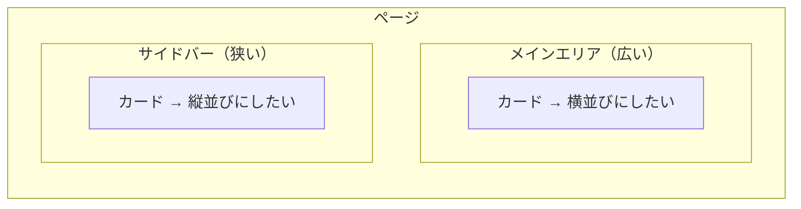
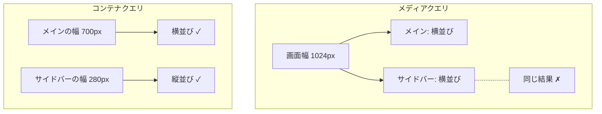

# レスポンシブの仕組み — 画面幅とコンポーネント幅で切り替える

## 今日のゴール

- 同じ HTML でも画面幅によって見た目を変えられることを知る
- メディアクエリの仕組みとモバイルファーストの考え方を知る
- コンテナクエリで「コンポーネント単位のレスポンシブ」ができることを知る

## 同じページなのにスマホと PC で見た目が違う

Web サイトをスマホで開いたときと PC で開いたとき、レイアウトが違うことがあります。スマホでは 1 列、PC では 3 列のカード一覧。ナビゲーションがスマホではハンバーガーメニューになる。

これは別々の HTML を用意しているわけではありません。**同じ HTML に対して、画面幅に応じて異なる CSS を適用している**だけです。この考え方を**レスポンシブデザイン**と呼びます。

## メディアクエリ — 画面幅で切り替える

CSS には `@media` という仕組みがあります。「この条件を満たすときだけ、このスタイルを適用する」というルールを書けます。

```css
/* ベース: スマホ向け（狭い画面） */
.card-list {
  display: flex;
  flex-direction: column;
  gap: 16px;
}

/* 768px 以上: タブレット・PC 向け */
@media (min-width: 768px) {
  .card-list {
    flex-direction: row;
    flex-wrap: wrap;
  }
}
```

- **画面幅が 768px 未満**（スマホ）: カードは縦に 1 列で並ぶ
- **画面幅が 768px 以上**（タブレット・PC）: カードは横に並び、折り返す

`@media (min-width: 768px)` が**メディアクエリ**です。「画面幅が 768px 以上のとき」という条件を表しています。

### モバイルファースト

上の例のように、狭い画面のスタイルをベースに書いて、画面が広くなるにつれてスタイルを足していく書き方を**モバイルファースト**と呼びます。`min-width`（〇〇px 以上のとき）を使います。

モバイルファーストが主流な理由は、スマホで見る人が多いこと、そして**狭い画面のレイアウトのほうがシンプル**だからです。シンプルなスタイルをベースに、広い画面で装飾や列数を足していくほうが、CSS が複雑になりにくいです。

### ブレークポイントと Tailwind の接続

メディアクエリで指定する幅の値を**ブレークポイント**と呼びます。

| Tailwind のクラス | メディアクエリ | 対象 |
|------------------|-------------|------|
| `sm:` | `@media (min-width: 640px)` | スマホ横向き |
| `md:` | `@media (min-width: 768px)` | タブレット |
| `lg:` | `@media (min-width: 1024px)` | ノート PC |
| `xl:` | `@media (min-width: 1280px)` | デスクトップ |

値を覚える必要はありません。Tailwind の `md:flex-row` は `@media (min-width: 768px) { flex-direction: row }` と同じ意味だと知っておけば十分です。

## メディアクエリの限界

メディアクエリには根本的な制約があります。**見ているのは常に「画面全体の幅」**だということです。

たとえば、カードコンポーネントを作ったとします。このカードをページの**メインエリア（広い）**に置いたときは横並び、**サイドバー（狭い）**に置いたときは縦並びにしたい。



メディアクエリでは、これがうまくいきません。`@media (min-width: 768px)` は「画面幅が 768px 以上か」を見ます。画面幅が 1024px なら、メインエリアに置いてもサイドバーに置いても同じ条件で判定されます。コンポーネントの**実際の表示幅**は関係ないのです。

同じコンポーネントが置き場所によって違う幅になるのに、画面幅しか見られない。これがメディアクエリの限界です。

## コンテナクエリ — 親要素の幅で切り替える

この限界を解決するために生まれたのが**コンテナクエリ**です。画面幅ではなく、**コンポーネントが置かれている親要素の幅**を条件にできます。

```css
/* 親をコンテナとして登録する */
.card-wrapper {
  container-type: inline-size;
}

/* カードのベーススタイル（狭いとき） */
.card {
  display: flex;
  flex-direction: column;
  gap: 8px;
}

/* 親の幅が 400px 以上なら横並びに */
@container (min-width: 400px) {
  .card {
    flex-direction: row;
  }
}
```

`@media` が `@container` に変わっただけのように見えますが、根本的に違います。

| | メディアクエリ | コンテナクエリ |
|---|---|---|
| 何の幅を見るか | **画面全体** | **親要素** |
| 同じコンポーネントの使い回し | 置き場所を区別できない | 置き場所に応じて変わる |
| 必要な準備 | なし | 親に `container-type` を指定 |



コンテナクエリを使えば、同じカードコンポーネントがメインエリアでは横並び、サイドバーでは縦並びになります。コンポーネント自身が「自分がどのくらいの幅で表示されているか」を知って、見た目を切り替えるのです。

2026 年 4 月時点で、コンテナクエリ（サイズ）は Chrome・Safari・Edge・Firefox の主要ブラウザすべてで対応しており、実用できる段階にあります。

## viewport メタタグ

レスポンシブデザインを正しく動かすために、HTML の `<head>` に必ず入れる 1 行があります。

```html
<meta name="viewport" content="width=device-width, initial-scale=1.0" />
```

これがないと、スマホのブラウザは「このページは PC 向けだ」と判断して、画面を縮小表示します。メディアクエリもコンテナクエリも意図どおりに動きません。

## まとめ

- 同じ HTML に対して、条件に応じて異なるスタイルを当てるのがレスポンシブデザインです
- **メディアクエリ**は画面全体の幅で切り替えます。Tailwind の `md:` `lg:` はそのショートカットです
- 狭い画面を先に書く**モバイルファースト**が現在の主流です
- メディアクエリは画面幅しか見られないため、同じコンポーネントの置き場所を区別できません
- **コンテナクエリ**は親要素の幅で切り替えます。コンポーネントが自分の表示幅に応じて見た目を変えられます
- `<meta name="viewport" ...>` がないとレスポンシブは動きません
