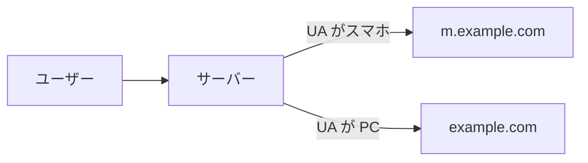
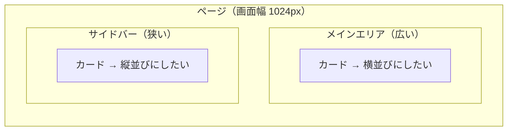
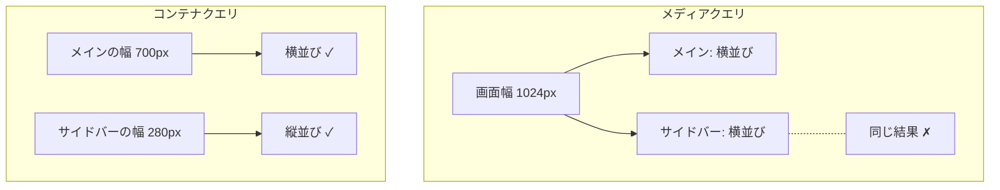

# レスポンシブデザイン — 1 つの HTML をあらゆる画面に届ける

## 今日のゴール

- スマホと PC で見た目が変わる仕組みを知る
- メディアクエリの仕組みと、その限界を知る
- コンテナクエリでコンポーネント単位の切り替えができることを知る

## かつてはページを丸ごと分けていた

スマホが普及し始めた頃、PC 向けとモバイル向けで別々のページを用意するのが一般的でした。PC では `example.com`、スマホでは `m.example.com` にリダイレクトする方法です。



サーバーはブラウザが送ってくる User-Agent（UA）という文字列を見て、スマホかどうかを判定していました。これを UA スニッフィングと呼びます。

この方法には大きな問題がありました。

- **2 つのコードベースを保守する必要がある**: PC 版を更新したらモバイル版も更新しなければならない。片方だけ古い状態になりがち
- **UA の判定が不完全**: 新しい端末が出るたびに判定ロジックを更新する必要がある。タブレットはどっちに振り分ける？
- **URL が 2 つになる**: 共有された URL がスマホ向けページだと、PC で開いたときにレイアウトが崩れる

## レスポンシブデザイン — 1 つの HTML で対応する

2010 年、Ethan Marcotte が「Responsive Web Design」という概念を提唱しました。**同じ HTML に対して、画面幅に応じて異なる CSS を適用する**ことで、1 つのページをあらゆる画面に対応させる考え方です。

ページを分けるのではなく、CSS を切り替える。これがレスポンシブデザインの核心です。コードベースは 1 つで済み、URL も 1 つ。UA の判定も不要になります。

レスポンシブデザインを正しく動かすには、HTML の `<head>` に次の 1 行が必要です。

```html
<meta name="viewport" content="width=device-width, initial-scale=1.0" />
```

これがないと、スマホのブラウザは「このページは PC 向けだ」と判断して、画面を縮小表示します。メディアクエリもコンテナクエリも意図どおりに動きません。

## メディアクエリ — 画面幅で CSS を切り替える

レスポンシブデザインを実現する CSS の仕組みが `@media`（メディアクエリ）です。「この条件を満たすときだけ、このスタイルを適用する」というルールを書けます。

```css
/* ベース: 狭い画面 */
.card-list {
  display: grid;
  gap: 16px;
}

/* 768px 以上: 広い画面 */
@media (min-width: 768px) {
  .card-list {
    grid-template-columns: repeat(3, 1fr);
  }
}
```

- **画面幅が 768px 未満**: カードは縦に 1 列で並ぶ
- **画面幅が 768px 以上**: カードは 3 列で並ぶ

`min-width`（〇〇px 以上のとき）でスマホをベースに書き、画面が広くなるにつれてスタイルを足していく書き方が定番です。これはモバイルファーストと呼ばれます。

### ブレークポイントと Tailwind

メディアクエリで指定する幅の値をブレークポイントと呼びます。Tailwind CSS では `md:` や `lg:` のプレフィックスがメディアクエリのショートカットになっています。

| Tailwind のクラス | メディアクエリ | 従来の目安 |
|------------------|-------------|-----------|
| `sm:` | `@media (min-width: 640px)` | スマホ横向き |
| `md:` | `@media (min-width: 768px)` | タブレット |
| `lg:` | `@media (min-width: 1024px)` | ノート PC |
| `xl:` | `@media (min-width: 1280px)` | デスクトップ |

値を覚える必要はありません。Tailwind の `md:grid-cols-3` は `@media (min-width: 768px) { grid-template-columns: repeat(3, 1fr) }` と同じ意味だと知っておけば十分です。

## メディアクエリの限界

メディアクエリには根本的な制約があります。<strong>見ているのは常に「画面全体の幅」</strong>だということです。

たとえば、カードコンポーネントを作ったとします。このカードをページの<strong>メインエリア（広い）</strong>に置いたときは横並び、<strong>サイドバー（狭い）</strong>に置いたときは縦並びにしたい。



メディアクエリでは、これがうまくいきません。`@media (min-width: 768px)` は「画面幅が 768px 以上か」を見ます。画面幅が 1024px なら、メインエリアに置いてもサイドバーに置いても同じ条件で判定されます。コンポーネントの実際の表示幅は関係ないのです。

同じコンポーネントが置き場所によって違う幅になるのに、画面幅しか見られない。UA スニッフィングが「端末を見て出し分ける」だったのに対し、メディアクエリは「画面幅を見て出し分ける」に進化しました。しかし「コンポーネントの幅を見る」にはまだ届いていなかったのです。

さらに、ブレークポイントの前提自体も揺らいでいます。「768px ならタブレット」という分類は、画面サイズがある程度パターン化されていた時代のものです。折りたたみスマホ、縦横どちらでも使うタブレット、車載ディスプレイなど、端末のバリエーションが増えた今、固定のブレークポイントで端末を分類すること自体が難しくなっています。

## コンテナクエリ — 親要素の幅で切り替える

この限界を解決するのがコンテナクエリです。画面幅ではなく、コンポーネントが置かれている親要素の幅を条件にできます。

```css
/* 親をコンテナとして登録する */
.card-wrapper {
  container-type: inline-size;
}

/* カードのベーススタイル（狭いとき） */
.card {
  display: grid;
  gap: 8px;
}

/* 親の幅が 400px 以上なら横並びに */
@container (min-width: 400px) {
  .card {
    grid-template-columns: 200px 1fr;
  }
}
```

`@media` が `@container` に変わっただけのように見えますが、根本的に違います。

| | メディアクエリ | コンテナクエリ |
|---|---|---|
| 何の幅を見るか | 画面全体 | 親要素 |
| 同じコンポーネントの使い回し | 置き場所を区別できない | 置き場所に応じて変わる |
| 必要な準備 | なし | 親に `container-type` を指定 |



コンテナクエリを使えば、同じカードコンポーネントがメインエリアでは横並び、サイドバーでは縦並びになります。コンポーネント自身が「自分がどのくらいの幅で表示されているか」を知って、見た目を切り替えるのです。

2026 年 5 月時点で、コンテナクエリは Chrome・Safari・Edge・Firefox の主要ブラウザすべてで対応しており、実用できる段階にあります。

## まとめ

- かつてはスマホ向けと PC 向けでページを丸ごと分けていました（UA スニッフィング）
- **レスポンシブデザイン**は 1 つの HTML に対して CSS を切り替える考え方です。`<meta name="viewport" ...>` が前提条件です
- **メディアクエリ**は画面全体の幅で切り替えます。Tailwind の `md:` `lg:` はそのショートカットです
- メディアクエリは画面幅しか見られず、端末の多様化でブレークポイントの前提も揺らいでいます
- **コンテナクエリ**は親要素の幅で切り替えます。コンポーネントが自分の表示幅に応じて見た目を変えられます
