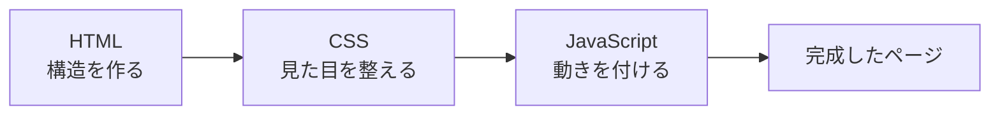

# JavaScript の役割 — HTML と CSS だけでは作れない「動き」

## 今日のゴール

- HTML と CSS だけではページに「動き」を付けられないことを知る
- JavaScript がブラウザで動く仕組みを知る
- JavaScript で何ができるかの全体像を知る

## ボタンを押しても何も起きない

HTML でボタンを作ってみます。

```html
<!DOCTYPE html>
<html lang="ja">
  <head>
    <meta charset="UTF-8" />
    <meta name="viewport" content="width=device-width, initial-scale=1.0" />
    <title>ボタンの例</title>
  </head>
  <body>
    <button type="button">クリックしてください</button>
    <p id="message"></p>
  </body>
</html>
```

ブラウザで開くと、ボタンは表示されます。押すこともできます。でも**何も起きません**。

HTML はページの**構造**を作るための言語です。CSS は**見た目**を整える言語です。どちらも「ボタンを押したら何かする」という**動き**を記述する機能を持っていません。

この「動き」を担当するのが JavaScript です。

## JavaScript を足すと動き出す

先ほどの HTML に `<script>` タグを足します。

```html
<!DOCTYPE html>
<html lang="ja">
  <head>
    <meta charset="UTF-8" />
    <meta name="viewport" content="width=device-width, initial-scale=1.0" />
    <title>JavaScript の例</title>
  </head>
  <body>
    <button type="button" id="btn">クリックしてください</button>
    <p id="message"></p>

    <script>
      const button = document.getElementById("btn");
      const message = document.getElementById("message");

      button.addEventListener("click", () => {
        message.textContent = "ボタンが押されました！";
      });
    </script>
  </body>
</html>
```

今度はボタンを押すと「ボタンが押されました！」というテキストが表示されます。

`<script>` タグの中に書かれたコードが JavaScript です。ブラウザは HTML を上から順に読んでいき、`<script>` タグを見つけると、その中のコードを**実行**します。



## JavaScript にできること

JavaScript がブラウザで行える代表的なことを見てみましょう。

### HTML の中身を書き換える

```javascript
document.getElementById("message").textContent = "こんにちは";
```

ページに表示されているテキストや HTML を、後から書き換えられます。ページを再読み込みしなくても、表示内容が変わります。

### ユーザーの操作に反応する

```javascript
button.addEventListener("click", () => {
  // ボタンがクリックされたときに実行される
});
```

クリック、キーボード入力、スクロールなど、ユーザーの操作を検知して、それに応じた処理を実行できます。

### サーバーにデータを取りに行く

```javascript
const response = await fetch("https://api.example.com/data");
const data = await response.json();
```

ページを表示した後に、サーバーにリクエストを送ってデータを取得できます。天気予報や SNS のタイムラインなど、後からデータを読み込んで表示する機能はこれで実現されています。

### 表示を条件で切り替える

```javascript
if (count > 0) {
  badge.textContent = count;
  badge.style.display = "block";
} else {
  badge.style.display = "none";
}
```

「通知が 0 件ならバッジを隠す」「ログイン中なら名前を表示する」のように、状態に応じて表示を切り替えられます。

## JavaScript の基本的な書き方

JavaScript のコードを読むための最低限の文法を紹介します。

### 変数 — 値に名前を付ける

```javascript
const name = "田中";       // 変更しない値
let count = 0;             // 変更する値
count = count + 1;         // let で宣言した変数は後から変更できる
```

`const` は値を変更しない変数、`let` は変更する変数に使います。迷ったら `const` を使い、変更が必要になったら `let` に変えるのが一般的です。

### 関数 — 処理をまとめる

```javascript
function greet(name) {
  return `こんにちは、${name}さん`;
}

greet("田中");  // "こんにちは、田中さん"
```

処理をまとめて名前を付けたものが関数です。`function` で定義し、`()` で呼び出します。

アロー関数という書き方もよく使われます。

```javascript
const greet = (name) => {
  return `こんにちは、${name}さん`;
};
```

`=>` を使う以外は同じです。Next.js のコードではアロー関数がよく出てきます。

### オブジェクト — 関連するデータをまとめる

```javascript
const user = {
  name: "田中",
  age: 25,
  email: "tanaka@example.com",
};

console.log(user.name);  // "田中"
```

`{ }` で囲んで、キーと値のペアを並べます。`.` でキーを指定して値を取り出します。

### 配列 — 複数の値を並べる

```javascript
const colors = ["赤", "青", "緑"];

console.log(colors[0]);     // "赤"
console.log(colors.length); // 3
```

`[ ]` で囲んで、複数の値を順番に並べます。`[0]` のようにインデックス（0 から始まる番号）で取り出します。

## console.log — 確認のための出力

JavaScript を書くとき、値を確認する方法があります。

```javascript
const name = "田中";
console.log(name);  // ブラウザの開発者ツールに "田中" と表示される
```

`console.log()` で渡した値が、ブラウザの開発者ツール（DevTools）の「Console」タブに表示されます。「この変数に何が入っているか」「ここまで処理が来ているか」を確認するために使います。

## まとめ

- HTML は構造、CSS は見た目、JavaScript は**動き**を担当します
- `<script>` タグの中に書いたコードをブラウザが実行します
- JavaScript で HTML の書き換え、ユーザー操作への反応、サーバーからのデータ取得などができます
- `const` / `let` で変数、`function` で関数、`{ }` でオブジェクト、`[ ]` で配列を作ります
- `console.log()` で開発者ツールに値を出力して確認できます
