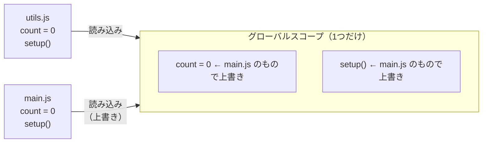
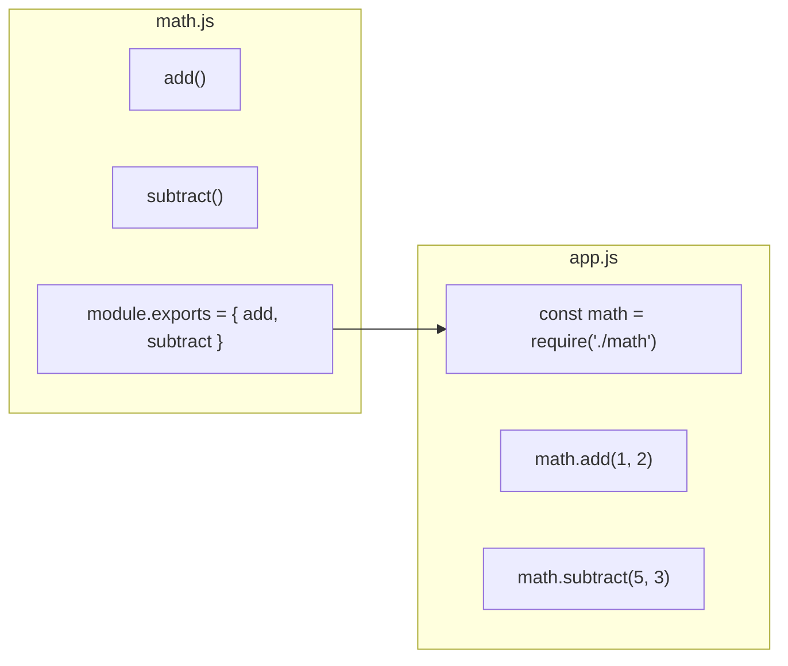
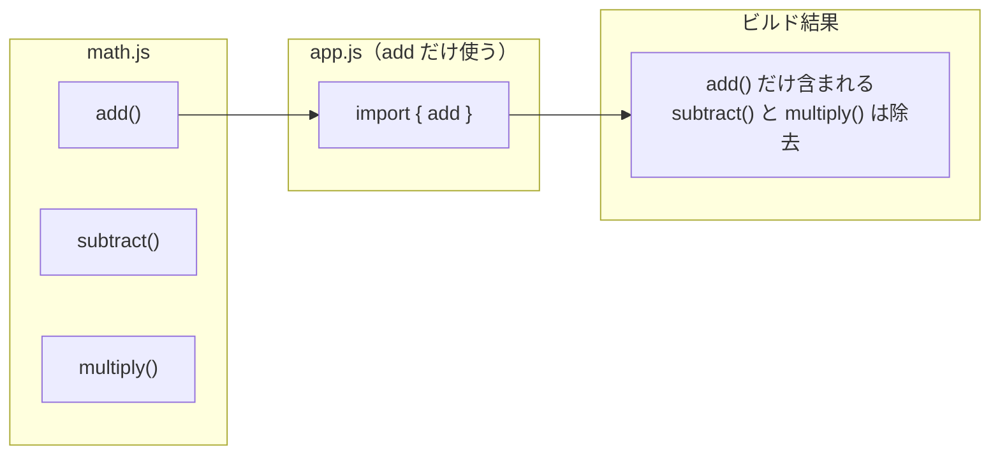
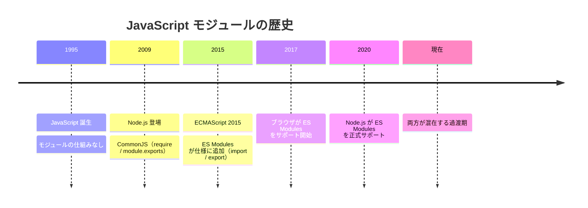
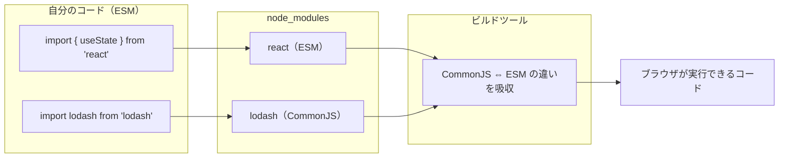

# モジュール — require と import が 2 つある理由

Next.js のコードで `import` を何気なく書いていると思います。一方で、ネットの記事やサンプルコードで `require` という別の書き方を見かけることもあるはずです。なぜ同じ「他のファイルを読み込む」という機能に 2 種類の書き方があるのでしょうか。その理由は JavaScript の歴史にあります。

## 今日のゴール

- JavaScript にモジュールがなかった時代の問題を知る
- CommonJS（require）と ES Modules（import）がそれぞれ生まれた背景を知る
- なぜ今も 2 種類が混在しているのかを知る

## モジュールがなかった時代

JavaScript は 1995 年にブラウザのための言語として生まれました。当初は、ページにちょっとした動きを付ける程度の用途で、コードの規模は小さいものでした。

このころの JavaScript には、コードをファイル単位で分離する仕組みがありませんでした。複数のファイルに分けて書いても、すべての変数や関数が 1 つの<strong>グローバルスコープ</strong>（プログラム全体で共有される名前空間）に置かれます。

```html
<script src="utils.js"></script>
<script src="main.js"></script>
```

```javascript
// utils.js
var count = 0;

function setup() {
  count = 10;
}
```

```javascript
// main.js
var count = 0;

function setup() {
  count = 99;
}
```

`utils.js` と `main.js` の両方に `count` と `setup` があります。ブラウザはこれらを順番に読み込みますが、どちらも同じグローバルスコープに置かれるため、後から読み込まれた `main.js` の `count` と `setup` が `utils.js` のものを上書きします。エラーは出ません。静かに壊れます。



小さなプロジェクトなら名前が衝突しないように気をつければ済みます。しかし Web アプリが大規模化するにつれて、ファイル数が数十、数百と増えていきます。すべての変数名・関数名がぶつからないように管理するのは現実的ではありません。

::: tip 即時実行関数（IIFE）という回避策
モジュールの仕組みがなかった時代、開発者は即時実行関数（IIFE: Immediately Invoked Function Expression）というテクニックで名前の衝突を避けていました。

```javascript
var MyUtils = (function() {
  var count = 0;

  function setup() {
    count = 10;
  }

  return { setup: setup };
})();
```

関数の中に閉じ込めることでグローバルスコープを汚さない工夫です。しかし、あくまで「工夫」であって言語の仕組みではありません。ファイル間の依存関係も管理できず、読み込み順を手動で制御する必要がありました。
:::

必要だったのは、ファイルごとにスコープを分離し、必要なものだけを外に公開する仕組み、つまり<strong>モジュール</strong>です。

## CommonJS — Node.js が作った仕組み

2009 年、JavaScript をブラウザの外で動かすための実行環境として Node.js が登場しました。サーバーサイドの開発では多数のファイルに分けて大規模なアプリケーションを構築する必要があり、モジュールの仕組みが不可欠でした。

しかし、当時の JavaScript の言語仕様（<strong>ECMAScript</strong> — JavaScript の正式な仕様を定める標準規格）にはモジュールの仕組みがありません。そこで Node.js は独自のモジュールシステムを作りました。それが CommonJS です。

CommonJS では、`require()` で他のファイルを読み込み、`module.exports` で公開するものを指定します。

```javascript
// math.js
function add(a, b) {
  return a + b;
}

function subtract(a, b) {
  return a - b;
}

module.exports = { add, subtract };
```

```javascript
// app.js
const math = require("./math");

console.log(math.add(1, 2));      // 3
console.log(math.subtract(5, 3)); // 2
```

`math.js` は `add` と `subtract` を `module.exports` で外に公開しています。`app.js` は `require("./math")` でそれを受け取ります。`math.js` の中で宣言した変数や関数は、`module.exports` に含めない限り外から見えません。ファイルがそのままスコープの境界になるのです。



CommonJS の重要な特徴は、<strong>同期的</strong>に読み込むことです。`require()` を実行すると、その場でファイルを読み込み、完了するまで次の行に進みません。

サーバー（Node.js）ではファイルがローカルのディスクにあるため、読み込みは一瞬で終わります。しかし、ブラウザではどうでしょうか。ファイルをネットワーク越しにダウンロードする必要があるため、同期的に読み込むとその間ページが固まってしまいます。

| 環境 | ファイルの場所 | 同期読み込みの影響 |
|------|---------------|-------------------|
| Node.js（サーバー） | ローカルディスク | 一瞬で完了するので問題なし |
| ブラウザ | ネットワーク越し | ダウンロード完了までページが止まる |

つまり CommonJS はサーバーサイド向けの仕組みであり、ブラウザでそのまま使うのには適していませんでした。

## ES Modules — 言語標準になった仕組み

2015 年、ECMAScript の改定版（ECMAScript 2015、ES6 とも呼ばれる）に、ついにモジュールの仕組みが正式に追加されました。これが<strong>ES Modules</strong>（ESM）です。

ES Modules では、`export` で公開し、`import` で読み込みます。

```javascript
// math.js
export function add(a, b) {
  return a + b;
}

export function subtract(a, b) {
  return a - b;
}
```

```javascript
// app.js
import { add, subtract } from "./math.js";

console.log(add(1, 2));      // 3
console.log(subtract(5, 3)); // 2
```

見た目は CommonJS と似ていますが、根本的に異なる点があります。

### 静的な構造

CommonJS の `require()` は普通の関数呼び出しなので、条件分岐の中で呼んだり、変数に応じて読み込むファイルを変えたりできます。

```javascript
// CommonJS — 実行時に決まる
if (condition) {
  const a = require("./moduleA");
} else {
  const b = require("./moduleB");
}
```

ES Modules の `import` は構文（文法）です。ファイルの先頭に書く必要があり、条件分岐の中には書けません。

```javascript
// ES Modules — ファイルの先頭で宣言する
import { add } from "./math.js";
```

この制約は欠点ではなく、大きな利点です。「このファイルが何に依存しているか」をコードを実行しなくても解析できるのです。これを<strong>静的解析</strong>と呼びます。

静的解析ができると何が嬉しいのでしょうか。たとえば、ビルドツールが「このプロジェクトで実際に使われていない関数」を検出して、最終的な出力から取り除くことができます。この最適化を<strong>ツリーシェイキング</strong>（tree shaking）と呼びます。使わないコードを配信しなくて済むので、ユーザーがダウンロードするファイルが小さくなります。



CommonJS では `require()` が実行時に動的に決まるため、ビルドツールは「何が使われるか」を正確に判断できず、ツリーシェイキングが難しくなります。

### 名前付きエクスポートとデフォルトエクスポート

ES Modules には 2 種類のエクスポートがあります。

```javascript
// 名前付きエクスポート（named export）
export function add(a, b) {
  return a + b;
}

export function subtract(a, b) {
  return a - b;
}
```

```javascript
// デフォルトエクスポート（default export）
export default function add(a, b) {
  return a + b;
}
```

| | 名前付きエクスポート | デフォルトエクスポート |
|---|---|---|
| 構文 | `export function add() {}` | `export default function add() {}` |
| インポート | `import { add } from "./math.js"` | `import add from "./math.js"` |
| 1 ファイルに | 複数置ける | 1 つだけ |
| 名前の一致 | エクスポート名と一致が必要 | インポート側で自由に名前を付けられる |

```javascript
// 名前付きエクスポートのインポート — 名前を合わせる必要がある
import { add, subtract } from "./math.js";

// デフォルトエクスポートのインポート — 好きな名前を付けられる
import myAdd from "./math.js";
```

デフォルトエクスポートはインポート側で名前を自由に付けられるため、同じモジュールをインポートしているのにファイルごとに違う名前になることがあります。大規模なプロジェクトでは検索しづらくなるため、名前付きエクスポートを推奨するプロジェクトも多くあります。

## CommonJS と ES Modules の比較

ここまでの違いを整理します。

| | CommonJS | ES Modules |
|---|---|---|
| 登場 | 2009 年（Node.js と共に） | 2015 年（ECMAScript 仕様） |
| 読み込み | `require()` | `import` |
| 公開 | `module.exports` | `export` / `export default` |
| 解析 | 動的（実行時に決まる） | 静的（実行前に解析できる） |
| ツリーシェイキング | 困難 | 可能 |
| ブラウザ対応 | そのままでは動かない | ネイティブ対応 |
| 言語仕様 | Node.js 独自の仕組み | JavaScript の正式な仕様 |

ES Modules は JavaScript の公式なモジュールシステムです。新しいコードを書くなら ES Modules を使うのが基本です。

## なぜ今も 2 種類あるのか

ES Modules が言語の標準なら、CommonJS はもう不要では？　そう思うかもしれません。しかし現実には、今も 2 つが混在しています。

理由は単純です。Node.js は 2009 年から CommonJS で動いてきました。npm に公開されている膨大な数のライブラリが CommonJS で書かれています。これらを一夜にして ES Modules に書き換えることはできません。



Node.js が ES Modules を正式にサポートしたのは 2020 年です。言語仕様に追加されてから 5 年かかりました。そしてサポートされた後も、既存の CommonJS のコードが消えるわけではありません。

### Node.js はどちらか判断する必要がある

Node.js は 1 つのファイルを CommonJS として解釈するか、ES Modules として解釈するか、どちらかに決める必要があります。この判断に使われるのが `package.json` の `"type"` フィールドと、ファイルの拡張子です。

```json
{
  "name": "my-project",
  "type": "module"
}
```

| `package.json` の `"type"` | `.js` ファイルの扱い |
|---|---|
| `"module"` | ES Modules として解釈 |
| `"commonjs"` または未指定 | CommonJS として解釈 |

`"type"` に関係なく、拡張子で強制的に指定する方法もあります。

| 拡張子 | 常に |
|---|---|
| `.mjs` | ES Modules として解釈 |
| `.cjs` | CommonJS として解釈 |

この判断の流れをまとめると次のようになります。

```mermaid
flowchart TD
  A["Node.js が .js ファイルを読み込む"] --> B{拡張子は .mjs?}
  B -- はい --> C["ES Modules として解釈"]
  B -- いいえ --> D{拡張子は .cjs?}
  D -- はい --> E["CommonJS として解釈"]
  D -- いいえ --> F{"package.json の\ntype は?"}
  F -- '"module"' --> C
  F -- '"commonjs" または未指定' --> E
```

プロジェクトの設定ファイル（`eslint.config.mjs` など）で `.mjs` という拡張子を見かけることがあるかもしれません。これは「このファイルは必ず ES Modules として解釈してほしい」という明示的な指定です。

## Next.js での実際

Next.js のプロジェクトでは ES Modules（`import` / `export`）を使います。

```tsx
import { useState } from "react";
import Link from "next/link";

export default function HomePage() {
  const [count, setCount] = useState(0);

  return (
    <div>
      <h1>ホーム</h1>
      <p>カウント: {count}</p>
      <button onClick={() => setCount(count + 1)}>+1</button>
      <Link href="/about">About ページへ</Link>
    </div>
  );
}
```

React の `useState` は名前付きエクスポートなので `{ useState }` で受け取り、Next.js の `Link` はデフォルトエクスポートなのでそのまま `Link` で受け取っています。

ただし、<strong>npm</strong>（Node.js のパッケージ管理ツール）で配布されるライブラリの中には、まだ CommonJS で書かれたものが多数あります。Next.js が使っているビルドツールが、CommonJS と ES Modules の違いを自動的に吸収してくれるため、開発者が意識する場面はほとんどありません。



つまり、Next.js で開発するとき覚えておくことは 1 つです。自分が書くコードでは `import` / `export` を使う。それだけです。

::: tip require() を見かけたら
他の人のコードやネット上のサンプルで `require()` を見かけることがあります。それは CommonJS で書かれたコードです。古い記事や Node.js 向けのツールの設定ファイルで使われていることが多く、同じことを `import` で書き換えられます。

```javascript
// CommonJS（古い書き方）
const express = require("express");

// ES Modules（現在の標準）
import express from "express";
```
:::

## まとめ

- 初期の JavaScript にはモジュールの仕組みがなく、すべてがグローバルスコープに置かれるため、変数名の衝突が問題だった
- Node.js が独自に CommonJS（`require` / `module.exports`）を作り、ファイル単位のスコープを実現した
- 2015 年に言語仕様として ES Modules（`import` / `export`）が追加された。静的に解析できるため、ツリーシェイキングなどの最適化が可能になった
- 今も 2 つが混在するのは、CommonJS で書かれた膨大な既存ライブラリがあるから
- Next.js では ES Modules を使う。CommonJS との違いはビルドツールが吸収してくれる
