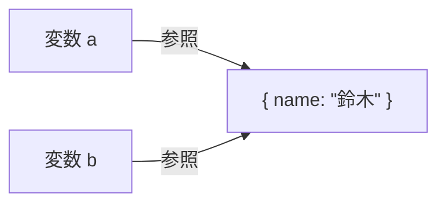
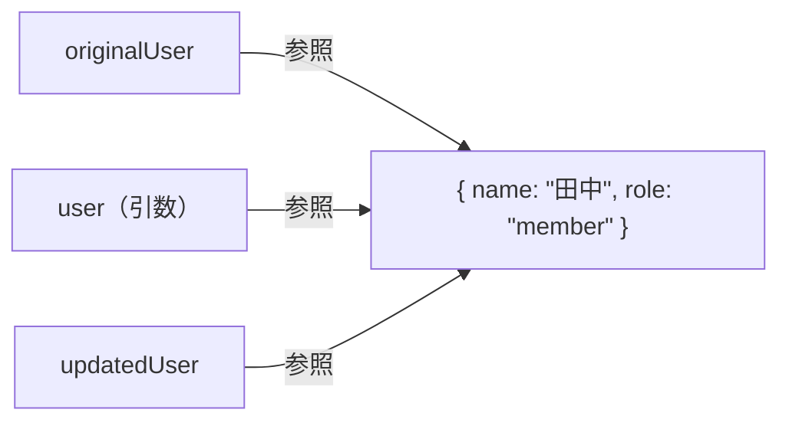
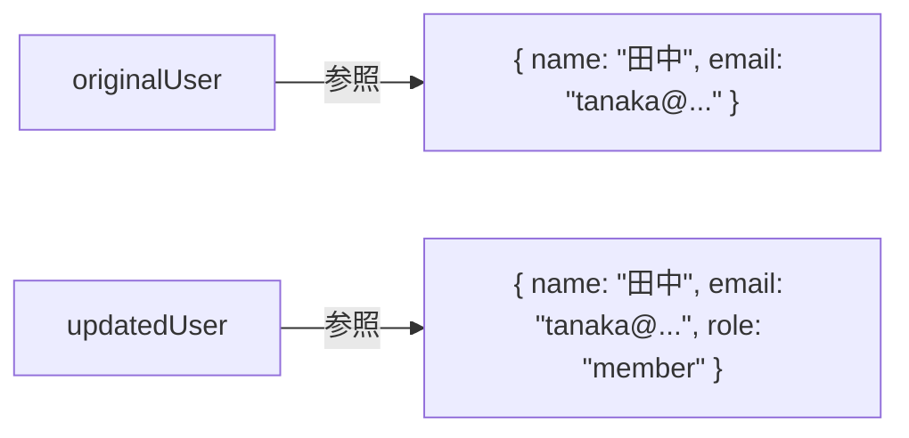
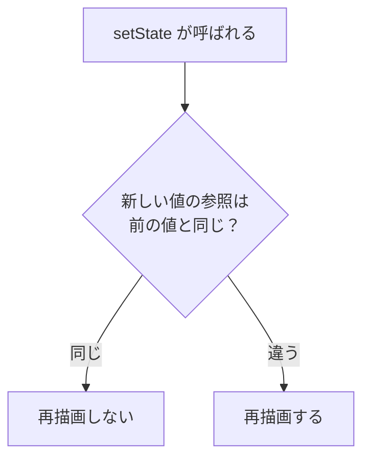
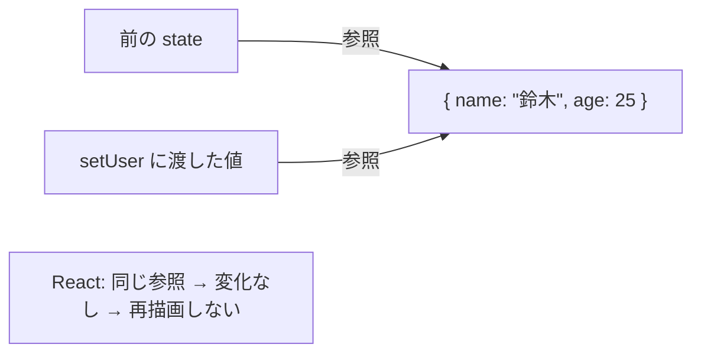
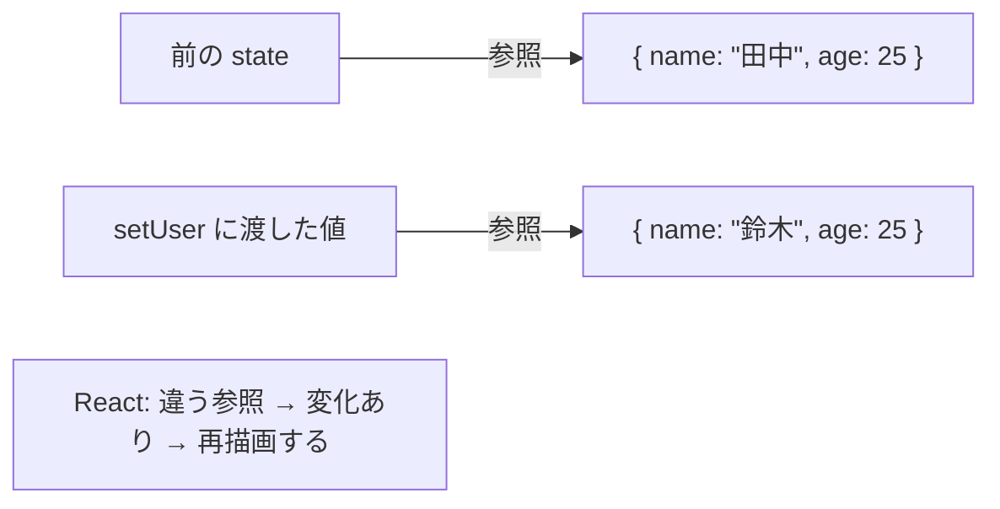

# 参照とイミュータビリティ — なぜ直接変更してはいけないか

## 今日のゴール

- JavaScript の値にはプリミティブとオブジェクトの 2 種類があり、メモリ上の扱いが異なることを知る
- オブジェクトの「参照の共有」によって、意図しない変更が起きる仕組みを知る
- イミュータビリティ（変更ではなく新規作成）の考え方と、React がそれを必要とする理由を知る

## 2 種類の値 — プリミティブとオブジェクト

JavaScript の値は大きく 2 種類に分かれます。

| 分類 | 含まれる型 | 例 |
|------|-----------|-----|
| プリミティブ | number, string, boolean, null, undefined | `42`, `"hello"`, `true` |
| オブジェクト | object, array, function | `{ name: "田中" }`, `[1, 2, 3]` |

この 2 種類は、変数に入るものが根本的に違います。

<strong>プリミティブ</strong>は値そのものが変数に入ります。`const x = 42` と書くと、変数 `x` には `42` という値がそのまま格納されます。

<strong>オブジェクト</strong>は値そのものではなく、値が置かれている場所を指す<strong>参照</strong>（アドレス）が変数に入ります。参照とは「メモリ上のどこにデータがあるか」を示す住所のようなものです。`const user = { name: "田中" }` と書くと、`{ name: "田中" }` というデータはメモリ上のどこかに作られ、変数 `user` にはその場所を指す参照が入ります。

```mermaid
flowchart LR
  subgraph プリミティブ
    x["変数 x"] --- v1["42"]
    y["変数 y"] --- v2['"hello"']
  end
  subgraph オブジェクト
    user["変数 user"] -->|参照| obj["{ name: &quot;田中&quot; }"]
    items["変数 items"] -->|参照| arr["[1, 2, 3]"]
  end
```

この違いは、変数を別の変数に代入したときの挙動に直接影響します。

```javascript
// プリミティブ：値がコピーされる
let a = 42;
let b = a;
b = 100;

console.log(a); // 42（b を変えても a は変わらない）
console.log(b); // 100
```

`a` の値 `42` がコピーされて `b` に入るので、`b` を変えても `a` には影響しません。

```javascript
// オブジェクト：参照がコピーされる
const a = { name: "田中" };
const b = a;
b.name = "鈴木";

console.log(a.name); // "鈴木"（b を変えたはずなのに a も変わっている）
console.log(b.name); // "鈴木"
```

`a` に入っているのは参照（アドレス）なので、`const b = a` でコピーされるのも参照です。`a` と `b` は同じオブジェクトを指しています。だから `b.name` を変えると、`a.name` も変わります。

## 参照の共有 — 同じ場所を指す

もう少し詳しく見てみます。`const b = a` の後、メモリ上では何が起きているでしょうか。



変数 `a` と `b` は別々の変数ですが、同じオブジェクトを指しています。これが<strong>参照の共有</strong>です。どちらの変数からでもオブジェクトの中身を変更でき、その変更はもう一方からも見えます。

配列でも同じことが起きます。

```javascript
const a = [1, 2, 3];
const b = a;
b.push(4);

console.log(a); // [1, 2, 3, 4]（b に push しただけなのに a も変わっている）
console.log(b); // [1, 2, 3, 4]
```

配列もオブジェクトの一種なので、変数に入るのは参照です。`a` と `b` は同じ配列を指しているため、`b.push(4)` は `a` にも影響します。

## なぜ直接変更が問題か

小さなコードなら「`a` と `b` が同じものを指している」と把握できます。しかし、コードが大きくなると話は別です。

次のコードを見てください。

```javascript
function addDefaultRole(user) {
  user.role = "member";
  return user;
}

const originalUser = { name: "田中", email: "tanaka@example.com" };
const updatedUser = addDefaultRole(originalUser);

console.log(updatedUser.role);  // "member"（これは期待通り）
console.log(originalUser.role); // "member"（元のデータまで変わっている！）
```

`addDefaultRole` に `originalUser` を渡すと、関数の引数 `user` には `originalUser` と同じ参照が入ります。関数の中で `user.role = "member"` と書くと、`originalUser` の中身が直接変更されます。



3 つの変数がすべて同じオブジェクトを指しています。「`addDefaultRole` は新しいユーザーを返す関数」だと思って使ったのに、実は元のデータを書き換えていた。これが参照の共有によるバグです。

関数に渡したデータが、知らないうちに書き換えられている。コードが数百行、数千行になると、どこで何が変更されたのかを追うのが非常に難しくなります。

## イミュータビリティ — 変更ではなく新規作成

この問題を避けるための考え方が<strong>イミュータビリティ</strong>（immutability）です。日本語では「不変性」と訳されます。

原則はシンプルです。**既存のオブジェクトを変更せず、新しいオブジェクトを作る。**

先ほどの `addDefaultRole` をイミュータブルに書き直します。

```javascript
function addDefaultRole(user) {
  return { ...user, role: "member" };
}

const originalUser = { name: "田中", email: "tanaka@example.com" };
const updatedUser = addDefaultRole(originalUser);

console.log(updatedUser.role);  // "member"
console.log(originalUser.role); // undefined（元のデータは変わっていない）
```

`{ ...user, role: "member" }` は<strong>スプレッド構文</strong>です。`user` の中身をすべてコピーした新しいオブジェクトを作り、そこに `role: "member"` を追加しています。元の `user` は一切変更されません。



`originalUser` と `updatedUser` は別々のオブジェクトを指しています。一方を変更しても、もう一方に影響しません。

### 配列のイミュータブルな操作

配列でも同じ考え方です。スプレッド構文 `[...arr]` で新しい配列を作ります。

```javascript
const original = [1, 2, 3];

// ミュータブル（元の配列を変更する）
original.push(4);       // original が [1, 2, 3, 4] に変わる

// イミュータブル（新しい配列を作る）
const added = [...original, 5];  // added は [1, 2, 3, 4, 5]、original は変わらない
```

よく使う操作のミュータブルとイミュータブルの対応表です。

| 操作 | ミュータブル（元を変更） | イミュータブル（新規作成） |
|------|------------------------|--------------------------|
| 末尾に追加 | `arr.push(item)` | `[...arr, item]` |
| 先頭に追加 | `arr.unshift(item)` | `[item, ...arr]` |
| 削除（条件） | `arr.splice(i, 1)` | `arr.filter(x => x !== target)` |
| 更新（条件） | `arr[i] = newVal` | `arr.map(x => x.id === id ? newVal : x)` |
| プロパティ変更 | `obj.key = val` | `{ ...obj, key: val }` |
| プロパティ削除 | `delete obj.key` | `const { key, ...rest } = obj`（分割代入で除外） |

左の列はすべて元のデータを直接変更します。右の列はすべて新しいデータを返し、元は変えません。

::: details 浅いコピーと深いコピー
スプレッド構文は 1 階層だけをコピーする<strong>浅いコピー</strong>（shallow copy）です。ネストされたオブジェクトの参照はそのままコピーされます。

```javascript
const original = {
  name: "田中",
  address: { city: "東京" }
};

const copy = { ...original };
copy.name = "鈴木";
copy.address.city = "大阪";

console.log(original.name);         // "田中"（1 階層目はコピーされている）
console.log(original.address.city); // "大阪"（ネストされた部分は共有されたまま！）
```

1 階層目の `name` はコピーされているので影響しませんが、`address` オブジェクトは同じ参照を共有しているため、`copy.address.city` を変えると `original.address.city` も変わります。

すべての階層をコピーする<strong>深いコピー</strong>（deep copy）が必要な場合は、`structuredClone()` を使います。

```javascript
const copy = structuredClone(original);
copy.address.city = "大阪";

console.log(original.address.city); // "東京"（深いコピーなので影響しない）
```

ただし、React の state 更新では深いコピーが必要になる場面は多くありません。通常はスプレッド構文で変更したい階層だけを新しく作ります。

```javascript
const copy = {
  ...original,
  address: { ...original.address, city: "大阪" }
};
```

変更したい階層ごとにスプレッドする書き方は冗長に見えますが、必要な部分だけを新しく作るため効率的です。
:::

## React の state と参照

ここまで学んだ「参照」と「イミュータビリティ」は、React の state 管理と直接つながっています。

React は state の変更を検知して画面を再描画（再レンダリング）するライブラリです。では、React はどうやって「state が変わった」と判断しているのでしょうか。

答えは**参照の比較**です。React は state の中身を 1 つ 1 つ比べるのではなく、「参照が前と同じかどうか」だけを見ます。



この仕組みを知ると、なぜ React で直接変更がダメなのかがわかります。

### 間違い: state を直接変更する

```javascript
const [user, setUser] = useState({ name: "田中", age: 25 });

function handleClick() {
  user.name = "鈴木";
  setUser(user);
}
```

`user.name = "鈴木"` は既存のオブジェクトを直接変更しています。そのあと `setUser(user)` を呼んでいますが、`user` の参照（アドレス）は変わっていません。React は「同じ参照だから何も変わっていない」と判断し、画面を再描画しません。



データは変わっているのに、画面に反映されない。これが直接変更によるバグです。

### 正しい方法: 新しいオブジェクトを作る

```javascript
const [user, setUser] = useState({ name: "田中", age: 25 });

function handleClick() {
  setUser({ ...user, name: "鈴木" });
}
```

`{ ...user, name: "鈴木" }` はスプレッド構文で新しいオブジェクトを作っています。新しいオブジェクトなので参照が異なり、React は「参照が変わった、つまり state が変わった」と判断して画面を再描画します。



配列の state でも同じです。

```javascript
const [items, setItems] = useState(["りんご", "みかん"]);

// 間違い: 直接変更
function handleAddWrong() {
  items.push("ぶどう");
  setItems(items);
}

// 正しい: 新しい配列を作る
function handleAddCorrect() {
  setItems([...items, "ぶどう"]);
}
```

AI が生成した React のコードで、state の更新にスプレッド構文が使われているのを見たことがあるかもしれません。それは見た目を整えるためではなく、React の再描画の仕組みに合わせて「新しい参照を作る」という意図で書かれています。

::: tip const なのに中身が変えられる？
`const user = { name: "田中" }` と宣言しても、`user.name = "鈴木"` はエラーになりません。`const` が禁止するのは変数への再代入（`user = 別のオブジェクト`）だけであり、オブジェクトの中身の変更は制限しません。

```javascript
const user = { name: "田中" };
user.name = "鈴木";   // OK（中身の変更は const で防げない）
user = { name: "鈴木" }; // エラー（再代入は const で禁止されている）
```

`const` は「変数が指す先を変えない」という宣言であり、「中身を変えない」という宣言ではありません。中身の変更を防ぐのは `const` の役割ではなく、イミュータブルに書くというプログラマーの判断です。
:::

## まとめ

- JavaScript の値にはプリミティブとオブジェクトの 2 種類があり、オブジェクトは参照（アドレス）を通じて操作される
- オブジェクトを変数に代入すると参照がコピーされるため、複数の変数が同じオブジェクトを指す（参照の共有）。一方を変更するともう一方にも影響する
- イミュータビリティとは、既存のオブジェクトを変更せず新しいオブジェクトを作る考え方。スプレッド構文 `{ ...obj }` / `[...arr]` で実現する
- React は state の「参照が変わったかどうか」で再描画を判断する。直接変更では参照が変わらないため、React は変化に気づけない。だから新しいオブジェクトを作る必要がある
