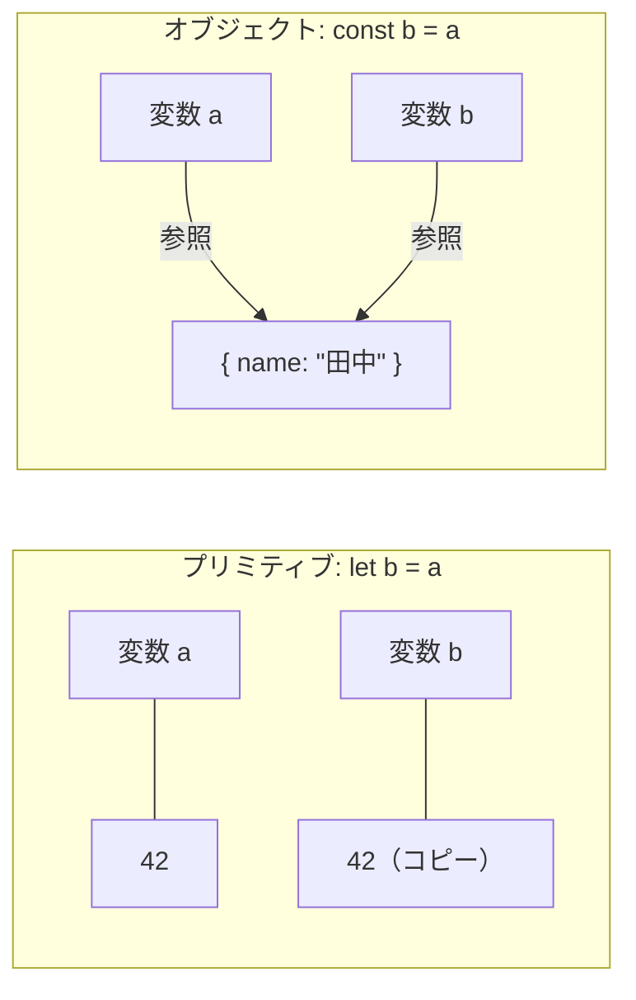
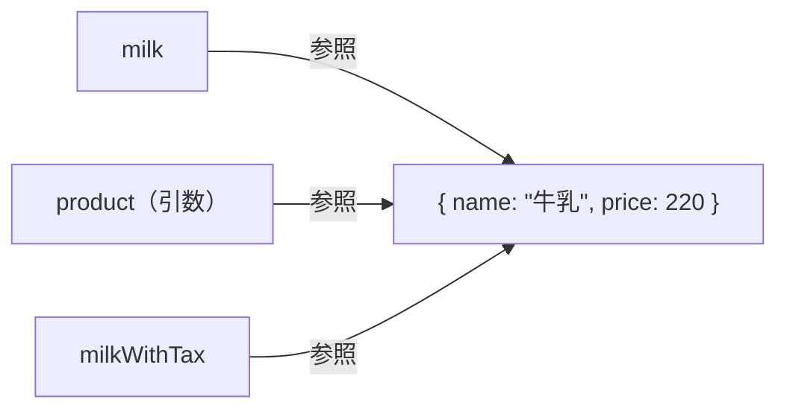
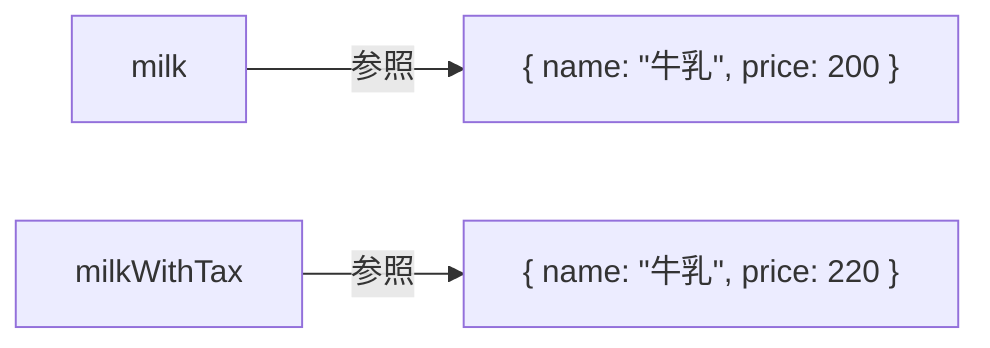
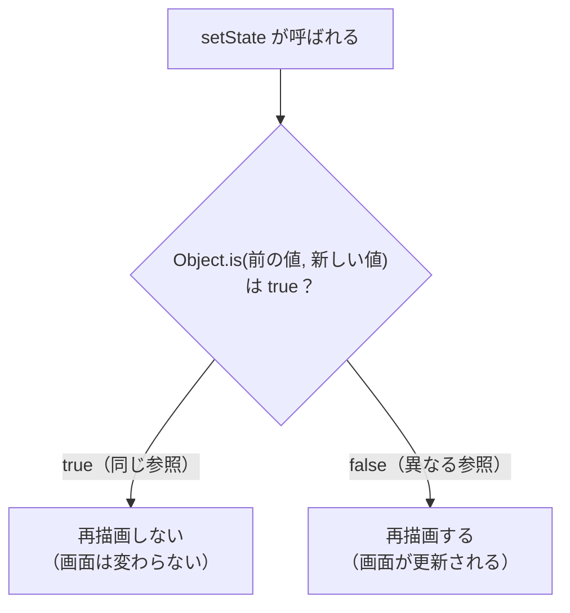
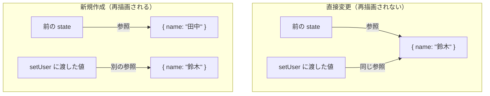

# 参照とイミュータビリティ — なぜ直接変更してはいけないか

## 今日のゴール

- JavaScript の値にはプリミティブとオブジェクトの 2 種類があり、メモリ上の扱いが異なることを知る
- オブジェクトの「参照の共有」によって、意図しない変更が起きる仕組みを知る
- イミュータビリティ（変更ではなく新規作成）の考え方と、React がそれを必要とする理由を知る

AI が生成した React のコードで、`{ ...user, name: "鈴木" }` のようなスプレッド構文を見たことはないでしょうか。なぜ `user.name = "鈴木"` と直接書き換えないのか。その答えは JavaScript の「参照」の仕組みにあります。

## 2 種類の値 — プリミティブとオブジェクト

JavaScript の値は大きく 2 種類に分かれます。

| 分類 | 含まれる型 | 例 |
|------|-----------|-----|
| プリミティブ | number, string, boolean, null, undefined, bigint, symbol | `42`, `"hello"`, `true` |
| オブジェクト | object, array, function | `{ name: "田中" }`, `[1, 2, 3]` |

bigint と symbol は使う場面が限られるので、ここでは触れません。重要なのはプリミティブとオブジェクトで<strong>変数に入るものが根本的に違う</strong>という点です。<strong>プリミティブは値そのものが</strong>、<strong>オブジェクトは値が置かれている場所を指す「参照」（メモリ上のアドレス）が</strong>、変数に入ります。

```mermaid
flowchart LR
  subgraph プリミティブ
    x["変数 x"] --- v1["42"]
    y["変数 y"] --- v2['"hello"']
  end
  subgraph オブジェクト
    user["変数 user"] -->|参照| obj["{ name: &quot;田中&quot; }"]
    items["変数 items"] -->|参照| arr["[1, 2, 3]"]
  end
```

この違いが最もはっきり現れるのは、変数を別の変数に代入したときです。

### プリミティブの代入 — 値がコピーされる

```javascript
let a = 42;
let b = a;
b = 100;

console.log(a); // 42（b を変えても a は変わらない）
console.log(b); // 100
```

`a` の値 `42` がコピーされて `b` に入ります。`a` と `b` はそれぞれ独立した値を持っているので、一方を変えても他方には影響しません。

### オブジェクトの代入 — 参照がコピーされる

```javascript
const a = { name: "田中" };
const b = a;
b.name = "鈴木";

console.log(a.name); // "鈴木"（b を変えたはずなのに a も変わっている）
console.log(b.name); // "鈴木"
```

`a` に入っているのは参照（アドレス）なので、`const b = a` でコピーされるのも参照です。`a` と `b` は同じオブジェクトを指しています。だから `b.name` を変えると、`a.name` も変わります。

プリミティブとオブジェクトの代入を並べてみます。



プリミティブは値そのものがコピーされるため独立しますが、オブジェクトは参照がコピーされるため同じデータを共有します。この「複数の変数が同じデータを指す」状態を<strong>参照の共有</strong>と呼びます。

配列もオブジェクトの一種なので同じことが起きます。

```javascript
const a = [1, 2, 3];
const b = a;
b.push(4);
console.log(a); // [1, 2, 3, 4]（b に push しただけなのに a も変わっている）
```

`a` と `b` は同じ配列を指しているため、一方への変更が両方に反映されます。

## なぜ直接変更が問題か

小さなコードなら「`a` と `b` が同じものを指している」と把握できます。しかし、コードが大きくなると話は別です。

商品に税込み価格を計算して返す関数を考えます。元の価格（税抜き）と税込み価格を両方使いたい、というよくある場面です。

```javascript
function withTax(product) {
  product.price = product.price * 1.1;
  return product;
}

const milk = { name: "牛乳", price: 200 };
const milkWithTax = withTax(milk);

console.log(`${milk.name}: ${milk.price}円（税込 ${milkWithTax.price}円）`);
// 牛乳: 220円（税込 220円） ← 税抜きを表示したかったのに 220 円になっている
```

`withTax` に `milk` を渡すと、関数の引数 `product` には `milk` と同じ参照が入ります。関数の中で `product.price = ...` と書くと、`milk` の中身が直接書き換わります。



3 つの変数がすべて同じオブジェクトを指しています。「税込み価格を返す関数」だと思って使ったのに、元の価格まで上書きされていた。コードが大きくなるほど、こうした「どの関数がどのデータを書き換えたか」が追えなくなり、原因不明のバグの温床になります。

## イミュータビリティ — 変更ではなく新規作成

この問題を避けるための考え方が<strong>イミュータビリティ</strong>（immutability）です。日本語では「不変性」と訳されます。

原則はシンプルです。<strong>既存のオブジェクトを変更せず、新しいオブジェクトを作る。</strong>

先ほどの `withTax` をイミュータブルに書き直します。

```javascript
function withTax(product) {
  return { ...product, price: product.price * 1.1 };
}

const milk = { name: "牛乳", price: 200 };
const milkWithTax = withTax(milk);

console.log(`${milk.name}: ${milk.price}円（税込 ${milkWithTax.price}円）`);
// 牛乳: 200円（税込 220円） ← 元の価格は変わっていない
```

`{ ...product, price: ... }` は<strong>スプレッド構文</strong>です。`product` の中身をすべてコピーした新しいオブジェクトを作り、そこに `price` を上書きしています。元の `product` は一切変更されません。



`milk` と `milkWithTax` は別々のオブジェクトを指しています。一方を変更しても、もう一方に影響しません。

### 配列のイミュータブルな操作

配列でも同じ考え方です。スプレッド構文 `[...arr]` で新しい配列を作ります。

```javascript
const original = [1, 2, 3];

// ミュータブル（元の配列を変更する）
original.push(4);       // original が [1, 2, 3, 4] に変わる

// イミュータブル（新しい配列を作る）
const added = [...original, 5];  // added は [1, 2, 3, 4, 5]、original は変わらない
```

よく使う操作のミュータブルとイミュータブルの対応表です。

| 操作 | ミュータブル（元を変更） | イミュータブル（新規作成） |
|------|------------------------|--------------------------|
| 末尾に追加 | `arr.push(item)` | `[...arr, item]` |
| 先頭に追加 | `arr.unshift(item)` | `[item, ...arr]` |
| 削除（条件） | `arr.splice(i, 1)` | `arr.filter(x => x !== target)` |
| 更新（条件） | `arr[i] = newVal` | `arr.map(x => x.id === id ? newVal : x)` |
| プロパティ変更 | `obj.key = val` | `{ ...obj, key: val }` |
| プロパティ削除 | `delete obj.key` | `const { key, ...rest } = obj`（分割代入で除外） |

::: details 浅いコピーと深いコピー
スプレッド構文は 1 階層だけをコピーする<strong>浅いコピー</strong>（shallow copy）です。ネストされたオブジェクトの参照はそのままコピーされます。

```javascript
const original = {
  name: "田中",
  address: { city: "東京" }
};

const copy = { ...original };
copy.name = "鈴木";
copy.address.city = "大阪";

console.log(original.name);         // "田中"（1 階層目はコピーされている）
console.log(original.address.city); // "大阪"（ネストされた部分は共有されたまま！）
```

1 階層目の `name` はコピーされているので影響しませんが、`address` オブジェクトは同じ参照を共有しているため、`copy.address.city` を変えると `original.address.city` も変わります。

すべての階層をコピーする<strong>深いコピー</strong>（deep copy）が必要な場合は、`structuredClone()` を使います。

```javascript
const copy = structuredClone(original);
copy.address.city = "大阪";

console.log(original.address.city); // "東京"（深いコピーなので影響しない）
```

ただし、React の state 更新では深いコピーが必要になる場面は多くありません。通常はスプレッド構文で変更したい階層だけを新しく作ります。

```javascript
const copy = {
  ...original,
  address: { ...original.address, city: "大阪" }
};
```

変更したい階層ごとにスプレッドする書き方は冗長に見えますが、必要な部分だけを新しく作るため効率的です。
:::

## React の state と参照

ここまで見てきた「参照」と「イミュータビリティ」は、React の state 管理と直接つながっています。

React は state の変更を検知して画面を再描画（再レンダリング）するライブラリです。では、React はどうやって「state が変わった」と判断しているのでしょうか。

答えは<strong>参照の比較</strong>です。正確には `Object.is()` という比較関数を使っています。オブジェクトの場合、`Object.is()` は参照が同じかどうかだけを見て、中身のプロパティは比較しません。



この仕組みが、直接変更ではなく新しいオブジェクトを作る必要がある理由です。

### 画面が更新されないパターン — state を直接変更する

```javascript
const [user, setUser] = useState({ name: "田中", age: 25 });

function handleClick() {
  user.name = "鈴木";
  setUser(user);
}
```

`user.name = "鈴木"` は既存のオブジェクトの中身を直接変更しています。そのあと `setUser(user)` を呼んでいますが、`user` の参照（アドレス）は変わっていません。`Object.is(前の値, user)` は `true` を返し、React は「何も変わっていない」と判断して画面を再描画しません。データの中身は変わっているのに画面に反映されない、というバグになります。

### 画面が更新されるパターン — 新しいオブジェクトを作る

```javascript
const [user, setUser] = useState({ name: "田中", age: 25 });

function handleClick() {
  setUser({ ...user, name: "鈴木" });
}
```

`{ ...user, name: "鈴木" }` はスプレッド構文で新しいオブジェクトを作っています。新しいオブジェクトなので参照が異なり、`Object.is(前の値, 新しい値)` は `false` を返します。React は「state が変わった」と判断して画面を再描画します。

2 つのパターンを図で並べてみます。



表でも整理しておきます。

| | 直接変更 | 新しいオブジェクトを作る |
|---|---|---|
| コード | `user.name = "鈴木"; setUser(user)` | `setUser({ ...user, name: "鈴木" })` |
| 参照 | 変わらない（同じオブジェクト） | 変わる（新しいオブジェクト） |
| `Object.is()` の結果 | `true` | `false` |
| React の判断 | 変化なし → 再描画しない | 変化あり → 再描画する |

配列の state でも同じです。

```javascript
const [items, setItems] = useState(["りんご", "みかん"]);

// 間違い: 直接変更
function handleAddWrong() {
  items.push("ぶどう");
  setItems(items);
}

// 正しい: 新しい配列を作る
function handleAddCorrect() {
  setItems([...items, "ぶどう"]);
}
```

AI が生成する React コードのスプレッド構文は、見た目を整えるためでも慣習でもなく、`Object.is()` で参照を比較する React の仕組みに合わせた必然的な書き方です。

::: tip const なのに中身が変えられる？
`const user = { name: "田中" }` と宣言しても、`user.name = "鈴木"` はエラーになりません。`const` が禁止するのは変数への再代入（`user = 別のオブジェクト`）だけであり、オブジェクトの中身の変更は制限しません。

```javascript
const user = { name: "田中" };
user.name = "鈴木";   // OK（中身の変更は const で防げない）
user = { name: "鈴木" }; // エラー（再代入は const で禁止されている）
```

`const` は「変数が指す先を変えない」という宣言であり、「中身を変えない」という宣言ではありません。中身の変更を防ぐのは `const` の役割ではなく、イミュータブルに書くというプログラマーの判断です。
:::

## まとめ

| 概念 | ポイント |
|------|---------|
| プリミティブとオブジェクト | プリミティブは値そのものが変数に入る。オブジェクトは参照（アドレス）が変数に入る |
| 参照の共有 | オブジェクトを代入すると参照がコピーされ、複数の変数が同じデータを指す。一方を変更するともう一方にも影響する |
| イミュータビリティ | 既存のオブジェクトを変更せず、スプレッド構文 `{ ...obj }` / `[...arr]` で新しいオブジェクトを作る考え方 |
| React の再描画 | React は `Object.is()` で state の参照を比較する。直接変更では参照が変わらないため変化に気づけない。新しいオブジェクトを作ることで参照が変わり、再描画が起きる |
