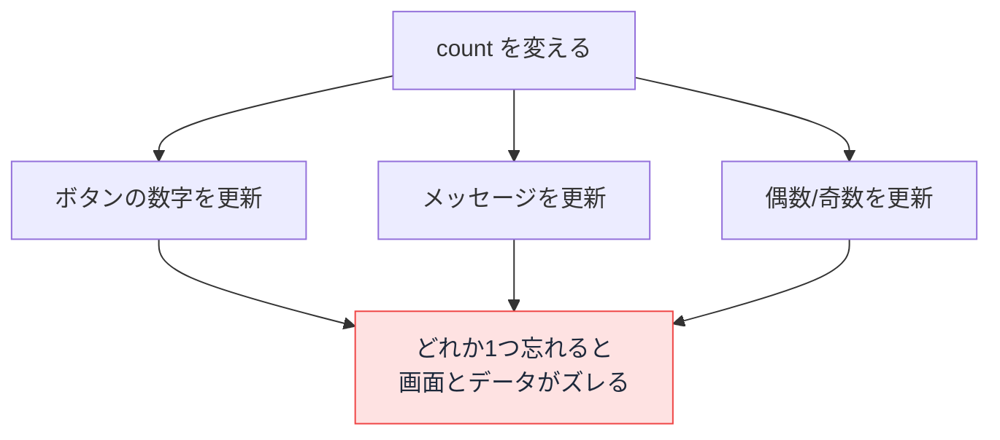

# 宣言的 UI — なぜ画面の書き換えを自分で書かないのか

## 今日のゴール

- 命令的（どうやって）と宣言的（何を）の違いを知る
- 素の JavaScript で画面を更新する大変さを知る
- React が「状態を変えれば画面が追従する」仕組みでそれを解決していることを知る

## 文字を書き換える命令がないのに、画面が変わる

次は、ボタンを押すと数字が 1 ずつ増えるカウンターを React で書いたものです。

```tsx
function Counter() {
  const [count, setCount] = useState(0);
  return <button onClick={() => setCount(count + 1)}>{count}</button>;
}
```

ボタンを押すと画面の数字が増えます。しかし、よく見ると不思議です。`setCount(count + 1)` で `count` という値を変えているだけで、「ボタンの文字を書き換えろ」という命令はどこにもありません。それなのに、画面の表示は更新されます。

なぜでしょうか。この「自分で書き換えていないのに画面が変わる」という性質こそ、<strong>宣言的 UI</strong>と呼ばれる考え方の核心です。

## 命令的 — 「どうやって」を一つずつ書く

この仕組みのありがたさを理解するために、まず React を使わず、素の JavaScript で同じカウンターを作ってみます。

```html
<button id="counter">0</button>
```

```javascript
let count = 0;
const button = document.querySelector("#counter");

button.addEventListener("click", () => {
  count = count + 1;
  button.textContent = count; // 自分で画面を書き換える
});
```

注目すべきは `button.textContent = count;` の行です。`count` の値を変えた後、<strong>自分で DOM（画面を構成する要素）を探して、文字を書き換えています</strong>。

このように「画面のどの要素を、どう変えるか」を手順として一つずつ書くやり方を<strong>命令的</strong>（imperative）と呼びます。コンピュータに「こうやって、次にこうして」と手順を指示するスタイルです。

カウンター 1 個ならこれで十分です。しかし、画面が複雑になると問題が起きます。

## 命令的の限界 — 更新コードが雪だるま式に増える

たとえば「数字が増えると、それに連動して 3 か所の表示が変わる」画面を考えます。

- ボタンの中の数字
- 「現在 N 回」というメッセージ
- 偶数か奇数かの表示

命令的に書くと、状態を変えるたびに全部を手で更新する必要があります。

```javascript
let count = 0;
const button = document.querySelector("#counter");
const message = document.querySelector("#message");
const parity = document.querySelector("#parity");

button.addEventListener("click", () => {
  count = count + 1;
  // count が変わったら、関連する表示をすべて自分で更新する
  button.textContent = count;
  message.textContent = `現在 ${count} 回`;
  parity.textContent = count % 2 === 0 ? "偶数" : "奇数";
});
```

表示が増えるほど、更新する行が増えていきます。さらに怖いのは<strong>更新し忘れ</strong>です。どこか 1 か所の更新を書き忘れると、その部分だけ古い値が残り、画面とデータがズレます。状態が増え、画面が複雑になるほど、この「手作業の更新」と「更新し忘れのバグ」は手に負えなくなります。



下のデモで試してください。左の命令的版は、偶数/奇数の更新を 1 か所書き忘れた例です。「+1」を押すと数字とメッセージは増えるのに、偶数/奇数だけ古いまま残り、画面とデータがズレます。右の宣言的版はズレません。

<div class="c08-demo">
  <div class="c08-cols">
    <div class="c08-col">
      <p class="c08-col-title">命令的（更新を1か所書き忘れた例）</p>
      <div class="c08-count" id="c08-imp-count">0</div>
      <p class="c08-line" id="c08-imp-msg">現在 0 回</p>
      <p class="c08-line" id="c08-imp-parity">偶数</p>
    </div>
    <div class="c08-col">
      <p class="c08-col-title">宣言的</p>
      <div class="c08-count" id="c08-dec-count">0</div>
      <p class="c08-line" id="c08-dec-msg">現在 0 回</p>
      <p class="c08-line" id="c08-dec-parity">偶数</p>
    </div>
  </div>
  <div class="c08-controls">
    <button type="button" class="c08-btn" id="c08-inc">+1</button>
    <button type="button" class="c08-btn c08-btn-sub" id="c08-reset">リセット</button>
  </div>
  <p class="c08-note">命令的版は数字とメッセージだけ更新し、偶数/奇数の更新を書き忘れている。宣言的版は状態から毎回すべてを作り直すのでズレない。</p>
</div>

## 宣言的 — 「状態」と「見た目」を結びつける

React の発想は、これとは逆です。「どうやって更新するか」を書くのをやめて、<strong>「この状態のとき、画面はこう」</strong>という対応だけを書きます。

先ほどの 3 か所連動の画面を React で書くとこうなります。

```tsx
function Counter() {
  const [count, setCount] = useState(0);

  return (
    <div>
      <button onClick={() => setCount(count + 1)}>{count}</button>
      <p>現在 {count} 回</p>
      <p>{count % 2 === 0 ? "偶数" : "奇数"}</p>
    </div>
  );
}
```

ここには「文字を書き換えろ」という更新の手順が一つもありません。あるのは「`count` がいくつのとき、画面にはこれを表示する」という<strong>状態と見た目の対応</strong>だけです。

`setCount` で `count` を変えると、React がこの対応をもう一度評価し直し、画面を作り直します。更新するのは開発者ではなく React です。だから更新し忘れが起きません。状態を変えれば、それに関係する表示はすべて自動的に追従します。

このように「どうやって」ではなく「何を」表示するかを宣言するスタイルを<strong>宣言的</strong>（declarative）と呼びます。

| | 命令的（素の JS） | 宣言的（React） |
|---|---|---|
| 書くこと | 画面の更新手順 | 状態と見た目の対応 |
| 状態が変わったら | 自分で DOM を書き換える | React が画面を作り直す |
| 表示が増えると | 更新コードも増える | 対応を書くだけ |
| 更新し忘れ | 起こりうる | 起こらない |

## 「作り直す」のに速いのはなぜか

「状態が変わるたびに画面を作り直す」と聞くと、毎回画面全体を描き直して遅いのでは、と思うかもしれません。

実際には、React は画面を丸ごと描き直しているわけではありません。新しく宣言された画面と、前の画面を比べ、<strong>実際に変わった部分だけ</strong>を本物の画面（DOM）に反映します。カウンターの数字だけが変わったなら、書き換わるのはその数字だけです。だから「作り直す」書き方でも速く動きます。

開発者は「状態が変わったら画面はこう」と宣言するだけでよく、どこをどう書き換えるかという面倒で間違いやすい部分は React が引き受けてくれる、というわけです。

## まとめ

- <strong>命令的</strong>な書き方では、状態が変わるたびに「画面のどこをどう更新するか」を自分で書く。表示が増えると更新コードが膨らみ、更新し忘れでバグが起きる
- <strong>宣言的 UI</strong>は「この状態のとき画面はこう」という対応だけを書く。状態を変えれば React が画面を作り直すので、更新の手順を書かなくていい
- React は前の画面と新しい画面を比べ、実際に変わった部分だけを更新する。だから「作り直す」書き方でも速い
- AI が生成する React コードは、この宣言的なスタイルで書かれている。「状態を変えれば画面が追従する」という前提を知っていれば、コードの構造が読める。逆に、React の中に命令的な DOM 操作（`document.querySelector(...).textContent = ...`）が紛れていたら、流儀から外れたコードだと気づける

<style>
.c08-demo {
  border: 1px solid var(--vp-c-divider);
  border-radius: 8px;
  padding: 16px;
  margin: 16px 0;
  background: #f8fafc;
  color: #1e293b;
}
.c08-cols {
  display: grid;
  grid-template-columns: 1fr 1fr;
  gap: 16px;
}
.c08-col {
  background: white;
  border: 1px solid #e2e8f0;
  border-radius: 6px;
  padding: 12px;
  text-align: center;
}
.c08-col-title {
  font-weight: bold;
  font-size: 13px;
  margin: 0 0 8px;
  color: #1e293b;
}
.c08-count {
  font-size: 32px;
  font-weight: bold;
  color: #064e3b;
  margin: 4px 0;
}
.c08-line {
  font-size: 14px;
  color: #1e293b;
  margin: 4px 0;
}
.c08-stale {
  color: #ef4444;
}
.c08-controls {
  display: flex;
  gap: 8px;
  margin-top: 14px;
  flex-wrap: wrap;
}
.c08-btn {
  background: #064e3b;
  color: white;
  border: none;
  border-radius: 6px;
  padding: 8px 16px;
  font-size: 14px;
  cursor: pointer;
}
.c08-btn-sub {
  background: #64748b;
}
.c08-note {
  font-size: 13px;
  color: #475569;
  margin: 10px 0 0;
}
</style>

<script setup>
import { onMounted } from 'vue'

onMounted(() => {
  let count = 0
  const impCount = document.getElementById('c08-imp-count')
  const impMsg = document.getElementById('c08-imp-msg')
  const impParity = document.getElementById('c08-imp-parity')
  const decCount = document.getElementById('c08-dec-count')
  const decMsg = document.getElementById('c08-dec-msg')
  const decParity = document.getElementById('c08-dec-parity')
  const incBtn = document.getElementById('c08-inc')
  const resetBtn = document.getElementById('c08-reset')
  if (!incBtn || !resetBtn) return

  function renderImperative() {
    // 命令的: 数字とメッセージは更新するが、偶数/奇数の更新を「書き忘れた」
    impCount.textContent = count
    impMsg.textContent = `現在 ${count} 回`
    // impParity の更新を意図的に書かない → 古いまま残る
    const correct = count % 2 === 0 ? '偶数' : '奇数'
    if (impParity.textContent !== correct) {
      impParity.classList.add('c08-stale')
    } else {
      impParity.classList.remove('c08-stale')
    }
  }

  function renderDeclarative() {
    // 宣言的: 状態から毎回すべてを作り直す
    decCount.textContent = count
    decMsg.textContent = `現在 ${count} 回`
    decParity.textContent = count % 2 === 0 ? '偶数' : '奇数'
  }

  incBtn.addEventListener('click', () => {
    count = count + 1
    renderImperative()
    renderDeclarative()
  })
  resetBtn.addEventListener('click', () => {
    count = 0
    impParity.textContent = '偶数'
    impParity.classList.remove('c08-stale')
    renderImperative()
    renderDeclarative()
  })
})
</script>
