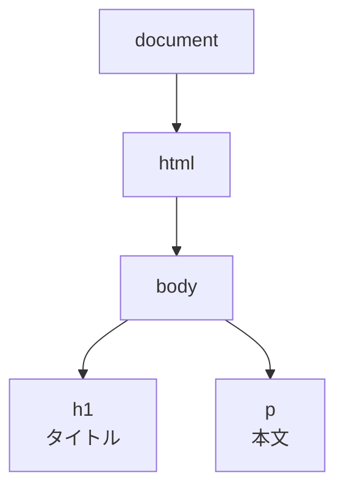
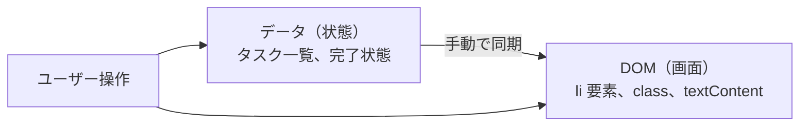

# DOM 操作 — JavaScript で HTML を書き換える

## 今日のゴール

- ブラウザが HTML をツリー構造（DOM）に変換していることを知る
- JavaScript で DOM を操作して画面を更新する仕組みを知る
- DOM 操作が面倒になる理由を知る

## ブラウザは HTML をそのまま使っていない

ブラウザは HTML ファイルを受け取ると、そのまま画面に表示しているわけではありません。まず HTML を読み取って、**ツリー構造のオブジェクト**に変換します。これを **DOM**（Document Object Model）と呼びます。

```html
<html>
  <body>
    <h1>タイトル</h1>
    <p>本文</p>
  </body>
</html>
```



HTML のタグがツリーの節（ノード）になり、親子関係で繋がっています。`<body>` の中に `<h1>` と `<p>` がある、というのがツリー構造で表現されています。

ブラウザが画面に表示しているのは、この DOM ツリーの内容です。つまり、**DOM を書き換えれば、画面の表示が変わります**。

## DOM を操作する

JavaScript には DOM を操作するための命令が用意されています。

### 要素を取得する

まず、操作したい要素を「取得」します。

```javascript
// id で取得
const title = document.getElementById("main-title");

// CSS セレクタで取得
const firstCard = document.querySelector(".card");

// 複数まとめて取得
const allCards = document.querySelectorAll(".card");
```

`document` はページ全体を指すオブジェクトです。ここから `getElementById` や `querySelector` で特定の要素を探します。

### テキストを書き換える

```javascript
const message = document.getElementById("message");
message.textContent = "更新されました";
```

`textContent` に値を代入すると、その要素のテキストが書き変わります。ページを再読み込みしなくても、画面上の表示が変わります。

### 属性を変更する

```javascript
const image = document.querySelector("img");
image.setAttribute("src", "new-photo.jpg");
image.setAttribute("alt", "新しい写真");
```

`setAttribute` で HTML の属性（`src`, `alt`, `class` など）を変更できます。

### 要素を追加する

```javascript
const list = document.getElementById("todo-list");

const item = document.createElement("li");
item.textContent = "新しいタスク";
list.appendChild(item);
```

`createElement` で新しい要素を作り、`appendChild` で既存の要素の中に追加します。

### スタイルを変える

```javascript
const box = document.getElementById("box");
box.style.backgroundColor = "red";
box.style.display = "none";
```

`style` プロパティで CSS を直接変更できます。

## 全部つなげると

ここまでの知識を組み合わせて、「ボタンを押すとリストに項目を追加する」機能を作ってみます。

```html
<!DOCTYPE html>
<html lang="ja">
  <head>
    <meta charset="UTF-8" />
    <meta name="viewport" content="width=device-width, initial-scale=1.0" />
    <title>DOM 操作の例</title>
  </head>
  <body>
    <h1>タスクリスト</h1>
    <input type="text" id="task-input" placeholder="タスクを入力" />
    <button type="button" id="add-btn">追加</button>
    <ul id="task-list" aria-label="タスク一覧"></ul>

    <script>
      const input = document.getElementById("task-input");
      const button = document.getElementById("add-btn");
      const list = document.getElementById("task-list");

      button.addEventListener("click", () => {
        if (input.value === "") return;

        const item = document.createElement("li");
        item.textContent = input.value;
        list.appendChild(item);

        input.value = "";
        input.focus();
      });
    </script>
  </body>
</html>
```

入力欄にテキストを入れてボタンを押すと、リストに項目が追加されます。ページ遷移も再読み込みもありません。JavaScript が DOM を直接書き換えているからです。

## DOM 操作は面倒になる

先ほどのタスクリストは 15 行ほどのコードで済みました。しかし、これが複雑になるとどうなるでしょう。

たとえば、タスクに「完了/未完了の切り替え」「削除」「編集」「フィルタリング（全部/完了のみ/未完了のみ）」を付けたいとします。

```javascript
// 完了状態を切り替える
item.addEventListener("click", () => {
  if (item.classList.contains("done")) {
    item.classList.remove("done");
    item.style.textDecoration = "none";
  } else {
    item.classList.add("done");
    item.style.textDecoration = "line-through";
  }
  updateCount();
});

// 削除ボタンを付ける
const deleteBtn = document.createElement("button");
deleteBtn.textContent = "削除";
deleteBtn.addEventListener("click", (e) => {
  e.stopPropagation();
  item.remove();
  updateCount();
});
item.appendChild(deleteBtn);

// 件数を更新する
function updateCount() {
  const total = list.children.length;
  const done = list.querySelectorAll(".done").length;
  counter.textContent = `${done}/${total} 完了`;
}
```

機能を足すたびに、「要素を取得 → 状態を判定 → DOM を書き換え → 他の場所も更新」というコードが増えていきます。**「データ（状態）」と「画面（DOM）」を手動で同期し続ける**のが DOM 操作の本質的な面倒さです。



データが変わったら DOM を書き換える。DOM が変わったらデータも更新する。この同期を全部自分で書かなければなりません。

この面倒さを解消するために、「データを更新すれば画面が自動で変わる」仕組みが求められました。それが React をはじめとする**宣言的 UI** のフレームワークが生まれた背景です。

## まとめ

- ブラウザは HTML をツリー構造の**DOM**に変換して画面を描画します
- JavaScript で DOM を操作すると、ページ遷移なしで画面の内容を変えられます
- `getElementById` で要素を取得し、`textContent` や `style` で書き換え、`createElement` + `appendChild` で追加します
- 機能が複雑になると「データと画面の手動同期」が大変になります。この面倒さが、React のような宣言的 UI フレームワークが生まれた背景です
