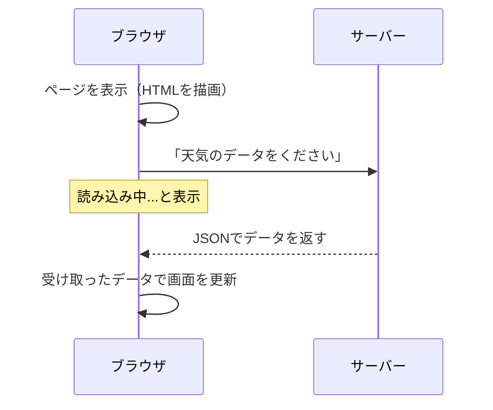
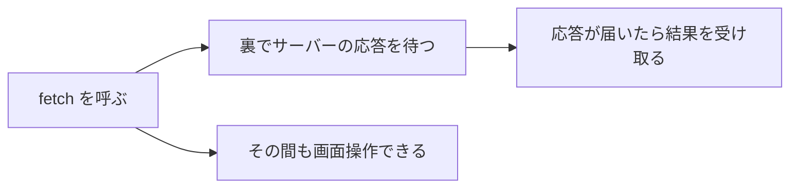

# データを取りに行く — fetch と非同期処理

## 今日のゴール

- ページ遷移しなくてもサーバーからデータを取れることを知る
- `fetch` でサーバーにリクエストを送り、JSON でデータを受け取る流れを知る
- 非同期処理の仕組みと `async` / `await` の書き方を知る
- ネットワーク通信のエラーに備える必要があることを知る

## ページを開いた後に中身が変わる

天気予報サイトを開くと、最初は「読み込み中...」と表示されて、少し経つと気温や天気のデータが現れます。SNS のタイムラインを開くと、ページ遷移していないのに新しい投稿が次々と表示されます。

この「ページを開いた後にデータが表示される」体験の裏では、JavaScript がサーバーにデータを取りに行っています。ページ全体を再読み込みしなくても、必要なデータだけを取得して画面に反映できるのです。



このデータの取得に使うのが `fetch` という仕組みです。そして `fetch` を理解するには、**非同期処理**という考え方を知る必要があります。

## fetch — サーバーにデータを取りに行く

`fetch` はブラウザに組み込まれている関数で、指定した URL にリクエストを送り、サーバーからの応答を受け取ります。

```javascript
const response = await fetch("https://jsonplaceholder.typicode.com/users/1");
const user = await response.json();
console.log(user.name); // "Leanne Graham"
```

やっていることは 2 ステップです。

1. **`fetch(URL)`** — サーバーにリクエストを送る。サーバーからの応答（レスポンス）が返ってくる
2. **`response.json()`** — レスポンスの中身を JSON として読み取る

### JSON とは

サーバーから返ってくるデータの形式は、多くの場合 **JSON**（JavaScript Object Notation）です。JavaScript のオブジェクトとほぼ同じ見た目をしています。

```json
{
  "id": 1,
  "name": "Leanne Graham",
  "email": "Sincere@april.biz"
}
```

`response.json()` を呼ぶと、この JSON 文字列が JavaScript のオブジェクトに変換されます。変換後は `user.name` のようにプロパティにアクセスできます。

## 非同期処理 — なぜ await が必要か

先ほどのコードに `await` というキーワードが出てきました。これがないとどうなるか、まずは `await` を外して考えてみます。

```javascript
// await なしで fetch を呼ぶと...
const response = fetch("https://jsonplaceholder.typicode.com/users/1");
console.log(response); // Promise { <pending> } — データではない！
```

`fetch` はすぐにはデータを返しません。ネットワーク越しにサーバーと通信するので、応答が返ってくるまでに時間がかかります。もし「応答が返るまで何もしない」としたら、待っている間ページが完全に固まります。ボタンを押しても反応せず、スクロールもできません。

だから JavaScript には**非同期処理**という仕組みがあります。「時間がかかる処理は裏で待って、その間も他の処理を進める」という考え方です。



### Promise — 「後で届く結果」の入れ物

`fetch` を呼ぶと、すぐにデータが返る代わりに **Promise**（プロミス）というオブジェクトが返ります。Promise は「今はまだ結果がないけど、後で届けます」という約束です。

Promise には 3 つの状態があります。

| 状態 | 意味 |
|------|------|
| **pending**（保留中） | まだ結果が届いていない |
| **fulfilled**（成功） | 結果が届いた |
| **rejected**（失敗） | エラーが起きた |

### async / await — 「ここで待つ」と書ける構文

Promise の結果を受け取るために使うのが `await` です。`await` を付けると、Promise の結果が届くまでその行で待ちます。ただし、ページ全体が固まるわけではありません。あくまでその関数の中だけが一時停止し、他の処理（画面のスクロールやボタンのクリックなど）は引き続き動きます。

```javascript
// await を付けると、結果が届くまで待ってから次の行に進む
const response = await fetch("https://jsonplaceholder.typicode.com/users/1");
// ↑ サーバーの応答が届いてから、次の行が実行される
const user = await response.json();
// ↑ JSON の変換が終わってから、次の行が実行される
console.log(user.name); // "Leanne Graham" — ちゃんとデータが入っている
```

`await` を使うには、関数に `async` を付ける必要があります。`async` は「この関数の中で `await` を使います」という宣言です。

```javascript
async function loadUser() {
  const response = await fetch("https://jsonplaceholder.typicode.com/users/1");
  const user = await response.json();
  console.log(user.name);
}

loadUser();
```

`async` と `await` はセットで覚えてください。

- **`async`** を関数の前に付ける → その関数の中で `await` が使えるようになる
- **`await`** を Promise の前に付ける → 結果が届くまで待ってから次に進む

## 実際のコード例

ここまでの知識を使って、サーバーからユーザー一覧を取得して画面に表示する完全なコードを見てみます。

```html
<!DOCTYPE html>
<html lang="ja">
  <head>
    <meta charset="UTF-8" />
    <meta name="viewport" content="width=device-width, initial-scale=1.0" />
    <title>ユーザー一覧</title>
  </head>
  <body>
    <h1>ユーザー一覧</h1>
    <div id="user-list" aria-live="polite">
      <p>読み込み中...</p>
    </div>

    <script>
      async function loadUsers() {
        const container = document.querySelector("#user-list");

        try {
          const response = await fetch(
            "https://jsonplaceholder.typicode.com/users"
          );

          if (!response.ok) {
            throw new Error(`HTTP エラー: ${response.status}`);
          }

          const users = await response.json();

          container.innerHTML = "";

          for (const user of users) {
            const card = document.createElement("article");
            card.innerHTML = `
              <h2>${user.name}</h2>
              <p>${user.email}</p>
            `;
            container.appendChild(card);
          }
        } catch (error) {
          container.innerHTML = `
            <p>データの取得に失敗しました: ${error.message}</p>
          `;
        }
      }

      loadUsers();
    </script>
  </body>
</html>
```

コードの流れを整理します。

1. ページが表示されると `loadUsers()` が呼ばれる
2. `fetch` でサーバーにリクエストを送り、ユーザー一覧の JSON を受け取る
3. 受け取ったデータをループで回し、1 人ずつ画面に追加する
4. 通信中は「読み込み中...」が表示され、データが届くと内容が置き換わる

このコードには `try / catch`、`response.ok`、`aria-live` という 3 つの見慣れない要素があります。次のセクションで説明します。

## エラーへの備え

ネットワーク通信は失敗する可能性があります。Wi-Fi が切れる、サーバーが落ちている、URL が間違っている — 原因はさまざまです。

### try / catch — エラーを受け止める

`try / catch` は「エラーが起きるかもしれないコードを安全に実行する」構文です。

```javascript
try {
  // エラーが起きるかもしれない処理
  const response = await fetch("https://example.com/api/data");
  const data = await response.json();
  console.log(data);
} catch (error) {
  // エラーが起きたときの処理
  console.log("エラーが発生しました:", error.message);
}
```

- **`try`** ブロックの中でエラーが起きると、残りの処理をスキップして `catch` ブロックに飛ぶ
- **`catch`** ブロックでエラーの内容を受け取り、ユーザーにメッセージを表示するなどの対処をする
- エラーが起きなければ `catch` ブロックは実行されない

`fetch` を使うときは `try / catch` で囲むのが基本です。ネットワーク通信が切れた場合、`fetch` 自体がエラーを投げるので `catch` で捕まえられます。

### response.ok — サーバーのエラーを見分ける

`fetch` は「通信自体が成功すれば」エラーを投げません。サーバーが「404 Not Found」や「500 Internal Server Error」を返しても、通信が成立していれば `fetch` はエラーにしません。

```javascript
const response = await fetch("https://example.com/api/not-found");
// サーバーが 404 を返しても fetch はエラーにならない

console.log(response.ok);     // false — 成功ではなかった
console.log(response.status); // 404 — ステータスコード
```

だから `response.ok` を確認して、成功でなければ自分でエラーを発生させるのが定番のパターンです。

```javascript
if (!response.ok) {
  throw new Error(`HTTP エラー: ${response.status}`);
}
```

先ほどの完全なコード例では、この 2 つのパターン（`try / catch` と `response.ok` のチェック）をどちらも使っています。

### aria-live でスクリーンリーダーに変化を伝える

完全なコード例にもう 1 つ、`aria-live="polite"` という属性がありました。

```html
<div id="user-list" aria-live="polite">
  <p>読み込み中...</p>
</div>
```

`aria-live` を付けた要素の中身が変わると、スクリーンリーダーがその変更を読み上げます。`"polite"` は「今の読み上げが終わったら通知する」という意味です。「読み込み中...」からユーザー一覧に変わったこと、あるいはエラーメッセージが表示されたことが、目で画面を見られないユーザーにも伝わります。

## まとめ

- `fetch` でサーバーにリクエストを送り、データを取得できる。ページ遷移は不要
- サーバーからのデータは **JSON** 形式で返ってくることが多い。`response.json()` でオブジェクトに変換する
- `fetch` はすぐに結果を返さない。**非同期処理**として裏でサーバーの応答を待ち、その間も画面は固まらない
- **`async` / `await`** で「ここで待つ」と書ける。`async` が付いた関数の中で `await` が使える
- ネットワーク通信は失敗する前提で書く。**`try / catch`** でエラーを受け止め、**`response.ok`** でサーバーのエラーを見分ける
- `aria-live` で動的に変わるコンテンツの変更をスクリーンリーダーに伝えられる
