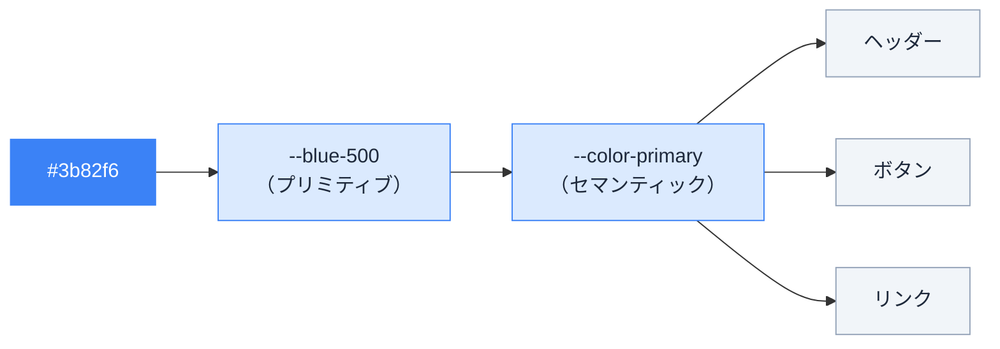
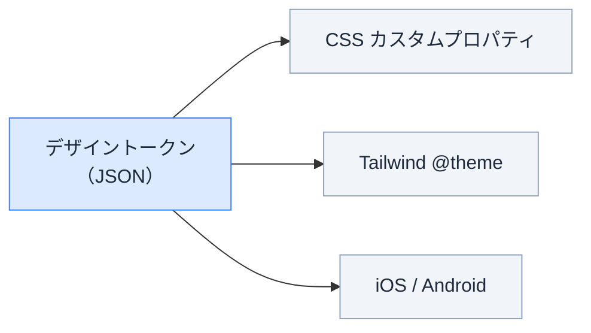

# デザイントークン — 色やサイズを「名前」で管理する

## 今日のゴール

- 色やサイズを直接書く（ハードコード）と何が困るかを知る
- デザイントークンという「名前で管理する」仕組みを知る
- CSS カスタムプロパティがその土台であることを知る
- Tailwind CSS がトークンの考え方をどう実現しているかを知る

## 同じ色を 50 箇所に書いている

あるプロジェクトのコードを見てみましょう。

```css
.header {
  background-color: #3b82f6;
}

.button-primary {
  background-color: #3b82f6;
}

.link {
  color: #3b82f6;
}

.badge {
  border: 1px solid #3b82f6;
}
```

`#3b82f6` というブランドカラーが、いろんなファイルに散らばっています。

ここで「ブランドカラーを `#2563eb` に変えたい」と言われたら？

- ファイルを横断して `#3b82f6` を検索
- 50 箇所見つかる
- 全部置換…と思ったら、一部は別の意図で同じ色を使っていた
- 漏れが出る、意図しない場所まで変わる

色だけではありません。`16px` というフォントサイズ、`8px` という角丸、`24px` という余白。同じ値がファイルをまたいで何十箇所にも書かれていると、「変更」が「全文検索と置換」になります。

これが**ハードコード**の問題です。

## 「値」に「名前」をつける

解決策はシンプルです。値に名前をつけて、使う側は名前で参照する。

```
定義:  primary = #3b82f6
使用:  ヘッダーの背景 → primary を使う
       ボタンの背景   → primary を使う
       リンクの文字色 → primary を使う
```

変更するときは定義元の 1 箇所だけ書き換えれば、使っている全箇所に反映されます。

この「**設計上の決定（色、サイズ、余白など）に名前をつけて一元管理する**」仕組みが、デザイントークンです。

管理するのは色だけではありません。

| 種類 | 例 |
|------|-----|
| 色 | ブランドカラー、背景色、文字色 |
| フォントサイズ | 本文、見出し、キャプション |
| 余白（スペーシング） | 要素間の距離、パディング |
| 角丸 | ボタンの丸み、カードの丸み |
| 影 | カードの影、モーダルの影 |
| ブレイクポイント | スマホ / タブレット / デスクトップの切り替え幅 |

「デザインの判断」をすべて名前付きの値として定義しておく — これがデザイントークンの考え方です。

## CSS カスタムプロパティ — ブラウザが持つ「変数」機能

デザイントークンの考え方を CSS で実現する仕組みが、**CSS カスタムプロパティ**（CSS 変数）です。

```css
:root {
  --color-primary: #3b82f6;
  --color-bg: #ffffff;
  --color-text: #1e293b;
  --radius-md: 8px;
  --spacing-md: 16px;
}
```

- `--` で始まる名前をつけて値を定義する
- `:root` に書くと、ページ全体で使える

使う側は `var()` で参照します。

```css
.header {
  background-color: var(--color-primary);
}

.button-primary {
  background-color: var(--color-primary);
  border-radius: var(--radius-md);
  padding: var(--spacing-md);
}

.link {
  color: var(--color-primary);
}
```

`#3b82f6` という値はもうどこにも直接書かれていません。変更は `:root` の 1 行だけです。

### プリミティブトークンとセマンティックトークン

トークンの名前には 2 つの層があります。

- **プリミティブトークン** — 色そのものに名前をつける。`--blue-500`、`--slate-900` のように、値が何であるかを表す
- **セマンティックトークン** — 役割・意図で名前をつける。`--color-primary`、`--color-text` のように、何のために使うかを表す

```css
:root {
  /* プリミティブトークン: 色そのものの名前 */
  --blue-500: #3b82f6;
  --blue-700: #1d4ed8;
  --slate-900: #0f172a;

  /* セマンティックトークン: 役割の名前。プリミティブを参照する */
  --color-primary: var(--blue-500);
  --color-primary-hover: var(--blue-700);
  --color-text: var(--slate-900);
}
```

使う側は**セマンティックトークン**を参照します。

```css
.button {
  background-color: var(--color-primary);
}
.button:hover {
  background-color: var(--color-primary-hover);
}
```

なぜ 2 層に分けるのか？ ブランドカラーが青から緑に変わったとき、`--color-primary: var(--green-500)` と差し替えるだけで済みます。使っている側のコードは `--color-primary` を参照しているので、一切触りません。

もし `--blue-500` を直接使っていたら、「ブランドカラーを参照している箇所」と「たまたま青を使っている箇所」の区別がつかず、ハードコードと同じ問題が戻ってきます。



## ダークモード — トークンが真価を発揮する場面

トークンの威力が最もわかりやすいのは、ダークモードの実装です。

ダークモードとは、背景を暗くして文字を明るくする表示の切り替えです。トークンがなければ、50 箇所の色を全部書き直す必要があります。トークンがあれば、**名前は同じまま、値だけ切り替える**だけです。

```css
:root {
  --color-bg: #ffffff;
  --color-text: #1e293b;
  --color-primary: #3b82f6;
  --color-surface: #f1f5f9;
}

[data-theme="dark"] {
  --color-bg: #0f172a;
  --color-text: #e2e8f0;
  --color-primary: #60a5fa;
  --color-surface: #1e293b;
}
```

使う側のコードは一切変わりません。

```css
body {
  background-color: var(--color-bg);
  color: var(--color-text);
}

.card {
  background-color: var(--color-surface);
}
```

`<html data-theme="dark">` と属性を切り替えるだけで、ページ全体の色が変わります。これは CSS カスタムプロパティの**カスケード（上書き）**という性質を利用しています。`:root` で定義した値を、`[data-theme="dark"]` がまるごと上書きするのです。

<div class="c11-theme-demo" id="c11-theme-demo">
  <div class="c11-theme-controls">
    <button class="c11-theme-btn c11-theme-btn-light c11-active" onclick="
      document.getElementById('c11-theme-demo').classList.remove('c11-dark');
      this.classList.add('c11-active');
      this.nextElementSibling.classList.remove('c11-active');
    ">ライト</button>
    <button class="c11-theme-btn c11-theme-btn-dark" onclick="
      document.getElementById('c11-theme-demo').classList.add('c11-dark');
      this.classList.add('c11-active');
      this.previousElementSibling.classList.remove('c11-active');
    ">ダーク</button>
  </div>
  <div class="c11-theme-preview">
    <div class="c11-theme-card">
      <div class="c11-theme-card-title">カードのタイトル</div>
      <div class="c11-theme-card-body">本文テキスト。トークンの値を切り替えるだけで、すべてのコンポーネントの色が変わります。</div>
      <button class="c11-theme-card-button">ボタン</button>
    </div>
  </div>
  <div class="c11-theme-tokens">
    <code class="c11-token-line">--color-bg: <span class="c11-token-value c11-tv-bg">#ffffff</span></code>
    <code class="c11-token-line">--color-text: <span class="c11-token-value c11-tv-text">#1e293b</span></code>
    <code class="c11-token-line">--color-primary: <span class="c11-token-value c11-tv-primary">#3b82f6</span></code>
    <code class="c11-token-line">--color-surface: <span class="c11-token-value c11-tv-surface">#f1f5f9</span></code>
  </div>
</div>

<style>
.c11-theme-demo {
  --c11-bg: #ffffff;
  --c11-text: #1e293b;
  --c11-primary: #3b82f6;
  --c11-surface: #f1f5f9;
  --c11-border: #e2e8f0;
  border: 1px solid var(--c11-border);
  border-radius: 12px;
  overflow: hidden;
  margin: 1.5em 0;
  transition: all 0.3s ease;
}
.c11-theme-demo.c11-dark {
  --c11-bg: #0f172a;
  --c11-text: #e2e8f0;
  --c11-primary: #60a5fa;
  --c11-surface: #1e293b;
  --c11-border: #334155;
}
.c11-theme-controls {
  display: flex;
  gap: 0;
  background: #f1f5f9;
  padding: 4px;
  margin: 12px;
  border-radius: 8px;
  width: fit-content;
}
.c11-theme-btn {
  padding: 6px 16px;
  border: none;
  border-radius: 6px;
  cursor: pointer;
  font-size: 14px;
  background: transparent;
  color: #64748b;
  transition: all 0.2s;
}
.c11-theme-btn.c11-active {
  background: #ffffff;
  color: #1e293b;
  box-shadow: 0 1px 3px rgba(0,0,0,0.1);
}
.c11-theme-preview {
  background: var(--c11-bg);
  padding: 20px;
  transition: background 0.3s ease;
}
.c11-theme-card {
  background: var(--c11-surface);
  border-radius: 8px;
  padding: 16px;
  max-width: 360px;
  transition: background 0.3s ease;
}
.c11-theme-card-title {
  font-weight: 700;
  font-size: 16px;
  color: var(--c11-text);
  margin-bottom: 8px;
  transition: color 0.3s ease;
}
.c11-theme-card-body {
  font-size: 14px;
  color: var(--c11-text);
  opacity: 0.8;
  line-height: 1.6;
  margin-bottom: 12px;
  transition: color 0.3s ease;
}
.c11-theme-card-button {
  background: var(--c11-primary);
  color: #ffffff;
  border: none;
  border-radius: 6px;
  padding: 8px 16px;
  font-size: 14px;
  cursor: pointer;
  transition: background 0.3s ease;
}
.c11-theme-tokens {
  background: #f8fafc;
  padding: 12px 20px;
  display: flex;
  flex-direction: column;
  gap: 4px;
  border-top: 1px solid var(--c11-border);
}
.c11-token-line {
  font-size: 13px;
  color: #475569;
  font-family: monospace;
}
.c11-token-value {
  display: inline-block;
  padding: 1px 6px;
  border-radius: 3px;
  font-weight: 600;
  transition: all 0.3s ease;
}
.c11-tv-bg { background: #ffffff; color: #1e293b; border: 1px solid #e2e8f0; }
.c11-tv-text { background: #1e293b; color: #ffffff; }
.c11-tv-primary { background: #3b82f6; color: #ffffff; }
.c11-tv-surface { background: #f1f5f9; color: #1e293b; border: 1px solid #e2e8f0; }
.c11-dark .c11-theme-tokens { background: #1e293b; border-color: #334155; }
.c11-dark .c11-token-line { color: #94a3b8; }
.c11-dark .c11-tv-bg { background: #0f172a; color: #e2e8f0; border-color: #334155; }
.c11-dark .c11-tv-text { background: #e2e8f0; color: #0f172a; }
.c11-dark .c11-tv-primary { background: #60a5fa; color: #0f172a; }
.c11-dark .c11-tv-surface { background: #1e293b; color: #e2e8f0; border-color: #334155; }
</style>

ライト / ダークを切り替えると、カードの見た目が変わります。コンポーネント側のコードは何も変えていません。変わっているのはトークンの値だけです。下部のトークン一覧で、どの値が切り替わったか確認してください。

### OS のダークモード設定を使う

ユーザーが OS で「ダークモードを使う」と設定している場合、CSS のメディアクエリで検知できます。

```css
@media (prefers-color-scheme: dark) {
  :root {
    --color-bg: #0f172a;
    --color-text: #e2e8f0;
    --color-primary: #60a5fa;
  }
}
```

手動のトグルと OS 設定の検知、どちらもトークンの値を切り替えているだけ、という点は同じです。

## Tailwind CSS のアプローチ — クラス名がトークンの参照になっている

配属先のプロジェクトで使う Tailwind CSS は、デザイントークンの考え方を別の形で実現しています。

### Tailwind のクラス名の裏側

```html
<button class="bg-blue-500 text-white rounded-lg p-4">
  ボタン
</button>
```

`bg-blue-500` は `background-color: #3b82f6` のショートカットに見えますが、実は内部で CSS カスタムプロパティが使われています。Tailwind はビルド時にこのようなCSSを生成します。

```css
:root {
  --color-blue-500: #3b82f6;
  /* ... 他の色やサイズも同様 */
}

.bg-blue-500 {
  background-color: var(--color-blue-500);
}
```

つまり Tailwind のクラス名は「トークンの参照」として機能しています。

### プロジェクト独自のトークンを追加する

Tailwind v4 では、CSS ファイルの中で直接トークンを定義します。

```css
@import "tailwindcss";

@theme {
  --color-brand: #2563eb;
  --color-brand-light: #60a5fa;
  --color-brand-dark: #1d4ed8;

  --spacing-card: 24px;
  --radius-card: 12px;
}
```

`@theme` に書いた値は、**名前のプレフィックスに応じて自動的にユーティリティクラスが生成されます**。

| `@theme` の変数名 | 生成されるクラス |
|---|---|
| `--color-brand` | `bg-brand`、`text-brand`、`border-brand` |
| `--spacing-card` | `p-card`、`m-card`、`gap-card` |
| `--radius-card` | `rounded-card` |

```html
<!-- @theme で定義した名前がそのままクラス名になる -->
<div class="bg-brand rounded-card p-card">
  ブランドカラーのカード
</div>
```

同時に、`@theme` の値は CSS カスタムプロパティとしても出力されます。Tailwind のクラスを使わない場所でも `var(--color-brand)` で参照できます。

v3 までは JavaScript の設定ファイル（`tailwind.config.js`）にトークンを書いていました。

```js
// v3: JavaScript で定義
module.exports = {
  theme: {
    extend: {
      colors: { brand: '#2563eb' },
    }
  }
}
```

v4 からは CSS の中で完結します。デザイントークンの定義と、それを使うスタイルが同じ言語（CSS）で書ける形になりました。

## デザイナーとの共通言語

デザイントークンは、コードの中だけの話ではありません。

デザインツールの Figma には **Variables（変数）** という機能があります。デザイナーが色やサイズに名前をつけて、デザイン内で再利用する仕組みです。

| Figma Variables | CSS カスタムプロパティ |
|------|------|
| `primary` という色変数を作る | `--color-primary: #3b82f6;` と定義する |
| 画面上の要素にその変数を適用 | `color: var(--color-primary);` で参照する |
| 変数の値を変えると全画面に反映 | 定義元を変えると全コンポーネントに反映 |

仕組みが同じなので、**同じ名前で会話できます**。

- デザイナー:「`primary` を少し濃くしました」
- エンジニア:「`--color-primary` の値を更新しますね」

名前が揃っているから、このやりとりが成立します。名前がバラバラだと「Figma のこの色って、コードだとどれですか?」という確認が毎回必要になります。

### W3C Design Tokens Format

デザイントークンの定義方法を標準化する仕様（W3C Design Tokens Format）が、2025 年 10 月に初の安定版に到達しました。Adobe、Google、Meta、Figma など 20 以上の組織が支持しています。

```json
{
  "color": {
    "primary": {
      "$value": "#3b82f6",
      "$type": "color"
    }
  }
}
```

この JSON 形式で定義したトークンを、ツールが CSS カスタムプロパティや Tailwind の設定、iOS / Android 向けのコードに自動変換します。「1 つの定義から複数のプラットフォームのコードを生成する」という流れが標準化されつつあります。



## まとめ

- 同じ値を散らばらせず、名前をつけて 1 箇所で管理する仕組みがデザイントークン
- CSS カスタムプロパティ（`--名前` / `var()`）がブラウザ標準の実現手段
- プリミティブ（色そのもの）とセマンティック（役割）の 2 層で名前を設計する
- ダークモードはトークンの値を切り替えるだけで実現できる
- Tailwind v4 の `@theme` はトークン定義を CSS 内で完結させる
- デザイナーと同じ名前でトークンを持つことで、会話がスムーズになる
