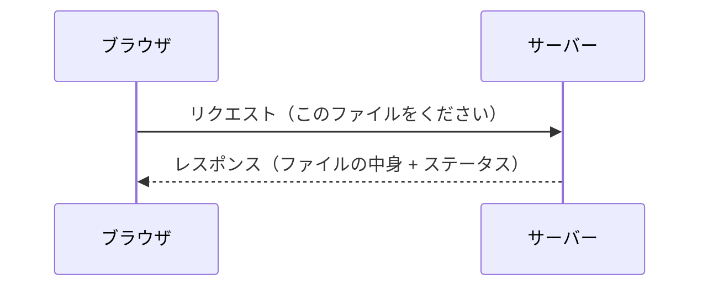

# HTTP — ページを 1 回開くだけでブラウザは何十回もリクエストしている

## 今日のゴール

- HTTP がリクエストとレスポンスのやり取りであることを知る
- ブラウザの Network タブで通信の中身が丸見えであることを知る
- ステータスコードの読み方を知る

## ページを開いただけで何が起きているか

ブラウザで Web ページを 1 つ開きます。画面にはテキスト、画像、スタイルが表示されます。ユーザーの目にはページが「表示された」だけですが、裏ではブラウザが大量の通信を行っています。

ブラウザの開発者ツール（DevTools）を開いて「Network」タブを見ると、それが丸見えになります。

1. ブラウザで任意のサイトを開く
2. 右クリック → 「検証」→ 「Network」タブ
3. ページを再読み込み

すると、HTML、CSS、JavaScript、画像、フォントなど、何十ものファイルが一覧に並びます。1 つのページを表示するために、ブラウザはこれだけの回数サーバーと通信しているのです。

## HTTP — リクエストとレスポンス

この通信に使われているのが **HTTP** です。仕組みはシンプルで、**リクエスト（要求）とレスポンス（応答）** の 1 往復が基本単位です。



ブラウザが「この URL のファイルをください」とリクエストを送り、サーバーが「はい、これです」とレスポンスを返す。Network タブに並んでいる行の 1 つ 1 つが、この 1 往復に対応しています。

## リクエストの中身

Network タブで行をクリックすると、リクエストの詳細が見えます。

### HTTP メソッド — 何をしたいか

リクエストには「何をしたいか」を示す**メソッド**が含まれています。

| メソッド | 意味 | 例 |
|---------|------|-----|
| `GET` | データを取得する | ページの表示、API からデータを読む |
| `POST` | データを送信する | フォームの送信、新しいデータの作成 |
| `PUT` | データを更新する | プロフィールの更新 |
| `DELETE` | データを削除する | 投稿の削除 |

ページを開いたときの通信はほとんど `GET` です。フォームを送信したときに `POST` が飛びます。

### URL — どこに送るか

リクエストには送り先の URL が含まれています。`https://api.example.com/users` のように、サーバーの住所とパスで構成されます。

## レスポンスの中身

サーバーが返すレスポンスには、ファイルの中身のほかに**ステータスコード**が含まれています。

### ステータスコード — 結果を 3 桁の数字で伝える

| コード | 意味 | よく見る場面 |
|--------|------|-------------|
| `200` | 成功 | ページが正常に表示された |
| `301` | 恒久的な移動 | URL が変わった（リダイレクト） |
| `404` | 見つからない | URL を間違えた、ページが削除された |
| `500` | サーバーエラー | サーバー側のプログラムが壊れた |

百の位で大まかな意味がわかります。

- **2xx**: 成功
- **3xx**: リダイレクト
- **4xx**: クライアント側のエラー（URL 間違いなど）
- **5xx**: サーバー側のエラー

Network タブでステータスコードが赤字（4xx, 5xx）になっていたら、そこが問題の手がかりです。

## fetch と HTTP の関係

JavaScript の `fetch` は、HTTP リクエストをコードから送る仕組みです。

```javascript
const response = await fetch("https://api.example.com/users");
```

この 1 行で、ブラウザは `GET https://api.example.com/users` という HTTP リクエストをサーバーに送ります。サーバーが返した HTTP レスポンスが `response` に入ります。

```javascript
console.log(response.status);  // 200
const data = await response.json();
```

`response.status` でステータスコード（200 など）が取れます。Network タブに表示される情報と同じものが、コードからアクセスできるのです。

## Network タブは最強のデバッグツール

「API からデータが返ってこない」「画像が表示されない」「ページが遅い」。こうした問題に遭遇したとき、最初に見るべき場所が Network タブです。

- **ステータスコードが 404**: URL が間違っている
- **ステータスコードが 500**: サーバー側のバグ
- **リクエストが飛んでいない**: そもそもコードが実行されていない
- **レスポンスの中身が空**: サーバーがデータを返していない

Network タブを開く習慣をつけるだけで、問題の原因がわかるスピードが大きく変わります。

## まとめ

- ページを 1 回開くだけで、ブラウザは何十回もの HTTP リクエストをサーバーに送っています
- HTTP は「リクエストとレスポンス」の 1 往復が基本単位です
- リクエストには「何をしたいか」を示すメソッド（GET, POST など）が含まれます
- レスポンスには結果を示すステータスコード（200 成功、404 見つからない、500 サーバーエラー）が含まれます
- ブラウザの Network タブでこれらの通信が丸見えになります。デバッグの第一歩はここを開くことです
