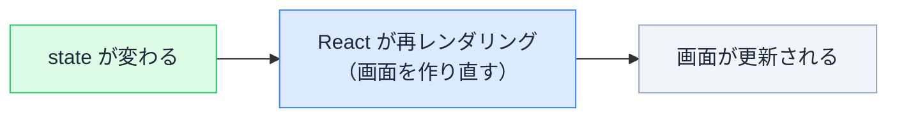
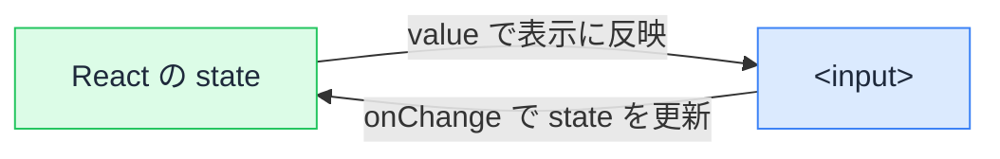
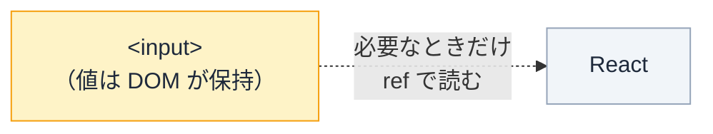

# フォームの値は誰が持つ — 制御と非制御コンポーネント

## 今日のゴール

- フォームが「打つたびに反応する」挙動は、入力値を React の state で持つことで成り立っていると知る
- 制御（state が値を持つ）と非制御（DOM が値を持つ）の違いが、どこから生まれるかを知る
- どちらをいつ選ぶか、判断の軸を持つ

## こういうフォーム、見たことありますよね

入力フォームには、打っている最中に画面が反応するものがあります。

- メールとパスワードの両方が埋まるまで、ログインボタンがグレーアウトしている
- 入力欄の下に「あと 10 文字」がリアルタイムで表示される
- 電話番号を打つと、自動で `090-1234-5678` の形に整形される
- 「国」を選ぶと、その下の「都道府県」プルダウンの中身が入れ替わる

これらに共通するのは、**打っている最中に、画面の別の場所が反応している**ことです。

この「反応できるかどうか」が、これから話す **制御コンポーネント / 非制御コンポーネント** の分かれ目です。なぜ反応できる／できないのかを、仕組みから見ていきます。

## 大前提：React の画面が変わるのは state が変わったときだけ

このあと何度も出てくる **state（ステート）** とは、React が画面のために覚えておく値のことです（後で出てくる `useState` で作ります）。「今の入力文字」「今のカウント数」など、画面に映る素になるデータと考えてください。

その state について、すべての出発点になるルールがあります。

> **React の画面が更新されるのは、state が変わったときだけ。**



逆に言うと、**state が変わらなければ、React は画面を一切作り直しません**。

だから「打つたびに文字数を出す」「打つたびにボタンの状態を変える」をやりたければ、**入力値を state に入れる**必要があります。この一点が、これから出てくる違いのすべての理由になります。

## 制御コンポーネント — 値を state で持つ

入力値を React の state で持つやり方です。state と input を 2 本の線でつなぎます。



- `value={text}` … state の値を input の表示に反映する（state → input）
- `onChange` … 入力されるたびに state を更新する（input → state）

打つたびに state が更新され、その state から画面が作り直されます。だから入力値を使った表示（文字数など）が、リアルタイムについてきます。

```tsx
import { useState } from "react";

export default function NameField() {
  const [text, setText] = useState("");

  return (
    <div>
      <input
        type="text"
        value={text}                              // state → input
        onChange={(e) => setText(e.target.value)} // input → state
      />
      <p>入力中の文字数: {text.length}</p>
    </div>
  );
}
```

`useState` は「今の値（`text`）」と「それを更新する関数（`setText`）」のペアを返します。`onChange` の `e.target.value` が、いま入力された文字列です。それを `setText` に渡して state を更新しています。

### 触って確かめる

打つたびに state が更新され、その state から文字数が計算されます。動きを下で再現しました。

<div class="c12-demo" id="c12-ctrl-demo">
  <label class="c12-label" for="c12-ctrl-input">制御された入力欄</label>
  <input class="c12-input" id="c12-ctrl-input" type="text" placeholder="ここに入力" oninput="
    var v = this.value;
    document.getElementById('c12-ctrl-state').textContent = v === '' ? '(空)' : v;
    document.getElementById('c12-ctrl-count').textContent = v.length;
  " />
  <div class="c12-readout">
    <div>state の中身: <span class="c12-badge" id="c12-ctrl-state">(空)</span></div>
    <div>文字数: <span class="c12-badge" id="c12-ctrl-count">0</span></div>
  </div>
  <p class="c12-note">打つたびに state が書き換わり、その state から文字数が計算し直されます（React の動きを再現したものです）。</p>
</div>

### `onChange` が無いと入力が固まる

`value` だけ書いて `onChange` を書かないと、**入力しても文字が変わりません**。

```tsx
// onChange が無い → 打っても変わらない
<input value={text} />
```

理由はこうです。React は input の表示を、常に `value`（＝ state の値）に**固定します**。`onChange` で state を更新していないので、state はずっと空のまま。だから何を打っても、表示は空に固定されたまま変わりません。

<div class="c12-demo" id="c12-frozen-demo">
  <label class="c12-label" for="c12-frozen-input">value だけ・onChange なし</label>
  <input class="c12-input" id="c12-frozen-input" type="text" value="編集できない" oninput="this.value='編集できない';" />
  <p class="c12-note">value が固定され、onChange で state を更新していないので、打っても表示は変わりません。React が表示を value に固定する動きを再現したものです。</p>
</div>

この「固まる」現象が、制御コンポーネントの正体をよく表しています。**React が `value` を握ると、入力欄の表示を完全に支配する**。だから `value` と `onChange` はセットで要るのです。

## 非制御コンポーネント — 値を DOM に任せる

逆に、入力値を state で持たず、ブラウザ（DOM）に任せるやり方です。**DOM** とは、ブラウザが画面を組み立てるために内部で持っている、要素の集まりのことです。`<input>` もその一つで、入力された文字を自分で覚えています。

このやり方では React は入力値を追いかけません。必要になったとき（多くは送信時）に、`ref` 経由で読みに行きます。



- `defaultValue` … 初期値だけ渡す（その後は DOM に任せる）
- `ref` … input 要素そのものに触れるための「取っ手」。`inputRef.current` がその input を指し、`.value` で今の入力値を読める

```tsx
import { useRef } from "react";

export default function NameForm() {
  const inputRef = useRef<HTMLInputElement>(null);

  function handleSubmit() {
    // 送信時にまとめて読む
    alert(inputRef.current?.value);
  }

  return (
    <div>
      <input type="text" defaultValue="" ref={inputRef} />
      <button onClick={handleSubmit}>送信</button>
    </div>
  );
}
```

### 触って確かめる

入力中、React はこの値を知りません。「読む」を押した瞬間に、初めて DOM から取り出します。

<div class="c12-demo" id="c12-unctrl-demo">
  <label class="c12-label" for="c12-unctrl-input">非制御の入力欄</label>
  <input class="c12-input" id="c12-unctrl-input" type="text" placeholder="自由に入力" />
  <div class="c12-readout">
    <button type="button" class="c12-btn" onclick="
      var v = document.getElementById('c12-unctrl-input').value;
      document.getElementById('c12-unctrl-read').textContent = v === '' ? '(空)' : v;
    ">読む（送信のイメージ）</button>
    <div>読み取った値: <span class="c12-badge" id="c12-unctrl-read">(まだ読んでいない)</span></div>
  </div>
  <p class="c12-note">入力中は React に値が伝わりません。ボタンを押した瞬間だけ、DOM から取り出します。</p>
</div>

## 「でも、非制御でも文字は普通に打てるよね？」

ここがいちばんの引っかかりどころです。非制御でも、入力欄に文字はちゃんと表示されます。なのになぜ「画面が反応しない」と言うのか。

答えはこうです。

> **入力欄に文字が出るのは「ブラウザの標準機能」であって、「React の再レンダリング」ではない。**

この 2 つは別の出来事です。

`<input>` はブラウザに元から備わっている部品です。文字を打てば表示する——これはブラウザ自身の仕事で、JavaScript が 1 行もなくても動きます。素の HTML に `<input>` を置くだけで打てるのと同じです。

つまり非制御で文字が見えるのは、**ブラウザが勝手にやっている**だけ。React は何もしていません。

### 「入力欄そのもの」と「画面の他の場所」を分ける

| 何が変わるか | 担当 | 非制御で変わる？ |
|---|---|---|
| 入力欄そのものの文字 | ブラウザの標準機能 | **変わる** |
| 画面の他の場所（文字数・ボタン・別の欄） | React の再レンダリング | **変わらない** |

下のデモは非制御の入力欄です。文字は打てます。でも隣の文字数は **0 のまま動きません**。

<div class="c12-demo" id="c12-noupdate-demo">
  <label class="c12-label" for="c12-noupdate-input">非制御の入力欄（隣は連動しない）</label>
  <input class="c12-input" id="c12-noupdate-input" type="text" placeholder="打ってみてください" />
  <div class="c12-readout">
    <div>文字数: <span class="c12-badge">0</span> ← 打っても 0 のまま</div>
  </div>
  <p class="c12-note">入力欄の文字はブラウザが表示します。でも state が変わらず再レンダリングが起きないので、文字数の表示は作り直されず 0 のままです。</p>
</div>

### なぜ動かないのか（因果の連鎖）

非制御で文字を打つと、次のことが起きます。

1. 打つ → 変わるのは **DOM の中の値だけ**
2. **state は変わっていない**
3. state が変わらない → **再レンダリングが起きない**
4. 再レンダリングが起きない → **画面の他の場所は作り直されない**

だから制約はこの一つに尽きます。

> **非制御の入力値は、画面の他の場所を動かせない。打っても再レンダリングが起きないから。**

逆に「打つたびに画面を動かしたい」なら、入力値を state に入れるしかない。state に入れる＝ `value` と `onChange` を付ける＝それはもう制御です。

### 3 つを並べると見通しがいい

| 書き方 | 入力欄の文字 | なぜ |
|---|---|---|
| 非制御（`value` なし） | **出る** | ブラウザに任せきり。React は介入しない |
| 制御だが `onChange` なし | **出ない（固まる）** | React が表示を `value` に固定し続ける（state は空のまま） |
| 制御（`value` + `onChange`） | **出る** | onChange → state 更新 → 再レンダリングで反映 |

## どちらを選ぶか — 良し悪しではなく使い分け

どちらが正解ということはありません。軸は一つです。

> **入力に合わせて、画面を動かしたいか？**

| | 制御コンポーネント | 非制御コンポーネント |
|---|---|---|
| 値の持ち主 | React の state | ブラウザ（DOM） |
| 書き方 | `value` + `onChange` | `defaultValue` + `ref` |
| 入力に合わせて画面を動かせるか | 動かせる | 動かせない（再レンダリングが起きない） |
| 再レンダリング | 1 文字ごとに起きる | 起きない |
| 向く場面 | 文字数表示・自動整形・ボタン制御・他欄と連動 | 入力して送るだけのシンプルなフォーム |

- 検索ボックスで打つたびに候補を出す → 画面を動かす → **制御**
- 名前と住所を入力して送るだけ → 画面を動かさない → **非制御でも足りる**

## 補足：実務ではフォームライブラリを使うことが多い

ここまでは仕組みを理解するための「素の React」の話です。実際の現場では、フォームを `useState` で 1 つずつ組むことは少なく、**フォームライブラリ**を使うのが一般的です。代表は **React Hook Form**（ほかに TanStack Form など）。

フォームには値の管理以外にもやることが多く（入力チェック、エラー表示、送信中の状態、多数の欄のとりまとめ）、ライブラリがそれらをまとめて引き受けてくれます。

ここで学んだ「制御 / 非制御」を知っていれば、ライブラリのドキュメントに出てくる `register` や `control` といった言葉が、内部で何をしているのかの見当がつきます。

## まとめ

- React の画面が変わるのは、state が変わったときだけ
- 制御 = 値を state で持つ（`value` + `onChange`）。入力に合わせて画面を動かせる
- `value` だけで `onChange` が無いと入力が固まる（React が表示を強制するから）
- 非制御 = 値を DOM に任せる（`defaultValue` + `ref`）。送信時に読む
- 非制御でも文字は出る。それはブラウザの標準機能で、React の再レンダリングではない
- 非制御は再レンダリングが起きないので、入力に合わせて画面を動かせない
- どちらが正解でもなく「入力に合わせて画面を動かすか」で使い分け

<style>
.c12-demo {
  border: 1px solid #e2e8f0;
  border-radius: 10px;
  padding: 16px;
  margin: 1.2em 0;
  background: #f8fafc;
  color: #1e293b;
}
.c12-label {
  display: block;
  font-size: 13px;
  font-weight: 700;
  color: #475569;
  margin-bottom: 6px;
}
.c12-input {
  width: 100%;
  max-width: 360px;
  box-sizing: border-box;
  padding: 8px 12px;
  font-size: 15px;
  border: 1px solid #cbd5e1;
  border-radius: 6px;
  background: #ffffff;
  color: #1e293b;
}
.c12-input:focus {
  outline: 2px solid #3b82f6;
  outline-offset: 1px;
  border-color: #3b82f6;
}
.c12-readout {
  display: flex;
  flex-wrap: wrap;
  align-items: center;
  gap: 12px;
  margin-top: 12px;
  font-size: 14px;
  color: #1e293b;
}
.c12-badge {
  display: inline-block;
  padding: 2px 8px;
  border-radius: 4px;
  background: #dcfce7;
  color: #166534;
  font-family: monospace;
  font-weight: 600;
}
.c12-btn {
  padding: 6px 14px;
  font-size: 14px;
  border: none;
  border-radius: 6px;
  background: #3b82f6;
  color: #ffffff;
  cursor: pointer;
}
.c12-btn:hover { background: #2563eb; }
.c12-note {
  font-size: 13px;
  color: #64748b;
  margin: 10px 0 0;
}
</style>
