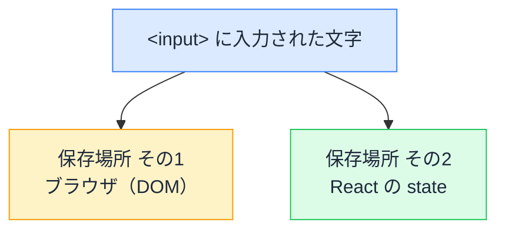
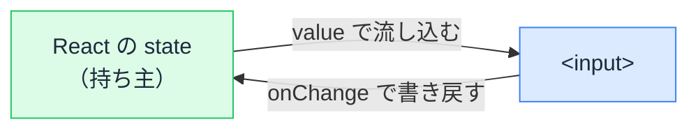
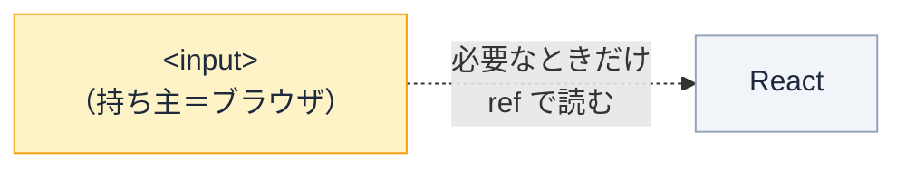

# フォームの値は誰が持つ — 制御と非制御コンポーネント

## 今日のゴール

- フォームの入力値の「置き場所」が、React の state か、ブラウザ（DOM）かの 2 通りあることを知る
- それぞれの仕組み（制御 = `value` + `onChange` / 非制御 = `defaultValue` + `ref`）を知る
- どちらをいつ選ぶか、判断の軸を持つ

## 素の HTML との違い

素の HTML なら、`<input>` を置くだけで文字が打てます。

```html
<input type="text" />
```

値はブラウザが勝手に覚えてくれます。JavaScript を 1 行も書かなくても、入力できて、フォーム送信時にはその値が送られます。

ところが React で入力欄を書くと、やり方が **2 通り** に分かれます。

- 値を**自分で state に持たせる**やり方
- 値を**ブラウザに任せる**やり方

同じ入力欄なのに、なぜ 2 通りあるのか。その分かれ目を仕組みから見ていきます。

## 入力値は必ずどこかに保存されている

まず大前提です。入力された文字は、**必ずどこかに保存されています**。保存場所の候補は 2 つあります。



ここで大事なルールがあります。

> **値の「本当の置き場所」は 1 つに決める。2 か所に持つと食い違う。**

これを **single source of truth（信頼できる唯一の情報源）** と呼びます。同じ値を 2 か所で別々に持つと、どちらが正しいのか分からなくなる。だから「持ち主」を 1 つに決めます。

- 持ち主を **React の state** にする → **制御コンポーネント**
- 持ち主を **ブラウザ（DOM）** にする → **非制御コンポーネント**

この「持ち主は誰か」が、2 通りの分かれ目です。

## 制御コンポーネント — React の state が値を持つ

React の state を値の持ち主にするやり方です。2 つの線で state と input をつなぎます。



- `value={text}` … state の値を input に**流し込む**（state → input）
- `onChange` … 入力されるたびに state を**書き戻す**（input → state）

この往復があるので、画面に映る値は常に state と一致します。state が唯一の持ち主です。

```tsx
import { useState } from "react";

export default function NameField() {
  const [text, setText] = useState("");

  return (
    <div>
      <input
        type="text"
        value={text}                       // state → input
        onChange={(e) => setText(e.target.value)} // input → state
      />
      <p>入力中の文字数: {text.length}</p>
    </div>
  );
}
```

### 触って確かめる

上の入力欄は、打つたびに state が更新され、その state から文字数を表示しています。実際の動きを下で再現しました。打ってみてください。

<div class="c12-demo" id="c12-ctrl-demo">
  <label class="c12-label" for="c12-ctrl-input">制御された入力欄</label>
  <input class="c12-input" id="c12-ctrl-input" type="text" placeholder="ここに入力" oninput="
    var v = this.value;
    document.getElementById('c12-ctrl-state').textContent = v === '' ? '(空)' : v;
    document.getElementById('c12-ctrl-count').textContent = v.length;
  " />
  <div class="c12-readout">
    <div>state の中身: <span class="c12-badge" id="c12-ctrl-state">(空)</span></div>
    <div>文字数: <span class="c12-badge" id="c12-ctrl-count">0</span></div>
  </div>
  <p class="c12-note">入力するたびに state が書き換わり、その state から文字数が計算されています。</p>
</div>

入力中の値が state にあるので、文字数カウントのように「**入力値に応じて画面を変える**」ことが自由にできます。

### `onChange` が無いと入力が固まる

ここが制御コンポーネントの仕組みを一番よく表します。`value` だけ書いて `onChange` を書かないと、**入力しても文字が変わりません**。

```tsx
// onChange が無い → 打っても変わらない
<input value={text} />
```

理由は単純です。React は描画のたびに `value` を state の値に**強制し直します**。`onChange` で state を更新していないので、state はずっと空のまま。だから打っても、次の瞬間 state の値（空）に戻されます。

下で再現しました。打ってみても、何も起きません。

<div class="c12-demo" id="c12-frozen-demo">
  <label class="c12-label" for="c12-frozen-input">value だけ・onChange なし</label>
  <input class="c12-input" id="c12-frozen-input" type="text" value="編集できない" oninput="this.value='編集できない';" />
  <p class="c12-note">value が固定され、onChange で state を更新していないので、打っても元に戻ります。React の「value 強制」を再現したものです。</p>
</div>

React はこのとき開発者に警告も出します。「`value` を渡したのに `onChange` がありません」と。**`value` と `onChange` がセットで要る**のは、この往復が制御コンポーネントの本体だからです。

## 非制御コンポーネント — ブラウザ（DOM）が値を持つ

逆に、値の持ち主をブラウザに任せるやり方です。React は入力中の値を**追いかけません**。必要になったとき（多くは送信時）に、`ref` 経由で読みに行きます。



- `defaultValue` … 初期値だけ渡す（その後はブラウザに任せる）
- `ref` … 読みたいときに input の現在値を取り出す

```tsx
import { useRef } from "react";

export default function NameForm() {
  const inputRef = useRef<HTMLInputElement>(null);

  function handleSubmit() {
    // 送信時にまとめて読む
    alert(inputRef.current?.value);
  }

  return (
    <div>
      <input type="text" defaultValue="" ref={inputRef} />
      <button onClick={handleSubmit}>送信</button>
    </div>
  );
}
```

### 触って確かめる

入力中、React はこの値を知りません。「読む」を押した瞬間に、初めてブラウザから値を取り出します。

<div class="c12-demo" id="c12-unctrl-demo">
  <label class="c12-label" for="c12-unctrl-input">非制御の入力欄</label>
  <input class="c12-input" id="c12-unctrl-input" type="text" placeholder="自由に入力" />
  <div class="c12-readout">
    <button type="button" class="c12-btn" onclick="
      var v = document.getElementById('c12-unctrl-input').value;
      document.getElementById('c12-unctrl-read').textContent = v === '' ? '(空)' : v;
    ">読む（送信のイメージ）</button>
    <div>読み取った値: <span class="c12-badge" id="c12-unctrl-read">(まだ読んでいない)</span></div>
  </div>
  <p class="c12-note">入力中は React に値が伝わりません。ボタンを押した瞬間だけ、ブラウザから値を取り出します。</p>
</div>

入力中に再レンダリングが起きないぶん軽く、書き方も素の HTML に近いのが特徴です。

## どちらを選ぶか — 良し悪しではなく使い分け

どちらが正解ということはありません。**入力中の値が要るかどうか**で選びます。

| | 制御コンポーネント | 非制御コンポーネント |
|---|---|---|
| 値の持ち主 | React の state | ブラウザ（DOM） |
| 書き方 | `value` + `onChange` | `defaultValue` + `ref` |
| 入力中の値を React で使えるか | そのまま使える | state に無いので直接は使えない |
| 再レンダリング | 1 文字ごとに起きる | 起きない |
| 向く場面 | 入力値で画面を変える<br>（文字数表示・自動整形・他欄と連動） | シンプルなフォーム・入力中に画面を変えない |

判断はこの一言に集約できます。

> **入力中の値で React の画面を変えたいか？**

- 検索ボックスで打つたびに候補を出す → 入力値で画面が変わる → **制御**
- 名前と住所を入力して送るだけ → 画面を変える必要がない → **非制御**でも足りる

## 実務ではフォームライブラリを使うことが多い

ここまでは仕組みを理解するための「素の React」の話です。実際の現場では、フォームを `useState` で 1 つずつ組むことはあまりなく、**フォームライブラリ**を使うのが一般的です。代表は **React Hook Form** です（ほかに TanStack Form など）。

なぜライブラリを使うのか。フォームには、値の管理以外にもやることが多いからです。

- 入力チェック（必須・形式・文字数）
- エラーメッセージの表示
- 送信中の状態管理
- 多数の入力欄をまとめて扱う

React Hook Form は、これらをまとめて引き受けてくれます。そして内部の作りは、ここで学んだ知識でそのまま理解できます。

> React Hook Form は基本的に非制御（ref で値を集める）で動き、入力中の再レンダリングを抑えて軽くしています。そのうえで、検証やエラー表示といった「制御の便利さ」を別の仕組みで足しています。

つまり、**制御と非制御の使い分けを、ライブラリが内部で肩代わりしている**わけです。素の仕組みを知っていれば、ライブラリのドキュメントに出てくる `register`（非制御的に登録）や `control`（制御的に扱う）といった言葉が、何を指しているのか見当がつきます。

## まとめ

- 入力値の真実は 1 か所に決める（2 か所だと食い違う）
- 制御 = React の state が持つ（`value` + `onChange`）。入力値で画面を変えられる
- `value` だけで `onChange` が無いと入力が固まる
- 非制御 = ブラウザが持つ（`defaultValue` + `ref`）。軽い、送信時に読む
- どちらが正解でもなく「入力値で画面を変えるか」で使い分け
- 実務ではフォームライブラリ（React Hook Form 等）が使い分けを肩代わりする

<style>
.c12-demo {
  border: 1px solid #e2e8f0;
  border-radius: 10px;
  padding: 16px;
  margin: 1.2em 0;
  background: #f8fafc;
  color: #1e293b;
}
.c12-label {
  display: block;
  font-size: 13px;
  font-weight: 700;
  color: #475569;
  margin-bottom: 6px;
}
.c12-input {
  width: 100%;
  max-width: 360px;
  box-sizing: border-box;
  padding: 8px 12px;
  font-size: 15px;
  border: 1px solid #cbd5e1;
  border-radius: 6px;
  background: #ffffff;
  color: #1e293b;
}
.c12-input:focus {
  outline: 2px solid #3b82f6;
  outline-offset: 1px;
  border-color: #3b82f6;
}
.c12-readout {
  display: flex;
  flex-wrap: wrap;
  align-items: center;
  gap: 12px;
  margin-top: 12px;
  font-size: 14px;
  color: #1e293b;
}
.c12-badge {
  display: inline-block;
  padding: 2px 8px;
  border-radius: 4px;
  background: #dcfce7;
  color: #166534;
  font-family: monospace;
  font-weight: 600;
}
.c12-btn {
  padding: 6px 14px;
  font-size: 14px;
  border: none;
  border-radius: 6px;
  background: #3b82f6;
  color: #ffffff;
  cursor: pointer;
}
.c12-btn:hover { background: #2563eb; }
.c12-note {
  font-size: 13px;
  color: #64748b;
  margin: 10px 0 0;
}
</style>
