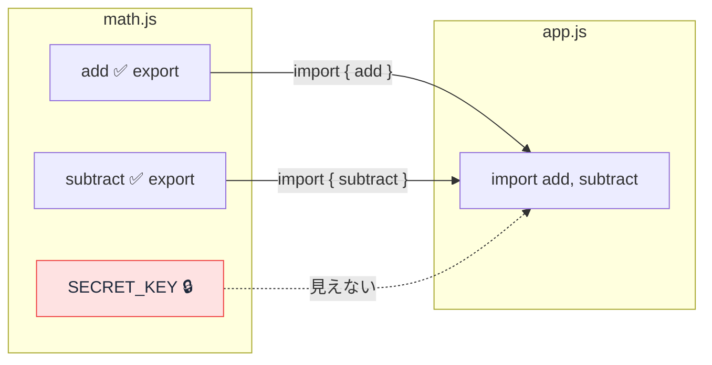
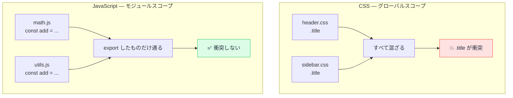

# モジュール — import で繋ぐ、CSS とは違うファイルの壁

## 今日のゴール

- Next.js のコードに並ぶ `import` が何をしているのかを知る
- JavaScript のファイルにはデフォルトで「壁」があり、`export` / `import` で穴を開けることを知る
- CSS のグローバルスコープと違い、JavaScript ではファイルを分けるだけでスコープが分かれることを知る
- default export と named export の違いを知る

## Next.js のファイルの先頭に並ぶ import

Next.js のプロジェクトを AI に作ってもらうと、ファイルの先頭にこんな行が並びます。

```javascript
import Link from "next/link";
import { useState } from "react";
import { Button } from "@/components/Button";
```

この `import` は何をしているのでしょうか。一言でいえば、**「別のファイルから機能を持ち込んでいる」** 宣言です。

逆に言えば、`import` しないと別のファイルの中身は一切見えません。JavaScript のファイルには **デフォルトで壁がある** のです。この仕組みを **モジュール**（ES Modules）と呼びます。

## 1 ファイルに全部書いたらどうなるか

なぜファイルを分けて `import` でつなぐのか。分けなかった場合を想像してみます。

### 変数名が衝突する

たとえばショッピングサイトを作っているとして、「税込み価格を計算する関数」と「送料を計算する関数」がどちらも `calculate` という名前だったらどうなるでしょう。

```javascript
// 税込み価格を計算する
function calculate(price) {
  return price * 1.1;
}

// ...数百行後...

// 送料を計算する（上の calculate を上書きしてしまう！）
function calculate(weight) {
  if (weight < 1) return 500;
  return 500 + (weight - 1) * 200;
}

// 税込み価格のつもりで呼んだのに、送料が返ってくる
console.log(calculate(1000)); // 500（期待は 1100）
```

1 ファイルに全部書くと、同じ名前の変数や関数があった場合に **後から書いたほうが勝ちます。** エラーにならず静かに上書きされるので、気づきにくいバグになります。

### ファイルが巨大になる

もう一つは単純な問題です。すべてを 1 ファイルに書くと数千行、数万行になり、目的のコードを探すだけで一苦労です。

この 2 つは、CSS のグローバルスコープ問題と構造が同じです。CSS はファイルを分けても全部のスタイルが 1 つに混ざってしまうため、クラス名の衝突が起きました。だから Tailwind CSS や CSS Modules のようなスコープの仕組みが必要でした。

JavaScript でも同じことが起きうるのでしょうか？ 実は、**JavaScript にはモジュールという仕組みがあるおかげで、ファイルを分けるだけでスコープが分かれます。** CSS のような追加の仕組みは不要です。

## export と import — ファイルに壁を作り、穴を開ける

モジュールの仕組みはシンプルです。

- 各ファイルは **独立したスコープ**（壁）を持つ
- `export` で **「このファイルから持ち出せるもの」** を指定する（壁に穴を開ける）
- `import` で **「別のファイルから持ち込むもの」** を指定する（穴を通して受け取る）
- `export` していないものは、外から一切見えない



実際のコードで見てみます。

**math.js** — 関数を作って公開する側:

```javascript
// export を付けた関数だけが外から使える
export const add = (a, b) => a + b;
export const subtract = (a, b) => a - b;

// export を付けていないので、このファイルの中だけで使える
const SECRET_KEY = "abc123";
```

**app.js** — 使う側:

```javascript
import { add, subtract } from "./math.js";

console.log(add(3, 5));       // 8
console.log(subtract(10, 4)); // 6

// SECRET_KEY は export されていないのでアクセスできない
// console.log(SECRET_KEY); // ❌ エラー
```

ポイントは `SECRET_KEY` です。同じ `math.js` の中に書かれていますが、`export` を付けていないので外からは見えません。**ファイルの壁がデフォルトで存在し、`export` した部分だけが穴になる。** これがモジュールスコープです。

## CSS との対比 — なぜ JavaScript にはスコープ問題が起きないのか

ここで CSS と JavaScript のスコープの違いを整理します。

| | CSS | JavaScript（モジュール） |
|---|---|---|
| ファイルを分けたとき | 全部混ざる（グローバルスコープ） | ファイルごとに壁がある（モジュールスコープ） |
| 名前の衝突 | 起きる（同じクラス名が上書きされる） | 起きない（export しなければ外から見えない） |
| スコープの追加対策 | Tailwind CSS / CSS Modules が必要 | 不要（最初から分かれている） |

CSS は「全部見える」がデフォルトで、スコープを **後から付ける** 必要がありました。JavaScript のモジュールは「何も見えない」がデフォルトで、必要なものだけ **明示的に公開する** 仕組みです。



同じ `add` という名前の関数が `math.js` と `utils.js` の両方にあっても、それぞれのファイルの中に閉じているので衝突しません。使う側が `import` で明示的に選ぶからです。

## default export と named export

`export` には 2 種類あります。

### named export（名前付きエクスポート）

1 つのファイルから **複数の値** を公開できます。`import` するときは `{ }` で名前を指定します。

```javascript
// utils.js
export const formatDate = (date) => date.toLocaleDateString("ja-JP");
export const formatPrice = (price) => `¥${price.toLocaleString()}`;
```

```javascript
// app.js — 名前を { } で指定して取り込む
import { formatDate, formatPrice } from "./utils.js";

console.log(formatDate(new Date()));  // "2026/4/25"
console.log(formatPrice(1980));       // "¥1,980"
```

### default export（デフォルトエクスポート）

1 つのファイルに **1 つだけ** 設定できる「主役」のエクスポートです。`import` するときは `{ }` が不要で、好きな名前を付けられます。

```javascript
// Button.js
export default function Button({ label }) {
  return <button>{label}</button>;
}
```

```javascript
// app.js — { } なしで、好きな名前で取り込める
import Button from "./Button";
import MyButton from "./Button"; // 別の名前でも OK
```

### 両方を使うファイル

1 つのファイルで default export と named export を混ぜることもできます。

```javascript
// api.js
const api = {
  get: (url) => fetch(url).then((res) => res.json()),
  post: (url, data) => fetch(url, { method: "POST", body: JSON.stringify(data) }),
};

export default api;
export const BASE_URL = "https://api.example.com";
```

```javascript
// app.js
import api, { BASE_URL } from "./api.js";

const users = await api.get(`${BASE_URL}/users`);
```

### Next.js / React での使い分け

| 種類 | 書き方 | よくある使い方 |
|------|--------|---------------|
| default export | `export default function Page()` | React コンポーネント（1 ファイルに 1 コンポーネント） |
| named export | `export const formatDate = ...` | ユーティリティ関数、定数、型定義 |

Next.js の `page.tsx` や `layout.tsx` は **default export が必須** です。Next.js がファイル名からルートを自動生成するとき、各ファイルの default export をそのページのコンポーネントとして使うためです。

## まとめ

- JavaScript のファイルには **デフォルトで壁がある**（モジュールスコープ）
- `export` で壁に穴を開け、`import` で別ファイルから受け取る
- `export` していないものは外から一切見えない
- CSS はファイルを分けても全部混ざる（グローバルスコープ）が、JavaScript はファイルを分けるだけでスコープが分かれる。だから CSS のような追加のスコープ対策が不要
- **named export** は `{ }` で名前を指定、複数 OK。**default export** は `{ }` 不要、1 ファイルに 1 つだけ
- Next.js では `page.tsx` や `layout.tsx` が default export を必須としている
