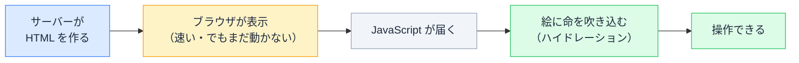

# ハイドレーション

## 今日のゴール

- 「速く表示する」と「ちゃんと動く」が、本来は両立しにくいことを知る
- その両立を支えている「ハイドレーション」という工程を知る
- ハイドレーションのズレ（あの赤いエラー）がなぜ起きるか、どう向き合うかを知る

## 「速く出る」のに「動く」、当たり前の不思議

あなたが AI と作った Next.js のページ。開いた瞬間に表示されて、しかもボタンもちゃんと動きます。当たり前に感じますが、この「速い表示」と「動き」の両立は、実は簡単ではありません。

そもそも、ページの「見た目」と「動き」は、別のものが担当しています。

- **HTML** が決めるのは「何があるか」。ボタンや文章がそこに**ある**こと
- **JavaScript** が決めるのは「**押したら何が起きるか**」。押すと数が増える、メニューが開く、といった反応

React のコードに頻繁に出てくる `onClick={...}` のような記述が、まさにこの「押したら何が起きるか」を書いた部分です。逆に言うと、HTML だけではボタンを**置く**ことはできても、押したときの反応は決まっていません。

これを踏まえると、ページの作り方には両極端な 2 つのやり方があります。

**素の HTML だけのページ**

- 文章もボタンも、受け取ってすぐ表示できる。**速い**
- でも、ボタンを押しても数が増えたりメニューが開いたりしない（「押したら何が起きるか」が無いから）

**全部 JavaScript で描くページ**

- ボタンもメニューも**動く**
- でも、JavaScript を全部ダウンロードして実行し終わるまで画面は真っ白。開いた直後にスピナーがくるくる回って中身が出てこない、あの画面です。**遅い**

| ページの作り方 | 表示 | 動き |
|---|---|---|
| 素の HTML だけ | 速い | ✗ |
| 全部 JavaScript | 遅い（真っ白） | ○ |
| **Next.js などで作ったページ** | **速い** | **○** |

どちらも一長一短です。なのに、あなたの Next.js のページは両方を満たしている。この両取りを実現しているのが **ハイドレーション**（hydration）です。

## 表示と動きを 2 段階に分ける

種明かしはシンプルです。表示と動きを、2 段階に分けています。



1. **サーバー**（あなたのブラウザとは別の場所にあるコンピュータ）が、本来ブラウザで動くはずのコードを先回りで実行して HTML を作り、届ける。ブラウザはそれをすぐ表示する（**速い**。でも、まだ動かない絵）
2. あとから JavaScript が届いて、その絵を**動くようにする**

この 2 つ目の工程が **ハイドレーション**です。先に見た目だけ届けて待たせず、あとから動きを足すことで、速さと操作性を両立しています。

## ハイドレーション

イメージは「**絵に命を吹き込む**」です。

- サーバーから届く HTML は「**絵**」です。すぐ表示できるけれど、ボタンは押せません
- そこへ JavaScript が届くと、ブラウザがその絵を動くようにします

すでに絵（HTML）は表示されているのに、ブラウザがあらためて何かをする必要があるのは、絵には「ここにボタンがある」とは描いてあっても、「**押したら何が起きるか**」までは載っていないからです。それだけでは動かしようがない。

そこでブラウザは、こう動きます。

1. 1 段階目でサーバーが実行したのと**同じコードをもう一度実行**し、「本来こうなるはず」という設計図（動きまで含めた、あるべき形）を組み立てる
2. その設計図を、すでに表示されている絵（HTML）と突き合わせる
3. ぴったり重なれば、絵に動き（クリックの反応など）を結びつける

ゼロから描き直さないのは、せっかく速く表示できている絵を**活かす**ためです。

ちなみに、ハイドレーション（hydration）は英語で「水分を与える」という意味です。乾いた絵に水を吸わせて生き返らせる。だから「命を吹き込む」と言えます。

### 触って確かめる

下のミニ画面は、最初は「絵」の状態です。カウントボタンを押しても数は増えません。「JavaScript を届ける」を押すと、ハイドレーションが起きてボタンに命が吹き込まれます。

<div class="c13-demo" id="c13-demo">
  <div class="c13-screen">
    <div class="c13-status" id="c13-status" aria-live="polite">状態: 絵（HTML）だけ</div>
    <p class="c13-count">カウント: <span id="c13-count">0</span></p>
    <button type="button" class="c13-counter" id="c13-counter" onclick="
      if (document.getElementById('c13-hydrate').disabled) {
        var el = document.getElementById('c13-count');
        el.textContent = String(Number(el.textContent) + 1);
      }
    ">＋1する</button>
  </div>
  <button type="button" class="c13-hydrate" id="c13-hydrate" onclick="
    document.getElementById('c13-status').textContent = '状態: 命が吹き込まれた（押せます）';
    this.disabled = true;
    this.textContent = 'ハイドレーション完了';
  ">JavaScript を届ける（ハイドレーション）</button>
  <p class="c13-note">この「JavaScript が届くまでの一瞬」が、実際のページでボタンが効かない時間にあたります。</p>
</div>

## ズレると作り直しになる

設計図と HTML を突き合わせる、と言いました。ここに大事な約束があります。

> **サーバーが作った HTML と、ブラウザが組み立てた設計図が、ぴったり一致していないといけない。**

ズレると、ブラウザはズレた箇所を含むかたまり（部品のまとまり）を捨てて、一から作り直します。ズレ方によっては、ページの広い範囲が作り直しになります。最終的には正しく動くことが多いものの、せっかく速く表示した画面が一瞬崩れたり、開発中はこんな赤いエラーが出たりします（実際は英語です）。

```
Hydration failed because the server rendered HTML
didn't match the client.
```

ズレる原因は、**サーバーとブラウザで結果が変わるもの**を使ったときです。

| 使うと危ないもの | なぜズレるか |
|---|---|
| `new Date()` / `Date.now()` | サーバー側で作った時刻と、ブラウザで動く時刻が違う |
| `Math.random()` | サーバーとブラウザで別々の乱数になる |
| `window` / `localStorage` | サーバーには存在しない（ブラウザにしかない） |

例えば「現在時刻」をそのまま表示すると、サーバー側で HTML を作ったときの時刻と、ブラウザがハイドレーションするときの時刻がズレて、不一致になります。

### どう向き合うか

避け方の方向性を知っておくと、AI への指示や原因の切り分けに役立ちます。

- こうした値は、**表示されたあとブラウザ側で出す**のが定石（最初の HTML には含めない）
- 「見えているのにエラーが出る」と気づけたら、AI に「これはハイドレーションのズレだから直して」と的確に頼める

原因を言葉にできれば、AI への指示も的確になります。

## まとめ

- 「速い表示」と「動く」は本来トレードオフ。その両取りの工夫がハイドレーション
- 1 段階目でサーバーが HTML（絵）を届け、2 段階目でブラウザが設計図を突き合わせて動きを吹き込む
- サーバーの HTML と設計図がズレると、作り直しになる
- 時刻・乱数・`window` など、環境で変わるものがズレの原因

<style>
.c13-demo {
  border: 1px solid #e2e8f0;
  border-radius: 10px;
  padding: 16px;
  margin: 1.2em 0;
  background: #f8fafc;
  color: #1e293b;
}
.c13-screen {
  border: 1px dashed #cbd5e1;
  border-radius: 8px;
  padding: 16px;
  background: #ffffff;
  color: #1e293b;
  margin-bottom: 12px;
}
.c13-status {
  font-size: 13px;
  font-weight: 700;
  color: #475569;
  margin-bottom: 8px;
}
.c13-count {
  font-size: 15px;
  color: #1e293b;
  margin: 8px 0;
}
.c13-counter {
  padding: 8px 16px;
  font-size: 15px;
  border: 1px solid #cbd5e1;
  border-radius: 6px;
  background: #f1f5f9;
  color: #1e293b;
  cursor: pointer;
}
.c13-hydrate {
  padding: 8px 16px;
  font-size: 14px;
  border: none;
  border-radius: 6px;
  background: #3b82f6;
  color: #ffffff;
  cursor: pointer;
}
.c13-hydrate:hover { background: #2563eb; }
.c13-hydrate:disabled {
  background: #22c55e;
  cursor: default;
}
.c13-note {
  font-size: 13px;
  color: #475569;
  margin: 12px 0 0;
}
</style>
