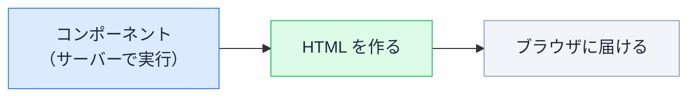
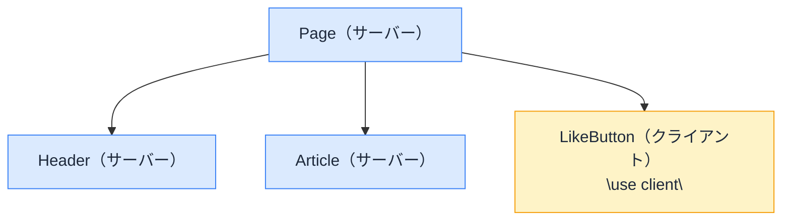

# 「use client」の正体

## 今日のゴール

- App Router のコンポーネントは、既定ではサーバーで動くことを知る
- state やクリックなどの「動き」を使うとき `"use client"` が要る理由を知る
- なぜサーバーとクライアントに分けるのか、その狙いを知る

## 見たことのある一行

AI が書いた Next.js のコードを見ると、ファイル（画面の部品＝コンポーネントを書いたファイル）の先頭に `"use client"` という一行が付いているものと、付いていないものがあります。

あるいは、こんなエラーに出くわしたことがあるかもしれません（実際は英語で出ます）。

```
useState は Client Component でしか使えません。
ファイル（またはその親）の先頭に "use client" を付けてください。
```

言われるがまま `"use client"` を付けたら動いた。でも、この一行が何なのかは分からないまま。今日はその正体を見ます。

## 既定はサーバーで動く

App Router では、コンポーネントは何も付けなければ **サーバーコンポーネント** です。名前のとおり、サーバーで動きます。



- 1 回のリクエストにつきサーバーで実行され、**HTML を作る**のが役目
- サーバー側で動くので、データベースや外部 API からデータを取ってきて、その結果を埋め込んだ HTML を作れる
- データベースや API キーに直接触れても、その中身はブラウザに漏れない
- 作った HTML をブラウザに届けたら、その役目は終わり

つまりサーバーコンポーネントは「**表示を組み立てる係**」です。データを集めて並べる、という仕事が得意です。

## 動きが要るならクライアント

一方で、サーバーには苦手なことがあります。**ユーザーの操作にその場で反応する**ことです。

- `useState`（入力やカウントなどの値を覚えておく）
- `onClick`（クリックに反応する）
- `window` / `localStorage`（ブラウザの機能を使う）

これらは「画面が表示されたあと、ユーザーの操作に合わせて値を変えたり反応したりする」もの。つまり、ブラウザの中で動き続ける必要があります。

ところがサーバーコンポーネントは、HTML を作ったら役目が終わります。ずっと居座ってクリックを待つことはできません。

そこで、操作に反応する部分は **ブラウザの中でも動かす**必要があります。それを宣言するのが `"use client"` です。ファイルの先頭に置くと、そのコンポーネントは **クライアントコンポーネント**（ブラウザでも動くコンポーネント）になります。

```tsx
"use client"; // ← これがないと、下の useState でエラーになる

import { useState } from "react";

export default function Counter() {
  const [count, setCount] = useState(0);
  return <button onClick={() => setCount(count + 1)}>{count}</button>;
}
```

冒頭のエラーは、これを言っていたわけです。「`useState` を使うなら、このコンポーネントはクライアントだと宣言してね」と。

### 「クライアント」は「ブラウザだけ」ではない

 ひとつ誤解しやすい点があります。`"use client"` は「**ブラウザだけ**で動く」という意味ではありません。

- クライアントコンポーネントも、**初回の HTML はサーバーで作られます**
- そのあと、ブラウザに届いてから「**動くようになる**」のです（表示済みの HTML をブラウザ側で操作できるようにするこの仕上げを、ハイドレーションと呼びます）

だから正確には「ブラウザ**でも**動く」。最初の表示はサーバーが用意し、操作できる状態にする仕上げをブラウザが担う。いわば二人三脚です。

### サーバーとクライアントの違い

| | サーバーコンポーネント | クライアントコンポーネント |
|---|---|---|
| `"use client"` | 不要（既定） | 必要 |
| `useState` / `onClick` | 使えない | 使える |
| DB・ファイル・API キー | 直接触れる | 触れない（中身がブラウザに送られるため） |
| 主な役目 | 表示を組み立てる | 操作に反応する |

### どちらになるか、見分けてみる

次のコンポーネント、`"use client"` が要るのはどれでしょうか。まず自分で考えてから開いてください。

<div class="c13-quiz" id="c13-quiz">
  <div class="c13-case">
    <p class="c13-q">1. 記事のタイトルと本文を表示するだけ</p>
    <button type="button" class="c13-qbtn" onclick="document.getElementById('c13-a1').hidden=false">答えを見る</button>
    <p class="c13-answer" id="c13-a1" hidden>サーバーで OK（不要）。操作に反応しないので、HTML を作るだけで足ります。</p>
  </div>
  <div class="c13-case">
    <p class="c13-q">2. ボタンを押すとカウントが増える</p>
    <button type="button" class="c13-qbtn" onclick="document.getElementById('c13-a2').hidden=false">答えを見る</button>
    <p class="c13-answer" id="c13-a2" hidden>クライアント（必要）。`useState` と `onClick` を使うので `"use client"` が要ります。</p>
  </div>
  <div class="c13-case">
    <p class="c13-q">3. データベースから記事一覧を取ってきて並べる</p>
    <button type="button" class="c13-qbtn" onclick="document.getElementById('c13-a3').hidden=false">答えを見る</button>
    <p class="c13-answer" id="c13-a3" hidden>サーバーで OK（不要）。むしろサーバーの得意分野。DB に直接触れて、結果の HTML だけ届けられます。</p>
  </div>
</div>

## なぜ分けるのか

そもそも、なぜこんな区別があるのでしょうか。両極端を考えると分かります。

**もし全部クライアントにしたら**

- 動かない表示部分まで含めて、コンポーネントの JavaScript を**全部ブラウザに送る**ことになる
- ダウンロードも実行も増えて、重く、遅くなる

**もし全部サーバーだけなら**

- 表示は速いが、クリックも入力も**動かない**

だから、両取りします。

> **動かない部分はサーバーで済ませて HTML だけ送り（軽い・速い）、動きが要る部分だけ `"use client"` でクライアントにする。**

`"use client"` は「**ここから先はブラウザでも動かす**」という境界線です。



ここで大事なコツがあります。`"use client"` を付けると、**そのコンポーネントが読み込む子も、まとめてクライアント側になります**。だから境界は、動きが本当に要る末端（上の例なら「いいねボタン」だけ）に寄せるのがよい。大きく囲うほど、ブラウザに送る JavaScript が増えて重くなります。

## まとめ

- App Router の既定はサーバーコンポーネント（表示を組み立てる係）
- state・クリック・ブラウザ機能を使うなら `"use client"`（クライアントコンポーネント）
- `"use client"` は「ブラウザだけ」ではなく「ブラウザでも動く」
- 分ける狙いは、軽さ（サーバー）と動き（クライアント）の両取り
- 境界は動きが要る末端に寄せると軽い

<style>
.c13-quiz {
  border: 1px solid #e2e8f0;
  border-radius: 10px;
  padding: 8px 16px;
  margin: 1.2em 0;
  background: #f8fafc;
  color: #1e293b;
}
.c13-case {
  padding: 12px 0;
  border-bottom: 1px solid #e2e8f0;
}
.c13-case:last-child { border-bottom: none; }
.c13-q {
  font-weight: 700;
  color: #1e293b;
  margin: 0 0 8px;
}
.c13-qbtn {
  padding: 6px 14px;
  font-size: 14px;
  border: none;
  border-radius: 6px;
  background: #3b82f6;
  color: #ffffff;
  cursor: pointer;
}
.c13-qbtn:hover { background: #2563eb; }
.c13-answer {
  margin: 10px 0 0;
  padding: 10px 12px;
  border-radius: 6px;
  background: #ffffff;
  color: #1e293b;
  border: 1px solid #cbd5e1;
  font-size: 14px;
}
</style>
