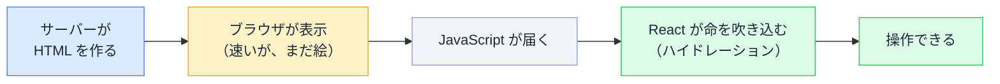

# ハイドレーション

## 今日のゴール

- ページが表示されてから操作できるようになるまでに、2 つの段階があることを知る
- なぜわざわざ 2 段階に分けるのか、その狙いを知る
- 「Hydration failed」のエラーがなぜ起きるのか、どう向き合うかを知る

## 表示されているのにボタンが効かない一瞬

開発中に、こんな赤いエラーを見たことがあるかもしれません。

```
Hydration failed because the server rendered HTML
didn't match the client. As a result this tree will
be regenerated on the client.
```

あるいは、ページを開いた瞬間、見た目はもう完成しているのに、ボタンを押しても一瞬だけ反応しないことがあります。少し待つと、急に押せるようになる。

この「Hydration というエラー」と「見えてるのに動かない一瞬」は、どちらも同じ仕組みから来ています。その仕組みが **ハイドレーション（hydration）** です。

## なぜ 2 段階に分けるのか

ハイドレーションを理解する前に、「なぜこんな面倒なことをするのか」から見ます。Web ページの届け方には、もともと両極端な 2 つのやり方がありました。

**やり方 A: 全部ブラウザの JavaScript で描く**

- 最初に届くのはほぼ空の HTML。画面は真っ白
- JavaScript を全部ダウンロードして実行し終えるまで、何も見えない
- 表示が遅く、検索エンジンも中身を読み取りにくい

**やり方 B: HTML だけ届ける**

- 表示は速い。サーバー（HTML を先に組み立てておく場所）が作った HTML がそのまま出る
- でもボタンも入力欄も動かない。ただの静止画のようなページ

どちらも一長一短です。そこで、**両方のいいとこ取り**をします。

| | 表示の速さ | 操作できるか |
|---|---|---|
| A: JS で描く | 遅い（真っ白から始まる） | できる |
| B: HTML だけ | 速い | できない |
| **両取り** | **速い** | **できる** |

1. まずサーバーが作った HTML を届けて、**すぐ表示する**（待たせない）
2. あとから JavaScript で**動くようにする**

この 2 段階のうち、2 つ目（届いた HTML に JavaScript を結びつけて動かす工程）が **ハイドレーション**です。「速く表示する」と「ちゃんと動く」を両立させるための工夫です。

## ハイドレーションの仕組み

イメージは「**絵に命を吹き込む**」です。



図の A・B が 1 段階目（表示）、C・D が 2 段階目（ハイドレーション）にあたります。

- サーバーが送ってくる HTML は「**絵（写真）**」です。速く表示できるけれど、ボタンは押せません
- あとから JavaScript が届くと、**React**（Next.js が内部で使っている UI ライブラリ）がその絵を見て、「ここがボタン」「ここで数を覚えている」と対応づけていきます
- この対応づけが終わると、絵に命が吹き込まれ、やっと操作できるようになります

ちなみに、ハイドレーション（hydration）は英語で「水分を与える」という意味です。乾いたものに水を吸わせて生き返らせる、というイメージの言葉です。

### 触って確かめる

下のミニ画面は、最初は「絵」の状態です。カウントボタンを押しても数は増えません。「JavaScript を届ける」を押すと、ハイドレーションが起きてボタンに命が吹き込まれます。

<div class="c13-demo" id="c13-demo">
  <div class="c13-screen">
    <div class="c13-status" id="c13-status" aria-live="polite">状態: 絵（HTML）だけ</div>
    <p class="c13-count">カウント: <span id="c13-count">0</span></p>
    <button type="button" class="c13-counter" id="c13-counter" onclick="
      if (window.c13Alive) {
        var el = document.getElementById('c13-count');
        el.textContent = String(Number(el.textContent) + 1);
      }
    ">＋1する</button>
  </div>
  <button type="button" class="c13-hydrate" id="c13-hydrate" onclick="
    window.c13Alive = true;
    document.getElementById('c13-status').textContent = '状態: 命が吹き込まれた（押せます）';
    this.disabled = true;
    this.textContent = 'ハイドレーション完了';
  ">JavaScript を届ける（ハイドレーション）</button>
  <p class="c13-note">ハイドレーション前は、＋1 を押しても数が増えません。JavaScript が届いて初めて反応します。この「届くまでの一瞬」が、実際のページでボタンが効かない時間にあたります。</p>
</div>

実際の Next.js などでは、この対応づけ（ハイドレーション）はフレームワークが自動でやってくれます。自分で書くことはほとんどありません。

## 一致していないと作り直しになる

命を吹き込むには、React は「どのボタンに、どの動きを結びつけるか」を知る必要があります。ところが、届いた HTML（絵）を見ただけでは、それは分かりません。絵には「ここがボタン」とは描いてあっても、「押したら何が起きるか」までは載っていないからです。

そもそもサーバーは、コンポーネントのコードを実行して、あの HTML（絵）を作りました。そこで React は、クライアント（＝ブラウザ）でも**同じコード**を実行し、「**本来こうなるはず**」という設計図を組み立てます。その設計図と、届いた HTML を突き合わせて、ぴったり重なれば、絵に動きを結びつけていきます。

設計図どおりにゼロから描き直すこともできますが、それでは表示が遅くなります。だから、すでに速く表示できている HTML を活かし、それに動きだけを結びつけるのです。

ここで大事な約束があります。

> **サーバーが作った HTML と、クライアントでの React の設計図が、ピッタリ一致していないといけない。**

ズレると、React はズレたその部分を捨てて、クライアントで作り直します。多くの場合、最終的には正しく動きます。

ただし代償があります。せっかく速く表示した画面が一瞬崩れたり、開発中はあの赤いエラーが出たりします。「速く表示する」という 2 段階方式の利点が、その分だけ失われるのです。

ズレる原因は、**サーバーとクライアントで結果が変わるもの**を使ったときです。

| 使うと危ないもの | なぜズレるか |
|---|---|
| `new Date()` / `Date.now()` | サーバー側で作られた時刻と、ブラウザで動く時刻が違う |
| `Math.random()` | サーバーとクライアントで別々の乱数になる |
| `window` / `localStorage` | サーバーには存在しない（ブラウザにしかない） |

例えば「現在時刻」をそのまま表示すると、サーバー側で HTML を作ったときの時刻と、ブラウザがハイドレーションするときの時刻がズレて、不一致になります。

```tsx
// サーバーとクライアントで時刻がズレて、ハイドレーション不一致になる例
function Clock() {
  return <p>今は {new Date().toLocaleTimeString()} です</p>;
}
```

### どう向き合うか

避け方の方向性も知っておくと、AI への指示や原因の切り分けに役立ちます。

- こうした値は、**ハイドレーション後（ブラウザ側）で表示する**のが定石。Next.js なら、画面の表示後に動く `useEffect` の中で扱う
- どうしてもズレてよい箇所には、`suppressHydrationWarning` という「ここは警告しなくていい」と伝える逃げ道もある（警告を消すだけで、ズレ自体がなくなるわけではない）

「見えてるのに一致しない」と気づけると、AI に「これはハイドレーションのズレだから直して」と的確に頼めます。原因を言葉にできることが、このレッスンの一番の収穫です。

## まとめ

- ハイドレーションは、表示済みの HTML に JavaScript で命を吹き込む工程
- 「速く表示する」と「ちゃんと動く」を両取りするための 2 段階
- 命が吹き込まれるまでの一瞬は、見えていても操作できない
- サーバーの HTML とクライアントの予想がズレると、作り直しになる
- 時刻・乱数・`window` など、環境で変わるものがズレの原因
- ズレる値はブラウザ側（`useEffect` の中など）で表示するのが定石

<style>
.c13-demo {
  border: 1px solid #e2e8f0;
  border-radius: 10px;
  padding: 16px;
  margin: 1.2em 0;
  background: #f8fafc;
  color: #1e293b;
}
.c13-screen {
  border: 1px dashed #cbd5e1;
  border-radius: 8px;
  padding: 16px;
  background: #ffffff;
  color: #1e293b;
  margin-bottom: 12px;
}
.c13-status {
  font-size: 13px;
  font-weight: 700;
  color: #475569;
  margin-bottom: 8px;
}
.c13-count {
  font-size: 15px;
  color: #1e293b;
  margin: 8px 0;
}
.c13-counter {
  padding: 8px 16px;
  font-size: 15px;
  border: 1px solid #cbd5e1;
  border-radius: 6px;
  background: #f1f5f9;
  color: #1e293b;
  cursor: pointer;
}
.c13-hydrate {
  padding: 8px 16px;
  font-size: 14px;
  border: none;
  border-radius: 6px;
  background: #3b82f6;
  color: #ffffff;
  cursor: pointer;
}
.c13-hydrate:hover { background: #2563eb; }
.c13-hydrate:disabled {
  background: #22c55e;
  cursor: default;
}
.c13-note {
  font-size: 13px;
  color: #475569;
  margin: 12px 0 0;
}
</style>
