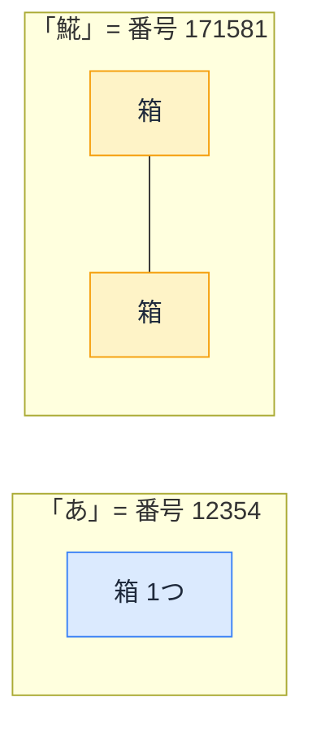

# 文字コードと文字数の罠 — `"𩸽".length` が 2 になる理由

## 今日のゴール

- JavaScript の `.length` が「見た目の文字数」と一致しない場合があることを知る
- どんな場面で問題になるか判断でき、AI に的確に指示できるようになる
- 普通の日本語や英数字では問題にならないことも知る（過剰に恐れない）

## AI が書いたコードに潜む落とし穴

AI に「入力を 10 文字以内に制限して」と頼んだとします。こんなコードが返ってくるかもしれません。

```typescript
if (text.length > 10) {
  alert("10文字以内で入力してください");
}
```

一見、正しそうです。でもこのコード、こういう入力で壊れます。

```typescript
"𩸽定食".length   // → 3 ...ではなく 4
"👨‍👩‍👧‍👦".length      // → 11
```

見た目は 3 文字の「𩸽（ほっけ）定食」が 4、見た目は 1 つの家族絵文字が 11。`.length` は、あなたが思う「文字数」を数えていません。

なぜこうなるのか。その答えは、コンピュータが文字をどう扱っているかにあります。

::: tip 普通の日本語や英数字なら問題ない
先に安心してほしいのですが、「あいうえお」や「Hello」のような普通のテキストでは `.length` はちゃんと見た目どおりの数を返します。ズレるのは一部の漢字や絵文字だけです。「`.length` が壊れている」わけではありません。
:::

## 文字の正体は「番号」

コンピュータは、文字を直接理解しません。内部では、すべての文字に**番号**を振って管理しています。

| 文字 | 番号 |
|---|---|
| A | 65 |
| a | 97 |
| あ | 12354 |
| 𩸽 | 171581 |
| 🍣 | 127843 |

この「どの文字にどの番号を振るか」を決めた世界共通の表が **Unicode（ユニコード）** です。日本語、中国語、アラビア文字、絵文字まで、約 16 万の文字に番号が割り当てられています。

## `.length` は「箱の数」を数えている

番号が決まったとして、その番号をコンピュータのメモリにどう保存するか。JavaScript は内部で **UTF-16** という方式を使っています。

UTF-16 の仕組みはシンプルです。

- 基本単位は「**箱**」（16 ビット。16 ビットで表せる最大値が 65535 なので、1 つの箱には **0〜65535** の番号が入る）
- 番号が 65535 以下の文字 → **箱 1 つ**で収まる
- 番号が 65535 を超える文字 → **箱 2 つ**で表す（この 2 つ組を**サロゲートペア**と呼ぶ）



そして `.length` は、**この箱の数**を返します。見た目の文字数ではありません。

| 文字 | 見た目 | 箱の数 | `.length` |
|---|---|---|---|
| `"abc"` | 3 文字 | 3 | 3 |
| `"あいう"` | 3 文字 | 3 | 3 |
| `"𩸽"` | 1 文字 | **2**（サロゲートペア） | **2** |
| `"𩸽定食"` | 3 文字 | 2 + 1 + 1 = **4** | **4** |

「あ」(番号 12354) は 65535 以下なので箱 1 つ。`.length` も 1。ズレません。「𩸽」(番号 171581) は 65535 を超えるので箱 2 つ。`.length` は 2。ここでズレます。

**普通の日本語（ひらがな・カタカナ・常用漢字）と英数字はすべて 65535 以下** なので、箱 1 つに収まります。`.length` で困ることはまずありません。ズレるのは、**絵文字**や「𩸽」のような一部の珍しい漢字です。

::: info 人名に注意
「𠮷」（つちよし。𠮷野家の𠮷）のように、人名・店名に使われる漢字にもサロゲートペアのものがあります。人名入力フォームは「普通の日本語だけ」と決めつけず注意してください。
:::

## 絵文字はさらにズレる

🍣 も 😀 も 👍 も、**多くの絵文字は番号が 65535 を超える**ため、単体でも箱 2 つ（サロゲートペア）です。SNS やチャットで絵文字が当たり前に使われる今、サロゲートペアは「珍しい特殊ケース」ではありません。

さらに、👨‍👩‍👧‍👦 のような複合絵文字は、**複数の絵文字を見えない接着文字（ZWJ）でくっつけた**ものです。

```
👨 + 接着 + 👩 + 接着 + 👧 + 接着 + 👦
```

各絵文字が箱 2 つ、接着文字が箱 1 つ。合計すると:

```typescript
"👨‍👩‍👧‍👦".length  // → 11  (2+1+2+1+2+1+2)
```

見た目は 1 つなのに `.length` は 11。肌の色を変えた絵文字やフラグ絵文字も同じ仕組みです。

## どんな場面で問題になるか

`.length` のズレが実際にバグになるのは、**ユーザーが絵文字を入力できるフィールド**で文字数に関わる処理をしているときです。

### 問題になる場面

- **文字数制限**（`maxlength` 属性や JavaScript のバリデーション）で、絵文字を入力すると見た目より多く消費してしまう（`maxlength` も `.length` と同じ UTF-16 単位で数えるので、両者は一貫している）
- **文字列の切り取り**（`slice` / `substring`）で、サロゲートペアの途中で切ると文字化けする

```typescript
const name = "𩸽定食";
name.slice(0, 1)  // → "�" (壊れた文字。サロゲートペアの片割れ)
name.slice(0, 2)  // → "𩸽" (こちらが正しい)
```

### 問題にならない場面

- ユーザー入力が**英数字・普通の日本語だけ**のフィールド（住所、社員番号、電話番号など）
- 文字数を数える必要がない処理

**絵文字が来うるかどうかがポイント**です。チャット、SNS 連携のプロフィール、コメント欄は注意。住所や社員番号の入力は気にしなくて OK です。

## 正しく数える方法

ズレを直す方法はいくつかあります。

### スプレッド構文（サロゲートペア対応）

```typescript
[..."𩸽定食"].length        // → 3 ✓
Array.from("𩸽定食").length  // → 3 ✓
```

Unicode の番号 1 つ = 1 文字として数えます。サロゲートペアのズレを解消できます。ただし、ZWJ 絵文字（👨‍👩‍👧‍👦 など）は複数に分かれます。

```typescript
[..."👨‍👩‍👧‍👦"].length  // → 7 （4つの絵文字 + 3つの接着文字）
```

### Intl.Segmenter（見た目どおりに数える）

見た目どおりに数えたいなら `Intl.Segmenter` を使います。人間が 1 文字と感じる単位で分割します。

```typescript
const segmenter = new Intl.Segmenter("ja", { granularity: "grapheme" });
const count = [...segmenter.segment("👨‍👩‍👧‍👦")].length;
// → 1 ✓
```

ZWJ 絵文字も正しく 1 として数えます。現在のモダンブラウザと Node.js で利用できます。

ただし、`Intl.Segmenter` が常にベストとは限りません。サーバーやデータベースが別の単位（UTF-16 の箱の数やバイト数）で制限をかけている場合、見た目の文字数でバリデーションするとむしろ不整合が起きます。フロント側とサーバー側で数え方を揃えるのが安全です。分からなければ「文字数制限の単位は何ですか？」とチームに確認してみてください。

| 方法 | `"𩸽"` | `"👨‍👩‍👧‍👦"` | 使いどころ |
|---|---|---|---|
| `.length` | 2 | 11 | 普通の日本語・英数字なら十分 |
| `[...str].length` | 1 | 7 | サロゲートペア対応が必要なとき |
| `Intl.Segmenter` | 1 | 1 | 絵文字を含む厳密な文字数制限 |

## AI のコードを受け取ったら

AI に文字数に関わるコードを頼んだとき、このチェックリストで判断できます。

**1. そのフィールドに絵文字が入力されうるか？**

- チャット、コメント欄、プロフィール → **絵文字が来る**
- 住所、電話番号、社員番号 → **来ない。`.length` で OK**

**2. 来うるなら、AI にこう伝える**

> 「文字数を見た目どおりに数えて。絵文字やサロゲートペアを考慮して」

この一言で、AI は `Intl.Segmenter` やスプレッド構文を使ったコードを返してくれます。

**3. AI のコードのここを見る**

- `.length` で直接バリデーション → 絵文字が来るフィールドなら要注意
- `.slice()` や `.substring()` で文字列を切っている → サロゲートペアの途中で切れる可能性
- `Intl.Segmenter` やスプレッド構文を使っている → 絵文字対応済み

「何がズレるか」「サロゲートペアという名前」を知っていれば、AI への指示が一言で的確になります。

## まとめ

- 文字の正体は番号。JavaScript は箱（UTF-16 の単位）で管理し、`.length` は箱の数を返す
- 普通の日本語・英数字は箱 1 つ。`.length` は見た目どおりで問題ない
- 絵文字や一部の漢字は箱 2 つ以上になり、`.length` がズレる
- 絵文字が来うるフィールドかどうかが判断基準
- AI に「絵文字やサロゲートペアを考慮して」と伝えれば正確なコードが返る
