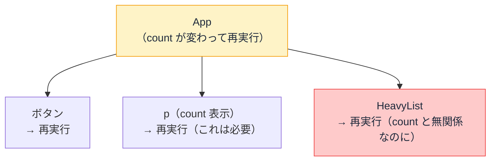
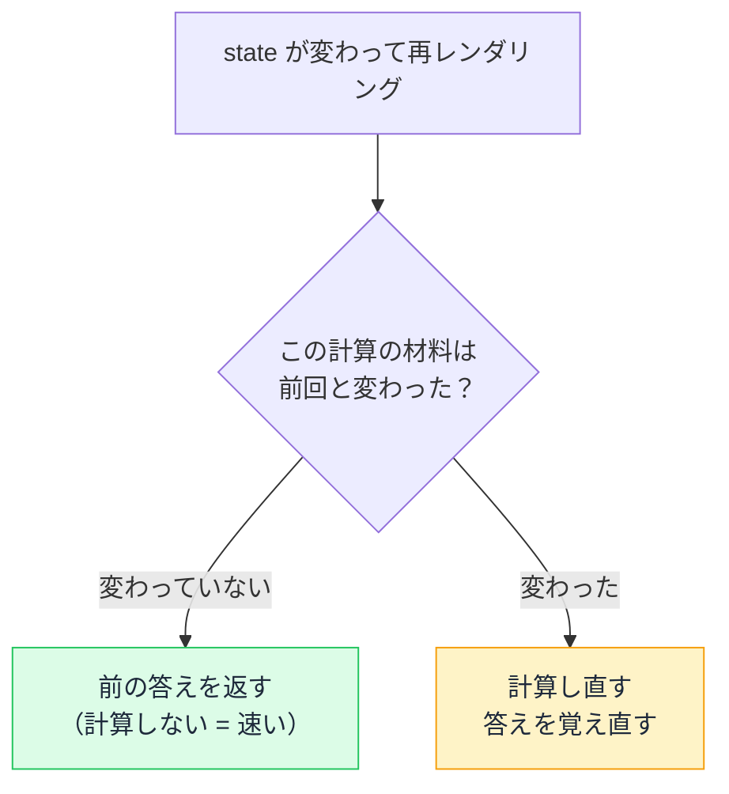

# 再レンダリングと手動メモ化 — useMemo / useCallback / React.memo

## 今日のゴール

- 再レンダリングの連鎖で不要な再計算が起きる仕組みを知る
- useMemo / useCallback / React.memo の役割の違いを知る
- useCallback は React.memo とセットで効くという関係を知る

## 入力するたびに、もたつく画面

商品の検索画面で、入力欄に文字を打つたびに一覧がカクついたり、もたついたりする。そんな画面を使ったことはないでしょうか。

「a」と 1 文字打っただけなのに、なぜ画面全体が作り直されてしまうのか。原因から順に見ていきます。

## 再レンダリングの連鎖

React のコンポーネントの実体は関数です。React は状態（state）が変わるとコンポーネント関数を再実行して、新しい画面を組み立てます。この再実行を**再レンダリング**と呼びます。

```tsx
import { useState } from "react";

function App() {
  const [count, setCount] = useState(0);

  return (
    <div>
      <button onClick={() => setCount(count + 1)}>+1</button>
      <p>{count}</p>
      {/* HeavyList は重い処理をする一覧コンポーネントとする */}
      <HeavyList />
    </div>
  );
}
```

`count` が変わると `App` が再レンダリングされます。問題は `<HeavyList />`。`count` とは無関係なのに、親である `App` が再レンダリングされるたびに一緒に再レンダリングされます。

**親が再レンダリングされると、子も全部再レンダリングされる**。これが**再レンダリングの連鎖**です。



なお、React には「画面の変わった部分だけを最小限更新する」仕組みがあるため、最終的な画面の書き換え自体は軽く済みます。それでも、コンポーネント関数の再実行と「どこが変わったか」の計算にはコストがかかります。コンポーネントが多く、中の処理が重いほど、この無駄は積み上がります。

## 無駄が起きる 2 つの場面

### 場面 1: 重い計算の繰り返し

```tsx
import { useState } from "react";

type Product = { id: number; name: string; price: number };

function ProductPage({ items }: { items: Product[] }) {
  const [query, setQuery] = useState("");

  // query が変わるだけで、items のソートも毎回やり直しになる
  const sorted = items.toSorted((a, b) => a.price - b.price);

  return (
    <>
      <input
        aria-label="商品名で絞り込み"
        value={query}
        onChange={e => setQuery(e.target.value)}
      />
      <ul>
        {sorted.map(item => (
          <li key={item.id}>{item.name}: ¥{item.price}</li>
        ))}
      </ul>
    </>
  );
}
```

入力欄に 1 文字打つたびに `query` が変わって再レンダリングが起き、関数の中の**すべての処理が再実行**されます。ソートの材料（`items`）は変わっていないのに、ソートまで毎回やり直しです。商品が数千件あれば、1 文字打つたびに数千件のソートです。

### 場面 2: 無関係な子コンポーネントの再レンダリング

先ほどの `App` の例がこれです。`count` が変わっただけなのに、無関係な `<HeavyList />` まで再レンダリングされます。

この 2 つの無駄を解決するのが**メモ化**です。

## メモ化 — 前と同じなら、やり直さない

メモ化は、一言で言うと「**前と同じ材料なら、計算し直さずに前の答えをそのまま返す**」仕組みです。

場面 1 で言えば、ソートの材料は `items` だけです。`query` が変わっても `items` が変わっていないなら、**ソートの答えは前と同じ**。だったら計算し直す必要はありません。



React はこの仕組みを 3 つの API で提供しています。

| API | 何をメモ化するか | やること |
|-----|----------------|---------|
| `useMemo` | **計算結果** | 依存配列が変わらなければ前回の値を返す |
| `useCallback` | **関数** | 依存配列が変わらなければ前回の関数を返す |
| `React.memo` | **コンポーネント** | props が変わらなければ再レンダリングをスキップ |

表の中の **props** は、親から子コンポーネントに渡される値のことです。

## useMemo: 重い計算をキャッシュ

第 2 引数の配列（**依存配列**）に「この値が変わったら再計算する」という条件を指定します。先ほどのソートの例なら、こう変わります。

```tsx
// items が変わったときだけソートし直す。query の変化では再計算しない
const sorted = useMemo(
  () => items.toSorted((a, b) => a.price - b.price),
  [items],
);
```

これで入力欄に文字を打っても、ソートは再実行されなくなります。

## React.memo: 子の再レンダリングをスキップ

コンポーネントを `memo` で包むと、親が再レンダリングされても「props が前回と同じなら、自分の再レンダリングをスキップする」ようになります。

```tsx
import { useState, memo } from "react";

// props の items が前回と同じなら再レンダリングしない
const HeavyList = memo(function HeavyList({ items }: { items: string[] }) {
  return (
    <ul>
      {items.map(item => (
        <li key={item}>{item}</li>
      ))}
    </ul>
  );
});

function App({ items }: { items: string[] }) {
  const [count, setCount] = useState(0);

  return (
    <div>
      <button onClick={() => setCount(count + 1)}>+1</button>
      <p>{count}</p>
      <HeavyList items={items} />
    </div>
  );
}
```

これで `count` が変わっても `HeavyList` は再レンダリングされなくなります。

## useCallback: React.memo を関数で壊さないため

`React.memo` には落とし穴があります。props に関数を渡すと、メモ化が効かなくなるのです。

```tsx
function App({ items }: { items: string[] }) {
  const [count, setCount] = useState(0);

  // 再レンダリングのたびに「新しい関数」が作られる
  const handleSelect = (id: string) => {
    console.log(id);
  };

  return (
    <div>
      <button onClick={() => setCount(count + 1)}>+1</button>
      <HeavyList items={items} onSelect={handleSelect} />
    </div>
  );
}
```

（`HeavyList` は先ほどの `memo` 版に、`onSelect` という関数の props を追加したものとします）

JavaScript では、関数は作るたびに別のオブジェクトになります。中身が同じでも `前回の handleSelect === 今回の handleSelect` は `false` です。`React.memo` は props を前回と比較して判断するので、「props が変わった」と見なされ、メモ化が無効になります。

これを防ぐのが `useCallback` です。依存配列が変わらない限り、前回と同じ関数を返し続けます。

```tsx
const handleSelect = useCallback((id: string) => {
  console.log(id);
}, []);
```

つまり `useCallback` は単体で再レンダリングを減らすものではなく、**`React.memo` とセットで初めて効果が出ます**。この関係を知らずに `useCallback` だけ書いても、何も速くなりません。

## 「効いていない」メモ化を見抜く

ここまでの知識で、メモ化を見抜く目が持てます。よく見かける形のコードを 1 つ見てみます。

```tsx
import { useState, useMemo, useCallback } from "react";

type Product = { id: number; name: string; price: number };

function ProductPage({ items }: { items: Product[] }) {
  const [query, setQuery] = useState("");

  const filtered = useMemo(
    () => items.filter(item => item.name.includes(query)),
    [items, query],
  );

  const handleReset = useCallback(() => setQuery(""), []);

  return (
    <>
      <input
        aria-label="商品名で絞り込み"
        value={query}
        onChange={e => setQuery(e.target.value)}
      />
      <button onClick={handleReset}>クリア</button>
      <ul>
        {filtered.map(item => (
          <li key={item.id}>{item.name}: ¥{item.price}</li>
        ))}
      </ul>
    </>
  );
}
```

`handleReset` の `useCallback`、効いているでしょうか。

渡す先はただの `<button>` 要素で、`memo` されたコンポーネントではありません。つまりこの `useCallback` は**効いていません**。メモ化はそれっぽく書かれていても、正しく効いているとは限らない。それを見抜けるのが、今日の知識です。

メモ化を見かけたら、この 3 つを疑ってみてください。

- **依存配列は正しいか**: 入れ忘れがあると、古いデータが表示され続けるバグになる
- **必要な場所に入っているか**: メモ化は書かなくても動くので、抜けていても見た目ではわからない
- **組み合わせは正しいか**: `useCallback` は `React.memo` とセットでないと無意味

完璧なメモ化を自分で書ける必要はありません。「これ、効いてる？」と疑える目があるだけで十分です。

## REPL で体感する

画面下の REPL を開き、**TSX** タブに以下を貼って ▶ 実行してください。1 万件の商品を入力のたびにソートしています。

入力欄に文字を打つと、**もたつき（キー入力に画面が追いつかない重さ）**を体感できます。「useMemo を使う」チェックを入れてもう一度打ってみてください。ソートがスキップされて軽くなるのが指で分かります。

まず **useMemo なし版**を貼って実行し、入力欄に文字を打ってみてください。**1文字ごとに明らかなもたつき**を感じるはずです。

```tsx
import { useState } from "react";

const items = Array.from({ length: 500 }, (_, i) => ({
  id: i,
  name: `商品${String(i).padStart(4, "0")}`,
  price: Math.floor(Math.random() * 10000),
}));

// わざと重い処理（実際のアプリでは複雑な集計やデータ加工がこれに相当する）
function heavySort(list) {
  const copy = [...list];
  for (let i = 0; i < copy.length; i++) {
    for (let j = 0; j < 5000; j++) {
      Math.sqrt(j * copy[i].price);
    }
  }
  return copy.sort((a, b) => a.price - b.price);
}

export default function App() {
  const [query, setQuery] = useState("");

  // query が変わるたびに heavySort も毎回走る
  const sorted = heavySort(items);
  const filtered = sorted.filter((item) => item.name.includes(query));

  return (
    <div style={{ fontFamily: "sans-serif", padding: 16 }}>
      <input
        placeholder="ここに打ってみる（重い）"
        value={query}
        onChange={(e) => setQuery(e.target.value)}
        style={{ width: "100%", padding: 8, fontSize: 16 }}
      />
      <p style={{ fontSize: 13, color: "#666" }}>{filtered.length} 件</p>
      <ul style={{ height: 180, overflow: "auto", fontSize: 13 }}>
        {filtered.slice(0, 100).map((item) => (
          <li key={item.id}>{item.name}: ¥{item.price.toLocaleString()}</li>
        ))}
      </ul>
    </div>
  );
}
```

次に **useMemo あり版**に貼り替えて再実行し、同じように打ってください。重い処理がスキップされて**入力が一瞬で反映される**のが分かります。

```tsx
import { useState, useMemo } from "react";

const items = Array.from({ length: 500 }, (_, i) => ({
  id: i,
  name: `商品${String(i).padStart(4, "0")}`,
  price: Math.floor(Math.random() * 10000),
}));

function heavySort(list) {
  const copy = [...list];
  for (let i = 0; i < copy.length; i++) {
    for (let j = 0; j < 5000; j++) {
      Math.sqrt(j * copy[i].price);
    }
  }
  return copy.sort((a, b) => a.price - b.price);
}

export default function App() {
  const [query, setQuery] = useState("");

  // items が変わったときだけ重い処理を実行。query の変化ではスキップ
  const sorted = useMemo(() => heavySort(items), [items]);
  const filtered = sorted.filter((item) => item.name.includes(query));

  return (
    <div style={{ fontFamily: "sans-serif", padding: 16 }}>
      <input
        placeholder="ここに打ってみる（軽い）"
        value={query}
        onChange={(e) => setQuery(e.target.value)}
        style={{ width: "100%", padding: 8, fontSize: 16 }}
      />
      <p style={{ fontSize: 13, color: "#666" }}>{filtered.length} 件（useMemo あり）</p>
      <ul style={{ height: 180, overflow: "auto", fontSize: 13 }}>
        {filtered.slice(0, 100).map((item) => (
          <li key={item.id}>{item.name}: ¥{item.price.toLocaleString()}</li>
        ))}
      </ul>
    </div>
  );
}
```

## まとめ

- 親の再レンダリングは子に連鎖し、不要な再計算を生む
- `useMemo` は計算、`useCallback` は関数、`React.memo` はコンポーネントのキャッシュ
- `useCallback` は `React.memo` とセットで初めて効く
