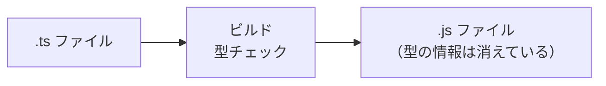

# 型とは何か — `: string` や `| null` が守っているもの

## 今日のゴール

- JavaScript の「自由すぎる型」がどんな問題を起こすかを知る
- 型注釈で変数や関数の入出力を制限できることを知る
- interface でオブジェクトの形を定義する方法を知る
- ユニオン型で「この値は文字列か null のどちらか」と表現できることを知る
- 型推論によって、すべてに型注釈を書かなくてよいことを知る

## JavaScript の自由すぎる型

AI が生成した Next.js のコードに `: string` や `: number` と書かれているのを見たことがあるかもしれません。あれは TypeScript（タイプスクリプト）という言語の記法です。なぜあの記号が必要なのか、まず JavaScript の「自由さ」を見てみましょう。

### 数値 + 文字列が `"12"` になる

```javascript
const price = 1;
const tax = "2";
console.log(price + tax); // "12"
```

数値の `1` と文字列の `"2"` を `+` で足しています。数学的には `3` になってほしいところですが、JavaScript は文字列が混ざると数値のほうを文字列に変換して結合します。結果は `"12"` です。

エラーにはなりません。JavaScript は「型が違っても何とかして動かす」設計の言語だからです。これを**暗黙の型変換**と呼びます。

### 引数に何でも渡せる

```javascript
function greet(name) {
  return "こんにちは、" + name + "さん！";
}

greet("田中");     // "こんにちは、田中さん！"
greet(42);         // "こんにちは、42さん！"
greet(undefined);  // "こんにちは、undefinedさん！"
```

`greet` は名前（文字列）を受け取るつもりの関数ですが、数値や `undefined` を渡してもエラーになりません。実行して出力を見て初めて「あれ、おかしい」と気づきます。

コードが数行ならすぐ原因がわかりますが、ファイルが何十もあるプロジェクトで「どこかで数値が紛れ込んだ」と言われたら、探すのは大変です。

### TypeScript はこの問題をどう解決するか

TypeScript は JavaScript に**型**（type）の仕組みを追加した言語です。「この変数には文字列しか入らない」「この関数は数値を返す」といったルールをコードに書けます。

```typescript
function greet(name: string): string {
  return "こんにちは、" + name + "さん！";
}

greet(42); // エラー！ number 型を string 型の引数に渡せません
```

このエラーはコードを実行する前、エディタ上やビルド時に表示されます。バグが本番環境に届く前に気づけるのが TypeScript の最大のメリットです。

TypeScript のコードはそのままブラウザでは動きません。ビルド時に型チェックが行われ、問題がなければ型の情報を取り除いた JavaScript が出力されます。型は開発時の安全ネットであり、実行時には存在しません。



> Next.js のプロジェクトでは TypeScript のセットアップが最初から組み込まれているので、自分で設定する必要はほとんどありません。

## 型注釈 — 「ここには文字列だけ」と宣言する

型注釈（type annotation）は、変数名や引数の後ろに `: 型名` と書く記法です。

### 変数の型注釈

```typescript
const message: string = "こんにちは";
const count: number = 42;
const isActive: boolean = true;
```

JavaScript のプリミティブ値に対応する型があります。

| 型 | 説明 | 例 |
|------|------|------|
| `string` | 文字列 | `"hello"`, `'world'` |
| `number` | 数値（整数・小数の区別なし） | `42`, `3.14` |
| `boolean` | 真偽値 | `true`, `false` |
| `null` | null | `null` |
| `undefined` | undefined | `undefined` |

> `String`（大文字）と `string`（小文字）は別物です。TypeScript では小文字の `string` を使います。大文字の `String` はラッパーオブジェクトの型なので、通常は使いません。

### 配列の型注釈

配列は `型名[]` と書きます。

```typescript
const numbers: number[] = [1, 2, 3];
const names: string[] = ["田中", "佐藤", "鈴木"];
```

宣言と異なる型の値を入れようとするとエラーになります。

```typescript
const numbers: number[] = [1, 2, 3];
numbers.push("四"); // エラー！ string は number に代入できません
```

### 関数の型注釈

関数では、引数と戻り値に型注釈を付けます。

```typescript
function add(a: number, b: number): number {
  return a + b;
}

const result = add(1, 2); // result は number 型
```

アロー関数も同じです。

```typescript
const multiply = (a: number, b: number): number => {
  return a * b;
};
```

何も返さない関数の戻り値は `void` です。

```typescript
function log(message: string): void {
  console.log(message);
}
```

冒頭の `greet` に型注釈を付けると、数値を渡した時点でエディタが赤線を引いてくれます。実行前に間違いに気づけるのが型注釈の役割です。

## interface — オブジェクトの形を定義する

変数に `: string` と書けるように、オブジェクトにも「どんなプロパティを持つか」という型を定義できます。

### インラインで書く方法

```typescript
const user: { name: string; age: number } = {
  name: "田中",
  age: 25,
};
```

定義にないプロパティにアクセスしたり、型の異なる値を代入しようとするとエラーになります。

```typescript
user.email; // エラー！ プロパティ 'email' は存在しません
user.age = "二十五"; // エラー！ string は number に代入できません
```

### interface で名前を付ける

同じ型を何度も使うなら、`interface` で名前を付けておくと便利です。

```typescript
interface User {
  name: string;
  age: number;
}

const user: User = { name: "田中", age: 25 };
const admin: User = { name: "佐藤", age: 30 };
```

`User` という名前で「`name` は文字列、`age` は数値」というオブジェクトの形を定義しています。この形に合わないオブジェクトを代入しようとするとエラーです。

### Optional プロパティ

プロパティ名の後ろに `?` を付けると、そのプロパティは省略可能になります。

```typescript
interface User {
  name: string;
  age: number;
  email?: string; // あってもなくてもよい
}

const user1: User = { name: "田中", age: 25 };
const user2: User = { name: "佐藤", age: 30, email: "sato@example.com" };
```

`email?` と書くと、型は自動的に `string | undefined` になります。使うときは `undefined` かもしれないことを考慮する必要があります。

```typescript
function printEmail(user: User): void {
  if (user.email) {
    console.log(user.email.toUpperCase());
  } else {
    console.log("メールアドレス未登録");
  }
}
```

### interface の拡張

`extends` を使うと、既存の interface を拡張して新しい型を作れます。

```typescript
interface Animal {
  name: string;
}

interface Dog extends Animal {
  breed: string;
}

const dog: Dog = { name: "ポチ", breed: "柴犬" };
```

`Dog` は `Animal` のプロパティ（`name`）に加えて `breed` を持つ型です。

> `interface` の他に `type`（型エイリアス）というキーワードでもオブジェクトの型を定義できます。プロジェクトによって使い分けのルールは異なりますが、できることはほぼ同じです。

## ユニオン型 — `string | null` は「文字列または null」

実際のアプリでは「値があるかもしれないし、ないかもしれない」場面がよくあります。ユーザーがメールアドレスを登録していないかもしれない、API からのレスポンスがまだ届いていないかもしれない。

ユニオン型（union type）は `|`（パイプ）で複数の型をつなぎ、「いずれかの型」を表現します。

```typescript
let email: string | null;

email = "tanaka@example.com"; // OK
email = null;                  // OK
email = 42;                    // エラー！ number は代入できません
```

`string | null` は「文字列か null のどちらか」という意味です。

### ユニオン型を使うときの注意

ユニオン型の値を使うときは、今どちらの型なのかを確認する必要があります。

```typescript
function printId(id: string | number): void {
  console.log(id.toUpperCase());
  // エラー！ id が number の場合、toUpperCase は存在しない
}
```

`typeof` で型を確認して分岐させます。これを**型の絞り込み**（narrowing）と呼びます。

```typescript
function printId(id: string | number): void {
  if (typeof id === "string") {
    console.log(id.toUpperCase()); // ここでは string として扱える
  } else {
    console.log(id.toFixed(2)); // ここでは number として扱える
  }
}
```

### リテラル型との組み合わせ

ユニオン型は特定の文字列だけを許可する「リテラル型」と組み合わせると強力です。

```typescript
type Status = "loading" | "success" | "error";

function showMessage(status: Status): string {
  switch (status) {
    case "loading":
      return "読み込み中...";
    case "success":
      return "完了しました！";
    case "error":
      return "エラーが発生しました";
  }
}

showMessage("loading"); // OK
showMessage("pending"); // エラー！ "pending" は Status に含まれない
```

JavaScript だけなら `showMessage("pending")` と書いてもエラーにならず、実行時に初めて不具合に気づきます。TypeScript なら書いた瞬間にわかります。

## 型推論 — 書かなくても推論される場面がある

ここまで毎回 `: 型名` を書いてきましたが、実は TypeScript は多くの場面で型を自動的に推論してくれます。

```typescript
const message = "こんにちは"; // string と推論される
const count = 42;             // number と推論される
const isActive = true;        // boolean と推論される
```

右辺の値から型が明らかなので、`: string` と書かなくても TypeScript は `message` が文字列であることを知っています。

関数の戻り値も推論されます。

```typescript
function add(a: number, b: number) {
  return a + b; // 戻り値は number と推論される
}
```

### いつ型注釈を書くか

型推論があるなら、すべてに型注釈を書く必要はありません。目安はこうです。

**書くべき場面:**
- 関数の引数（右辺の値がないので推論できない）
- 推論結果が意図と異なる場合
- コードの意図を明示したい場合

**省略してよい場面:**
- 変数の初期値から型が明らかな場合（`const x = 42`）
- 関数の戻り値が return 文から明白な場合

```typescript
// 引数には型注釈が必須（推論できない）
function greet(name: string) {
  // 戻り値は return 文から推論されるので省略可能
  return `こんにちは、${name}さん！`;
}

// 初期値から推論されるので型注釈は省略可能
const greeting = greet("田中");
```

> 型推論に頼れる場面では頼り、必要な場面だけ型注釈を書く。これが TypeScript の自然な使い方です。

## まとめ

- JavaScript は型が異なる値を混ぜてもエラーにならず、バグの原因になります
- TypeScript は `: string` のような型注釈で「ここには文字列だけ」と宣言し、実行前にミスを検出します
- `interface` でオブジェクトの形を定義でき、`?` で省略可能なプロパティも表現できます
- ユニオン型（`string | null`）で「いずれかの型」を表現し、`typeof` で絞り込んで使います
- 型推論が働くので、すべてに型注釈を書く必要はありません。関数の引数には必須、それ以外は推論に頼れます
