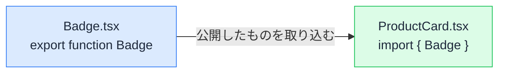

# React コードを読むための JavaScript 構文 — import・分割代入・スプレッド・?.

## 今日のゴール

- import の波括弧の有無が export の種類で決まることを知る
- 分割代入とスプレッドの「取り出す / 配る」の関係を知る
- `?.` と `??` が「無いかもしれない値」を安全に扱う構文だと知る

## React のコードが読めない理由

React のコードを前にして「何が書いてあるか分からない」と感じるとき、つまずきの原因は React ではなく、**土台の JavaScript の構文**であることがほとんどです。

たとえば、ありふれた「商品カード」のコードです。**今は一行ずつ理解できなくて構いません**ので、眺めるだけで大丈夫です。

```tsx
import { useState } from "react";
import { Badge } from "./Badge";

type Product = {
  name: string;
  price: number;
  campaign?: { rate: number };
};

export function ProductCard({ product }: { product: Product }) {
  const [options, setOptions] = useState<string[]>([]);
  const { name, price } = product;
  const rate = product.campaign?.rate ?? 0;

  const addOption = (option: string) => {
    setOptions([...options, option]);
  };

  return (
    <article>
      <h2>{name}</h2>
      <p>{`¥${price.toLocaleString()}（割引 ${rate}% 適用中）`}</p>
      <Badge label={options.length > 0 ? "カスタム" : "標準"} />
      <button onClick={() => addOption("ギフト包装")}>ギフト包装を追加</button>
    </article>
  );
}
```

わずか 30 行ほどのこのコードに、`{ useState }`、`{ name, price }`、`...options`、`?.`、`??`、`` `¥${...}` `` と、記号だらけの構文が詰め込まれています。

これらは React 特有の機能ではなく、すべて **JavaScript の標準構文**です。そして React のコードのほぼ全行に登場します。

なお、`type Product = { ... }` や引数の `: Product` は TypeScript の型注釈という別の要素です。ここでは「値の形をあらかじめ宣言している」とだけ捉えて、今日は JavaScript の構文に集中します。

読めない記号が残っていると、その行は意味の分からない「おまじない」のままで、コードの違和感にも気づけません。この 1 ファイルを全行読めるようにするのが今日のゴールです。

## ファイルの出入り口 — import と export

JavaScript では、1 つのファイルが 1 つの**モジュール**という独立した部屋になっています。ファイルの中で定義した関数や変数は、そのままでは他のファイルから見えません。

- **export**: 部屋の外に公開する宣言
- **import**: 他の部屋から持ち込む宣言



### 波括弧の有無は export の種類で決まる

import 文には、波括弧が付くものと付かないものがあります。

```tsx
import { useState } from "react";   // 波括弧あり
import Image from "next/image";     // 波括弧なし
```

この違いは好みではなく、**相手のファイルがどう export しているか**で決まっています。

| export の種類 | 書き方 | 個数 | import 側 |
|--------------|--------|------|-----------|
| **named export** | `export function Badge() {}` | 1 ファイルにいくつでも | `import { Badge }` — 名前は一致必須 |
| **default export** | `export default function Badge() {}` | 1 ファイルに 1 つだけ | `import Badge` — 名前は自由 |

named export は「名前付きで公開された棚」から名前を指定して取り出すイメージです。だから波括弧の中の名前は相手と一致している必要があり、必要なものだけを選んで取り込めます。

```tsx
// Badge.tsx — named export は複数できる
export function Badge({ label }: { label: string }) {
  return <span>{label}</span>;
}

export const BADGE_KINDS = ["標準", "カスタム"];
```

```tsx
// 使う側 — 必要なものだけ波括弧で選ぶ
import { Badge, BADGE_KINDS } from "./Badge";
```

default export は「このファイルの代表」を 1 つだけ決める仕組みです。代表は 1 つしかないので名前の指定が不要で、import 側が好きな名前を付けられます。

::: tip import の波括弧と分割代入は別物
import の波括弧は、次に説明する分割代入と見た目がそっくりですが、**別の仕組み**です。「named export を名前で選んでいる」専用の記法だと覚えてください。
:::

## 取り出す構文 — 分割代入

**分割代入**（destructuring）は、オブジェクトや配列から中身を取り出して変数にする構文です。

### オブジェクトの分割代入

```tsx
const product = { name: "コーヒー豆", price: 1500 };

// 分割代入を使わない場合
const name = product.name;
const price = product.price;

// 分割代入 — 同じことを 1 行で
const { name, price } = product;
```

`{ name, price }` は「`product` の中から `name` と `price` という名前のものを取り出す」という意味です。**プロパティ名と同じ名前**の変数ができます。

React で最も目にするのは、props の受け取りです。関数の引数の場所で直接分割代入できます。

```tsx
// props というオブジェクトから label を取り出している
function Badge({ label }: { label: string }) {
  return <span>{label}</span>;
}
```

取り出すときに初期値も指定できます。値が `undefined` のときだけ初期値が使われます。

```tsx
type Product = { name: string; stock?: number }; // stock は無いこともある

function StockLabel({ product }: { product: Product }) {
  const { name, stock = 0 } = product; // stock が無ければ 0
  return <p>{name}: 残り {stock} 点</p>;
}
```

### 配列の分割代入

配列の場合は名前ではなく**位置**で取り出します。

```tsx
const [count, setCount] = useState(0);
```

`useState` は「現在の値」と「更新する関数」のペアを配列で返します。配列の分割代入は位置で取り出すので、1 番目を `count`、2 番目を `setCount` と、**呼ぶ側が自由に名前を付けられます**。

`useState` がオブジェクトではなく配列を返すのは、この「名前を自由に決められる」性質を活かすためです。

```tsx
// 同じ useState でも、用途に合わせた名前を付けられる
const [query, setQuery] = useState("");
const [isOpen, setIsOpen] = useState(false);
```

## 配る構文 — スプレッドとレスト

`...`（点 3 つ）は、分割代入と対になる構文です。

### スプレッド — 中身を展開する

**スプレッド構文**は、オブジェクトや配列の中身をその場に並べ直します。

```tsx
const user = { name: "田中", age: 25 };

// user の中身をすべて展開し、name だけ上書きした新しいオブジェクト
const renamed = { ...user, name: "鈴木" };

const items = ["りんご", "バナナ"];

// items の中身を展開し、末尾に 1 つ足した新しい配列
const added = [...items, "みかん"];
```

ポイントは、どちらも**元のデータを書き換えず、新しいオブジェクトや配列を作っている**ことです。React は「前と同じオブジェクトかどうか」で変更を検知するため、書き換えるのではなく新しく作って渡すのが React の流儀です。

`user.name = "鈴木"` と直接書き換えるのではなく `{ ...user, name: "鈴木" }` と書くのは、この流儀に沿うためです。

JSX（HTML のようにタグを書ける React の記法）では、まとめた属性をタグに配る使い方も頻出します。

```tsx
function SubmitButton({ isSending }: { isSending: boolean }) {
  // 送信中はボタンを無効化し、支援技術にも「処理中」を伝える
  const buttonProps = { disabled: isSending, "aria-busy": isSending };

  return <button {...buttonProps}>{isSending ? "送信中..." : "送信する"}</button>;
}
```

### レスト — 残りを集める

同じ `...` でも、分割代入の中で使うと意味が逆になります。取り出した**残り全部**を 1 つに集めるので、**レスト**（rest）と呼ばれます。

```tsx
const product = { id: 1, name: "コーヒー豆", price: 1500 };

const { id, ...rest } = product;
// id   → 1
// rest → { name: "コーヒー豆", price: 1500 }
```

| 構文 | 場所 | 役割 |
|------|------|------|
| スプレッド | 作る側（オブジェクト・配列・JSX の中） | 中身を**配る** |
| レスト | 受け取る側（分割代入・関数の引数） | 残りを**集める** |

## 穴があっても落ちない参照 — ?. と ??

開発中、画面が真っ白になってこんなエラーに出会うことがあります。

```
TypeError: Cannot read properties of undefined (reading 'rate')
```

原因の定番は、「まだ無いかもしれないデータ」への参照です。

```tsx
// campaign はセール中の商品にしか無い
const rate = product.campaign.rate; // campaign が undefined だとここで停止
```

### ?. — オプショナルチェーン

`?.` を使うと、途中が `null` や `undefined` だったときにエラーで止まらず、全体が `undefined` になります。

```tsx
const rate = product.campaign?.rate;
// campaign がある   → rate の値
// campaign が無い   → undefined（エラーにならない）
```

### ?? — Null 合体演算子

`??` は「左側が `null` か `undefined` のときだけ右側を使う」演算子です。`?.` とセットで、「無かったときの代わりの値」を用意するのに使われます。

```tsx
const rate = product.campaign?.rate ?? 0; // 無ければ 0 とみなす
```

似た書き方に `||` がありますが、判定の基準が違います。

| 式 | 右側が使われる条件 | `0` のとき | `""` のとき |
|----|------------------|-----------|------------|
| `a ?? b` | `a` が `null` / `undefined` | `0` のまま | `""` のまま |
| `a \|\| b` | `a` が falsy（`0`、`""`、`false`、`null`、`undefined` など、偽とみなされる値） | `b` になる | `b` になる |

「割引率 0%」や「空文字の入力値」は正当な値です。`||` だとこれらまで置き換えられてしまうため、「値が無いときだけ」の意図なら `??` が適切です。

AI のコードで `||` が使われていたら、`0` や `""` が来る可能性を考えてみてください。

## 文字列への埋め込み — テンプレートリテラル

バッククォート（`` ` ``）で囲んだ文字列では、`${}` の中に式を埋め込めます。

```tsx
const price = 1500;

const message = "合計は ¥" + price + " です";  // + でつなぐ書き方
const message2 = `合計は ¥${price} です`;       // テンプレートリテラル
```

クラス名の組み立てなど、条件と文字列が混ざる場面でよく使われます。

```tsx
<div className={`card ${isActive ? "card-active" : ""}`}>
```

## 冒頭のコードの読み直し

最初のファイルに戻って、一行ずつ読み直します。

- `import { useState }` — react の named export から選んで取り込む
- `export function ProductCard({ product })` — named export しつつ、props を分割代入
- `const [options, setOptions]` — 配列の分割代入。位置で取り出して自由に命名
- `product.campaign?.rate ?? 0` — campaign が無くても落とさず、無ければ 0
- `[...options, option]` — 書き換えずに、1 つ足した新しい配列を作る
- `` `¥${price.toLocaleString()}` `` — 文字列への埋め込み（`toLocaleString()` は数値を 1,500 のような 3 桁区切りにするメソッド）
- `options.length > 0 ? "カスタム" : "標準"` — 三項演算子。`条件 ? 真のとき : 偽のとき` の 1 行分岐
- `() => addOption("ギフト包装")` — `=>` で関数を作るアロー関数。「クリックされたら実行する関数」をその場で作って渡している

これらが読めると、AI のコードは「おまじない」から「意図のある文章」に変わります。「ここは `??` にして」のように、修正の指示も的確な言葉で出せるようになります。

## まとめ

- `import { }` は named export、波括弧なしは default export
- 分割代入は取り出す、スプレッド `...` は配る（新しく作る）、レストは残りを集める
- `?.` は途中に穴があっても落ちない、`??` は null / undefined のときだけ右側
- `${}` で文字列に式を埋め込む
