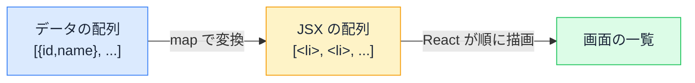

# 配列操作と JSX のリスト — map と key で一覧を描く

## 今日のゴール

- JSX の中で for 文ではなく map が使われる理由を知る
- key が「兄弟の中で自分を特定する名札」だと知る
- filter / find / some の使い分けと、0 件のときの画面を知る

## AI が書く一覧表示の定番コード

「ユーザーの一覧を表示して」と AI に頼むと、ほぼ確実にこの形のコードが返ってきます。

```tsx
type User = {
  id: number;
  name: string;
  department: string;
};

function UserList({ users }: { users: User[] }) {
  return (
    <ul>
      {users.map((user) => (
        <li key={user.id}>
          {user.name}（{user.department}）
        </li>
      ))}
    </ul>
  );
}
```

`map` はここで、配列の各要素を変換して新しい配列を作るメソッドとして使われています。`(user) => ...` の部分は変換のしかたを表す関数です（`=>` は関数を短く書く記法）。

なお、`map` の中の `=> (` の丸括弧は「複数行の式をまとめて返す」書き方です。`=> {` の波括弧にすると、`return` が必要になります。JSX が 1 行で収まらないときの定番の形です。

一覧を作るなら、繰り返しの構文 `for` のほうが素直に思えます。なぜ React の一覧は決まって `map` なのか。そして `key={user.id}` とは何なのか。この 2 つが今日の本題です。

## JSX に for 文が書けない理由

JavaScript の文法には**文**（statement）と**式**（expression）の区別があります。

| | 何か | 例 |
|---|------|---|
| **式** | **値になる**もの | `1 + 2`、`user.name`、`users.map(...)` |
| **文** | 処理の手順。値にならない | `for (...) {}`、`if (...) {}` |

そして JSX の波括弧 `{}` の中に書けるのは**式だけ**です。`{user.name}` が表示できるのは、`user.name` が「値になる」からです。

```tsx
return (
  <ul>
    {for (const user of users) { ... }}  {/* ← 文は書けない。構文エラー */}
  </ul>
);
```

`for` は値にならない「手順」なので、`{}` に置くことができません。

一方 `users.map(...)` は**新しい配列という値になる式**です。だから `{}` の中に収まります。

JSX の外で `for` を回して配列を作っておき、それを `{}` に置くことも文法上は可能です。それでも `map` が定番なのは、「データを JSX に変換する」という意図を 1 つの式で、JSX のすぐそばに書けるからです。

## 配列から JSX の配列へ

では `map` が作った配列はどう画面になるのでしょうか。実は React は、**JSX の配列を渡されると順番に描画する**というルールを持っています。

```tsx
// この 2 つはほぼ同じ意味
<ul>
  {[
    <li key="a">りんご</li>,
    <li key="b">バナナ</li>,
  ]}
</ul>
```

```tsx
<ul>
  <li>りんご</li>
  <li>バナナ</li>
</ul>
```

（配列で渡す場合にだけ `key="a"` という見慣れない属性が付いています。これが次の節の主役です）

つまり一覧表示の正体は、こうなります。



「データの配列」を「JSX の配列」に**変換**する。一覧表示は繰り返し処理ではなく変換処理であり、変換のためのメソッドが `map` です。

## key — 兄弟の中で自分を特定する名札

冒頭のコードの `key={user.id}` を外すと、開発中はコンソールに警告が出ます。

```
Each child in a list should have a unique "key" prop.
```

key は、**同じ並びの兄弟要素の中で「これは誰か」を React に伝える名札**です。

一覧のデータは、追加・削除・並べ替えで変化します。そのとき React は「前回の一覧」と「今回の一覧」を見比べて、変わった部分だけを画面に反映します。名札が無いと、並べ替えただけなのに「全部別人になった」と誤解して無駄な作り直しをしたり、入力欄の中身が別の行に紛れ込んだりします。

```tsx
{users.map((user) => (
  <li key={user.id}>{user.name}</li>
))}
```

key に使う値の条件は 2 つです。

- **兄弟の中で重複しない**こと
- **同じデータなら毎回同じ値**であること（データの id が最適）

なお AI は、id が無いデータに対して `key={index}`（配列の何番目か）を使うことがあります。並べ替えや途中への追加が無い固定の一覧なら動きますが、並びが変わる一覧では「何番目か」と「誰か」がズレて表示が崩れます。「この一覧、並び変わるけど key は大丈夫？」と確認できると、AI のコードを見る目が一段上がります。

## 絞り込み — filter と map の組み合わせ

検索や絞り込みのある一覧は、`filter`（条件に合う要素だけ残す）と `map` をつなげた形になります。

```tsx
function UserSearch({ users, query }: { users: User[]; query: string }) {
  const matched = users.filter((user) => user.name.includes(query));

  return (
    <ul>
      {matched.map((user) => (
        <li key={user.id}>{user.name}</li>
      ))}
    </ul>
  );
}
```

「絞り込んでから、JSX に変換する」。データの加工と画面への変換が分かれているので、読むときも「どんな条件で絞っているか」を `filter` の行だけ見れば把握できます。

## 1 件を探す・有無を確かめる — find と some

一覧の描画以外でも、配列のメソッドは AI のコードに頻出します。代表的な使い分けはこの 3 つです。

| メソッド | 返すもの | 用途の例 |
|---------|---------|---------|
| `filter` | 条件に合う要素**すべて**の配列 | 絞り込み一覧 |
| `find` | 条件に合う**最初の 1 件**（無ければ `undefined`） | id から詳細データを取る |
| `some` | 条件に合う要素が**あるかどうか**（true / false） | 「未読があるか」の判定 |

```tsx
const selected = users.find((user) => user.id === selectedId);
const hasGuest = users.some((user) => user.department === "ゲスト");
```

`find` の戻り値は「見つからないかもしれない」ので、使うときは `selected?.name` のように `?.`（途中が `undefined` でもエラーで止めない記法）を組み合わせるのが定番です。

## 0 件のときの画面

絞り込みの結果が 0 件のとき、何も無い空白が表示されると、ユーザーは「壊れた？」と感じます。`length` で件数を確かめて、0 件用の表示を用意するのが定番です。

```tsx
function UserSearch({ users, query }: { users: User[]; query: string }) {
  const matched = users.filter((user) => user.name.includes(query));

  if (matched.length === 0) {
    return <p>「{query}」に一致するユーザーはいません</p>;
  }

  return (
    <ul>
      {matched.map((user) => (
        <li key={user.id}>{user.name}</li>
      ))}
    </ul>
  );
}
```

0 件の理由と次の行動（条件を変える）が伝わる文言にするのがポイントです。AI は 0 件の画面まで気を回さないことも多いので、「0 件のときの表示も作って」と指示できると仕上がりが変わります。

## まとめ

- JSX の `{}` には式しか書けない。だから一覧は文の for ではなく、値になる `map`
- 一覧表示は「データの配列 → JSX の配列」への変換
- key は兄弟の中の名札。重複せず、同じデータなら同じ値（id が最適）
- `filter` は全部、`find` は最初の 1 件、`some` は有無。0 件の画面も忘れない
