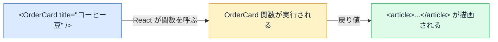

# JSX と props — コンポーネントは UI を返す関数

## 今日のゴール

- コンポーネントの実体が「JSX を返す関数」だと知る
- props が関数の引数であり、読み取り専用だと知る
- 条件レンダリングの 3 つの書き方と `&&` の罠を知る

## タグに見えて、タグではないもの

React のコードには、HTML に無いタグが平然と並びます。

```tsx
function App() {
  return (
    <main>
      <h1>注文履歴</h1>
      <OrderCard title="コーヒー豆" price={1500} />
      <OrderCard title="ドリッパー" price={2200} />
    </main>
  );
}
```

`<main>` や `<h1>` は HTML のタグです。しかし `<OrderCard />` は HTML のどこを探してもありません。これは**コンポーネント**、つまり自分（または AI）が定義した部品です。

`<OrderCard />` はタグのように見えますが、中身は自分（や AI）が定義したものです。`title="コーヒー豆"` のように値を渡すと表示が変わる、その仕組みを説明します。

## コンポーネントの実体は関数

`<OrderCard />` の定義はこうなっています。

```tsx
type OrderCardProps = {
  title: string;
  price: number;
};

function OrderCard({ title, price }: OrderCardProps) {
  return (
    <article>
      <h2>{title}</h2>
      <p>¥{price.toLocaleString()}</p>
    </article>
  );
}
```

ただの**関数**です。特別な登録も継承もありません。React のコンポーネントとは「JSX（画面の部品の記述）を返す関数」のことです。

そして `<OrderCard title="コーヒー豆" price={1500} />` と書くと、React がこの**関数を呼び出し**、戻り値の JSX を画面に描画します。タグのような見た目をした、関数呼び出しの予約です。



### 大文字始まりの意味

`<main>` は HTML タグとして、`<OrderCard>` は関数として扱われる。React はこの区別を**頭文字が大文字かどうか**で行います。

| 書き方 | 扱い |
|--------|------|
| `<main>`、`<button>`（小文字始まり） | HTML のタグ |
| `<OrderCard>`、`<Badge>`（大文字始まり） | コンポーネント（関数を呼ぶ） |

コンポーネント名が必ず大文字で始まっているのは命名の好みではなく、小文字にすると React が「そういう名前の HTML タグ」を探しに行ってしまうからです。

## props — タグの属性に見える引数

`title="コーヒー豆" price={1500}` の部分が **props**（プロパティの略）です。HTML の属性のような見た目ですが、実体は**関数に渡される引数**です。

React は props をひとまとめのオブジェクトにして関数に渡します。

```tsx
// この JSX は…
<OrderCard title="コーヒー豆" price={1500} />

// 概念的にはこの関数呼び出しに相当する
OrderCard({ title: "コーヒー豆", price: 1500 });
```

受け取る側の `function OrderCard({ title, price })` は、そのオブジェクトから分割代入（オブジェクトの中身を取り出して変数にする記法）で受け取っています。

### 文字列以外は波括弧で渡す

```tsx
<OrderCard
  title="コーヒー豆"        // 文字列はそのまま
  price={1500}             // 数値は {} で
  isGift={true}            // 真偽値も {} で
  tags={["豆", "深煎り"]}   // 配列・オブジェクトも {} で
  onCancel={() => alert("キャンセルしました")}  // 関数も渡せる
/>
```

`price="1500"` と書くと文字列の `"1500"` が渡ってしまいます。波括弧は「ここは JavaScript の値」という印です。

### props は読み取り専用

props の値の持ち主は、渡す側（親）です。受け取った側で書き換えることはできません。

```tsx
function OrderCard(props: OrderCardProps) {
  props.price = props.price * 1.1; // ❌ props を書き換えてはいけない
  ...
}
```

「データは親から子へ一方通行で流れ、子は受け取って表示するだけ」。この一方通行のおかげで、「この表示がおかしいのはどこから渡された値のせいか」を親へ親へとたどるだけで原因を探せます。値を変えたい場合は、加工した別の変数を作ります（`const taxed = price * 1.1;`）。

## children — タグで挟んだ中身も props

開始タグと終了タグで挟んだ中身は、`children` という名前の props として渡されます。

```tsx
type PanelProps = {
  children: React.ReactNode; // JSX を受け取るときの型
};

function Panel({ children }: PanelProps) {
  return <section className="panel">{children}</section>;
}
```

```tsx
<Panel>
  <h2>お知らせ</h2>
  <p>本日のセール情報です。</p>
</Panel>
```

`Panel` は「枠」だけを定義し、中身は使う側が自由に決める。枠と中身の分業ができるので、カード・モーダル・レイアウトなど「囲むもの」はほぼこの形で書かれます。

## 条件レンダリング — 出し分けの 3 つの書き方

「ログイン中ならユーザー名、そうでなければログインボタン」のような出し分けは、JSX の `{}` に**値になる式**を置くことで実現します。よく使う形は 3 つです。

### 三項演算子 — どちらかを出す

```tsx
{isLoggedIn ? <p>{userName} さん</p> : <a href="/login">ログイン</a>}
```

### && — 条件を満たすときだけ出す

```tsx
{isGift && <p>ギフト包装で発送します</p>}
```

`&&` は左側が真のときだけ右側を返します。「片方しか無い三項演算子」として AI のコードに頻出します。

### early return — 大きく分ける

表示が丸ごと変わる場合は、関数の早い段階で return します。

```tsx
type Order = { id: number; title: string };

function OrderList({ orders }: { orders: Order[] }) {
  if (orders.length === 0) {
    return <p>注文履歴はまだありません</p>;
  }

  return <ul>{orders.map((order) => <li key={order.id}>{order.title}</li>)}</ul>;
}
```

### && の罠 — 0 が画面に出る

`&&` には有名な罠があります。

```tsx
{cartCount && <p>カートに {cartCount} 点あります</p>}
```

`cartCount` が `0` のとき、何も表示されない、のではなく**画面に `0` と表示されます**。`&&` は左が偽ならその左の値を返す仕組みで、JSX は `false` は描画しませんが **`0` は数値として描画する**からです。

対策は、左側を真偽値にすることです。

```tsx
{cartCount > 0 && <p>カートに {cartCount} 点あります</p>}
```

AI もこの罠を踏むことがあります。画面の隅にポツンと `0` が出ていたら、「`&&` の左が数値になっていないか」を疑ってください。原因を言葉にできれば、修正の指示は一言で済みます。

## まとめ

- コンポーネント = JSX を返す関数。大文字始まりで HTML タグと区別される
- props はタグの属性に見える関数の引数。読み取り専用で、親から子への一方通行
- タグで挟んだ中身は `children` として渡される
- 出し分けは三項演算子・`&&`・early return。`&&` の左が `0` だと画面に出る
