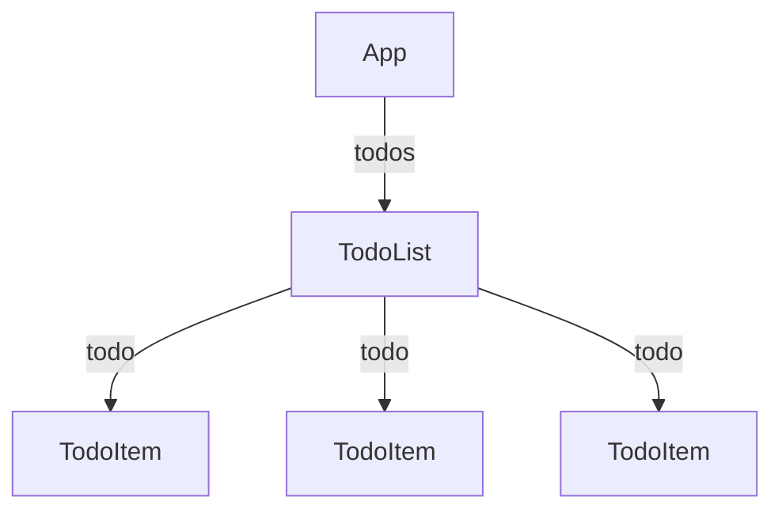

# React が解決した問題 — 宣言的 UI、JSX、コンポーネント

## 今日のゴール

- DOM 操作の何が面倒だったかを振り返り、React の宣言的 UI という発想を知る
- JSX が HTML ではなく JavaScript の関数呼び出しであることを知る
- コンポーネントと props の基本的な仕組みを知る

## DOM 操作の面倒さ

JavaScript で画面を動的に変えるには、DOM を直接操作する必要がありました。

```javascript
// カウンターを DOM 操作で作る
const counter = document.querySelector("#counter");
const button = document.querySelector("#increment");
let count = 0;

button.addEventListener("click", () => {
  count++;
  counter.textContent = `カウント: ${count}`;
});
```

たった数行の処理でも、「要素を取得 → イベントを登録 → 状態を変更 → 画面を手動で書き換える」という手順を毎回書きます。

もう少し複雑な例を見てみましょう。

```javascript
// TODO リストを DOM 操作で作る
const input = document.querySelector("#todo-input");
const list = document.querySelector("#todo-list");
const addButton = document.querySelector("#add-button");

addButton.addEventListener("click", () => {
  const text = input.value.trim();
  if (!text) return;

  const li = document.createElement("li");
  li.textContent = text;

  const deleteButton = document.createElement("button");
  deleteButton.textContent = "削除";
  deleteButton.addEventListener("click", () => {
    list.removeChild(li);
  });

  li.appendChild(deleteButton);
  list.appendChild(li);
  input.value = "";
});
```

データ（TODO の内容）と画面（DOM）を自分で同期させなければなりません。アプリが大きくなると、「今どの要素がどのデータに対応しているのか」を追いかけるのが困難になります。

この面倒さを解決するのが React です。

## 宣言的 UI — 「こうあるべき」を書く

DOM 操作のアプローチは **命令的 UI** と呼ばれます。「この要素を取得して、次にこの要素を作って、ここに追加して...」と、画面を変えるための **手順** を1つずつ書くからです。

React は逆の発想を取ります。**宣言的 UI** です。

```tsx
// 宣言的: 「データがこうなら、画面はこう」を書く
function Counter() {
  const [count, setCount] = useState(0);

  return (
    <button onClick={() => setCount(count + 1)}>
      カウント: {count}
    </button>
  );
}
```

開発者は「`count` が 3 のとき、ボタンには "カウント: 3" と表示される」という **結果** を書くだけです。`count` が変わったら React が自動的に画面を更新してくれます。DOM を取得する必要も、`textContent` を書き換える必要もありません。


この仕組みを**仮想 DOM**（Virtual DOM）と呼びます。React は画面の状態を JavaScript オブジェクトとして保持し、状態が変わるたびに「前の姿」と「新しい姿」を比較して、変わった部分だけを実際の DOM に反映します。

命令的 UI と宣言的 UI の違いをまとめます。

| | 命令的 UI（DOM 操作） | 宣言的 UI（React） |
|---|---|---|
| 書くもの | 画面を変える **手順** | 画面の **あるべき姿** |
| DOM 操作 | 開発者が手動で行う | React が自動で行う |
| データと画面の同期 | 自分で管理する | React が管理する |

## JSX — HTML に見えて JavaScript

React のコードに登場する HTML のような記法を見てみましょう。

```tsx
const element = <h1>こんにちは、世界！</h1>;
```

これは HTML ではありません。**JSX**（JavaScript XML）という JavaScript の拡張構文です。ビルド時に、JavaScript の関数呼び出しに変換されます。

```javascript
// 上の JSX が変換された結果
const element = React.createElement("h1", null, "こんにちは、世界！");
```

`React.createElement` は JavaScript のオブジェクト（仮想 DOM のノード）を返します。つまり JSX は「HTML を書いている」のではなく、「JavaScript のオブジェクトを作っている」のです。見た目が HTML に似ているだけで、中身は JavaScript です。

### JSX のルール

JSX にはいくつかのルールがあります。

**1. 必ず1つのルート要素で囲む**

```tsx
// エラー！ 複数のルート要素は書けない
return (
  <h1>タイトル</h1>
  <p>本文</p>
);

// OK: Fragment で囲む（余分な DOM 要素を作らない）
return (
  <>
    <h1>タイトル</h1>
    <p>本文</p>
  </>
);
```

`<>...</>` は **Fragment** と呼ばれ、余計な `<div>` を追加せずに複数の要素をまとめられます。

**2. JavaScript の式を `{}` で埋め込める**

```tsx
const name = "田中";
const element = <h1>こんにちは、{name}さん！</h1>;
```

`{}` の中には JavaScript の式（値を返すもの）を書けます。計算やメソッド呼び出しも可能です。

```tsx
const price = 1000;
const element = <p>税込価格: {(price * 1.1).toLocaleString()}円</p>;
```

**3. HTML と異なる属性名がある**

JSX は JavaScript なので、JavaScript の予約語と衝突する属性名が変更されています。

| HTML | JSX | 理由 |
|------|-----|------|
| `class` | `className` | `class` は JavaScript の予約語 |
| `for` | `htmlFor` | `for` は JavaScript の予約語 |

```tsx
<label htmlFor="email" className="form-label">
  メールアドレス
</label>
```

**4. すべてのタグを閉じる**

HTML では `` や `<input>` を閉じなくても動きますが、JSX ではすべてのタグを閉じる必要があります。

```tsx

<input type="text" />
```

## コンポーネント — 関数が UI の部品になる

React の**コンポーネント**は、JSX を返す JavaScript の関数です。

```tsx
function Greeting() {
  return <h1>こんにちは！</h1>;
}
```

コンポーネント名は**大文字で始めます**。小文字だと HTML タグとして解釈されてしまいます。

```tsx
<Greeting />  // コンポーネント
<greeting />  // HTML タグ（存在しない）
```

コンポーネントは他のコンポーネントの中で使えます。小さな部品を組み合わせて画面を構築するのが React の基本パターンです。

```tsx
function Greeting() {
  return <h1>こんにちは！</h1>;
}

function App() {
  return (
    <main>
      <Greeting />
      <p>React の学習を始めましょう。</p>
    </main>
  );
}
```

ただし、このままでは `Greeting` は「こんにちは！」しか表示できません。コンポーネントに外からデータを渡す仕組みが必要です。

## props — コンポーネントにデータを渡す

**props**（properties の略）は、コンポーネントに外からデータを渡す仕組みです。HTML の属性のような形でデータを渡し、関数の引数として受け取ります。

```tsx
function Greeting({ name }: { name: string }) {
  return <h1>こんにちは、{name}さん！</h1>;
}

// 使う側
<Greeting name="田中" />
<Greeting name="佐藤" />
<Greeting name="鈴木" />
```

同じコンポーネントに異なるデータを渡すことで、同じ見た目で異なる内容を表示できます。

### props の型定義

TypeScript の `interface` を使って props の型を定義するのが一般的です。

```tsx
interface UserCardProps {
  name: string;
  role: "admin" | "editor" | "viewer";
  email?: string; // 省略可能（Optional）
}

function UserCard({ name, role, email }: UserCardProps) {
  return (
    <article>
      <h2>{name}</h2>
      <p>権限: {role}</p>
      {email && <p>メール: {email}</p>}
    </article>
  );
}
```

引数の `{ name, role, email }` は**分割代入**（destructuring）です。`props.name` と毎回書く代わりに、直接変数として取り出せます。

### children — 中身を外から差し込む

コンポーネントの開始タグと終了タグの間に書いた内容は、`children` という特別な props として渡されます。

```tsx
interface CardProps {
  title: string;
  children: React.ReactNode;
}

function Card({ title, children }: CardProps) {
  return (
    <section>
      <h2>{title}</h2>
      <div>{children}</div>
    </section>
  );
}

// 使う側: 中身を自由に差し替えられる
<Card title="お知らせ">
  <p>明日はメンテナンスのためサービスを停止します。</p>
</Card>

<Card title="プロフィール">
  
  <p>田中太郎</p>
</Card>
```

`React.ReactNode` は「React が描画できるもの」を表す型です。テキスト、JSX 要素、それらの組み合わせなど、何でも渡せます。

`children` を使うことで、「外見はコンポーネントが決め、中身は使う側が決める」という柔軟な設計ができます。

### props は読み取り専用

React の重要なルールとして、**props は変更してはいけません**。

```tsx
function Greeting({ name }: { name: string }) {
  // name = "上書き";  // やってはいけない！
  return <h1>こんにちは、{name}さん！</h1>;
}
```

データは親コンポーネントから子コンポーネントへ一方向に流れます。これを**単方向データフロー**（one-way data flow）と呼びます。データの流れが一方向に決まっているので、「このデータはどこから来たのか」が追いやすくなります。



## まとめ

- DOM 操作は「データが変わったら自分で画面を書き換える」命令的なアプローチ。React は「データを渡せば画面が勝手に変わる」宣言的なアプローチ
- 仮想 DOM により、React が差分を計算して最小限の DOM 更新を自動で行う
- JSX は HTML に見えるが、ビルド時に `React.createElement` という JavaScript の関数呼び出しに変換される
- コンポーネントは JSX を返す関数。小さな部品を組み合わせて画面を構築する
- props でコンポーネントにデータを渡す。データは親から子への単方向に流れ、props は読み取り専用
