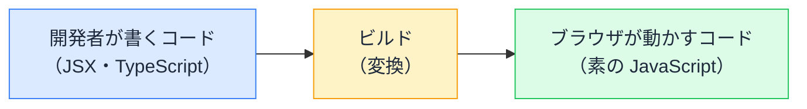

# JSX の仕組み — ビルドで関数呼び出しに変換される構文

## 今日のゴール

- JSX がブラウザの知らない「拡張構文」だと知る
- ビルドで JSX が関数呼び出しに変換されることを知る
- コンポーネント名の大文字・小文字ルールの由来を知る

## ブラウザに貼ると動かないコード

React のコンポーネントのコードを、ブラウザの開発者ツールのコンソールにそのまま貼り付けると、エラーになります。

```tsx
function Hello() {
  return <h1 className="title">こんにちは</h1>;
}
```

```
Uncaught SyntaxError: Unexpected token '<'
```

ブラウザの JavaScript エンジンは、`return` の直後に `<` が来る文法を知りません。それなのに、**この構文で書かれた React アプリはブラウザでちゃんと動いています**。

## JavaScript の標準には無い拡張構文

`<h1>...</h1>` を JavaScript の式として書く記法を **JSX** と呼びます。JSX は JavaScript の標準仕様には含まれていない**拡張構文**です。

- 書き心地のために、HTML のようなタグの記法を JavaScript に「足した」もの
- ブラウザはこの構文を一切理解しない
- つまり、**書いたままの形でブラウザに届くことはない**

このギャップを埋めているのが、**ビルド**という変換工程です。

## ビルドという変換工程

開発者が書いたコードは、ブラウザに届く前に「ブラウザが理解できる JavaScript」へ変換されます。



JSX は、ビルドで**関数呼び出し**に変換されます。

```tsx
// 開発者が書くコード
const element = <h1 className="title">こんにちは</h1>;
```

```js
// ビルド後（概念を示した簡略版。実際の関数名や細部はツールにより異なる）
const element = jsx("h1", { className: "title", children: "こんにちは" });
```

タグ名が第 1 引数に、属性と中身（children）がオブジェクトになって第 2 引数に入ります。タグの見た目が消えてただの JavaScript になったので、これならブラウザも実行できます。

タグが入れ子なら、関数呼び出しも入れ子になります。

```tsx
// 開発者が書くコード
<ul>
  <li>りんご</li>
</ul>
```

```js
// ビルド後（簡略版）
jsx("ul", {
  children: jsx("li", { children: "りんご" }),
});
```

この `jsx()` が返すのは「`h1` を、この属性で、この中身で表示したい」という**設計図のオブジェクト**です。React はこのオブジェクトを受け取り、実際の画面に反映します。

つまり JSX を書くことは、HTML を書くことではなく、**設計図オブジェクトを組み立てる JavaScript を書くこと**です。

## 大文字・小文字ルールの仕組み

React ではコンポーネント名を大文字で始める決まりがあります。変換後の形を見ると、その理由がはっきりします。

```tsx
// 開発者が書くコード
<main>
  <OrderCard title="コーヒー豆" />
</main>
```

```js
// ビルド後（簡略版）
jsx("main", {
  children: jsx(OrderCard, { title: "コーヒー豆" }),
});
```

- 小文字の `<main>` → `"main"` という**文字列**になる（HTML タグ名として扱われる）
- 大文字の `<OrderCard>` → `OrderCard` という**関数そのもの**が渡される

変換器は「大文字始まりなら変数（関数）、小文字始まりなら文字列」という機械的なルールで振り分けています。小文字で `<orderCard>` と書くと `"orderCard"` という文字列になり、そんな名前の HTML タグは無いので画面に何も出ません。

## 変換のタイミングと担当

Next.js のプロジェクトでは、この変換を意識することはほぼありません。

| 場面 | 変換のタイミング |
|------|----------------|
| 開発中（`npm run dev`） | ファイルを保存するたびに、開発サーバーが即座に変換する |
| 本番向け（`npm run build`） | 全ファイルをまとめて変換し、配信用のファイルを作る |

変換を担当するソフトウェアは**コンパイラ**（またはトランスパイラ）と呼ばれます。React では長らく Babel が定番で、Next.js は SWC という高速なコンパイラを使っています。

このとき、JSX の変換と同時に **TypeScript の型注釈も取り除かれます**。`price: number` のような型はビルド時のチェックに使われるだけで、ブラウザに届くコードには残りません。

ブラウザの開発者ツールで「自分が書いた覚えのないコード」が表示されるのは、このためです。ブラウザで動いているのは変換後のコードであり、書いたコードそのものではありません。

エラーの位置が本来のコードとズレて見えるときも、「ブラウザにあるのは変換後」と知っていれば慌てずに済みます。

## まとめ

- JSX はブラウザの知らない拡張構文で、書いたままブラウザに届くことはない
- ビルドで `jsx("h1", {...})` のような関数呼び出しに変換される
- 大文字始まりは関数、小文字始まりはタグ名の文字列として変換される
- ブラウザで動いているのは変換後のコード
