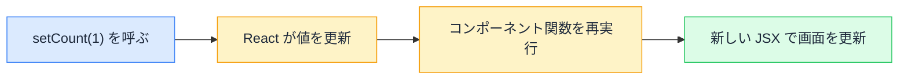

# useState と画面更新 — 普通の変数ではダメな理由

## 今日のゴール

- 普通の変数では画面が更新されない 2 つの理由を知る
- useState が「React に値を預ける」仕組みだと知る
- state がスナップショットであり、set した直後は古いままだと知る

## 普通の変数で書いたカウンター

「押すと数が増えるボタン」を、JavaScript の変数の知識だけで素直に書くと、こうなります。

```tsx
function Counter() {
  let count = 0;

  return (
    <button onClick={() => { count = count + 1; }}>
      {count} 回押された
    </button>
  );
}
```

一見正しそうですが、**何度押しても画面は「0 回押された」のまま**です。ボタンを押すたびに `count` 自体は増えているのに、画面には反映されません。

## 画面が変わらない 2 つの理由

### 1. 変数を変えても画面を描き直す合図にならない

React のコンポーネントは「JSX を返す関数」です。画面に反映されるのは、**関数が実行されて JSX が返されたとき**だけです。

`count = count + 1` はメモリ上の値を変えるだけで、「関数をもう一度実行して画面を描き直して」という合図にはなりません。React は変数の変化を監視していないので、何も起きないのです。

### 2. 再実行のたびにローカル変数は作り直される

仮に何らかの方法で関数を再実行できたとしても、`let count = 0` は関数の中のローカル変数なので、**再実行のたびに 0 で作り直されます**。増やしたはずの値はどこにも残りません。

つまり画面を正しく更新するには、次の 2 つが揃った仕組みが必要です。

1. 関数が再実行されても**消えない場所**に値を保存する
2. 値を変えたら**再実行（再レンダリング）の合図**を送る

この 2 つをセットで提供するのが `useState` です。

## useState — React に値を預ける

```tsx
import { useState } from "react";

function Counter() {
  const [count, setCount] = useState(0);

  return (
    <button onClick={() => setCount(count + 1)}>
      {count} 回押された
    </button>
  );
}
```

`useState(0)` は「初期値 0 の値を React に預ける」という宣言です。戻り値は 2 つの要素のペアです。

| 戻り値 | 役割 |
|--------|------|
| `count`（1 つ目） | 預けてある**現在の値**。state と呼ぶ |
| `setCount`（2 つ目） | 値を更新して**再レンダリングを予約する関数** |

値の保管場所はコンポーネント関数の外、React の管理領域なので、関数が再実行されても消えません。そして `setCount` を呼ぶと、React は新しい値を保存し、コンポーネント関数を再実行して画面を描き直します。



直接代入（`count = 1`）ではなく必ず set 関数を使うのは、**値の更新と再描画の合図を 1 つの操作にまとめるため**です。

## state はスナップショット

useState には、知らないと必ず混乱するポイントがあります。**set を呼んでも、その場では `count` は変わりません**。

```tsx
function Counter() {
  const [count, setCount] = useState(0);

  const handleClick = () => {
    setCount(count + 1);
    console.log(count); // 1 ではなく 0 が表示される
  };

  return <button onClick={handleClick}>{count} 回押された</button>;
}
```

`setCount` は「次の再レンダリングで新しい値にする」という**予約**で、いま実行中の関数の中では `count` は実行開始時点の値（スナップショット）のまま動き続けます。新しい値が見えるのは、再実行された次回の関数の中です。

この性質は、連続更新で表面化します。

```tsx
const handleTriple = () => {
  setCount(count + 1); // count は 0 なので「1 にする」と予約
  setCount(count + 1); // count はまだ 0 なので「1 にする」と予約
  setCount(count + 1); // 同上
};
// 3 回呼んだのに、結果は 1
```

3 回とも「実行開始時点の `count`（= 0）+ 1」を予約しているので、結果は 1 にしかなりません。

「前の値を踏まえて更新したい」ときは、**関数を渡す書き方**を使います。

```tsx
const handleTriple = () => {
  setCount((prev) => prev + 1); // 最新の値を受け取って +1
  setCount((prev) => prev + 1);
  setCount((prev) => prev + 1);
};
// 結果は 3
```

関数を渡すと、React は予約を順番に処理しながら「その時点の最新値」を引数 `prev` に渡してくれます。コードで `setCount((prev) => prev + 1)` という形を見かけたら、「前の値を踏まえた更新だな」と読めます。

## オブジェクトや配列の state

state には数値だけでなく、オブジェクトや配列も預けられます。このとき守るルールは 1 つ、**直接書き換えず、新しいオブジェクトを作って set に渡す**ことです。

```tsx
const [profile, setProfile] = useState({ name: "田中", age: 25 });

// ❌ 直接書き換えても React は変化に気づけない
profile.age = 26;
setProfile(profile);

// ✅ スプレッド構文で新しいオブジェクトを作る
setProfile({ ...profile, age: 26 });
```

React は「前のオブジェクトと今のオブジェクトが同じものかどうか」で変化を判定します。中身だけ書き換えて同じオブジェクトを渡すと「変わっていない」と判断され、画面が更新されないことがあります。

`{ ...profile, age: 26 }` は、スプレッド構文（`...` で中身を展開する書き方）でコピーした**別の新しいオブジェクト**なので、確実に「変わった」と伝わります。

## まとめ

- 普通の変数は再描画の合図にならず、値も再実行で消える
- useState は値を React に預け、set 関数が更新と再レンダリングをセットで行う
- state はスナップショットで、set は次回の実行から反映される予約なので、連続更新は `(prev) => ...`
- オブジェクト・配列は書き換えず、新しく作って set する
