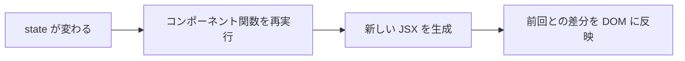

# state — let で変数を変えても画面が変わらない理由

## 今日のゴール

- React で画面を更新するには `useState` が必要な理由を知る
- state が変わると React がコンポーネントを再実行する仕組みを知る
- イベントハンドラで state を更新するパターンを知る

## let で変数を変えても画面は変わらない

React でカウンターを作ろうとして、こう書いたとします。

```tsx
function Counter() {
  let count = 0;

  const handleClick = () => {
    count = count + 1;
    console.log(count);  // 1, 2, 3... と増える
  };

  return (
    <div>
      <p>{count}</p>
      <button onClick={handleClick}>+1</button>
    </div>
  );
}
```

ボタンを押すと `console.log` では `count` が増えています。しかし**画面上の数字は 0 のまま変わりません**。

これは React の根本的な仕組みに関わる話です。

## React は関数を「再実行」して画面を作り直す

React のコンポーネントは関数です。React はこの関数を呼び出して、戻り値の JSX から画面を作ります。

画面を更新するとき、React はこの関数を**もう一度呼び出します**。これを**再レンダリング**と呼びます。



`let count = 0` の問題はここにあります。関数が再実行されるたびに `let count = 0` も再実行され、**毎回 0 に戻ってしまいます**。

## useState — 再実行をまたいで値を保持する

`useState` は、コンポーネントの再実行をまたいで値を保持する仕組みです。

```tsx
import { useState } from "react";

function Counter() {
  const [count, setCount] = useState(0);

  const handleClick = () => {
    setCount(count + 1);
  };

  return (
    <div>
      <p>{count}</p>
      <button onClick={handleClick}>+1</button>
    </div>
  );
}
```

`useState(0)` は「初期値 0 の state を作る」という意味です。戻り値は 2 つ:

- `count`: 現在の値
- `setCount`: 値を更新する関数

`setCount(count + 1)` を呼ぶと:

1. React が新しい値（`count + 1`）を記憶する
2. コンポーネント関数を再実行する
3. 今度は `useState(0)` が `0` ではなく記憶した新しい値を返す
4. 新しい JSX が生成される
5. 画面が更新される

`let` は関数内の普通の変数なので再実行で消えます。`useState` は React が管理する「関数の外にある保管場所」なので、再実行をまたいで値が残ります。

## イベントハンドラ — ユーザーの操作をきっかけにする

`onClick` に渡す関数を**イベントハンドラ**と呼びます。

```tsx
<button onClick={handleClick}>+1</button>
```

React のイベントハンドラは HTML の属性名とは少し違います。

| HTML | React |
|------|-------|
| `onclick` | `onClick` |
| `onchange` | `onChange` |
| `onsubmit` | `onSubmit` |

キャメルケース（小文字始まり、単語の区切りを大文字）になっています。

### よくある state + イベントのパターン

```tsx
function Toggle() {
  const [isOpen, setIsOpen] = useState(false);

  return (
    <div>
      <button onClick={() => setIsOpen(!isOpen)}>
        {isOpen ? "閉じる" : "開く"}
      </button>
      {isOpen && <p>コンテンツが表示されています</p>}
    </div>
  );
}
```

- `isOpen` が `false` → ボタンに「開く」と表示。コンテンツは非表示
- ボタンをクリック → `setIsOpen(!isOpen)` で `true` に
- React がコンポーネントを再実行 → ボタンが「閉じる」に、コンテンツが表示

state を変えると画面が自動で変わる。これが DOM を手動で書き換えていた時代との決定的な違いです。

## state は「1 つの値」ではない

state は 1 つのコンポーネント内に複数持てます。

```tsx
function Form() {
  const [name, setName] = useState("");
  const [email, setEmail] = useState("");

  return (
    <form>
      <input value={name} onChange={(e) => setName(e.target.value)} />
      <input value={email} onChange={(e) => setEmail(e.target.value)} />
    </form>
  );
}
```

`name` と `email` はそれぞれ独立した state です。一方を更新しても、もう一方には影響しません。

## まとめ

- `let` で変数を変えても React の画面は更新されません。関数が再実行されるたびに変数は初期値に戻ります
- `useState` は再実行をまたいで値を保持し、更新時に再レンダリングを引き起こします
- `setCount(新しい値)` を呼ぶと、React がコンポーネントを再実行して画面を作り直します
- イベントハンドラ（`onClick`, `onChange` など）で state を更新するのが React の基本パターンです
