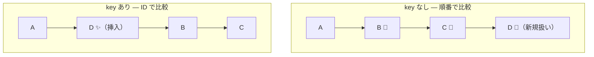

# リストと条件分岐 — map と key、そして JSX の中の if

## 今日のゴール

- `.map()` でリストを表示する方法を知る
- `key` が何のために必要かを知る
- JSX の中で条件分岐する方法を知る

## 配列からリストを作る

React でリスト（一覧）を表示するとき、`.map()` がほぼ必ず登場します。

```tsx
function TodoList() {
  const todos = ["買い物", "洗濯", "掃除"];

  return (
    <ul>
      {todos.map((todo) => (
        <li>{todo}</li>
      ))}
    </ul>
  );
}
```

`todos.map()` は配列の各要素を `<li>` に変換して、新しい配列（`<li>` の配列）を返します。React はその配列をそのまま画面に表示します。

## key — React がリストの変更を追跡するための目印

先ほどのコードをブラウザで動かすと、コンソールに警告が出ます。

```
Warning: Each child in a list should have a unique "key" prop.
```

`key` は、React がリストの各要素を**識別するための目印**です。

```tsx
<ul>
  {todos.map((todo, index) => (
    <li key={todo}>{todo}</li>
  ))}
</ul>
```

### なぜ key が必要なのか

React はコンポーネントを再実行して新しい JSX を作り、前回の画面との**差分**だけを DOM に反映します。リストの場合、「どの要素が追加されたのか」「どの要素が削除されたのか」「どの要素が移動したのか」を判断する必要があります。

`key` がないと、React はリストの順番だけで判断するしかありません。途中に要素を挿入したとき、その位置以降のすべての要素が「変更された」と見なされ、不必要な再レンダリングが起きます。



key があれば「A, B, C は変わっていない。D が新しく入った」と正しく判断でき、D だけを追加します。

### key に index を使うのは危険

AI が生成するコードに `key={index}` が使われていることがありますが、これは問題を起こす場合があります。

```tsx
// 危険: 要素の追加・削除で index がずれる
{todos.map((todo, index) => (
  <li key={index}>{todo}</li>
))}
```

リストの先頭に要素を追加すると、すべての要素の index が変わります。React は「同じ key の要素は同じもの」と判断するため、中身がずれて表示が壊れることがあります。

**key にはリスト内で一意な値（ID など）を使います**。

## JSX の中での条件分岐

JSX の `{ }` の中には JavaScript の式が書けます。条件によって表示を切り替えるパターンがいくつかあります。

### 三項演算子 — 2 択の切り替え

```tsx
<p>{isLoggedIn ? "ログイン中" : "未ログイン"}</p>
```

`条件 ? true のとき : false のとき` です。

### && 演算子 — 表示/非表示の切り替え

```tsx
{hasError && <p>エラーが発生しました</p>}
```

`hasError` が `true` のときだけ `<p>` が表示されます。`false` のときは何も表示されません。

### 早期 return — コンポーネントごと切り替え

```tsx
function Dashboard({ user }: { user: User | null }) {
  if (!user) {
    return <p>ログインしてください</p>;
  }

  return <div>ようこそ、{user.name}さん</div>;
}
```

条件に合わないときは早めに `return` して、メインの表示をシンプルに保ちます。

## まとめ

- `.map()` で配列から JSX のリストを作ります。React でリストを表示する基本パターンです
- `key` は React がリストの変更を正しく追跡するための目印です。一意な値（ID など）を使います
- `key={index}` はリストの追加・削除で表示が壊れる原因になります
- JSX の中では三項演算子（`? :`）、`&&` 演算子、早期 return で条件分岐できます
