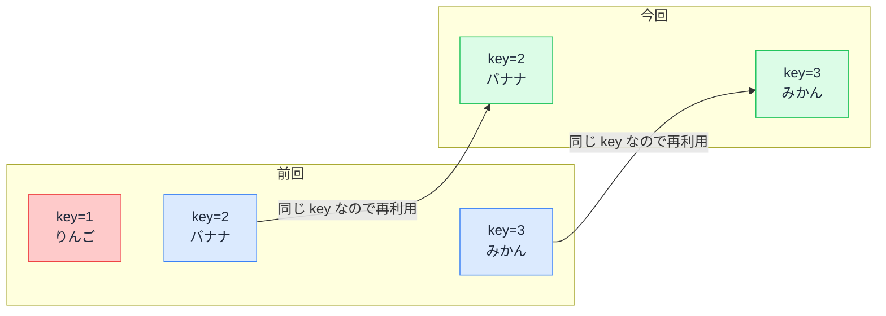

# key の役割 — React が一覧の項目を見分ける名札

## 今日のゴール

- React が一覧の変化を key で照合していることを知る
- state が「位置」ではなく「key」に紐づくことを知る
- `key={index}` で表示がズレる仕組みを知る

## 警告消しだと思われがちな key

React で一覧を描くコードには、必ず `key` が付いてきます。

```tsx
{todos.map((todo) => (
  <li key={todo.id}>{todo.text}</li>
))}
```

key を付け忘れるとコンソールに警告が出るため、「警告を消すためのおまじない」と思われがちです。AI に聞いても「一意な値を付けてください」と教えてくれますが、**なぜ一意でなければならないのか**までは分かりません。

実は key は、警告どころか**表示の正しさそのもの**を左右しています。

## 前回と今回の設計図の見比べ

React は state が変わるたびにコンポーネント関数を再実行し、新しい JSX（画面の設計図）を作ります。そして**前回の設計図と今回の設計図を見比べて、変わった部分だけ**を実際の画面に反映します。

一覧の場合、この「見比べ」には難問があります。

```
前回: [りんご] [バナナ] [みかん]
今回: [バナナ] [みかん]
```

この変化が「りんごの削除」なのか「全部の内容が 1 つずつ繰り上がって最後が消えた」なのか、**並びだけでは区別できません**。

そこで React は、各項目に付けられた key を名札として使います。

```
前回: [key=1 りんご] [key=2 バナナ] [key=3 みかん]
今回: [key=2 バナナ] [key=3 みかん]
```

key 1 が消えて key 2 と 3 は残っているので、「りんごの削除」だと特定できます。残った 2 つは**作り直さずそのまま再利用**されます。



## state は key に紐づく

「再利用」が重要になるのは、リストの各項目が**自分の状態を持っている**ときです。状態とは、入力欄の途中の文字、チェックの有無、開閉の状態などです。

React は「**同じ key の項目は同じもの**」とみなし、その項目が持つ状態を引き継ぎます。つまり状態の持ち主は「上から何番目」という位置ではなく、**key** です。

key に `index`（配列の何番目か）を使うと、この紐づけが崩れることがあります。メモ欄付きのタスク一覧で考えます。

```tsx
{tasks.map((task, index) => (
  <li key={index}>
    {task.title}
    <input aria-label={`${task.title} のメモ`} />
  </li>
))}
```

ユーザーが「タスク A」の行のメモ欄に「至急」と入力した状態で、タスク A を削除すると、こうなります。

| | 削除前 | 削除後 |
|---|--------|--------|
| key=0 | タスク A（メモ: 至急） | タスク B（メモ: **至急**） |
| key=1 | タスク B | タスク C |
| key=2 | タスク C | — |

React から見ると「key=0 は削除後も存在する」ので、key=0 の状態、つまりメモ欄の「至急」はそのまま残ります。一方で key=0 の表示内容はタスク B に変わっているため、**タスク A に書いたはずのメモが、無関係なタスク B の行に引っ越して見える**のです。

`key={task.id}` なら、タスク A の削除は「key=A の消滅」なので、メモごと正しく消えます。並べ替えでも同じことが起き、入力欄やチェックボックスが「別の行の状態」を引き継いでしまいます。

- **固定の一覧**（追加・削除・並べ替えが無い）なら index でも実害は出ない
- **並びが変わる一覧**では、id のような「データ自身の名札」が必須

AI は id が無いデータに `key={index}` を当ててくることがあります。「この一覧は並びが変わるか」を考えて key を見るのが、今日からできるチェックです。

## 応用 — key を変えて状態をリセットする

「同じ key なら状態を引き継ぐ」を裏返すと、**key を変えれば状態を捨てて作り直させられる**ということです。これは公式に推奨されているテクニックで、AI のコードにも登場します。

```tsx
function UserPage({ userId }: { userId: string }) {
  // userId が変わると ProfileForm は「別物」とみなされ、
  // 入力途中の内容ごと丸ごと作り直される
  return <ProfileForm key={userId} />;
}
```

ユーザー A の編集画面からユーザー B の編集画面に切り替えたとき、入力途中の内容が残っていては事故になります。key に `userId` を渡しておけば、切り替えと同時にフォームが初期状態に戻ります。

このように key は一覧専用ではなく、「**これは同じものか、別物か**」を React に伝える汎用の名札として使えます。

## まとめ

- React は前回と今回の一覧を key で照合し、同じ key は再利用する
- 入力途中の文字などの状態は、位置ではなく key に紐づく
- `key={index}` は並びが変わる一覧で「状態の引っ越し事故」を起こす
- key を意図的に変えると、状態ごと作り直させられる
