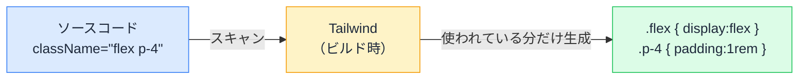

# Tailwind CSS の仕組み — クラス名の羅列はなぜ「あり」なのか

## 今日のゴール

- ユーティリティファーストという考え方と、インライン style との違いを知る
- 「使ったクラスだけ生成する」ビルドの仕組みと、動的クラス名の罠を知る
- Tailwind CSS 4 の設定が CSS ファイルに書かれることを知る

## AI が書く、長いクラス名の羅列

AI に Next.js の UI を作らせると、ほぼ確実にこういうコードが返ってきます。

```tsx
function Alert({ message }: { message: string }) {
  return (
    <div
      role="alert"
      className="flex items-center gap-2 rounded-lg border border-red-200 bg-red-50 p-4 text-sm text-red-800"
    >
      {message}
    </div>
  );
}
```

`className` に細かいクラスが 10 個。これが **Tailwind CSS** の書き方です。

HTML と CSS を分けて書くのが行儀よいとされてきた歴史からすると、「ひどい書き方では？」という違和感は自然です。しかし Tailwind は現在のフロントエンドで最有力のスタイリング手法で、Next.js の公式セットアップにも組み込まれています。なぜこの羅列が「あり」とされるのか。仕組みから見ていきます。

## ユーティリティファースト — 1 クラス = 1 スタイル

Tailwind のクラスは、それぞれが小さなスタイル 1 つに対応します。

| クラス | 意味する CSS |
|--------|-------------|
| `flex` | `display: flex` |
| `items-center` | `align-items: center` |
| `p-4` | `padding: 1rem` |
| `text-sm` | `font-size: 0.875rem` |

この「単機能の部品クラスを組み合わせる」スタイルを**ユーティリティファースト**と呼びます。

### インライン style と何が違うか

「タグに直接 `style` 属性を書くインライン style と同じでは？」と思えますが、決定的な違いが 3 つあります。

| | インライン style | Tailwind |
|---|---|---|
| ホバーやフォーカス | 書けない | `hover:bg-red-100` のように書ける |
| 画面幅での出し分け | 書けない | `md:flex-row` のように書ける |
| 値の自由度 | 何でも書けてしまう | `p-1, p-2, p-4...` と**決められた目盛り**から選ぶ |

3 つ目が特に重要です。値が「あらかじめ決められた選択肢」に制限されているため、余白や色がページごとにバラバラになりません。色やサイズに名前を付けて一元管理する**デザイントークン**の考え方が、クラス名の形で組み込まれているのです。

### なぜ羅列が「あり」になったか

従来の CSS の苦労が、ユーティリティファーストでは構造的に起きません。

- **クラス名を考えなくていい**: `news-card-wrapper-inner` のような命名に悩む時間が消える
- **ファイルの往復が消える**: HTML と CSS を行き来せず、その場で完結する
- **名前の衝突が起きない**: CSS は本来すべてのクラス名がグローバルで、別ファイルの同名クラスと衝突する。Tailwind は自分でクラスを定義しないので、衝突のしようがない
- **消す勇気が要らない**: 従来は「この CSS、どこかで使われているかも」と消せずに肥大化した。Tailwind はタグを消せばスタイルも一緒に消える

## 仕組み — 使ったクラスだけを生成するビルド

「`p-4` も `p-5` も `hover:bg-red-100` も全部入った巨大な CSS が配信されるのでは」という心配は不要です。Tailwind は**ビルド時にソースコードをスキャンし、実際に書かれているクラスの分だけ CSS を生成**します。



どれだけ大きなアプリでも、CSS には「使ったクラス」しか入りません。だから配信される CSS は小さく保たれます。

### 動的クラス名の罠

この仕組みには、知らないと必ずハマる制約があります。スキャンは**ソースコードの文字列をそのまま探す**だけで、JavaScript を実行するわけではありません。つまり、**実行時に組み立てたクラス名は検出できません**。

```tsx
// ❌ スキャンには「text-${color}-600」という文字列しか見えない。
//    text-red-600 という CSS は生成されず、スタイルが効かない
function Status({ color }: { color: "red" | "green" }) {
  return <p className={`text-${color}-600`}>ステータス</p>;
}
```

```tsx
// ✅ 完全なクラス名がコード上にあれば検出される
function Status({ color }: { color: "red" | "green" }) {
  const colorClass = color === "red" ? "text-red-600" : "text-green-600";
  return <p className={colorClass}>ステータス</p>;
}
```

AI もときどきこの罠を踏み、「コードは正しそうなのに色だけ付かない」状況を作ります。**クラス名は必ず完全な形でコードに書く**。原因を知っていれば、「クラス名を組み立てているから効かないのでは」と一目で疑えます。

## 設定は CSS ファイルに書く（Tailwind CSS 4）

現行の Tailwind CSS 4 では、設定も CSS ファイルに書きます（CSS ファースト設定）。プロジェクトの CSS の先頭はこの 1 行です。

```css
/* app/globals.css */
@import "tailwindcss";
```

独自の色やサイズを足したいときは、`@theme` ブロックで宣言します。

```css
@import "tailwindcss";

@theme {
  --color-brand: #0f6fff;
}
```

これだけで `bg-brand` や `text-brand` というクラスが使えるようになります。デザイントークンの追加が、そのままユーティリティクラスの追加になる仕組みです。

::: tip AI が出す古い設定ファイル
以前のバージョンでは `tailwind.config.js` という JavaScript の設定ファイルが必須でした。古い記事や AI が生成した古いスタイルの設定を見かけたら、「いまは CSS に書く方式」と思い出してください。
:::

## 読み方のコツ — プレフィックスは「条件付き」

長いクラス列も、`:` 付きのクラスの読み方さえ知れば分解できます。`プレフィックス:クラス` は「この条件のときだけ適用」です。

| 書き方 | 意味 |
|--------|------|
| `hover:bg-red-100` | マウスが乗ったときだけ `bg-red-100` |
| `md:flex-row` | 画面幅 md（768px）以上のときだけ `flex-row` |
| `dark:text-white` | ダークモードのときだけ `text-white` |
| `focus-visible:ring-2` | キーボード操作でフォーカスされたときだけリングを表示 |

`focus-visible:` のようなフォーカス系のクラスは、キーボードで操作する人に「いまどこにいるか」を伝えるアクセシビリティの要です。AI のコードからフォーカス系の指定が抜けていたら、補うよう指示する価値があります。

## まとめ

- Tailwind は 1 クラス = 1 スタイルのユーティリティファースト。値は決められた目盛りから選ぶ
- ビルド時にソースをスキャンし、書かれているクラスの分だけ CSS を生成する
- だから実行時に組み立てたクラス名は効かない。クラス名は完全な形で書く
- Tailwind CSS 4 の設定は CSS ファイル（`@import "tailwindcss"` と `@theme`）
