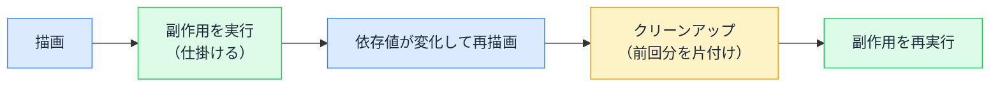

# useEffect と副作用 — React の外と同期する

## 今日のゴール

- 副作用が「レンダリング以外の、外の世界に触れる仕事」だと知る
- 依存配列が useEffect の実行タイミングを決めることを知る
- クリーンアップが必要な理由と、よくあるミスを知る

## レンダリングは「計算」だけ

React のコンポーネントは「props と state を受け取り、JSX を返す関数」です。この関数の仕事は、あくまで**計算**です。入力から表示内容を計算して返す。それだけです。

しかしアプリには、計算に収まらない仕事があります。

- 1 秒ごとに時計を進める（タイマーの開始）
- ウィンドウのリサイズを監視する（イベントの購読）
- ページタイトルを変える（ブラウザへの直接の働きかけ）

これらはどれも、**JSX を返すという計算の外側**にある、ブラウザや外部の仕組みへの働きかけです。React ではこれを**副作用**（side effect）と呼びます。

副作用をコンポーネント関数の本体に直接書いてはいけません。コンポーネント関数は再レンダリングのたびに何度でも実行されるので、本体に書いた副作用も毎回実行されてしまいます（タイマーが何本も走り出すことを想像してください）。

そこで React は、「**描画が終わったあとに、この副作用を実行して**」と予約する場所を用意しています。それが `useEffect` です。

## useEffect の基本形

```tsx
import { useEffect, useState } from "react";

function Clock() {
  // 時刻は環境によって変わる値なので、最初の描画には含めず空にしておく
  const [time, setTime] = useState("");

  useEffect(() => {
    // 描画が終わったあとに実行される
    const update = () => setTime(new Date().toLocaleTimeString());
    update(); // まず 1 回表示してから
    const id = setInterval(update, 1000); // 1 秒ごとに更新

    // クリーンアップ（後述）
    return () => clearInterval(id);
  }, []);

  return <p>現在時刻: {time || "取得中..."}</p>;
}
```

`useEffect` は 2 つのものを受け取ります。

1. **副作用の関数**: 描画後に実行したい処理
2. **依存配列**: いつ再実行するかの条件

## 依存配列 — いつ実行されるか

第 2 引数の配列で、副作用を再実行する条件を指定します。

| 書き方 | 実行されるタイミング |
|--------|--------------------|
| `useEffect(fn)` — 配列なし | **毎回**の描画後 |
| `useEffect(fn, [])` — 空配列 | **初回**の描画後だけ |
| `useEffect(fn, [userId])` | 初回 + `userId` が**変わった**描画後 |

「`userId` が変わったらタイマーを仕掛け直す」のように、**何に反応すべきか**を配列で宣言する仕組みです。逆に言うと、副作用の中で使っている値は依存配列に入れるのが原則です。入れ忘れると、値が変わっても副作用が古い値のまま動き続けます。

## クリーンアップ — 後片付けの関数

副作用の関数から**関数を return すると、それが後片付け**（クリーンアップ）として扱われます。

```tsx
useEffect(() => {
  const onResize = () => console.log(window.innerWidth);

  window.addEventListener("resize", onResize); // 監視を開始
  return () => window.removeEventListener("resize", onResize); // 監視を解除
}, []);
```

クリーンアップが呼ばれるのは 2 つのタイミングです。

1. **副作用が再実行される直前**（前回の分を片付けてから、新しい分を実行する）
2. **コンポーネントが画面から消えるとき**

なぜ必要か。タイマーやイベント監視は、仕掛けた側が止めない限り**動き続ける**からです。クリーンアップが無いと、再実行のたびに監視が二重三重に積み上がったり、もう存在しないコンポーネントのためにタイマーが走り続けたりします。「仕掛ける副作用には、必ず対になる片付けを返す」がセットの作法です。



::: tip 開発中は副作用が 2 回動く（Strict Mode）
開発中の React は、クリーンアップの書き忘れを早期に見つけるため、**初回の副作用をわざと「実行 → 片付け → もう一度実行」と 2 回動かします**。「console.log が 2 回出る」のは多くの場合バグではなく、この開発用の動作です（本番では 1 回になります）。
:::

## よくあるミス

### 依存配列の入れ忘れ

```tsx
useEffect(() => {
  const id = setInterval(() => {
    console.log(`${userName} さんの画面を更新`);
  }, 5000);
  return () => clearInterval(id);
}, []); // ❌ userName を使っているのに依存に入れていない
```

`userName` が変わっても副作用は再実行されず、タイマーは**古い名前を表示し続けます**。コードは動いて見えるので、気づくのはだいぶ後です。「副作用の中で使っている値が、依存配列に揃っているか」は AI のコードでも真っ先に確認する価値があります。

### 無限ループ

```tsx
const [items, setItems] = useState<string[]>([]);

useEffect(() => {
  setItems([...items, "新着"]); // state を更新すると…
}, [items]); // ❌ その state に依存しているので、また実行される
```

「実行 → state 更新 → 再描画 → 依存が変化 → また実行 → …」の永久機関です。画面が固まる、開発サーバーが悲鳴を上げる、という形で現れます。**副作用の中で set した state が依存配列に入っていたら要注意**です。

### そもそも useEffect が不要

```tsx
// ❌ 計算で済むものを副作用にしている
const [fullName, setFullName] = useState("");
useEffect(() => {
  setFullName(`${lastName} ${firstName}`);
}, [lastName, firstName]);

// ✅ レンダリング中の計算で十分
const fullName = `${lastName} ${firstName}`;
```

既存の props や state から導ける値は、副作用ではなく**ただの計算**で書けます。AI は「とりあえず useEffect」のコードを出すことがありますが、useEffect は「外の世界に触れるとき」のための道具です。**外の世界が登場しない useEffect を見たら、計算に書き直せないか疑う**。これだけで余計な再レンダリングとバグの芽が減ります。

サーバーからのデータ取得も、かつては useEffect の代表的な仕事でしたが、現在の Next.js ではサーバー側で取得する方法や専用ライブラリに役割が移っています。「useEffect での取得が唯一の方法ではない」と知っておくだけで十分です。

## まとめ

- 副作用 = レンダリング（計算）の外側で、タイマー・購読などの外の世界に触れる仕事
- 依存配列が再実行の条件で、中で使う値は依存に揃える
- 仕掛ける副作用には対になるクリーンアップを返す（開発中の 2 回実行は確認用）
- 計算で済むものに useEffect は不要で、「外の世界」が無ければ疑う
