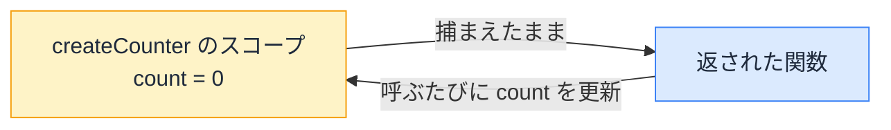

# スコープとクロージャ — 関数が古い値を覚えている理由

## 今日のゴール

- スコープが「変数の見える範囲」だと知る
- クロージャは関数が生まれた場所の変数を持ち歩く仕組みだと知る
- React で古い値を参照し続けるバグの原因がクロージャだと知る

## 古い値を表示し続けるタイマー

React でこんなコードを書くと、奇妙な現象が起きます。

```tsx
import { useEffect, useState } from "react";

function Counter() {
  const [count, setCount] = useState(0);

  useEffect(() => {
    const id = setInterval(() => {
      console.log(`現在のカウント: ${count}`);
    }, 1000);
    return () => clearInterval(id);
  }, []); // 初回だけ実行

  return <button onClick={() => setCount(count + 1)}>+1（{count}）</button>;
}
```

ボタンを押してカウントが 5 になっても、コンソールには「**現在のカウント: 0**」が出続けます。画面は 5 なのに、タイマーの中の `count` は 0 のままです。

タイマーの中の関数が昔の値を覚えているのは、React のバグではなく、JavaScript の**クロージャ**という仕組みの正確な動作です。

## スコープ — 変数の見える範囲

**スコープ**とは、変数を参照できる範囲のことです。JavaScript では、`{}` のブロックや関数が範囲の区切りになります。

```js
function outer() {
  const message = "こんにちは";

  function inner() {
    console.log(message); // ✅ 内側から外側の変数は見える
  }

  inner();
}

console.log(message); // ❌ エラー。外から関数の中の変数は見えない
```

ルールは 2 つだけです。

- **内側の関数から、外側の変数は見える**
- **外側から、内側の変数は見えない**

内側から外側を覗けるこの性質が、次のクロージャの土台になります。

## クロージャ — 生まれた場所の変数を持ち歩く

この性質は、関数を**値として返せる**ことと組み合わさったときに効いてきます。

```js
function createCounter() {
  let count = 0;

  return function () {
    count = count + 1;
    return count;
  };
}

const counter = createCounter(); // createCounter の実行はここで終わる

console.log(counter()); // 1
console.log(counter()); // 2
console.log(counter()); // 3
```

`createCounter` の実行はとっくに終わっているのに、返された関数を呼ぶたびに `count` が増えていきます。**関数は、自分が定義された場所のスコープの変数を捕まえたまま持ち歩く**のです。

この仕組みを**クロージャ**（closure、閉じ込めるもの）と呼びます。



ポイントは、関数が捕まえるのは「呼ばれた瞬間の値のコピー」ではなく、**定義されたときのスコープそのもの**だということです。

## React は実行のたびに新しいスコープを作る

React のコンポーネントは関数で、**再レンダリングのたびに丸ごと再実行されます**。つまり実行のたびに、新しいスコープが作られます。

- 1 回目の実行: `count` が 0 のスコープができ、その中で作られた関数は 0 を捕まえる
- 2 回目の実行: `count` が 1 のスコープができ、その中で作られた関数は 1 を捕まえる

イベントハンドラも useEffect の中の関数も、**自分が作られた回のスコープを捕まえています**。state がその実行時点の値のまま固定されて見えるのは、このクロージャの性質によるものです。

冒頭のタイマーの謎は、これで解けます。

1. 初回の実行で `count = 0` のスコープができる
2. `useEffect(..., [])` は**初回しか実行されない**ので、タイマーの関数は初回のスコープ（count = 0）を捕まえたまま
3. その後何度再レンダリングされても、**動き続けているのは初回に作られた関数**。捕まえているのは永遠に `count = 0`

古い実行のスコープを捕まえた関数が生き残ってしまう。この現象は **stale closure**（古くなったクロージャ）と呼ばれ、React の「値が更新されないバグ」の定番の原因です。

## stale closure の直し方

### 1. 依存配列に入れて作り直す

```tsx
useEffect(() => {
  const id = setInterval(() => {
    console.log(`現在のカウント: ${count}`);
  }, 1000);
  return () => clearInterval(id);
}, [count]); // count が変わるたび、新しいスコープでタイマーを作り直す
```

`count` が変わるたびに古いタイマーが片付けられ、**最新のスコープを捕まえた新しい関数**でタイマーが作り直されます。「中で使う値は依存配列に入れる」という useEffect の原則は、stale closure を防ぐためのルールだったわけです。

### 2. set 関数で最新値を受け取る

state の更新だけが目的なら、set 関数に関数を渡す形で「最新の値」を React から受け取れます。

```tsx
useEffect(() => {
  const id = setInterval(() => {
    setCount((prev) => prev + 1); // prev には常に最新値が渡される
  }, 1000);
  return () => clearInterval(id);
}, []); // 作り直し不要
```

クロージャが捕まえた古い `count` を使わず、React が管理している最新値をその場で受け取るので、初回のスコープのままでも正しく動きます。

::: tip useEffectEvent — stale closure 対策の公式 API
React 19.2 からは、この問題のための公式 API **useEffectEvent** も使えます。「副作用の中の、最新の値で動いてほしい部分」を切り出すと、依存配列に入れなくても常に最新の state や props を読める関数になります。

コードに `useEffectEvent` が出てきたら、stale closure 対策をしていると読めます。
:::

## stale closure を疑うサイン

クロージャ自体は、悪者ではありません。イベントハンドラが自分のスコープの値を使えるのも、クロージャのおかげです。

問題になるのは、**長生きする関数**（タイマー、購読、一定時間後のコールバック）が**古いスコープ**を捕まえたまま動き続けるときだけです。コードを確認する場所も、そこに絞れます。

- `setInterval` / `addEventListener` など長生きする関数の中で state や props を使っていないか
- 使っているなら、依存配列で作り直すか、`(prev) => ...` で最新値を受け取る形になっているか

「画面は新しいのに、ログや通信だけ古い値」という症状を見たら、stale closure を疑ってください。原因に名前が付いていれば、AI への報告も「stale closure になっていない？」の一言で済みます。

## まとめ

- スコープは変数の見える範囲で、内側の関数から外側が見える
- クロージャは関数が定義された場所のスコープを捕まえて持ち歩く仕組み
- React は実行のたびに新しいスコープを作るので、長生きする関数が古いスコープを掴むと stale closure
- 直すには、依存配列で作り直すか `(prev) => ...` で最新値をもらう
