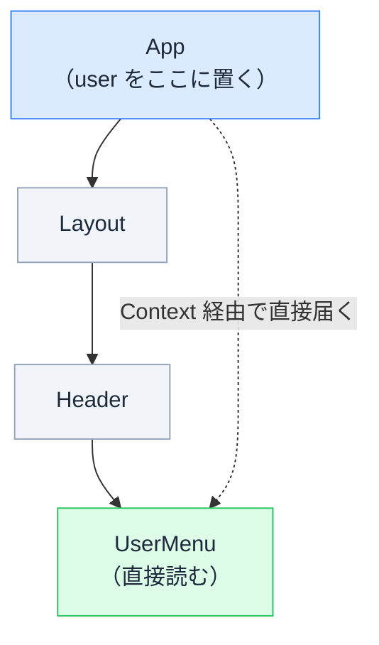
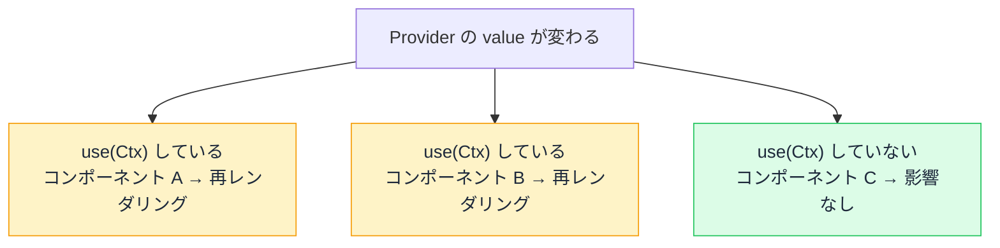

# Context と use() — props のバケツリレーを終わらせる

## 今日のゴール

- props のバケツリレー（prop drilling）の辛さを知る
- Context が「ツリーのどこからでも読める共有データ」だと知る
- `use(Context)` での読み取りと、Context を使うべき場面を知る

## バケツリレーになる props

ログイン中のユーザー名を、画面のあちこちで表示したいとします。props は親から子への一方通行なので、素直に書くとこうなります。

```tsx
function App({ user }: { user: User }) {
  return <Layout user={user} />;
}

function Layout({ user }: { user: User }) {
  return <Header user={user} />; // 自分は使わない。渡すだけ
}

function Header({ user }: { user: User }) {
  return <UserMenu user={user} />; // 自分は使わない。渡すだけ
}

function UserMenu({ user }: { user: User }) {
  return <p>{user.name} さん</p>; // やっと使う
}
```

`Layout` と `Header` は `user` を**使わないのに、運ぶためだけに受け取っています**。この中継だらけの構図を **props のバケツリレー**（prop drilling）と呼びます。

- 中継地点が増えるほど、props の型と引数の修正が連鎖する
- 「この props は誰が本当に使うのか」がコードから見えにくくなる

階層が 2〜3 段なら我慢できますが、実際のアプリは 5 段 10 段と深くなります。

## Context — ツリーの上に置いて、どこからでも読む

React の **Context** は、データを**コンポーネントツリーの上のほうに置いておき、間の中継なしに、深いところから直接読める**ようにする仕組みです。



使い方は 3 ステップです。

### 1. Context を作る

```tsx
// user-context.ts
import { createContext } from "react";

export type User = { name: string };

// 引数は「上に Provider が無かったとき」のデフォルト値
export const UserContext = createContext<User | null>(null);
```

### 2. ツリーの上で値を提供する

作った Context をコンポーネントとして配置し、`value` に共有したいデータを渡します。囲んだ範囲（とその子孫すべて）がこの値を読めるようになります。

```tsx
import { UserContext, type User } from "./user-context";

function App({ user }: { user: User }) {
  return (
    <UserContext value={user}>
      <Layout /> {/* user を渡さなくてよくなった */}
    </UserContext>
  );
}
```

::: tip 古い書き方を見かけたら
以前の React では `<UserContext.Provider value={...}>` と書く必要がありました。古いほうの書き方を見かけても、意味は同じです。
:::

### 3. 深いところで読む

読みたいコンポーネントで `use()` を呼びます。

```tsx
import { use } from "react";
import { UserContext } from "./user-context";

function UserMenu() {
  const user = use(UserContext);

  if (user === null) return null; // デフォルト値（未提供）への備え
  return <p>{user.name} さん</p>;
}
```

`use(UserContext)` は、**ツリーを上にたどって、いちばん近い `<UserContext value={...}>` の値**を返します。間の `Layout` や `Header` は何も知らなくてよく、props の中継が消えます。

以前からある `useContext(UserContext)` も同じ用途の API で、AI のコードには今もよく登場します。現在は `if` 文の中でも呼べるなど制約の少ない `use()` が推奨です。

## どこまで Context に乗せるべきか

バケツリレーが消えるなら何でも Context に、とはなりません。使いどころには明確な相場があります。

| Context 向き | props 向き |
|-------------|-----------|
| ログイン中のユーザー情報 | 一覧の 1 行分のデータ |
| テーマ（ダークモードなど） | ボタンのラベルや無効化フラグ |
| 表示言語の設定 | フォームの入力値 |

判断の軸は「**アプリ全体（または広い範囲）で共有され、たまにしか変わらないもの**」かどうかです。

理由は仕組みにあります。Context の値が変わると、**その Context を `use()` で読んでいるコンポーネントすべてが再レンダリングされます**。これは props の連鎖による再レンダリングとは違い、途中のコンポーネントを飛ばして**直接読んでいる全員に波及する**仕組みです。



props なら「この props を渡している親子だけ」が影響範囲で追えますが、Context は「ツリーのどこで読まれているか」が**コードからは見えにくい**。入力のたびに変わるような値を乗せると、自分では気づかないうちに画面のあちこちが連鎖的に再描画されて重くなります。

これが「たまにしか変わらないもの」という判断基準の理由です。**変更頻度が低ければ、全員への波及も低頻度に抑えられる**。

また、Context に乗せたデータは「誰がどこで使っているか」が props のように追えません。何でも乗せると、データの流れが見えないアプリになります。**まず props、本当に広く共有するものだけ Context** が基本姿勢です。

AI に「props のバケツリレーを解消して」と頼むと Context 化を提案してきますが、「それは全体で共有すべき値か、変更頻度は低いか」をこの相場で判定できると、提案を鵜呑みにせずに済みます。

## まとめ

- 使わない props を運ぶだけの中継がバケツリレー（prop drilling）
- Context は上に置いた値を、中継なしで深くから読む仕組み。`<Ctx value>` で提供、`use(Ctx)` で読む
- 値が変わると読んでいる全員が再レンダリングされる
- まず props。全体共有・低頻度変更のものだけ Context
